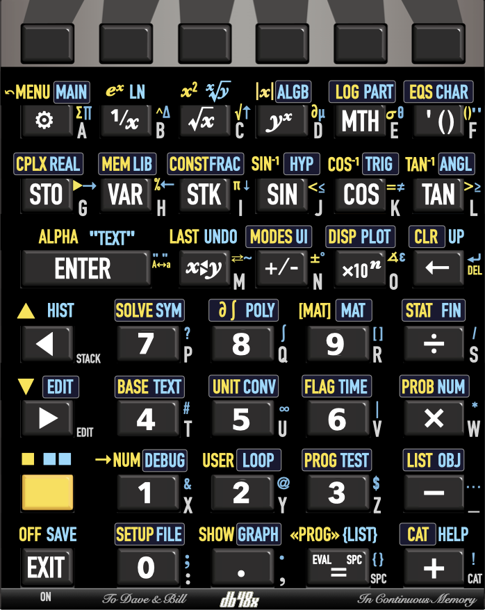

# Overview

## DB50X on DM32

The DB50X project intends to rebuild and improve the user experience of the
legendary HP48 family of calculators, notably their *"Reverse Polish Lisp"*
 [(RPL)](#Introduction-to-RPL)
language with its rich set of data types and built-in functions.

This project is presently targeting the **SwissMicro DM32 calculator**
and leveraging its built-in software platform, known as **DMCP**. This is
presumably the calculator you are currently running this software on.
You can also [try it in your browser](http://48calc.org).

## Table of contents

* [Using the on-line help](#help)
* [Quickstart guide](#quickstart-guide)
* [Programming examples](#rpl-programming-examples)
* [State of the project](#state-of-the-project)
* [Design overview](#design-overview)
* [Keyboard interaction](#keyboard-interaction)
* [Soft menus](#soft-menus)
* [Differences with other RPLs](#differences-with-other-RPLs)
* [Built-in help](#help)
* [Acknowledgements and credits](#acknowledgements-and-credits)
* [Release notes](#release-notes)
* [Performance](#performance-measurements)
* [Keyboard overlays](https://www.hpmuseum.org/forum/thread-20113.html)


## State of the project

This is currently **SEMI-STABLE** software, meaning that the implemented
features appear to work somewhat reliably, but that some features are still
being added with each new release. This is **NOT PRODUCTION READY** and should
not be used for any mission-critical computation.

At this point in time, you should only installing this if you are interested in
contributing to the project, whether it is in the form of code, feedback or
documentation changes. Please refer to the web site of the project on GitHub or
GitLab for details and updates. The best way to
[report an issue](https://github.com/c3d/db48x/issues),
[request an improvement](https://github.com/c3d/db48x/issues/new)
or [submit a proposed change](https://github.com/c3d/db48x/pulls) is
on the project's [GitHub page](https://github.com/c3d/db48x).

The [implementation status](#implementation-status) section categorizes all the
RPL commands in the HP50G and in DB50X into
[implemented](#implemented-commands),
[not implemented yet](#unimplemented-commands),
[unapplicable commands](#unapplicable-commands) and
[DB50X only](#additional-commands) lists.

## Design overview

The objective is to re-create an RPL-like experience, but to optimize it for the
existing DM32 physical hardware.
The DM32 keyboard layout is really different compared to the DB50X expected
layout. For example, the DM32 does not have unshifted arrow keys, and has two
shift keys. For that reason, when running DB50X on a DM32, it is highly
recommended to use a
[keyboard overlay](https://github.com/c3d/db48x/blob/stable/Keyboard-Layout.png).

Compared to the original HP48, the DM32 has a much larger screen, but no
annunciators (it is a fully bitmap screen). It has a keyboard with dedicated
soft-menu (function) keys, but no arrow keys (whereas the HP48 has four),
lacks a dedicated alpha key, and has no space key (_SPC_ on the HP48).


## Keyboard interaction

The keyboard differences force us to revisit the user interaction with the
calculator compared to the HP48:


* When running DB50X on the DM32, the blue shift key cycles between three
  states, *Shift* (shown in the documentation as 🟨), *Right Shift* (shown in
  the documentation as 🟦) and no shift. The physical yellow shift key is
  actually used as a down/right cursor key, and will be shown as _▶︎_ in the rest
  of this document. Similarly, the _XEQ_ key is used as an up/left cursor key,
  and will be shown as _◀︎_ in the rest of this document. This remapping of keys
  appears necessary because RPL calculators like the HP48 are command-line
  oriented and absolutely need at least two unshifted cursor keys. Sacrificing a
  physical shift key while preserving two shifted function seems like the best
  compromise.

* A first press on the shift key is shown as 🟨 in the documentation, and
  activates functions shown in yellow in the keyboard overlay. A second press is
  shown as 🟦 in the documentation, and activates functions shown in blue in the
  keyboard overlay. On the screen, the shift state is indicated in the header
  area. When a [soft menu](#soft-menus) is visible on the screen, the selected
  row of functions is highlighed.

In the rest of this document, the shift key is referred to as 🟨, and pressing
it twice is referred to as 🟦, irrespective of the appearance of the physical
shift key on your particular hardware. While running the firmware, this will display in the annunciator area as follows:


Other aspects of the keyboard interaction are fine-tuned for RPL usage:

* Since RPL uses alphabetic entry (also called *Alpha* mode) a lot more
  frequently than on RPN models like the HP41 or HP42, making it quickly
  accessible seems important, so there are
  [three distinct ways to activate it](#alpha-mode).


* Using 🟨 _◀︎_ and 🟨 _▶︎_ moves the cursor up and down.  When not editing, _◀︎_
  and _▶︎_ behave like _▲_ and _▼_ on the HP48, i.e. _◀︎_ enters the *interactive
  stack*  and _▶︎_ edits the object on the first level of the stack.

* Long-pressing arrow keys, the _←_ (also known as *Backspace*) or text entry
  keys in Alpha mode activates auto-repeat.

* Long-pressing keys that would directly trigger a function (e.g. _SIN_),
  including function keys associated with a soft-menu, will show up the
  [built-in help](#help) for the corresponding function.


### Alpha mode

Entering alphabetic characters is done using *Alpha* mode. These alphabetic
characters are labeled on the right of each key on the DM32's keyboard.

When *Alpha* mode is active, an _ABC_ indicator shows up in the annunciator area
at the top of the screen. For lowercase entry, the indicator changes to
_abc_.

There are three ways to enter *Alpha* mode:

* The first method is to use 🟨 _ENTER_ as indicated by the _ALPHA_ yellow label
  on the DM32 ENTER key. This cycles between *Alpha* _ABC_, *Lowercase* _abc_
  and *Normal* entry modes.

* The second method is to hold 🟨 for more than half a second. This cycles
  between *Alpha* _ABC_ and *Normal* entry modes, and cannot be used to type
  lowercase characters.

* The third method is to hold one of the arrow keys _◀︎_ or _▶︎_ *while* typing on
  the keyboard. This is called *transient alpha mode* because *Alpha* mode ends
  as soon as the arrow key is released. Using _◀︎_ enters uppercase characters,
  while _▶︎_ uses lowercase characters.

There is no equivalent of the HP48's "single-Alpha" mode. Alpha mode is either
_transient_ (when you hold one of the arrow keys) or _sticky_ (with 🟨 _ENTER_
or by holding 🟨).

Alpha mode is cancelled when pressing _ENTER_ or _EXIT_.

Since the DM32's alphabetic keys overlap with the numeric keys (unlike the
HP48), as well as with operations such as _×_ and _÷_, using 🟨 in Alpha mode
brings back numbers. This means 🟨 cannot be used for lowercase, but as
indicated above, there are two other methods to enter lowercase
characters.

Using 🟨 or 🟦 in combination with keys other than the numeric keypad gives a
variety of special characters. The `CharactersMenu` and `Catalog` can be used to
enter special characters in a more comfortable way.


### Key mapping

The layout of keys on DB50X was carefully chosen to offer a good compromise
between immediate applicability for calculations and giving access to numerous
advanced functions through menus.

DB50X keyboard overlays for DM-42 and DM-32 SwissMicros calculators are
[already available](https://www.hpmuseum.org/forum/thread-20113.html).



In the rest of this document, keys bindings will usually be described using the
alphabetic key, to make it easier to locate on the keyboard, followed by the
standard label on the DB50X layout. For example, the assignment for the `sin`
function will be described as _J_ (_SIN_). The shifted functions of the same key
will be described as 🟨 _J_ (_SIN⁻¹_) or 🟦 _J_ (_HYP_) respectively.

In some cases, the label between parentheses may refer to another calculator
model, which will be indicated as follows. For example, the _A_ key can be
described as _A_ (_⚙️_, DM-42 _Σ+_, DM-32 _√x_).


Using DB50X with the DM32 is quite difficult without a keyboard overlay.

In particular, an unfortunate difference between the DM32 and the keyboard
layout used by DB50X is that the placement of all letters after `M` is shifted
by one position on the keyboard, and the first row of scientific functions
(starting with square root and ending with _Σ+_) is inconsistent. The reason is
that the layout for DB50X is heavily based on the DM-42 model.

Also, while the DM32 has two shift keys, a blue and a yellow one, it lacks
dedicated cursor movement arrow keys, a limitation that is visible in the
calculator's firmware menus.  While the two arrow shift keys would be welcome,
not having arrow keys for cursor movement is just not an option. As a result,
only the blue shift key is kept as a shift key, and the yellow shift key is
converted to an arrow key, along with the DM32 _XEQ_ key.

Here are a few of the interesting RPL-specific key mappings:

* _A_ (_⚙️_, DM-42 _Σ+_, DM-32 _√x_) is used to invoke a context-sensitive
  [ToolsMenu](#ToolsMenu), which select a softkey menu based on what is on the
  stack and other context.

* 🟨 _A_ (_←MENU_, DM-42 _Σ-_, DM-32 _x²_) selects the [LastMenu](#LastMenu)
  command, which displays the previously selected menu.

* 🟦 _A_ (_MAIN_, DM-32 _PARTS_) selects the [MainMenu](#MainMenu), a top-level
  menu giving indicrect access to all other menus and features in DB50X (see
  also the [Catalog](#Catalog) feature).

* _F_ (_' ()_, DM-42 _XEQ_, DM-32 _Σ+_) opens an algebraic expression, i.e. it
  shows `''` on the command-line and switches to equation entry. If already
  inside an equation, it inserts a pair of parentheses. This can be used to
  evaluate expressions in [algebraic mode](#algebraic-mode) instead of
  RPN.

* 🟨 _G_ (_CPLX_, DM-42 _COMPLEX_, DM-32 _CMPLX_) lets you work with complex
  numbers. It opens the [ComplexMenu](#ComplexMenu), which can be used to enter
  complex numbers in rectangular or polar form, and perform common operations on
  these numbers. The same menu can be accessed without shift using _A_ (_⚙️_)
  when there is a complex number on the stack.

* _H_ (_VAR_, DM-42 and DM-32 _RCL_) opens the [VariablesMenu](#VariablesMenu)
  showing user variables in the current directory.

* _I_ (_STK_, DM-42 and DM-32 _R↓_) will open the [StackMenu](#StackMenu),
  giving access to stack operations.

* 🟨 _I_ (_CONST_, DM-42 _π_, DM-32 _HYP_) shows a
  [ConstantsMenu](#ConstantsMenu) giving access to various constants. You can
  provide your own constants in a `config/constants.csv` file on disk.

* _M_ (_X⇆Y_) executes the RPL [Swap](#swap) function

* 🟨 _M_ (_LAST_, DM-42 _LAST x_, DM-32 _MEM_) is [LastArg](#LastArguments),
  which recalls the arguments of the last command.

* 🟦 _M_ (_Undo_, DM-32 _X⇆_) restores the previous state of the stack. This is
  like `Last Stack` on the HP48, but on DB50X, it is a real command that can be
  used in programs.

* _N_ (_+/-_) executes the equivalent RPL `Negate` function. While editing, it
  changes the sign of the current number on the command-line.

* _O_ (_×10ⁿ_, _EEX_ or _E_ depending on keyboard labeling, referred to as
  _×10ⁿ_ in the rest of this document) is used to enter the exponent of a number
  in scientific notation. However, when not entering or editing values, it
  invokes the [Cycle](#Cycle) command, which cycles between various
  representations of a number, for example polar and rectangular for a complex
  number, or fraction and decimal for a decimal number.

* _EXIT_ (DM-32 _ON_) corresponds to what the HP48 manual calls _Attn_, and
  typically cancels the current activity. It can also be used to interrupt a
  running program.

* 🟨 _EXIT_ (_OFF_) shuts down the calculator. The state of the calculator is
  preserved.

* 🟦 _EXIT_ (_SAVE_) saves the current state of the calculator to disk. This
  state can be transferred to another machine, and survives system reset or
  firmware upgrades.

* 🟨 _0_ (_SETUP_) shows the firmware's [SystemMenu](#SystemMenu), for example
  to load the original DM-42 or DM-32 program, activate USB disk, and to access
  some calculator preferences.

* The _R/S_ keys inserts a space in the editor, an `=` sign inside equations,
 and maps to [Evaluate](#evaluate) otherwise.

* 🟨 _R/S_ (_«PROG»_, DM-42 and DM-32 _PRGM_) inserts the delimiters for an RPL
  program, `«` and `»`, while 🟦 _R/S_ (_{LIST}_) inserts the list delimiters,
  `{` and `}`.

* 🟨 _+_ (_CAT_, DM-42 _CATALOG_, DM-32 _LBL_) shows a complete
  context-sensitive [catalog](#Catalog) of all available functions, and
  enables auto-completion using the soft-menu keys. Note that the `+` key alone
  (without shift) activates the catalog while in *Alpha* mode. When inside text,
  the catalog presents alternates for the character at the left of the cursor,
  providing a convenient way to select diacritics and accents..

* 🟦 _+_ (_HELP_, DM-32 _RTN_) activates the context-sensitive help system.


## Soft menus

The DM32 has 6 dedicated soft-menu keys at the top of the keyboard. Most of the
advanced features of DB50X can be accessed through these soft menus. Soft menu
keys have no label on the physical calculator, but in this documentation, they
may sometimes be referred to as _F1_ through _F6_.

All built-in soft-key menus are named, with names ending in [Menu](#Menu). For
example, the [VariablesMenu](#VariablesMenu) is the menu listing global
variables in the current directory. Unlike HP RPL calculators, menus cannot be
accessed by number, but they can be accessed by name. In a future version of the
firmware, a [Menu](#Menu) special variable will return the name of the current
menu. The [LastMenu](#LastMenu) command selects the previous menu.

Menus are organized internally as a hierarchy, where menus can refer to other
menus. A special menu, [MainMenu](#MainMenu), accessible via the 🟦 _A_,
contains all other menus.

Menus can contain up to 18 entries at once, 6 being directly accessible, 6
more being shown when using the 🟨 key, and 6 more with 🟦. Three rows of
functions are shown on screen, with the active row highlighted.

A long press on a function key invokes the on-line help for the associated
function.

When a menu contains more than 18 entries, then the _F6_ function key turns into
a `▶︎`, and 🟨 _F6_ turns into `◀`︎. These keys can be used to
navigate across the available menu entries. This replaces the _NXT_ and _PREV_
keys on HP calculators.

The [VariablesMenu](#VariablesMenu) is used to access global varibales. It is
invoked using the _H_ key, which is labeled _RCL_ on SwissMicros hardware. This
menu is special in the sense that:

* Selecting an entry *evaluates* that menu entry, for example to run a program

* The 🟨 function *recalls* its name without evaluating it.

* The 🟦 function *stores* into the variable.


## Differences with other RPLs

Multiple implementations of RPL exist, most of them from Hewlett-Packard.
A good reference to understand the differences between the various existing
implementations from HP is the
[HP50G Advanced User's Reference Manual](https://www.hpcalc.org/details/7141).

There are a number of intentional differences in design between DB50X and the
HP48, HP49 or HP50G's implementations of RPL. There are also a number of
unintentional differences, since the implementation is completely new.

### User interface

* DB50X features an extensive built-in help system, which you are presently
  using. Information for that help system is stored using a regular *markdown*
  file named `/help/db50x.md`, stored in the calculator's flash storage.

* DB50X features auto-completion for commands while typing, through
  the  _CAT_ key (a [catalog](#catalog) of all commands).

* Many RPL words exist in short and long form, and a user preference selects how
  a program shows. For example, the ` Negate ` command, which the HP48 calls
  ` NEG `, can display, based on [user preferences](#command-display), as
  ` NEG `, ` neg `, ` Neg ` or ` Negate `. In the help, commands are shown using
  the current spelling preference, and all possible aliases are shown on the
  right of the default spelling.

* The DB50X dialect of RPL is not case sensitive, but it is case-respecting.
  For example, if your preference is to display built-in functions in long form,
  typing ` inv ` or ` INV ` will show up as `Invert` in the resulting program.
  This means that the space of "reserved words" is larger in DB50X than in other
  RPL implementations. Notably, on HP's implementations, ` DUP ` is a keyword
  but you can use ` DuP ` as a valid variable name. This is not possible in
  DB50X.

* The saving of the stack arguments for the `LastArg` command is controled
  independently by two distinct settings, `SaveLastArguments` and
  `ProgramLastArguments`. The first one controls if `LastArg` is saved for
  interactive operations, and is enabled by default. The second one controls if
  `LastArg` is saved before executing commands while running a program or
  evaluating an expression, and is disabled by default. This impacts commands
  that evaluate programs, such as `ROOT`. On the HP48, `LastArg` after running
  `ROOT` interactively gives arguments used by some operation within `ROOT`,
  whereas on DB50X with the default settings, it returns the arguments to
  `ROOT`.

* When parsing the `Σ` or `∏` functions (HP calculators only have `Σ`), all
  arguments are separated by semi-colons like for all other functions. HP
  calculators have a special syntax in that case, where an `=` sign separates
  the index and its initial value. In other words, where an HP calculator would
  show `Σ(i=1;10;i^2)`, which corresponds to the 4-argument sequence `i 1 10
  'i^2' Σ`, the DB50X implementation shows and requires the `Σ(i;1;10;i^2)`
  syntax. Note that an `=` sign may appear inside an expression, but it always
  denotes equality.


### Evaluation

* Local names are evaluated on DB50X, unlike in the HP versions of RPL. This
  makes it easier to use local subprograms in larger programs as if they were
  normal operations. In the less frequent case where you do not want evaluation,
  you need to use `RCL` like for global variables.

* Lists do not evaluate as programs by default, like on the HP28, but unlike on
  the HP48 and later HP models. This can be controlled using the
  `ListEvaluation` setting. Note that a list can be converted to a program using
  the `→Program` command, which makes it easy to build programs from lists.
  See also the differences regarding quoted names in
  [Representation of objects](#representation-of-objects)

* The `case` statement can contain `when` clauses as a shortcut for the frequent
  combination of duplicating the value and testing against a reference. For
  example, `case dup "A" = then "Alpha" end` can be replaced with
  `case "A" when "Alpha" end`.

* There are no _compiled local variables_. A program like `→ ←x « Prog »`
  may perform incorrectly if `Prog` attempts to access `←x`. Compiled local
  variables are a rather obscure feature with a very limited use, and might be
  replaced with true closures (which have a well-defined meaning) if there is
  enough demand.


### Numbers

* DB50X has several separate representations for numbers:
  [integers](#integers), [fractions](#fractions),
  [decimal](#decimal-numbers) and [complex](#complex-numbers) in polar or
  rectangular form.Notably, this implementation of RPL keeps integer values
  and fractions in exact form for as long as possible to optimize both
  performance and memory usage.  This is closer to the HP50G in exact mode than
  to the HP48. Like the HP50G, DB50X will distinguish `1` (an integer) from `1.`
  (a decimal value), and the `TYPE` or `TypeName` commands will return distinct
  values.

* Integer and fraction arithmetic can be performed with arbitrary
  precision, similar to the HP50G. The `MaxNumberBits` setting controls how much
  memory can be used for integer arithmetic.

* DB50X has true fractions. From a user's perspective, this is somewhat similar
  to fractions on the HP50G, except that fractions are first-class numbers,
  whereas the HP50G treats them like expressions. On the HP50G, `1 3 / TYPE`
  returns `9.`, like for `'A + B'`. On DB50X, the `TYPE` for fractions is
  different than for expressions. Fractions can be shown either as
  `MixedFractions` or `ImproperFractions`.

* On HP50G, decimal numbers often outperform integers or fractions, and
  benchmark code will contain `1.` instead of `1` for that reason. On DB50X,
  arithmetic on integers and fractions is generally faster.

* Like the HP Prime, DB50X displays a leading zero for decimal values by
  default, whereas HP RPL calculators do not. For example, DB48x with default
  settings will display `0.5` and not `.5`. This is controlled by the
  `LeadingZero` flag.

* DB50X has two distinct representations for complex numbers, polar and
  rectangular, and transparently converts between the two formats as needed.
  The polar representation internally uses fractions of pi for the
  angle, which allows exact computations. By contrast, HP RPL implementations
  always represent complex numbers in rectangular form internally, possibly
  converting it to polar form at display time.

* DB50X features arbitrary-precision decimal floating-point. The `Precision`
  command (in the `DisplayModesMenu`) can be used to select the precision for
  numerical operations. In addition, it supports 32-bit and 64-bit
  hardware-accelerated binary floating-point.

* Based numbers with an explicit base, like `#123h` keep their base, which makes
  it possible to show on stack binary and decimal numbers side by side. Mixed
  operations convert to the base in stack level X, so that `#10d #A0h +`
  evaluates as `#AAh`. Based numbers without an explicit base change base
  depending on the [base](#base) setting, much like based numbers on the HP48,
  but with the option to any base between 2 and 36. In addition to the
  HP-compatible trailing letter syntax (e.g. `#1Ah`), the base can be given
  before the number (e.g. `16#1A`), which works for all supported bases.

### Representation of objects

* The storage of data in memory uses a denser format than on the HP48.
  Therefore, objects will almost always use less space on DB50X. Notably, the
  most frequently used functions and data types consume only one byte on DB50X,
  as opposed to 5 nibbles (2.5 bytes) on the HP48. A number like `123` consumes
  2 bytes on DB50X vs. 7 on the HP50 and 10.5 on the HP48.

* Numerical equality can be tested with `=`,  whereas object equality is tested
  using `==`. For example, `0=0.0` is true, but `0==0.0` is false, because `0`
  is an integer whereas `0.0` is a floating-point.

* Because of differences in internal representation that would require expensive
  computations to mimic the HP50G behaviour with limited benefit, `Size` returns
  1 for integers, algebraic expressions and unit objects.

* The `Type` command can return HP-compatible values that are sometimes
  imprecise (e.g. it cannot distinguish between polar and rectangular complex
  values), or numerical values that distinguish all the types in DB50X. This is
  controlled by the `CompatibleTypes` setting. The `TypeName` command is a
  DB50X-only extension that returns more precise textual information, and should
  be preferred both for readability and future compatibility.

* Expressions between quotes are always algebraic expressions, unlike on HP
  calculators, where a number or a name in quotes is parsed as a number or
  name. The `Type` for `'N'` is `9` on DB48x vs. `6` on HP calculators.
  Parsing names always behaves like in programs, and is consistent for arrays
  and lists as well. By contrast, on HP calculators, if you enter `« 'N' N »`
  and edit it, you get a quoted name followed by an unquote, but if you enter
  `{ 'N' N }`, you get `{ N N }` as a resulting object, which is not very
  consistent, and makes it harder to programmatically use lists to create
  programs (e.g. using `→Program`).

* DB50X has a dedicated data type to represent multi-variate polynomials, in
  addition to the classical RPL-based algebraic expressions.


### Alignment with SwissMicros calculators

* DB50X will borrow to the DM-42 the idea of _special variables_ for settings,
  which are variables with a special meaning. For example, the `Precision`
  special variable is the current operating precision for floating point, in
  number of digits. While there is a `Precision` command that sets the value, it
  is also possible to use `'Precision' STO` to set it, and `'Precision' RCL` to
  fetch the current value. This does not imply that there is an internal
  `Precision` variable somewhere. This applies to all settings and
  flags. Additionally, binary settings can be set with `SF` and `CF`, and
  queried with `SF?` and `CF?`. For example, `'HideDate' CF` will clear the
  `HideDate` flag, meaning that the date will show in the header.

* The DB50X also provides full-screen setup menus, taking advantage of the DM32
  existing system menus. It is likely that the same menu objects used for
  softkey menus will be able to control system menus, with a different function
  to start the interaction.

* The whole banking and flash access storage mechanism of the HP48 will be
  replaced with a system that works well with FAT USB storage. It is possible to
  directly use a part of the flash storage to store RPL programs or data, either
  in source or compiled form. Using a text argument to `STO` and `RCL` accesses
  files on the USB disk, e.g. `1 "FOO.TXT" STO` stores the text representation
  of `1` in a file named `DATA/FOO.TXT` on the USB flash storage.

### List operation differences

The application of a same operation on arrays or matrices has never been very
consistent nor logical across RPL models from HP.

* On HP48 and HP50, `{1 2 3} 4 +` gives `{1 2 3 4}`. However, `{1 2 3} 4 *`
  gives a type error on the HP48 but applies the operation to list elements on
  the HP50, yielding `{4 8 12}`. Finally, `{1 2 3} 4 add` will give `{5 6 7}` on
  the HP50, but that command does not exist on HP48.

* For arrays, `[ 1 2 3 ] 4 +` fails on both the HP48 and HP50, but
  `[ 1 2 3 ] 4 *` works.

* The HP50 has a `MAP` function, which works both for list and matrices.
  `[ 1 2 3 ] « 3 + »` will return `[ 4 5 6 ]`, and `{ 1 2 3 } « 3 * »` will
  return `{ 3 6 9 }`. That function has no direct equivalent on the HP48.

DB50X considers lists as bags of items and treat them as a whole when it makes
sense, whereas arrays are focusing more on the values they contain, and will
operate on these items when it makes sense. Therefore:

* `{ 1 2 3 } 4 +` gives `{ 1 2 3 4 }`, `{ 1 2 3 } 2 -` gives `{ 1 3 }` (not yet
  implemented), and `{ 1 2 3 } 3 ×` gives `{ 1 2 3 1 2 3 1 2 3 }`. The `÷`
  operator is equivalent to the `ListDivide` function, and partitions a list in
  chunks of the given size and returns the number of partitions so generated
  (the last partition being possibly shorter), i.e. `{ 1 2 3 4 5 } 2 ÷` will
  generate `{1 2} {3 4} {5} 3` on the stack (this is not yet implemented).

* `[ 1 2 3 ] 4 +` gives `[ 5 6 7 ]`, `[ 1 2 3 ] 2 -` gives `[ -1 0 1 ]`,
  `[ 1 2 3 ] 3 ×` gives `[ 3 6 9 ]` and `[ 1 2 3 ] 5 ÷` gives
  `[ 1/5 2/5 3/5 ]`.

* Two lists can be compared using lexicographic order. This also applies to the
  `Min` and `Max` functions, which compares the entire lists, whereas on HP50G,
  it compares element by element (element-wise comparison applies to arrays).

* The `|` operator to apply variables to an expression can be used without
  parentheses and chained. For example, `'A+B|A=X|B=Y+Z|Z=42'` evaluates as
  `'X+Y+42'`. This differs from the way the HP50G evaluates it, where the last
  substitution `Z=42` would not be applied since `Z` was not part of the
  original expression. In other words, on HP50G, `'A+B|(A=X;B=Y+Z;Z=42)'`
  evaluates as `'X+Y+Z'`, not as `'X+Y+42'`.The HP-style parenthesized notation
  is accepted, but is converted to the DB50X sequence of `|` form during
  parsing.

* On HP calculators, the behavior on tagged lists is not very consistent.
  For example, `{ 1 2 } :A:{ 3 4 } +` gives `{ 1 2 :A:{ 3 4 } }` but
  `:A:{ 1 2 } :B:{ 3 4 } +` gives `{ 1 2 3 4 }`, and so does
  `:A:{ 1 2 } { 3 4 } +`. DB48x strips the tags in all cases, i.e. the first
  case gives the same `{ 1 2 3 4 }` as the other two.

* As indicated [earlier](#representation-of-objects), quoted names in lists
  remain quoted, whereas on HP calculators, the quotes are removed.


### Vectors and matrices differences

* On DB50X, vectors like `[ 1 2 3 ]` are very similar to lists. The primary
  difference is the behavior in the presence of arithmetic operators.
  On lists, addition is concatenation, e.g. `{ 1 2 3} { 4 5 6} +` is
  `{ 1 2 3 4 5 6 }`, whereas on vectors represents vector addition, e.g.
  `[1 2 3] [4 5 6] +` is `[5 7 9]`. However, unlike on the HP original
  implementation, a vector can contain any type of object, so that you can
  do `[ "ABC" "DEF" ] [ "GHI" "JKL" ] +` and obtain `[ "ABCGHI" "DEFJKL" ]`.

* Size enforcement on vectors only happens _during these operations_, not while
  you enter vectors from the command line. It is legal in DB50X to have a
  non-rectangular array like `[[1 2 3] [4 5]]`, or even an array with mixed
  objects like `[ "ABC" 3 ]`. Size or type errors on such objects may occur
  if/when arithmetic operations are performed.

* In particular, a matrix is nothing but a vector of vectors. DB50X also
  supports arrays with dimensions higher than 2, like `[[[1 2 3]]]`.

* As a consequence, The `GET` and `GETI` functions work differently on
  matrices. Consider a matrix like `[[ 7 8 9 ][ 4 5 6 ][ 1 2 3 ]]`. On the HP48,
  running `1 GET` on this object gives `7`, and the valid range of index values
  is 1 through 9. On DB50X, that object is considered as an array of vectors, so
  `1 GET` returns `[7 8 9]`.  This is intentional. The behavior of `{ 1 1 } GET`
  is identical on both platforms, and is extended to multi-dimensional arrays,
  so that `[[[4 5 6]]] { 1 1 2 } GET` returns `5`.

* Matrices and vectors can contain integer values or fractions. This is closer
  to the HP50G implementation than the HP48's. In some cases, this leads to
  different results between the implementations. If you compute the inverse of
  `[[1 2 3][4 5 6][7 8 9]` on the HP48, you get a matrix with large values, and
  the HP48 finds a small, but non-zero determinant for that matrix. The HP50G
  produces a matrix with infinities. DB50X by default produces a `Divide by
  zero` error.

* DB50X accept matrices and vectors as input to algebraic functions, and returns
  a matrix or vector with the function applied to all elements. For example,
  `[a b c] sin ` returns `[ 'sin a' 'sin b' 'sin c' ]`.

* Similarly, DB50X accept operations between a constant and a vector or matrix.
  This applies the same binary operation to all components of the vector or
  matrix. `[ a b c ] x +` returns `[ 'a+x' 'b+x' 'c+x' ]`. Consistent with that
  logic, `inv` works on vectors, and inverts each component, so that
  `[1 2 3] inv` gives `[1/1 1/2 1/3]`.

* The `Min` and `Max` operations on arrays apply element by element, in a way
  similar to how these operations apply to lists on the HP50G (which seems to
  be undocumented).


### Mathematics

* The `Σ` operation behaves differently between the HP48 and the HP50. On the
  HP48, `I A B 'I^3' Σ` gives an expression, `Σ(I=A;B;I^3)`, and an empty range
  like `I 10 1 'I^3' Σ` gives `0` as a value. On the HP50, this sum is
  simplified as a polynomial expression, so that you get a negative value if
  `A>B`. The HP50G behaviour seems surprising and undesirable. DB50X follows the
  HP48 approach.

* The `↑Match` and `↓Match` operations return the number of replacement
  performed, not just a binary `0` or `1` value. In addition, the patterns can
  identify specific kinds of values based on the first letter of the pattern
  variable name, e.g. `i` or `j` for positive integers, or `u` and `v` for
  unique terms, i.e. terms that are only matched once in the expression.

* When differentiating a user-defined function, HP calculators would replace `F`
  with `d1F`. The HP50G advanced reference manual suggests it should be `derF`.
  Thanks to Unicode support, DB50X will instead use `F′` as the name
  for the derivative function, making it closer to the standard mathematical
  notation. If `F` has multiple parameters, then the partial derivative relative
  to the first argument will be denoted as `F′₁`, the partial derivative
  relative to the second argument will be denoted as `F′₂` and so on.

* For built-in functions that have no known derivative, such as `GAMMA`, the
  HP50G would generate `d1GAMMA`, whereas DB50X will generate an
  `Unknown derivative` error.

* HP calculators would also accept `d1` for standard functions, which is only
  the name of the derivative relative to the first argument, but does not
  actually compute a partial derivative. For example, `d1SIN(2*X)` gives
  `COS(2*X)`, whereas `∂X(SIN(2*X))` evaluates as `2*COS(2*X)`. DB50X does not
  recognize this `dn` notation.

* The behaviour of the HP derivative function `∂` depends on whether it is in an
  algebraic object (stepwise differentiation) or whether it is used in stack
  syntax (full differentiation). The DB50X variant always perform full
  differentiation irrespective of the syntax used.

* The _HP50G advanced reference manual_ indicates that `∂` substitutes the value
  of global variables. For example, if `Y` contains `X+3*X^2`, `'Y' 'X' ∂` is
  expected to return `1+6*X`. It actually returns `0`, unless you evaluate `Y`
  first. DB50X matches the actual behaviour of the HP50G and not the documented
  one.


### Unicode support

DB50X has almost complete support for Unicode, and stores text internally using
the UTF-8 encoding. The built-in font has minor deviations in appearance for a
few RPL-specific glyphs.

Overall, a text file produced by DB50X should appear reliably in your
favorite text editor, which should normally be GNU Emacs. This is notably the
case for state files with extension `.48S` which you can find in the `STATE`
directory on the calculator.

The `Size` operation when applying to text counts the number of Unicode
characters, not the number of bytes. The number of bytes can be computed using
the `Bytes` command.

The `Num` and `Chr` commands deal with Unicode codepoints, and do not use the
special HP characters codes. In addition, `Num` return `-1` for an empty string,
not `0`. `0` is only returned for a string that begins with a ` NUL ` codepoint.

The `Code→Char` command can also be spelled as `Code→Text`, and take a list of
Unicode codepoints as input. Conversely, `Text→Code` will generate a list of all
the codepoints in a text.

## Help

The DB50X project includes an extensive built-in help, which you are presently
reading. This help is stored as a `help/db50x.md` file on the calculator. You
can also read it from a web browser directly on the GitHub page of the project.

The `Help` command makes it possible to access the built-in help in a contextual
way. It is bound to 🟦 _+_. If the first level of the stack contains a text
corresponding to a valid help topic, this topic will be shown in the help
viewer. Otherwise, a help topic corresponding to the type of data in the stack
will be selected.

The DB50X help viewer works roughly similarly to the DM32's, but with history
tracking and the ability to directly access help about a given function by
holding a key for more than half a second.

To navigate the help on the calculator, use the following keys:

* The soft menu keys at the top of the keyboard, references as _F1_ through
  _F6_, correspond to the functions shown in the six labels at the bottom of the
  screen.

* While the help is shown, the keys _◀︎_ and _▶︎_ on the keyboard scroll
  through the text.

* The _F1_ key returns to the [Home](#overview) of the help file, which gives an
  overview of the project and top-down navigation links.

* The _F2_ and _F3_ keys (labels `Page▲` and `Page▼`) scroll the text one full
  page at a time.

* The _F4_ and _F5_ keys (labels `Link▲` and `Link▼`) select the previous and
  next link respectively. The keys _÷_ and _9_ also select the previous
  link, while the keys _×_ and _3_ can also be used to select the next link.

* The _F6_ key correspond to the `←Menu` label, and returns one step back in
  the help history. The _←_ key achieves the same effect.

* To follow a highlighted link, click on the _ENTER_ key.


## Acknowledgements and credits

DB50X is Free Software, see the LICENSE file for details.
You can obtain the source code for this software at the following URL:
https://github.com/c3d/db48x.


### Authors

This software is (C) 2022-2023 Christophe de Dinechin and the DB50X team.

Additional contributors to the project include:

* Jean Wilson (Equation Library and associated documentation)
* Franco Trimboli (WASM port)
* Jeff, aka spiff72 (keyboard overlay)
* Camille Wormser (complex number fixes)
* Conrado Seibel (help file fix)
* Kjell Christenson (simulator fix)
* Václav Kadlčík (documentation fix)
* GitHub user mipa83 (Windows documentation)

The authors would like to acknowledge

* [Hewlett and Packard](#hewlett-and-packard)
* [The Maubert Team](#the-maubert-team)
* [Museum of HP calculators](#hp-museum)
* [HPCalc](#hpcalc)
* [The newRPL project](#newrpl-project)
* [The WP43 and C47 projects](#wp43-and-c47-projects)
* [SwissMicro's DMCP](#swissmicros-dmcp)

This work was placed by Christophe de Dinechin under the patronage of
[Carlo Acutis](http://www.miracolieucaristici.org/en/Liste/list.html)


### Hewlett and Packard

Hand-held scientific calculators changed forever when Hewlett and Packard asked
their engineers to design and produce the HP35, then again when their company
introduced the first programmable hand-held calculator with the HP65, and
finally when they introduced the RPL programming language with the HP28.

Christophe de Dinechin, the primary author of DB50X, was lucky enough to meet
both Hewlett and Packard in person, and this was a truly inspiring experience.
Launching the Silicon Valley is certainly no small achievement, but this pales
in comparison to bringing RPN and RPL to the world.


### The Maubert Team

Back in the late 1980s and early 1990s, a team of young students with a passion
for HP calculators began meeting on a regular basis at or around a particular
electronics shop in Paris called "Maubert Electronique", exchanging
tips about how to program the HP28 or HP48 in assembly language or where to get
precious technical documentation.

It started with Paul Courbis, who carefully reverse-engineered and documented
[the internals of RPL calculators](https://literature.hpcalc.org/items/1584),
encouraging his readers to boldly cut open these wonderful little machines
to solder IR receivers acting as makeshift PC connection tools, or to waste
countless hours debugging [video games](https://www.hpcalc.org/hp48/games).

There were more serious efforts as well, notably the
[HP48 Metakernel](https://www.hpcalc.org/hp48/apps/mk/), which completely
reinvented the HP48 user interface, making it both much faster and better.  It
is fair to see DB50X as a distant descendent from such efforts. The Metakernel
was the work of many now well-known names in the HP community, such as Cyrille
de Brébisson, Jean-Yves Avenard, Gerald Squelart and Étienne de Foras. Many of
these early heroes would go on to actually change the [history of
Hewlett-Packard calculators](https://www.hpcalc.org/goodbyeaco.php) for the
better.

The original author of DB50X, Christophe de Dinechin, was part of this loose
team, focusing on [cross-development tools](https://github.com/c3d/HPDS),
which he used at the time to write several games for the HP48, notably
[PacMan](https://www.hpcalc.org/details/553) or
[Lemmings](https://www.hpcalc.org/details/530) clones. If DB50X exists, it's
largely because of that community.


### HP Museum

The [HP Museum](https://www.hpmuseum.org) not only extensively documents the
history of RPN and RPL calculators, it also provides a
[very active forum](https://www.hpmuseum.org/forum/) for calculator enthusiasts
all over the world.


### HPCalc

Much of the work from [early enthusiasts](#the-maubert-team) can still be found
on [hpcalc.org](https://www.hpcalc.org) to this day.

Back in the 1990s, long before Internet was widely available, HP48 programs were
busily swapped over floppy disks, or propagated from machine to machine using
the built-in infrared ports. This may have been the first case of large-scale
viral distribution of software. This is probably the reason why all this
software. which originated from all over the world, can still be downloaded
and used today.


### newRPL project

[newRPL](https://newrpl.wiki.hpgcc3.org/doku.php) is a project initiated by
Claudio Lapilli to implement a native version of RPL, initially targeting
ARM-based HP calculators such as the HP50G.

DB50X inherits many ideas from newRPL, including, but not limited to:

* Implementing RPL natively for ARM CPUs
* Adding indicators in the cursor to indicate current status
* Integrating a [catalog](#catalog) of functions to the command line

A first iteration of DB50X started as a
[branch of newRPL](https://github.com/c3d/db48x/), although the
current implementation had to restart from scratch due to heavy space
constraints on the DM32.


### WP43 and C47 projects

The DB50X took several ideas and some inspiration from the
[WP43](https://gitlab.com/rpncalculators/wp43) and
[C47](https://47calc.com) projects.

Walter Bonin initiated the WP43 firwmare for the DM32 as a "superset of the
legendary HP42S RPN Scientific".

C47 (initially called C43) is a variant of that firmware initiated by Jaco
Mostert, which focuses on compatibility with the existing DM32, notably with
respect to keyboard layout.

DB50X borrowed at least the following from these projects:

* The very idea of writing a new firmware for the DM32
* The idea of converting standard Unicode TrueType fonts into bitmaps
  (with some additional contributions from newRPL)
* How to recompute the CRC for QSPI images so that the DM32 loads them,
  thanks to Ben Titmus
* At least some aspects of the double-shift logic and three-level menus
* The original keyboard layout template and styling, with special thanks
  to DA MacDonald.


### SwissMicros DMCP

[SwissMicros](https://www.swissmicros.com/products) offers a range of
RPN calculators that emulate well-known models from Hewlett-Packard.
This includes the [DM32](https://www.swissmicros.com/product/dm42),
which is currently the primary target for the DB50X firmware.

Special thanks and kudos to Michael Steinmann and his team for keeping
the shining spirit of HP RPN calculators alive.

The DM32 version of the DB50X software relies on
[SwissMicro's DMCP SDK](https://github.com/swissmicros/SDKdemo), which
is released under the following BSD 3-Clause License:

Copyright (c) 2015-2022, SwissMicros
All rights reserved.

Redistribution and use in source and binary forms, with or without
modification, are permitted provided that the following conditions are met:

* Redistributions of source code must retain the above copyright notice, this
  list of conditions and the following disclaimer.

* Redistributions in binary form must reproduce the above copyright notice,
  this list of conditions and the following disclaimer in the documentation
  and/or other materials provided with the distribution.

* Neither the name of the copyright holder nor the names of its
  contributors may be used to endorse or promote products derived from
  this software without specific prior written permission.

THIS SOFTWARE IS PROVIDED BY THE COPYRIGHT HOLDERS AND CONTRIBUTORS "AS IS"
AND ANY EXPRESS OR IMPLIED WARRANTIES, INCLUDING, BUT NOT LIMITED TO, THE
IMPLIED WARRANTIES OF MERCHANTABILITY AND FITNESS FOR A PARTICULAR PURPOSE ARE
DISCLAIMED. IN NO EVENT SHALL THE COPYRIGHT HOLDER OR CONTRIBUTORS BE LIABLE
FOR ANY DIRECT, INDIRECT, INCIDENTAL, SPECIAL, EXEMPLARY, OR CONSEQUENTIAL
DAMAGES (INCLUDING, BUT NOT LIMITED TO, PROCUREMENT OF SUBSTITUTE GOODS OR
SERVICES; LOSS OF USE, DATA, OR PROFITS; OR BUSINESS INTERRUPTION) HOWEVER
CAUSED AND ON ANY THEORY OF LIABILITY, WHETHER IN CONTRACT, STRICT LIABILITY,
OR TORT (INCLUDING NEGLIGENCE OR OTHERWISE) ARISING IN ANY WAY OUT OF THE USE
OF THIS SOFTWARE, EVEN IF ADVISED OF THE POSSIBILITY OF SUCH DAMAGE.
# Introduction to RPL

The original RPL (*Reverse Polish Lisp*) programming language was designed and
implemented by Hewlett Packard for their calculators from the mid-1980s until
2015 (the year the HP50g was discontinued). It is based on older calculators
that used RPN (*Reverse Polish Notation*). Whereas RPN had a limited stack size
of 4, RPL has a stack size only limited by memory and also incorporates
programmatic concepts from the Lisp and Forth programming languages.

The first implementation of RPL accessible by the user was on the HP28C, circa
1987, which had an HP Saturn processor. More recent implementations (e.g., HP49,
HP50g) run through a Saturn emulation layer on an ARM based processor. These
ARM-based HP calculators would be good targets for a long-term port of DB50X.

DB50X is a fresh implementation of RPL on ARM, initially targetting the
SwissMicros DM32 calculator.
This has [consequences on the design](#design-overview) of this particular
implementation of RPL.

## The RPL stack

The RPL stack can grow arbitrarily in size.

By convention, and following RPN usage, this document gives the names `X`, `Y`,
`Z` and `T` to the first four levels of the stack. This is used to describe the
operations on the stack with synthetic stack diagrams showing the state of the
stack before and after the operation.

For example, the addition of two objects in levels 1 and 2 with the result
deposited in stack level 1 can be described in synthetic form using the
following stack diagram:

`Y` `X` ▶ `Y+X`

The duplication operation `Duplicate` can be described in synthetic form
using the following synthetic stack diagram:

`X` ▶ `X` `X`


## Algebraic mode

Unlike earlier RPN calculators from Hewlett-Packard, RPL calculators from HP
includes complete support for algebraic objects written using the standard
precedence rules in mathematics. This gives you the best of both worlds,
i.e. the keyboard efficiency of RPN, requiring less keystrokes for a given
operation, as well as the mathematical readability of the algebraic
notation. Better yet, it is possible and easy to build an algebraic expression
from RPN keystrokes. These nice properties are also true for DB50X.

In RPL, algebraic expressions are placed between ticks. For
example, `'2+3×5'` will evaluate as `17`: the multiplication `3×5`, giving `15`,
is performed before the addition `2+15`, which gives `17`. An algebraic
expression can also be symbolic and contain unevaluated variables. For example,
`2+x` is a valid algebraic operation. If, having this expression on the stack,
you type `3` and then hit the `×` key, you will end up with `(2+x)×3`, showing
how the algebraic expression was built from RPN keystrokes.

Algebraic expressions are not evaluated automatically. The _R/S_ key (bound to
the [Evaluate](#evaluate) function) will compute their value as needed. On the
DB50X keyboard overlay, this key is also marked as `=` for that reason.

## Rich data types

Since introducing the first scientific pocket calculator, the HP-35, in 1972,
and with it the reverse polish notation (RPN), Hewlett-Packard perfected its
line-up for decades. This led to such powerhouses pocket computers such as as
the HP-41C series, or tiny wonders of pocket efficiency such as the HP-15C. Many
of these calculators, including the models we just cited, were capable of
advanced mathematics, including dealing with complex numbers, matrix operations,
root finding or numeric integration.

Then in 1986, everything changed with the HP-28C, which introduced a new user
interface called RPL. While the most evidently visible change was an unlimited
stack, what instantly made it both more powerful and easier to use than all its
RPN predecessors was the introduction of [data types](#types). Every value
on the stack, instead of having to be a number, could be a text, a name or an
equation. This made operations completely uniform irrespective of the data being
operated on. The same `+` operation that adds numbers can also add complex
numbers, vectors, matrices, or concatenate text. The exact same logic applies in
all case. This solved a decade-long struggle to extend the capabilities of
pocket calculators.

For example, whereas the HP-41C had some support for text, with an "Alpha" mode
and an alpha register, text operations were following their own logic, with for
example `ARCL` and `ASTO` dealing with at most 6 characters at a time, because
they were artificially fitted in a register designed to hold a numerical value.
Dealing with complex numbers on the HP-41C was
[similarly clunky](https://coertvonk.com/sw/hp41/complex-arithmetic-xmem-4426).
Even the HP-15C, which had built-in support for complex numbers, remained a bit
awkward to use in "complex mode" because its display could only show one half of
a complex number, e.g. the real or imaginary part. Similarly, matrix or
statistic operations had non-obvious interactions with numbered data registers.

All this was solved with RPL, because now a complex number, a matrix or a text
would occupy a single entry on the stack. So whereas adding two integers would
require a sequence like _1_ _ENTER_ _2_ _+_ like in RPN, a very similar sequence
would add two texts: `"ABC"` _ENTER_ `"DEF"` _+_, and the exact same logic would
also add two vectors in `[1 2 3]` _ENTER_ `[4 5 6]` _+_.

DB50X adopts this extremely powerful idea, with a focus on making it as
efficient as possible for interactive calculations as well as for custom
programmed solution.
# Quickstart guide

This quickstart guide will rapidly give you an overview of the capabilities of
DB50X, and show you how to use it efficiently. Make sure that you have
[installed the latest version](#installation).

The _ON_ / _EXIT_ button is at the bottom left of the calculator. It can be used
to power the calculator on, but also to exit operations, for example aborting a
data entry.

DB50X is a RPL calculator, which means that:

* It inherits the stack-based "reverse polish" approach to operations that has
  been a central feature of practically all Hewlett-Packard scientific
  calculators since the HP-35. You enter arguments to a functions by pushing
  them on the stack, and the operation removes its arguments from the stack
  before putting its result(s). Unlike earlier HP calculators, the RPL stack is
  practically unlimited.


* Unlike simpler calculators, it uses a _command line_ for data entry, with
  advanced text editing capabilities, and a rich text-based command
  language. One way to access the hundreds of available commands is by simply
  typing their name.


[](https://www.youtube.com/watch?v=kzkjE8BZW10&list=PLz1qkflzABy-Cs1R07zGB8A9K5Yjolmlf "Long demo of v0.7.0")


## Arithmetic operations

Let's compute the area of a room made of a main section that is 6 meters by 8.3
meters, with an additional smaller section that is 3.5 meters by 2.8.

A first way to do it is to use the reverse polish stack-based approach, by
typing the following sequence of keys: _6_, _ENTER_, _8_, _._, _3_, _×_, _3_,
_._, _5_, _ENTER_, _2_, _._, _8_, _×_, _+_. The result, `59.6`, shows on the
stack. Prior to pressing the _+_ key, the intermediate results for the two
multiplications, `49.8` and `9.8`, could be seen on the stack.

<video src="https://github.com/c3d/db48x/assets/1695924/e185f3e8-dd36-4beb-a6c5-03bf489d91a7"></video>

RPL also supports the standard algebraic notation. Begin the computation with
the _'()_ key. The editor contains quotes, `''` with the cursor between
them. The cursor shows the letter `A`, indicating algebraic entry. Type _6_,
_×_, _8_, _._, _3_, _+_, _3_, _._, _5_, _×_, _2_, _._, _8_. At this point,
the text editor should show the whole expression, `'6·8.3+3.5·2.8'`
or `'6×8.3+3.5×2.8'`. Press `ENTER` and the expression shows up on the
stack. Hitting the _=_ / _EVAL_ / _SPC_ key (located between the _._ and _+_
keys) evaluates the expression, to get the result `59.6`.

<video src="https://github.com/c3d/db48x/assets/1695924/ba81f9f0-ec4d-4619-bf95-c56c14210fc3"></video>

Algebraic and reverse-polish computations are equivalent, and can be mixed and
matched during computations. Using one or the other is stricly a matter of
preference. Algebraic data entry makes it easier to view the entire
expression. Reverse-polish makes it easier to see intermediate results.


## Using Fractions

Let us now compute how many pies we need to feed 22 kids if we divide each pie
in 8 slices. Using the RPL approach, we would type _2_, _2_, _ENTER_, _8_,
_÷_. Using the algebraic notation, we would type _'()_, _2_, _2_, _÷_, _8_,
_ENTER_ and then use the _=_ to perform the computation.

<video src="https://github.com/c3d/db48x/assets/1695924/89ebbf7a-f331-4729-a1b9-1527287daa3e"></video>

With the default settings, you should see a mixed fraction, `2 ³/₄`. Unlike many
calculators, DB50X by default perform exact computations on fractions instead of
using approximate decimal numbers.

You can convert that fraction to a decimal value and back using the `Cycle`
command, which is bound to the _×10ⁿ_ key. A first press will show `2.75`, and a
second press will show the value again as fraction `2 ³/₄`.


## Mathematical functions

DB50X features a number of mathematical functions. Some of the functions are
directly available on the keyboard.

We can compute the length of the diagonal of a rectangle with sides 2m and 3m
using the Pythagorean theorem, and display it in millimeters.

<video src="https://github.com/c3d/db48x/assets/1695924/899ad5f3-fd0b-4695-86bb-0b682a191422"></video>

In RPL, we can type the following sequence: _2_, _x²_ (🟨 _C_), _3_, _x²_,
_+_, _√x_ (_C_), _1_, _0_, _0_, _0_, _×_. The decimal result,
`3 605.55127 546`, is shown on the stack. The digits in the whole part of the
decimal number are grouped 3 by 3, while the digits in the fractional part are
grouped 5 by 5.

In algebraic mode, we can type the following sequence:
_'()_, _1_, _0_, _0_, _0_, _×_, _√x_,
_2_, _x²_ (🟨 _C_), _+_, _3_, _x²_, _ENTER_. The mathematical
expresssion shows up on the stack graphically. It can then be evaluated using
the _=_ key, and shows the same result as for RPL mode.


## Mixing algebraic and reverse-polish operations

In the algebraic expression, we have multiplied by 1000 first, whereas in the
RPL case, we multiplied by 1000 last. We can also multiply by 1000 last in
algebraic mode. There are at least two ways to do it.

<video src="https://github.com/c3d/db48x/assets/1695924/88cb7865-87cb-427e-b18b-33086bcbabd5"></video>

A first method is to use the arrow key to exit the parentheses around the
argument of the square root function, as follows: _'()_, _√x_,
_2_, _x²_, _+_, _3_, _x²_, _▶︎_, _×_, _1_, _0_, _0_, _0_,
_ENTER_. The expression with the multiplication is then shown on the stack, and
can then be evaluated with the _=_ key.

A second method is to mix and match algebraic and RPL, by typing
the following sequence: _'()_, _√x_, _2_, _x²_, _+_,
_3_, _x²_, _ENTER_. At this point, the expression without the
multiplication is on the stack. We can then multiply it by 1000 by typing
_1_, _0_, _0_, _0_, _×_. The expression with the multiplication is then shown on
the stack, and can then be evaluated with the _=_ key.


## Trigonometric functions

Consider that we need to build a plank ramp. We can ask a number of questions,
like:

* If the plank is 5 meters in length, and the slope is 10 degrees, how high
  will it reach?

* If we need to reach 60 cm above ground, what is the required slope?

<video src="https://github.com/c3d/db48x/assets/1695924/a90b32c4-a903-4421-a768-c6b6b2afddec"></video>

In RPL, can answer the first question by typing _1_, _0_, _SIN_, _5_,
_×_. The result is shown in scientific format as `8.68240 88833 5×₁₀⁻¹`.
In algebraic mode, we would type _'()_, _5_, _×_, _SIN_, _1_, _0_, _ENTER_
and then evaluating the expression with _=_. This shows the same result.

We can answer the second question using RPL by typing _6_, _0_, _ENTER_, _5_,
_ENTER_, _1_, _0_, _0_, _×_, _÷_, _sin⁻¹_ (🟨 _J_). The result is shown as
`6.89210 25793 5 °`. This is an example of *unit object*: the value is
associated with a unit, in that case the `°` symbol indicating that we use
degrees. DB50X supports three other angle modes, radians, grads and fractions of
pi (piradians).

Answering the same question using algebraic mode introduces a new little
keyboard trick. Type _'()_,  _sin⁻¹_, _6_, _0_, _÷_, _'()_,
 _5_, _×_, _1_, _0_, _0_, _ENTER_, and then evaluating the expression with the
 _=_ key. Observe how the second use of the _'()_ key, which inserts parentheses
 when used inside an expression.


## Selecting display modes

The scientific notation may not be the most readable in that case. How do we
display this result with three digits? We will use a *menu* for that. Menus are
an essential component of the DB50X user interface.

<video src="https://github.com/c3d/db48x/assets/1695924/be997041-74f9-489b-9583-b94036b9dc33"></video>

Let us type 🟨 _O_ (_Disp_). This shows the `DisplayModesMenu`. The menu
occupies three rows at the bottom of the screen, with six columns. Menus can
give a quick access to 18 functions directly, six more with a single shift 🟨,
and yet another six with the second shift 🟦. Hitting the shift key 🟨
repeatedly will highlight the different rows of the menu.

On the lower row of the menu, the second entry from the left is labeled `Fix`.
The `Fix` display mode shows a fixed number of digits after the decimal
separator. There are other modes, `Sci` to display in scientific notation, `Eng`
to display with engineering multiples (the exponent is a multiple of three), and
`Sig` to display at most a given number of digits.

We can type _3_, _F2_, where _F2_ is the second key from the left on the top row
of the keyboard. This activates the `Fix 3` mode, which shows three digits after
the decimal separator. The display changes to `0.868` for the answer to the
first question, and `6.892 °` for the answer to the second question.


## Displaying the on-line help for a function

Since the number of available commands in DB50X is quite high, it is useful to
be able to consult the built-in help. In order to get help on a command, simply
hold the corresponding key until the help shows up. For instance, to get
[help about the command](#std) under the `Std` label, simply hold the _F1_ key.

This also works for normal keyboard operations. For instance, if you hold the
_SIN_ key, you will get the [help about the sine command](#sin).

<video src="https://github.com/c3d/db48x/assets/1695924/55d312a4-3977-421e-9cdf-65d8b5ff5036"></video>

You should refer to the on-line help whenever you have a question about a
specific command.


## Angle operations

The _sin⁻¹_ command we used previously returns an *angle* which was shown in
degrees, the default angle mode for DB50X. When applied to angles, the `Cycle`
command on the _×10ⁿ_ key cycles between various angle units: degrees, radians,
grads and pi-radians, i.e. a number of radians shown as a multiple of π.

<video src="https://github.com/c3d/db48x/assets/1695924/5d23f388-b034-45cd-9d4d-7685b7f211f0"></video>

The function also alternates between decimal and fractional representations of
angles.

In order to access angle-related functions, we can use the Tools key _⚙️_ which
invokes the `ToolsMenu` command. That command picks up a menu that is suited for
the value on the stack. For angles, this shows the `AnglesMenu`, which can be
used to perform angle conversions directly.

We can select the `→Deg` command to convert an angle to degrees by hitting the
🟨 _F1_ key while the `AnglesMenu` is active, and similarly for `→Rad` with
🟨 _F2_, and so on. To convert the angle to a Degrees/Minutes/Seconds (DMS)
representation, we can select the `→DMS` using the 🟦 _F1_ key, since that
function is on the second level of the menu.

There is a quick way to manually enter angles in DMS format by using the _._
more than once during data entry. For example, to enter 10°20′30″, you simply
need to type _1_, _0_, _._, _2_, _0_, _._, _3_, _0_, _ENTER_.

On the command-line, this shows up as `10°20′30_hms`. Once you hit the _ENTER_
key, this shows on the stack as `10°20′30″`.

Using _._ more while on the command-line lets you add fractions of a second, for
example _1_, _0_, _._, _2_, _0_, _._, _3_, _0_, _._, _4_, _0_, _._, _5_, _0_,
_ENTER_, which will show on the stack as `10°20′30″4/5`.

You can add or subtract angles directly using normal arithmetic functions. For
example, hitting the _+_ key will add angles, correctly adjusting the angle
units as necessary.


## Complex number operations

DB50X support complex numbers both in rectangular and polar (phasor) form.
For example, in our effort to build a plank ramp, we may need more than one
plank. How far and how high can you reach if you have a 5 meter plank with a
slope of 10 degrees, followed by a 3 meters plank with a slope of 30 degrees?

<video src="https://github.com/c3d/db48x/assets/1695924/a17d5404-ad05-4a4d-8c62-069f327b3428"></video>

We can add two complex numbers in phasor form to answer that question.
In order to enter the complex number representing the first plank, we need the
`ComplexMenu`, which is activated with the _CPLX_ key (🟨 _G_). The _F1_ key
will be used to enter complex numbers in rectangular form, and the _F2_ key to
enter complex numbers in polar form.

To solve our problem, we simply need to enter _CMPLX_ (🟨 _G_), then _5_, _F2_,
_1_, _0_, _ENTER_ to enter the first complex number. The stack shows the complex
value as `5∡10°`. We can enter the second complex number using _3_, _F2_, _3_,
_0_, and add the two values using the _+_ key. The result shows as
`7.522+2.368ⅈ`, which means that we can reach about 7.5 meters ahead and 2.3
meters above ground.


## Unit conversions

If you are living in the United States, having the results in meters might not
be convenient. You can use the DB50X built-in units in order to convert the
result above into feet, yards or inches.

<video src="https://github.com/c3d/db48x/assets/1695924/1fd54b22-5d1e-42bc-ac3a-2be5770422cf"></video>

Select the `UnitMenu` with 🟨 _5_. This shows a catalog of unit categories. We
can select the `Length` category using the _F4_ key. In order to indicate that
our result is in meters, we select the `m` unit by hitting _F1_. Our result now
shows as `7.522+2.368ⅈ m` We can then convert that result in yards by selecting
the `→yd` command with the 🟨 _F2_ key.

You can convert to other units in the `Length` units menu the same way. This
menu is too large to fit on the screen, so the _F6_ key can be use to select the
next page in the menu with more units, such as `in` or `mm`. Note that DB50X
does not have a `NXT` key unlike HP calculators. Instead, when necessary, the
`NXT` and `PREV` features appear in the menu itself as _F6_ and 🟨 _F6_.


## Operations on whole numbers

[](https://www.youtube.com/watch?v=tT5az2CIcnk&list=PLz1qkflzABy-Cs1R07zGB8A9K5Yjolmlf)


### Entering whole numbers

### Arithmetic on integers

### Changing the sign of a number with +/-

### Exact division

### Computing on large numbers: 2^40, 25!

### Separators to make large numbers more readable

### Built-in functions: example of 1/x


## Using the shift key

### Primary function: 1/x

### First shifted function: y^x and square

### Second shifted function: Help

### The shift annunciator


## Invoking the on-line Help

### Long-press on a function key

### Moving up and down

### Following links

### Navigating back to a previous topic

### Exiting the on-line help

### Contextual help


## The annunciator area

### Battery level

### USB vs. battery power

### Showing or hiding the date and time

### Current state file name

### Future direction


## Decimal values

### Entering a decimal number

### Entering a number in scientific notation with _×10ⁿ_

### Arithmetic on decimal values

### Arithmetic on fractions

### Cycling between decimal and fraction with _×10ⁿ_

### Separators for the fractional part

### Live separators during number editing


## Soft keys and menus

### Soft keys

### The DISP menu

### Effect of shift state on the menu

### Submenus

### Menu history (Last Menu)


## Displaying decimal values

### Standard display mode

### FIX display mode

### Switching to scientific mode

### Digits to show for small values

### SCI display mode

### ENG display mode

### SIG display mode

### Emulating HP48 standard display


## Scientific functions

### Square and power

### Square root and xroot

### Exponential and Log

### Exponential and log in base 10

### DM32 layout difference: EXP LN instead of LOG LN

### Trigonometric functions and their inverse

### Functions in menus: example of hyperbolic functions


## Using an infinite stack

### Showing multiple stack levels

### Result vs. other levels

### When a result is too large


### An example of complicated calculation - The Mach number benchmark

### How to proceeed with that computation

### Correcting an error in the middle

### Saving results for later with Duplicate

### Dropping results and cleaning up with Drop

### LastArg to recall last arguments

### Undo to restore previous stack state


## The command line

### Editing an object on the stack with Right key

### Moving left and right on the command line

### Repeating keys: Insert, left, right, delete

### Inserting characters in the middle

### Deleting characters left and right

### Space key on R/S

### Command line: entering three numbers at once


## The editor menu

### Selecting the editor menu

### Moving word by word

### Moving to beginning and end

### Selecting text

### Cut, copy and paste

### Incremental search

### Search and replace


## Command line history

### Recalling a previous command line

### Optimization of command-line space

### Exiting the command line

## Entering letters and symbols

### Alpha mode with Shift Enter

### Alpha mode with Long Shift

### Transient Alpha mode, upper and lowercase

### Shift on digits and operations while in Alpha mode

### Shifted characters

### 2nd shifted characters

### White cursor for Alpha mode

### C and L cursor indicators in text


## Entering names

### Executing a command by typing its name

### Catalog with + key

### Auto-completion

### Example: VERSION

### What happens if the name is not a command


## Multi-line text editor

### Multi-line Text editor

### Up and down by shifting

### Repeat up and down by holding key


## Entering text

### Entering text with 2nd shift ENTER

### The C and L cursors

### Mixed operations, e.g. adding text

### Multiplying text by a number


## Entering an algebraic expression

### The `' ()` key

### Entering an expression

### Evaluating an expression with `=`

### Cursor in algebraic mode

### Comparing the `sin` key in direct and algebraic mode

### Entering parentheses

### Automatic elimination of parentheses

### Symbolic algebraic expressions

### Performing RPN operations on algebraic expressions

### Automatic simplification of `0+x`, `1*x`, etc.


## The Tools menu

### Tools menu on empty stack

### Tools menu for a decimal value

### Tools menu for an integer

### Tools menu for a text

### Tools menu for an expression


## Computations on complex numbers

### The complex menu

### Entering numbers in rectangular form

### Entering numbers in polar form

### Switching between polar and rectangular with Cycle key

### Arithmetic on complex numbers

### Exact angles and exact computations: 2<45 * 3<90 ^ 8

### Functions on complex numbers, e.g. `sin` and `log`.

### Effect of angle mode on display in polar form


## Computations on vectors

### Entering a vector

### The M cursor

### Adding and subtracting vectors

### Component-wise multiplication and division

### Operations between vector and a constant

### Component-wise functions: 1/x

### The tools menu on vectors

### Computing the norm of a vector

### The Matrix menu


## Computations on matrices

### Entering a matrix

### Adding and subtracting matrices

### Multiplication and division by a constant

### Multiplying square matrices

### Multiplying a matrix and a vector

### Computing a determinant

### Computing an inverse with 1/x


## Advanced matrix operations

### Matrix of complex numbers

### Symbolic matrix

### Inverse and determinant of 2x2 symbolic matrix


## Entering data in lists

### Entering a list

### Adding elements to a list

### Applying a function to a list

### Repeating a list (multiply)

### Lists containing lists


## Computations with based numbers

### Entering based numbers

### Entering hexadecimal directly with A-F

### Logical operations

### Setting the word size

### Changing to common bases (2, 8, 10, 16)

### Changing to an arbitray base

### Entering number in arbitrary base

### The tools menu on based number

### Binary operations

### Emulating a 16-bit or 256-bit CPU

### The Cycle key on based numbers

### Adding a suffix to force a base (DM32 only)


## Unit objects

### Entering a value with a unit

### The units menus

### Applying a unit

### Converting to a unit

### Dividing by a unit


## Entering a program

### Computing a VAT

### Evaluating a program with `Evaluate`

### Modifying a program with LastArg

### Modifying a program with Undo

### Modifying a program with command-line history

### The three roles of the R/S key: Space, =, EVAL


## Storing values in global variables

### Storing a value in a new variable 'VATRate'

### Evaluating a variable

### Case insensitivity

### Naming a variable on the command line

### Using quotes to avoid evaluation

### Overwriting a variable value

### Expressions containing variables


## Storing and modifying programs

### Creating a new `VAT` command

### Evaluating a program by name

### Evaluting a program from variables menu

### Taking input and computing output


## The variables menu

### Showing the variables menu

### Evaluating a variable with F1

### Recalling a variable with shift F1

### Storing in an existing variable with xshift F1

### Rationale for the difference with HP48

### Using variables menu while editing a program


## Menus with too many entries

### Adding more variables overflows

### Going from 6 to 7 entries

### No next key, using F6 and shift F6 for next and previous


## Saving your state to disk

### The system menu

### Saving the calculator state

### Restoring another state

### Merging states

### Returning to the calculator

### Saving state quickly with xshift-EXIT


## Plotting a function

### Plotting a wave function sin(x * a) * cos(x * b)

### Plotting a polar function

### Plotting a parameteric function

### Drawing two functions on the same screen

### Changing line width

### Changing line patterm


## The numerical solver

### Solving an equation

### Expressions that must be zero

### Equations A=B

### Solving for different variables


## Numerical integration

### Integrating x^2 from 0 to 1 (exact results)

### What happens with 0.0 to 1.0

### Integration 1/x from 2 to 22

### Comparing with LN(2) - LN(2)


## Symbolic expression manipulation

### Collecting terms

### Expanding terms

### General expression rewriting facility


## Adding Local variables

### Why use local variables

### Inserting local variables in a program

### Inserting local variables in equations


## Localized number display preferences

### Changing the decimal separator

### Changing the spacing for numbers

### Changing the character used for spacing


## User interface preferences

### Square and rounded menu styles

### 3-level, 1-level and flat menu styles

### Changing result font size

### Changing stack font size

### Changing editor font size

### Changing multi-line editor font size


## Comparisons and tests

### Truth: True, False, 0, 1

### Equality tests

### Differences between = and ==

### Relational operators

### Logical operations (AND, OR, NOT)


## More sophisticated programming

### Testing with IF THEN ELSE END

### Conditional expression with IFTE

### Counted loop with START NEXT

### Stepping loop with START STEP

### Named loop with FOR NEXT

### Named loop with FOR STEP

### WHILE conditional loop

### UNTIL conditional loop


## Enjoy the calculator!


<!-- ====================================================================== -->
<!--                                                                        -->
<!--   Installation guide                                                   -->
<!--                                                                        -->
<!-- ====================================================================== -->

## Installation

[](https://www.youtube.com/watch?v=rVWy4N0lBOI&list=PLz1qkflzABy-Cs1R07zGB8A9K5Yjolmlf)


### Downloading the software

You can download pre-built versions of the firmware from the releases page of
the project (https://github.com/c3d/db48x/releases), or alternatively,
you can download the source code and build it yourself.


The pre-built firmware for the DM-32 is split into two components, `db50x.pg5`
and `db50x_qspi.bin`. The built-in help is stored in a file called `db50x.md`.

In addition, a file called `Demo.48s` contains a few sample RPL programs to
illustrate the capabilities of this new firmware, two comma-separated values
files `units.csv` and `constants.csv`, which define the units and constants
respectively.

### Connecting the calculator to a computer


The DM-32 calculator connects to your computer using a standard USB-C cable.


### System menu

The `Setup` menu is displayed by using 🟨 _0_. This key combination is the same
on the stock DM32 firmware and on the new DB50X firmware, and it contains
similar entries. However, the setup menu entries are not necessarily in the same
order.

On the stock firmware, you need to successively select:

* `System`

* `Enter System Menu`

* `Reset to DMCP menu`

On the DB50X firmware, the required options are both directly available from the
`Setup` menu.


### Exposing internal storage as a USB disk

The `Activate USB Disk` option enables the calculator's USB disk mode, and
exposes 6MB of its internal storage as a regular flash disk that you can access
from your computer as an external disk.


### Copying DB50X installation files

The files should be copied as follows:


* `db50x.pg5` and `db50x_qspi.bin` in the root directory of the calculator's USB
  disk.

* `db50x.md` should be placed in a directory called `help`.

* `units.csv` and `constants.csv` should be placed in a directory called
  `config`. You can customize these files to add your own [units](#units) and
  [constants](#constants).


### Copying DM32 installation files

Refer to the SwissMicros installation instructions to install or reinstall the
original calculator firmware.


### Installing the DB50X QSPI file

To install the QSPI file, [select the system menu](#system-menu) and then select
the `Load QSPI from FAT` menu entry.

The `QSPI` in the menu label refers to the file ending with `_qspi.bin`. When
upgrading, you should load the new QSPI file first, and only then load the
program file.


### Installing the DB50X program file

To install the program file file, [select the system menu](#system-menu) and
then select the `Load program` menu entry.

After loading the DB50X program, the firmware loaded asks you to press a key,
and the new firmware automatically runs.


## Switching between DM32 and DB50X

Early releases of the DB50X firmware produced a QSPI image file that was capable
of running the stock DM32 program file. Unfortunately, this is no longer the
case due to space constraints.

Unfortunately, the installation procedure for the QSPI file erases the file
from the flash storage. This makes it relatively inconvenient to switch back and
forth between DB50X and original firmware, since that requires copying the
`_qspi.bin` file from your computer every time.


### Saving and restoring DB50X state

The DB50X `Setup` menu is displayed by using 🟨 _0_. It contains a `State` menu
entry to manage the DB50X state, which includes variables, programs and
preferences.

The `State` submenu includes the following options:

* `Load state`
* `Save state`
* `Clear state`
* `Merge state`
* `Activate USB Disk`
* `Show Disk Info`
# Types

DB50X, [like HP RPL](#rich-data-types), supports a wide variety of data types.


## Integers

The DB50X version of RPL distinguishes between integer values, like `123`, and
[decimal values](#decimal-numbers), like `123.` Integer values are represented
internally in a compact and efficient format, saving memory and making
computations faster. All values between -127 and 127 can be stored in two bytes.
All values between -16383 and 16383 in three bytes.

Integers can be [as large as memory permits](#big-integers). They represent
values in the mathematical sets known as ℕ (natural numbers, i.e. positive
integers) and ℤ (positive and negative integers).


## Big integers

The DB50X version of RPL can perform computations on arbitrarily large integers,
limited only by available memory, enabling for example the exact computation of
`100!` and making it possible to address problems that require exact integer
computations, like exploring the Syracuse conjecture.

## Fractions

Fractions represent a ratio between two integers, like `2/3`. They represent
values in the mathematical set known as ℚ. In DB50X, fractions are first-class
objects, allowing exact and relatively inexpensive operations in many common
cases.


## Decimal numbers

Decimal numbers are used to represent values with a fractional part.
DB50X supports three internal representations for decimal numbers:

* Hardware accelerated 32-bit IEEE-754 with a binary representation. This is
  similar to the `float` type in a programming language like C.

* Hardware accelerated 64-bit IEEE-754 with a binary representation. This is
  similar to the `double` type in a programming language like C.

* Software variable-precision decimal representation, which is much slower.
  The default configuration selects 24 digits of precision.

Decimal numbers of various size and formats can be mixed and matched
transparently. It is valid and safe to adjust `Precision` settings along a
computation to only pay the cost of increased precision where it matters.

For example, you can compute the following expression at various precisions:

```rpl
'(SQRT(2)-1)^10-(3363-2378*SQRT(2))' DUP
512 Precision EVAL 'Precision' PURGE
@ Expecting 5.99480 35⁳⁻⁵⁰⁹
```

In a calculator, decimal numbers are always part of the mathematical set known
as ℚ, and more precisely of a subset sometimes written as 𝔻. However, they are
often improperly considered as an approximation of the set of *real* numbers, ℝ.


### Variable-precision decimal

DB50X features a variable-precision decimal implementation of floating point,
like [newRPL](#newRPL-project).

The [Precision](#precision) command selects the precision for computations,
given as a number of digits.

Internally, computations are not done in base 10, but in base 1000, which allows
a more compact decimal representation. Each base-1000 "kigit" uses 10 bits in
memory. As a result:

* From a performance point of view, the cost of computations is determined by
  the `Precision` divided by 3 and rounded up to the next integer, corresponding
  to one new base-1000 kigit being added.

* From a memory point of view, `Precision` values that are multiples of 12 are
  optimal, because four base-1000 kigit require 40 bits, which line up perfectly
  with five 8-bit bytes. `Precision` values that are not multiples of 12 will
  contain a few unused bits.

The `typename` command returns `"decimal"` for variable-precision decimal
floating-point values.

When `HardwareFloatingPoint` is disabled, numerical values entered on the command
line or in a program are always stored internally with all the digits entered,
and only those. For example, if you enter a decial number with 3 digits or less,
it will only use 5 bytes:

```rpl
1.23 BYTES
@ Expecting 5
```

On the other hand, if you enter a constant with a high number of digits, then
all the digits will be preserved internally irrespective of the `Precision`
setting:

```rpl
3.141592653589793238462643383279502884197169399375105820974944592307816406286208
BYTES
@ Expecting 37
```

Computations are performed according to the `Precision` setting, irrespective of
the precision of input values. For example, the following computation is
guaranteed to gives `0.` irrespective of `Precision`, even if one of the inputs
to `+` has a larger number of digits stored internally:

```rpl
3.141592653589793238462643383279502884197169399375105820974944592307816406286208
DUP 0 SWAP - +
@ Expecting 0.
```

If desired, the larger number of digits in the user-entered constant can be
exploited by setting `Precision` before the digit-cancelling operation, as
shown below:

```rpl
3.141592653589793238462643383279502884197169399375105820974944592307816406286208
DUP 0 SWAP -     @ Recompute value at 24 digits
60 Precision +   @ Computation at 60 digits
'Precision' PURGE
@ Expecting 3.38327 95028 8⁳⁻²⁴
```


### Binary floating-point

The 32-bit format offers a 7 digits mantissa and has a maximum exponent of 96.
The 64-bit format offers a 16 digits mantissa and has a maximum exponent of 384.

The benefits of the binary floating-point representation are:

* It delivers higher performance using hardware acceleration.
* It is compatible with the IEEE-754 representation used in most computers.
  If you need to replicate results computed by a desktop computer, this may be
  the best format to use for that reason.

The primary drawback of this representation is that it cannot represent some
decimal values exactly, in the same way as `1/3` cannot be represented exactly
in decimal. For example, `0.2` cannot be represented exactly using a binary
floating-point representation.

Using a binary format is not recommended if you need exact results on decimal
values, for example adding monetary amounts. As an illustration, if you enable
16-digit hardware binary floating-point and add `0.20` and `0.45`, the result is
`0.65000 00000 00000 022`. This is not a bug, but a limitation of the
floating-point representation. The same computation with `SoftwareFloatingPoint`
gives the exact expected result `0.65`.

The `typename` command returns `"hwfloat"` for 32-bit binary floating-point
numbers, and `"hwdouble"` for 64-bit binary floating-point numbers.

### HardwareFloatingPoint

This command enables IEEE-754 accelerated binary floating point. It is the
opposite of `SoftwareFloatingPoint`.

When this setting is active, a 32-bit IEEE-754 format is used for `Precision`
values below 7, and a 64-bit IEEE-754 format is used for `Precision` values
below 16. Variable-precision decimal computations are used for `Precision`
settings of 17 and higher.

The `HardwareFloatingPoint` setting is disabled by default because of the
inherent precision loss incurred by the binary format when dealing with decimal
numbers. For example, `0.2` cannot be represented exactly using a binary format.

### SoftwareFloatingPoint

This command disables accelerated binary floating point, and ensures that the
variable-precision decimal floating-point format is used even for `Precision`
values below 16.. This setting is the opposite of `HardwareFloatingPoint`.


## Based numbers

Based numbers are used to perform computations in any base. The most common
bases used in computer science, 2, 8, 10 and 16, have special shortcuts.
The `BasesMenu` list operations on based numbers.

Like integers, based numbers can be [arbitrary large](#big-integers).
However, operations on based numbers can be truncated to a specific number of
bits using the `WordSize` setting. This makes it possible to perform
computations simulating a 16-bit or 256-bit processor.


## Boolean values

DB50X has two boolean values, `True` and `False`. These values are typically
returned by operations such as tests that return a truth value.

In addition, numerical values are interpreted as being `False` if the value is
0, and `True` otherwise. This applies to conditional tests, conditional loops,
and other operations that consume a truth value.

## Complex numbers

Complex numbers can be represented in rectangular form or polar form.
The rectangular form will show as something like `2+3ⅈ` on the display, where
`2` is the real part and `3` is the imaginary part. The polar form will show as
something like `1∡90°` on the display, where `1` is the modulus and `90°` is the
argument. The two forms can be mixed and matched in operations. The calculator
typically selects the most efficient form for a given operation.

Available operations on complex numbers include basic arithmetic, trigonometric,
logarithms, exponential and hyperbolic functions, as well as a few specific
functions such as `conj` or `arg`. These functions are available in
the `ComplexMenu`.


## Expressions

Algebraic expressions and equations are represented between quotes, for example
`X+1` or `A+B=C`. Many functions such as circular functions, exponential, logs
or hyperbolic functions can apply to algebraic expressions.

An expression that contains an equal sign, e.g. `sin X + 1 = cos X`, is called
an *equation*. It can be given as an argument to the solver.


## Symbols

A symbol is a sequence of characters such as `Hello` or `A→B` that can be used
ot identify variables. Evaluating a symbol evaluates the underlying variable if
it exists, or evaluates as itself otherwise.

## Text

Text is represented as a sequence of Unicode characters placed between double
quotes, such as `"Hello"`. Operations on text include concatenation using the
`+` operator, and multiplication by a positive integer to repeat a text.

## Programs

Programs are represented as RPL objects enclosed between the `«` and `»`
delimiters, and containing a sequence of RPL objects. Running (or evaluating) a
program is done using the `Run` (the _=_ key) or `Eval` commands, which evaluate
each RPL object in the program in turn.

See [RPL Programming](#rpl-programming) for more details and examples about
programming your DB48x.

## Lists

Lists are sequence of items between curly braces, such as `{ 1 'A' "Hello" }`.
They can contain an arbitrary number of elements, and can be nested.

Operations such as `sin` apply to all elements on a list.


## Vectors and matrices

Vector and matrices represent tables of numbers, and are represented between
square brackets, for example `[1 2 3]` for a vector and `[[1 2] [3 4]` for a 2x2
matrix.

Vector and matrices follow their own arithmetic rules. Vectors are
one-dimensional, matrices are two-dimensional. DB50X also supports tables with a
higher number of dimensions, but only offers limited operations on them.

DB50X implements vector addition, subtraction, multiplication and division,
which apply component-wise. Multiplication and division are an extension
compared to the HP48.

DB50X also implements matrix addition, subtraction, multiplication and
division. Like on the HP48, the division of matrix `A` by matrix `B` is
interpreted as left-multiplying `A` by the inverse of `B`.

As another extension, algebraic functions such as `sin` apply to all elements in
a vector or matrix in turn.


## Units

Unit objects represent values with an associated unit. They are represented
using the `_` operator, e.g. `1_km/s`, although on display this operator is
shown as a thin space, e.g. `1 km/s`.

Units as implemented in DB50X are modernized compared to what the HP48
implements, and differ from the HP RPL implementation in the following ways:

* Add [recent SI prefixes](https://www.nist.gov/pml/owm/metric-si-prefixes),
  Z (zetta), Y (yotta), R (ronna) and Q (quetta) for large scale,
  z (zepto), y (yocto), r (ronto) and q (quecto) for small scale.

* Take into account the impact on unit conversions of the
  [revised 2023 definition of the foot](https://www.nist.gov/pml/us-surveyfoot/revised-unit-conversion-factors).

* Use exact (fraction-based) conversions wherever possible. This notably matters
  for the conversions of pre-2023 US Survey units, where the ratio is
  `1_ft = 1200/3937_m`, which is not well represented using decimal values.

* Add computer-related units, like the `byte`, the `bit`, the `baud`, as well
  as a menu supporting these units.

* In order to support the computer-related units better, also recognize the
  [power-of-two variants](https://en.wikipedia.org/wiki/Kilobyte),
  e.g. `1_kiB` is `1024_B`. Also recogize the `K` prefix in addition to `k`.

### Units file

The built-in units can be overriden by your own set of units, which is defined
in a CSV file called `config/units.csv` in the calculator. CSV stands for "Comma
separated values, and is a common interchange format for spreadsheet data.

Here is an example of file that would let you have a units menu called `Money`
to convert between various monetary units:

```
"Money"
"USD", "1_USD"
"EUR", "1.07_USD"
"GBP", "1.24_USD"
"CAD", "0.73_USD"
"AUD", "0.65_USD"
"CHF", "1.11_USD"
```

* All values must be placed between quotes. Separators between text values are
  mostly ignored.

* Rows in a file containing a single value denote unit menus, unless the value
  begins with an `=` sign.

* Rows in a file containing two ore more values denote unit menu entries, which
  will be added to the previous menu.

* The first column in these rows give the name of the unit as shown in the menu.

* The second column in these rows gives the definition of the unit.

* The definition should be reduced to `=` if the first column contains what
  would be a valid unit expression. For example, to place `km/h` in a menu, use
  `"km/h", "="` since `km` can be deduced from existing unit `m` using the
  standard "kilo" unit prefix, and `h` is an existing unit.

A unit where the value is `1` of the same unit is a base unit. This is the case
for `USD` in the example above, which is considered the base units for monetary
exchanges. Units that refer to the same base unit can be converted with one
another. For example, you can convert between `GBP` and `AUD` because they both
have the same `USD` base unit.

The commands `ShowBuiltinUnits` and `HideBuiltinUnits` indicate if the built-in
uits should be shown after the units loaded from the file. The default is that
when a units file is present, the built-in units are hidden. This only affects
the menus. Built-in units can always be used in expressions if they are typed
manually. However, units loaded from file will be looked up first, so that a
built-in unit can be overriden by the units file, which can be useful if a
definition changes like the US Survey foot changed on January 1st, 2023.

If you build a units file, it is recommended that you do not exceed 17 unit
submenus so that all unit categories fit on a single screen.


### Cycle command customization

The menu name `"=Cycle"` is reserved to define sequences of units that the
`Cycle` command (bound to the _×10ⁿ_ key) will recognize as special. For
example, you can ensure that `mm` and `in` convert to one another as follows:

```
"=Cycle"
"in", "mm"
"mm", "in"
"USD", "EUR"
"EUR", "CHF"
"CHF", "USD"
```

If you do provide a `Cycle` customization for a unit, other normal behaviours of
the `Cycle` command for units are disabled, notably conversion between various
relevant scales and conversion between fractions and decimal. To force a
particular conversion to happen in decimal, you can override the definition of
the corresponding unit in the units file, for example:

```
"in",   "25.4_mm"
```


## Constants

Constant objects represent named values like Euler's constant `e`, the ratio
between circumference and diameter of a circle `π`, or the speed of light `c`.
They are represented by a name, and have an associated value.

Like units, there are some built-in constants, and additional constants can be
provided by a `config/constants.csv` file, which has the same format as
for the units file.

On the command-line, constant names are prefixed with _CST_, which is a way to
distinguish them from normal symbols.

You can edit the constants catalog by recalling its content on the stack using
`"config:equations.csv" RCL`, editing the values, and then storing the content
back to disk using `"config:equations.csv" STO`.


## Infinite results

Some operations such as `1/0` or `tan 90 °` are said to produce an
*infinite result*. Like HP calculators, DB50X can either generate an error or
produce a special result in these cases.

* If the `InfinityValue` (-22) flag is clear, corresponding to the
  `InfinityError` setting, then the operation generates a
  `Division by zero` error. Note that the text of the error is different than
  for Hewlett-Packard calculators, which generate an `Infinite result` error.

* If the `InfinityValue` flag is set and `NumericalConstants` (-2) flag
  is clear, corresponding to the `SymbolicConstants` setting, then the operation
  generates the `∞` (infinity) constant with the appropriate sign for the
  result, and the `InfiniteResultIndicator` (-26) flag is set.

* If the `InfinityValue` flag is set and `NumericalConstants` flag is set,
  then the operation generates the numerical value associated to the `∞`
  constant with the appropriate sign for the result, and set the
  `InfiniteResultIndicator` flag.

By default, the numerical value of the `∞` constant is set to `9.99999E999999`,
which is significantly smaller than what would actually cause a numerical
[overflow](#overflow-and-underflow), but is easy to read. This value can be
changed in the `config/constants.csv` file.


## Overflow and underflow

There is a maximum representable value for [decimal numbers](#decimal-numbers).
This value is significantly larger than on HP calculators. Whereas HP RPL
implementations could not represent decimal numbers with an exponent bigger than
499 or smaller than -499, DB50X supports exponents ranging from -2^60 to 2^60
(±1 152 921 504 606 846 976).

An *overflow* happens if the result would have an exponent higher than the
maximum. An *underflow* happens if the result would have an exponent lower than
the minimum. Like HP calculators, DB50X can either generate an error or
produce a special result in these cases.

* If the `UnderflowValue` (-20) or `OverflowValue` (-21) is clear,
  corresponding to the `UnderflowError` or `OverflowError`
  setting, then the operation generates a `Positive numerical underflow`,
  `Negative numerical underflow` or `Numerical overflow` error depending on the
  computation. Note that the text of the error is different than for
  Hewlett-Packard calculators, which generate an `Overflow`, `Positive
  Underflow` or `Negative Underflow` error.

* If the `UnderflowValue` or `OverflowValue` is set,
  and `NumericalConstants` (-2) flag is clear, corresponding to the
  `SymbolicConstants` setting, then overflowing operations generate the `∞`
  (infinity) constant with the appropriate sign for the result, and underflowing
  operations generate a zero value. The operation also sets the
  `NegativeUnderflowIndicator` (-23), `PositiveOverflowIndicator` (-24) or
  `OverflowIndicator` (-25) flag.

* If the `UnderflowValue` or `OverflowValue` is set, and
  `NumericalConstants` flag is set, then overflowing operations generate the
  numerical value associated to the  `∞` constant, and underflowing operations
  generate a zero value. The operation also sets the
  `NegativeUnderflowIndicator` (-23), `PositiveOverflowIndicator` (-24) or
  `OverflowIndicator` (-25) flag.


## Undefined

Some operations such as `0/0` are *undefined*, meaning that there isn't a single
possible answer.

If the `UndefinedValue` flag is set, such operations return the constant
`?`, and further operations on the value will keep returning the same undefined
result.

If the `UndefinedValue` flag is is clear, which corresponds to `UndefinedError`
being set, such operations will generate an `Undefined operation` error.


## Library

The `Library` is a catalog of frequently used and rarely modified objects that
are stored on disk in the `config/library.csv` file.

You can edit the library content by recalling its content on the stack using
`"config:library.csv" RCL`, editing the values, and then storing the content
back to disk using `"config:library.csv" STO`.

Library entries are cached in memory for efficiency.
See [library management](#library-management) for operations to use when you
update the library content.


## Equations Library

The equations library is a catalog of common equations that are stored on disk
in the `config/equations.csv` file.

You can edit it by recalling its content on the stack using
`"config:equations.csv" RCL`, editing the values, and then storing the content
back to disk using `"config:equations.csv" STO`.
# RPL Programming

If you’ve used a calculator or computer before, you’re probably familiar with
the idea of programs. Generally speaking, a program is something that gets the
calculator or computer to do certain tasks for you — more than a built-in
command might do. In DB48x, like in the HP 48gII, HP 49g+, and HP 50g
calculators, a program is an object that does the same thing.

## Understanding programming

A calculator program is an object with `«` `»` delimiters containing a sequence
of numbers, commands, and other objects you want to execute automatically to
perform a task.

For example, a program that takes a number from the stack, finds its factorial,
and divides the result by 2 would look like this: `« ! 2 / »`:

```rpl
6
«
	!  2 /
»
EVAL
@ Expecting 360
```

### The Contents of a Program

As mentioned above, a program contains a sequence of objects. As each object is
processed in a program, the action depends on the type of object, as summarized
below:

* Commands like `sin` are executed
* Numbers like `12.34` are put on the stack
* Quoted names and algebraics like `'A'` or `'X+Y'` are put on the stack
* Texts like `"Hello"` are put on the stack
* Lists and arrays like `{ 1 2 3}` or `[ A B C]` are put on the stack
* Programs like `« 1 + »` are put on the stack
* Unquoted names like `Foo` are evaluated. Programs and commands in variables
  are executed, names are evaluated, directories become current, other objects
  are put on the stack.

Note that on DB48x, the behaviour is identical for local and global names. This
is a [difference](#differences-with-other-RPLs) relative to HP calculators.

As you can see from this list, most types of objects are simply put on the
stack, but built-in commands and programs called by name cause *execution*. The
following examples show the results of executing programs containing different
sequences of objects.


### Program Structures

Programs can also contain structures. A structure is a program segment with a
defined organization. Two basic kinds of structure are available:

* *Local variable structure*. The `→` operator defines
  [local variables](#local-variables), followed by an algebraic or
  program object that’s evaluated using those variables.
* *Branching structures*. Structure words (like `DO`…`UNTIL`…`END`) define
  [conditional](#conditionals) or [loop](#loops) structures to control the order
  of execution within a program.


### Local variables

A local variable structure has `→` followed by local names, followed by either a
program or an algebraic. This removes values from the stack, puts them in the
local variables, and then evaluates the algebraic or program.

For example, the following program takes two numbers from the stack and returns
the absolute value of their difference:

```rpl
3 5
« → a b 'ABS(a-b)' »
EVAL
@ Expecting 2
```

When evaluating the algebraic expression `'ABS(a-b)'`, the value `3` is put in
local variable `a` and the value `5` is put in local variable `b`.


### Calculations in a program

Many calculations in programs take data from the stack. Two typical ways to
manipulate stack data are:

* *Stack commands* that operate directly on the objects on the stack.
* *Local variable structures* that store the stack objects in temporary local
  variables, then use the variable names to represent the data in the following
  algebraic or program object.

Numeric calculations provide convenient examples of these methods. The following
programs use two numbers from the stack to calculate the hypotenuse of a right
triangle using the square root of the sum of the squares (Pythagorean theorem).

The first program uses stack commands to manipulate the numbers on the stack,
and the calculation uses stack syntax.

```rpl
3 4
« SQ SWAP SQ + √ »
EVAL
@ Expecting 5.
```

The second program uses a local variable structure to store and retrieve the
numbers, while the calculation uses stack syntax. In that case, the value `3` is
stored in local variable `x`, and the value `4` is stored in local variable
`y`.

```rpl
3 4
« → x y « x SQ y SQ + √ » »
EVAL
@ Expecting 5.
```

The third program also uses a local variable structure, but this time the
calculation uses algebraic syntax.

```rpl
« → x y '√(x^2+y^2)' »
```

Note that the underlying formula is most apparent in the third program. This
third method is often the easiest to write, read, and debug.


### Efficiency vs. readability

Programmers should be be aware that the DB48x implementation of local variables
makes accessing them as efficient as accessing a stack value. Furthermore, using
local variables often makes it possible to avoid stack manipulation commands.

Consequently, this programming style can often lead to an implementation that is
both more readable and more efficient than using complicated stack manipulations
with commands such as `Swap`, `Rot` or `Over`.

This is particularly true when a value is used multiple times, as shown in the
following example:

```rpl
2 3
« → x y 'x^y-(x+y)/(x^2-y^2)' »
EVAL
@ Expecting 9
```

An equivalent program using stack operations could be written as follows:

```rpl
2 3
« DUP2 POW UNROT DUP2 + UNROT SQ SWAP SQ SWAP - / - »
EVAL
@ Expecting 9
```

The first program is more readable. Both implementations run at almost exactly
the same speed. However, the second version uses half the number of bytes in
program memory (17 vs. 34), primarily because each local variable reference uses
at least two bytes, whereas most stack manipulation operations only use
one. This difference may become lower as the program grows larger, since the
program may require more complicated stack operations such as `Pick`.

## Entering and running programs

The programs in this section demonstrate basic programming concepts in
[RPL](#introduction-to-rpl). They are intended to develop and improve your
programming skills, and to provide supplementary functions for your
calculator. The DB50X calculator features a library of introductory programs
covering mathematics, physics and computer science, which is accessible using
the `Library` command, 🟦 _H_ (_LIB_).

### What defines a RPL program?

A RPL program is a regular [RPL object](#programs) describing a procedure
consisting in a space-separated sequence of RPL objects such as numbers,
algebraic and RPN instructions. The whole sequence is enclosed between the `«`
and `»` delimiters.

### Entering a program

To enter a program, use the 🟨 _=_ (`«PROG»`) key, which puts `« »` in the text
editor, with the cursor in the middle. One enters the sequence of instructions
defining the procedure at the position indicated by the cursor. The _Enter_ key
then enters the sequence as an object on the stack. If there is an error in the
program, it will be reported, and the cursor will be positioned next to it.

### Naming programs

Programs can be stored in variables, like any RPL object. To store a program in
a variable, enter the program to put it on the stack, then use the _'()_ key and
alphabetic mode to enter a name, and store the program on the stack using the
`Store` command (_STO_).

### Running programs

A program can be executed by evaluating it, typically using the _=_ key, which
is bound to the `Run` command. The `Run` and `Eval` commands also execute
programs.

Evaluating the name of the variable evaluates the program. The program can also
be executed quickly using function keys while the `VariablesMenu` (_VAR_ key) is
active.

There are four ways to run a program:

* Press the _VAR_ key, and then the menu key for the program name
* Enter the program name without delimiters, then press _Enter_
* Put the program on the stack and press _=_ to activate the `Run` command
* Put the program name on the stack and press _=_ to activate the `Run` command

### Stopping a program

A program can be interrupted while it's running using the _EXIT_ key.
If `DebugOnError` is active, then the program can be single-stepped with `Step`,
and execution can be resumed using `Continue`. These commands are available from
the `DebugMenu`.


## Volume of a cylinder

The following programs take the values of the radius `r` and the height `h` of a
cylinder to compute the total area of the corresponding cylinder according to
the equation `ACyl=2·π·R↑2+2·π·R·H`. We use the symbolic constant `Ⓒπ`,
which we convert to its numerical value using the `→Num` function.

The following code stores the program in the `ACyl` variable, and then supplies
the value for `R` and `H` on level 1 and 2 of the stack respectively. In the
examples, we will use `R=2_m` and `H=3_m`.

### RPN style

The following code computes the cylinder area using _stack RPN instructions_,
i.e. manipulating values on the stack directly. This approach is the most
similar to traditional HP calculators.

```rpl
« Duplicate Rot + * 2 * Ⓒπ →Num * »
'ACyl' Store

3_m 2_m ACyl
@ Expecting 62.83185 30718 m↑2
```

### Using global variables

The following implementation computes the cylinder area using _RPN instructions_
and global variables to store `R` and `H`. It then stores the result in a global
variable named `A`, using the `Copy` command that copies the result from the
stack into global variable `A` without removing it from the stack..

Using global variables is rarely the most efficient, but it has the benefit that
it leaves the inputs and output of the program avaiable for later use. This can
be beneficial if these values are precious and should be preserved.

```rpl
«
  'R' Store 'H' Store
  2 Ⓒπ →Num * R * R H + *
  'A' Copy
»
'ACyl' Store

3_m 2_m ACyl
@ Expecting 62.83185 30718 m↑2
```

Note that global variables stick around in the current directory after the
program executes. They can be purged using `{ R H A } Purge`.

### Using algebraic expressions

The following example computes the cylinder area using an _algebraic expression_
and global variables. Using algebraic expressions can make programs easier to
read, since the operations look similar to normal mathematical expressions.

```rpl
« 'R' Store 'H' Store
'2*Ⓒπ*R*(R+H)' →Num 'A' Copy »
'ACyl' Store

3_m 2_m ACyl
@ Expecting 62.83185 30718 m↑2
```

### Using local variables

The following example computes the cylinder area using _local variables_, which
make it easier to reuse the same value multiple times, and do so much faster
than global variables. The code otherwise uses regular RPN instructions.

```rpl
« → H R « 2 Ⓒπ →Num * R * R H + * » »
'ACyl' Store

3_m 2_m ACyl
@ Expecting 62.83185 30718 m↑2
```

Notice that when we declare local variables, the order of the arguments is the
order in which they are given on the command line, not the order in which they
appear on the stack. In that case, we enter `H` first, and `R` second, meaning
that `R` is on level 1 of the stack and `H` on level 2, yet we must use the
`→ H R` notation instead of `→ R H`. This is the opposite order compared to the
`Store` commands we used for global variables.

### Local algebraics

The following example computes the cylinder area using _local variables_, along
with an _algebraic expression_.

```rpl
« → H R '2*→Num(Ⓒπ)*R*(R+H)' »
'ACyl' Store

3_m 2_m ACyl
@ Expecting 62.83185 30718 m↑2
```

## Volume of a sphere

The following program computes the volume of a sphere given the radius put on
the stack, using stack-based programming, and stores it in a variable named
`VOL`:

```rpl
« 3 ^ Ⓒπ * 4 3 / * →NUM »
'VOL' STO
4 VOL
@ Expecting 268.08257 3106
```

We need the `→NUM` command in this program to get a numerical result, because
the `Ⓒπ` constant, by default, evaluates symbolically.
This can be changed using the `NumericalConstants` or `NumericalResults`
settings, or, for compatibility with the HP48 calculator, using the `SF` command
on flags `-2` or `-3` respectively.

The following is the same program using an algebraic expression for readability:

```rpl
« → r '4/3*Ⓒπ*r^3' →NUM »
'VOL' STO
4 VOL
@ Expecting 268.08257 3106
```


## Volume of a spherical cap

Instead of local variables, a program can take input from global variables.
The following program, `SPH`, calculates the volume of a spherical cap of height
_h_ within a sphere of radius _R_ using values stored in variables `H` and `R`.
We can then use assignments like `R=10` and `H=3` to set the values before we
run the program.

```rpl
« '1/3*Ⓒπ*H^2*(3*R-H)' →NUM »
'SPH' STO

R=10 H=3 SPH
@ Expecting 254.46900 4941
```

Alternatively, we can use the `STO` command sto initialize the values for `R`
and `H`:

```rpl
« '1/3*Ⓒπ*H^2*(3*R-H)' →NUM »
'SPH' STO

10 'R' STO
3 'H' STO
SPH
@ Expecting 254.46900 4941
```

## Creating programs on a computer

It is convenient to create programs and other objects on a computer and then
load them into the calculator. This is typically done by editing a text file
with extension `.48s`, and then storing them on the internal storage of DM32.
The state files stored under `STATE` are such files, and example being the file
named `STATE/Demo.48s` that comes with the DB48x distribution.


### Comments

If you are creating programs on a computer, you can include _comments_ in the
computer version of the program. Comments are free text annotations that a
programmer can add to document a program.

Comments in a DB48x program begin with `@` or `@@`, and finish at the end of a
line.  Comments that begin with `@` are preserved in a program, while comments
that begin with `@@` are removed while loading a program.

The following program is the program from an
[earlier section](#calculations-in-a-program) computing the hypothenuse of a
square rectangle, with comments added:

```rpl
«
@@ Compute the hypothenuse of a square rectangle
@@ Input is from the two levels of the stack
@@ Output is left on the first level of the stack
@@ These comment will be removed from the program
@@ The comments below will remain the program

@ Square first side
SQ

@ Get second side and square it
SWAP SQ

@ Add the two squares
+

@ Take the square root
√
»
```

You can check when you enter this program from the help file that all the
`@@` comments at the top are removed, while the `@` comments in the middle
remain in the resulting program.
# Release notes

## Release 0.9.1 "Follow" - Finances, bit-counting and constants

This release follows-up on 0.9.0 by improving the way constants are
evaluated to better serve the equation library. It also adds
finance-related functions, and specialized bit-counting functions.

### New features

* Add standard and relative uncertainty for all constants. For a
  constant like `G`, which when edited looks like `ⒸG`, the standard
  uncertainty is `ⓈG` and the relative uncertainty is `ⓇG`. This shows
  as `UsG` and `UrG` on screen, to match common practice.

* The constants menu now contains helpers to enter constants, and for
  the commands `Const`, `StdUnc` and `RelUnc`, which generate a
  constant, a standard uncertainty or a relative uncertainty from a
  name.

* Implement precision-control functions that make it possible to
  adjust the result of computatoins adjusting to relative or standard
  uncertainty. `→Us` and `→Ur` convert betwen standard and relative
  uncertainty. `StandardRound`, `RelativeRound` and `PrecisionRound`
  round a value based on its standard or relative uncertainty, or
  according to the precision of some other value.

* Add bit-counting operations. `FirstBitSet` and `LastBitSet` find the
  position of the first and last bit set in an integer value.
  `CountBits` counts the number of bits set in an integer value.

* Add finance operations. The finance menu `TVM` now shows a solver
  for time value of money, with payments at beginning (`TVMBeg`) or at
  end (`TVMEnd`). The `Amort` command generates the amortization
  (principal, interest and balance). The `AmortTable`, a DB48x
  extension, generates a complete amortization table. A new setting,
  `FinanceRounding`, a DB48x extension, sets the rounding of finance
  results.

* Add the `Sub` command to extract a subset of texts, lists or grobs.
  As an illustration, the `Anagram` program was added to the demo
  state. As a side effect, the named variants for arithmetic operators
  have been renamed from `sub`, `mul` and `div` to `subtract`,
  `multiply` and `divide`.


### Bug fixes

* Avoid possible crash when using the delete key while searching.

* Fix a few broken (obsolete) links in the help file.

* `UVal` now works on numbers, not just on unit objects, like on HP
  calculators.

* Remove NewRPL names for some commands like `ToRectangular`, and
  replace them with the DB48x spelling.

### Improvements

* Constants are brought up to date to the latest best practice from
  the scientific community. This includes computing many derived
  constants from a smaller subset of exact constants, as well as
  providing standard and relative uncertainty for each constant.

* Constant values are cached to accelerate their evaluation. This
  avoids having to parse and evalute constant definitions.

* The `ConstantMenus` was reorganized with more constant categories
  covering dates, mathematics, chemistry, phsyics, particle masses,
  electromagnetism, atomic sizes, Compton scattering, magnetism,
  materials and computing.

* The `MathMenu` was reorganized, notably to make the exp and log
  functions easier to access. This merges the former `PowerMenu` and
  `ExpLogMenu` so that the `MathMenu` still has less than 18 entries.

* Numerical integration now uses the refinements documented in Kahan's
  1980 HP Journal article about numerical integration on the HP34.
  This makes it possible for example to integrate `'sin(x)/x'` over
  0 to π interval.

* Numerical integration now limits its precision to the number of
  digits being displayed, like on HP calculators.

* Document the difference and rationale for parsing quoted names
  compared to HP calculators.


## Release 0.9.0 "Wilson's Dream" - Full equation library

This version integrates an extended version of the HP50G equation
library that Jean Wilson has been working on for many weeks.
Equations are also fully documented, with examples illustrating how to
use them, and a full documentation of the variables they contain.

It also fully enables the algebraic-assisted solver, i.e. a version of
the solver that attempts to isolate variables to evaluate expressions
directly, which is both faster and more accurate when possible.

*WARNING* Equations in the current state of the library are not
fully validated yet. DB48x users are invited to test them and report
issues they find.

*WARNING* Constants used in the library are relatively accurate and
have been modernized compared to the HP50G version. However, an effort
is underway to compute the physical constants that are not fundamental
but derived from other constants. It is expected that the numerical
values returned from the equations will changeslightly as constants
are udpated.


### Features

* Improved equation library and documentation
  The equation library now features more than 650 equations, more than
  700 variables, 18 sections and 158 subsections. This is roughtly
  twice as big as the HP50G equation library, and covers more modern
  aspects of science such as nuclear physics.

### Bug fixes

* solver: Do not propagate errors during `isolate`
  When using the algebraic-assisted solver, errors raised by the
  internal calls to `isolate` no longer manifest as solver errors.
* units: Do not leave error behind in `unit::convert_to_real`
  This could cause spurious `Inconsistent units` errors while solving.
* logical: Make logical operations behave symmetrically, i.e.
  ensure that `#100+1` and `1+#100` both return `#101`.
* nfunctions: Evaluate symbolic arguments symbolically and
  fix bugs converting arguments to decimal.
  The evaluation of `'∫(0;1;x+1;x)'` after `x=3` would result in a
  nonsensical expression `'∫(0;1;4;3)'`.
* integrate: Report errors in bound evaluation.
  An error in the evaluation of the first bound could be "erased" if
  the evaluation of the second bound was successful. For example, in
  `'∫(0;1;sin(x)/x;x)'`, the `Divide by zero` error evaluating
  `'sin(x)/x'` at `x=0` is erased by the successful evaluation at
  `x=1` that follows.

### Improvements

* equations: Accept units in `isolate`
  This allows many equations in the equation library to successfully
  use the symbolic approach, improving accuracy significantly.
* add/sub: Accept zero as an operand around units.
  An operation like `1_km+0` is now accepted, and evaluates as `1_km`.


## Release 0.8.11 "Accomplishment" - Towards full equation library

This release contains a number of fixes and features intended for use in the
equation library being contributed by Jean Wilson

### Features

* Accept library items for functionc calls. For example, the expression
  `'ⓁSiDensity(273_K)'` is now accepted. This function is usd in semi-conductor
  equations in the library.
* The `Root` command now attempts symbolic solving using the `Isol` command.
  This can lead to exact solutions for common equations.
* The `SigDig` command is a DB48x extension that returns the number of
  significant digits in a number, i.e. the number of non-zero digits.
* The `xpon` and `mant` now apply to unit objects
* Functions now accept assignments as input, e.g. `x=9` `sqrt` gives `3.0`
* The equation referenced to by the `Equation` variable can now be identified
  using a name.
* The `NxEq` command now works with quoted equations

### Bug fixes

* The `ln(1E-100)` expression no longer gives a `Argument outside domain`
  error. The error was caused by rouding during argument reduction.
* Comparison between a value and a unit object now work correclty
* Arithmetic now correctly deals with dimensionless unit objects, for example in
  expression `'1-1000_mm/m'`, and improves the evaluation of unit expressions
  when adding or subtracting unit objects.
* Names containing programs or functions are now evaluated as part of algebraic
  evaluation
* The solver now correctly processes equations wrapped in an expression.
* `Convert` now correclty evaluates its arguments when necessary
* Assignment objects no longer cause a crash on error. For example, `x='ln(0)'`
  no longer crashes.

### Improvements

* Improve solver heuristic when slope is small. This allows the solver to find a
  solution for an equation like `'tan(x)=224'` in degrees mode.
* Add more recorder entries in the solver describing what is being solved.
* Move recorder entries for tests to `tests` data logger.
* Tests use a larger text rendering limit
* Tests now purge the directory between examples. This prevents stray variables
  from influencing later tests.
* The handling of long UTF-8 sequences in tests was improved, which allows tests
  involving a lot of text (e.g. examples) to run faster.


## Release 0.8.10 "Fire Dove" - Input and Prompt, Android preparation

The focus of this release is support for user input in programs, with
the addition of the `Input` and `Prompt` commands. Internally, a lot
of groundwork was performed towards Android builds.

### New features

* Add `Prompt` command, which programs can use to let users manipulate
  the stack or do other operations before resuming execution.

* In order to facilitate the use of `Prompt`, added the `Run` command,
  which resumes execution of halted programs and otherwise evaluates
  the first item on the stack. The key at the left of the _+_ key,
  which is labeled _R/S_ on the DM-42 calculators, is now bound to the
  `Run` command instead of `Evaluate`. Therefore, after a `Prompt`,
  you can resume execution with a single key.

* Add `Input` command, which programs can use to let users enter data.
  The DB48x version makes it easier to enter and validate numerical
  data or other non-text objects, with input validators for numbers,
  integer values, arithmetic objects or expressions. It is also
  possible to use custom code to validate user input.

* Additional `Compile` variants were created to help with this user
  input validation, checking if the input is a number, an integer, a
  positive integer, a real number, a single object, a single algebraic
  object or an expression.

### Bug fixes

* Fixed problem with the computation of the length of the integer
  value being parsed if it was parsed from a text value at the end of
  the temporaries.

* Emit an error from `Step` and variants if no program is being
  debugged. The effect was that the next program being run would halt
  after the first step.

* Avoid persisting beep in the simulator when two beeps were emitted
  rapidly in successioon.

* Reload the user-selected keymap file after loading the state file.

### Improvements

* Change capitalization of `DTag` as a shortcut for `DeleteTag`.

* Various code improvements making it easier to compile for Android.
  A side effect is that the simulator can now safely be started from
  any current directory.

* Improve rescaling of the window in the simulator to keep the
  keyboard and screen larger and easier to read.

* Improve the detection of the default simulator size for Hi-DPI
  screens.

* Add documentation about matrix multiplication performance

* Make the default memory size more consistent with the simulated
  device.


## Release 0.8.9 "Advent" - Mostly bug fixes

This is a relatively minor release, with mostly bug fixes, but also a
new, explicit syntax for hardware-accelerated floating-point.


### New features

* Hardware-accelerated IEEE-754 binary floating-point values are now
  identified with a suffix, `D` for `double` (64-bit), `F` for
  `float` (32-bit). For example, `1.23` is a variable-precision
  decimal value, `1.23D` is a 64-bit binary floating-point value, and
  `1.23F` is a 32-bit binary floating-point value. This ensures that
  the `HardwareFloatingPoint` setting does not change the way a
  program is compiled or presented, only its computations.
* plot: Draw a bar on the horizontal axis for errors.
  This makes it easier to identify where the function is not defined.
* probabilities: Extend `COMB` and `PERM` to real arguments
  For real argument, the Gamma function extension of the factorial is
  used with the usual expressions to compute combinations and
  permutations. One user remarked that some half-integer combinations
  of arguments, for example, directly give some common Taylor series
  factors with a single expression.
* decimal: Add decimal to integer conversion (`R→I`)
* simulator: Add `-N` option to disable sound. This is notably useful
  on Linux where some hardware platforms takes tens of seconds to
  fail, slowing down error messages.
* simulator: Recognize settings on the command line. For example, you
  can enable the _silent beep_ feature (flashing screen on error) by
  passing the `SilentBeepOn=true` parameter on the command-line.
* parser: Add `PREC` alias for `Precision`.


### Bug fixes

* random: Fix bias in integer version of `Random`. Using `1 10 Random`
  would generate values `1` and `2` at half the frequency of other
  values.
* help: Do not process links that are not visible. This could cause
  links that had scrolled past the top of the screen to be incorrectly
  selected when pressing the _ENTER_ key, even if there was an RPL
  code example visible on the screen.
* simplifications: Do not simplify infinities. Earlier versions would
  incorrectly apply a rule like `X-X=0` to the case where `X` was an
  infinity, giving incorrect results. This could manifest for example
  in `Comb` with decimal input returning `1` for large values (as a
  result of dividing `∞` by `∞`) and `Det` returning `0` (as a
  result of subtracting `∞` from `∞`).
* expression: Fix rendering of `derivative`, `primitive` and `where`
  in HP compatibility mode. This could cause programs to become
  unparseable, e.g. with `∂X(X+1)` turning into `DERIVATIVEX(X+1)`.
* expression: Do not render arity-2 commands as infix. For example,
  `CONVERT(X;1_m/s)` no longer renders as `X CONVERT 1_m/s`.
* simulator: Improve extension checks on case-independent filesystems.
  On such systems, files `foo.48s` and `FOO.48S` are identical. The
  simulator could incorrectly add a second extension if the case did
  not match.
* arcsin: Fix the incorrect computation of `arcsin(1)`. More
  generally, improve the way exact angles are generated by functions
  that require them. This allows such functions to now return
  non-rounded results when using angle modes such as `degrees`.
  Previously, a computation involving the value of the `π` constant
  would cause some rounding even if an exact result was possible.
* Fix a rare bug in the user interface which could lead to memory
  corruption if a garbage collection happened at the wrong time.
* Accelerated arithmetic evaluation is now correctly disabled when the
  `HardwareFloatingPoint` setting changes.
* Fix silent errors when `NumericalResults` is on and computations
  involve non-normal results (e.g. infinities).
* Convert infinities correctly from hardware floating-point to
  decimal.

### Improvements

* simulator: Return relative paths when selecting files when possible.
  For example, when selecting the name of a keyboard layout, a file is
  written on disk that used to contain the absolute path of the
  layout file being used. As a result, moving the simulator directory
  elsewhere would make the file unreadable.
* files: Automate tracking of open files. A mechanism was implemented
  in earlier releases to avoid opening two files at the same time,
  because that is a limitation of the DMCP implementation on
  SwissMicros calculators. That mechanism required manual maintenance
  by developers, and was the source of many bugs. A new mechanism
  replaces it that transparently manages scenarios where multiple
  files are open simultaneously. This should quash annoying bugs, such
  as one where the simulator would write state files with incorrect
  spelling for constants or library items.
* doc: Remove the `docol.md` section of the help. This file was
  inherited from newRPL documentation, and incorrectly documented
  existing DB48x functions, or mentioned functions that do not exist
  on DB48x.
* grob: Accept BMP files with zero colours. Some contributors have
  submitted files generated by Windows tools that describe the BMP
  file as a bitmap with 0 colours instead of 2. These files were not
  loading in the helpfile. They are now read and displayed correctly.
* Hardware-accelerated floating-point arithmetic now also benefits
  from the accelerated dynamic dispatch.

## Release 0.8.8 "Voice" - Power usage reduction

This release focuses on reducing power usage and improving reactivity,
notably while running on battery.

### Features

* Cache rendered graphics and text on the stack to reduce the time
spent redrawing the stack.

* Limit the size of objects being rendered on the stack. Objects that
  are too large will simply render as something like `Large bignum
  (399 bytes)` on the stack. This is configured by two new settings,
  `TextRenderingSizeLimit` and `GraphRenderingSizeLimit`.

* Limit the size spent rendering graphical objects. There are four
  settings controlling the maximum time spent rendering objects
  graphically.  `ResultGraphingSizeLimits` controls the display for
  the first level on the stack, `StackGraphingSizeLimit` controls the
  display for the other levels on the stack, `ShowTimeLimit` controls
  the display for the `Show` command, and `GraphingTimeLimit` controls
  other graphical rendering.

* Blink the battery icon when in a low-battery situation.

* Add configurable `MinimumBatteryVoltage` to adjust the threshold for
  low-battery detection and automatic power-off.

* Power-related commands: The `BatteryVoltage` and `PowerVoltage` read
  the battery and power voltage respectively. The `USBPowered`
  commands detects if the calculator is running on USB power. The
  `LowBattery` command detects if the calculator is running low on
  battery.

* Detect and reject Unicode characters that look like mathematical
  characters, and are produced by auto-correction on Windows, notably
  the`-` and `*` signs that look like `-` and `*`. This is notably
  useful when copy-pasting in the simulator on Windows.

### Bug fixes

* Fix `NDupN` again. While the previous release fixed what `NDupN`
  does, it did not fix the detection of the number of arguments,
  meaning that `NDupN` would incorrectly complain about missing
  arguments if the stack was not deep enough.

* Fix the precedence of unary `-` when in front of a parenthesized
  expression.  For example, `-(X)^2` now parses correctly.

* Disable keyboard repeat timer when no key is pressed. It was
  possible to trigger a condition where the keyboard repeat timer
  would trigger continuously if two keys had been pressed in rapid
  succession, keeping the CPU in a busy loop and depleting the battery
  unnecessarily rapidly until another key was pressed. This could also
  trigger incorrect long-press detections, e.g. the shift key
  triggering alpha mode instead of a simple shift.

* Disable all timers when switching the calculator off. In some
  situations, the display refresh timer could still remain active
  after the calcualtor had been switched off.

* `RclΣ` now returns the statistics data even when the `ΣData`
  variable contains the name of a variable or file.

* The `Off` command can now be used while editing and no longer causes
  immediate command-line evaluation.

* Return to the first page of the catalog menus when updating it, to
  avoid scenarios where the catalog appeared empty

* Return to the first page of the cartalog menu when changing
  directories, to avoid showing an empty variables menu in a non-empty
  directory.

* Do not leave garbage on the stack after failed array arithmetic.

* Avoid occasional test crashes due to concurrent pixmap updates in
  the simulator.

* Avoid occasional spurious error on `Primitive` test due to long
  execution time.

* Switch to `kg` as the base unit for `UBASE` instead of `g`,
  following the SI standard.

### Improvements

* Reduce animations more drastically while on battery power.
  Notably, the cursor does not blink, and menu animations are entirely
  disabled.

* Rework the animation and screen refresh system to make it easier to
  maintain and more power-efficient while on battery.

* Refresh the display using hardware-accelerated background refresh
  routines provided by the DMCP platform. This can be disabled using
  the `SoftwareDisplayRefresh` flag.

* Redraw the battery immediately on power change, i.e. plugging or
  unplugging the USB cable.

* Updated built-in constants with latets CODATA values
  (contributed by Jean Wilson)


## Release 0.8.7 "Signs" - Performance optimizations

This release focuses on performance improvements and bug fixes for
issues reported by users and contributors.

### Features

* Long array operations such as matrix multiplications can now be
  interrupted with the EXIT key.

* Eliminate local names from `LNAME` output. For example, if you
  perform a sum with a variable named `i` as an index, no longer
  report `i` as being a name used by the expression..

* Implement `HEAD` and `TAIL` for text objects.

* Allow constant definitions to contain expressions, which will be
  fully evaluated when using the `→Num`. This makes it possible to now
  define constants using other constants, in the spirit of the more
  recent CODATA recommandations.

* Library management commands `Attach`, `Detach` and `Libs` are now
  implemented. These commands make it possible to reload a library
  entry after changing its definition on disk. While they take
  arguments that are similar to what HP calculators do, they are not
  interpreting them in the same way due to hardware differences
  between SwissMicros and HP calculators.


### Bug fixes

* Fix hard crash when running some RPL programs using conditional
  loops, local variables and/or deep recursion. The crash was caused
  by a non-robust check of whether the call stack needed to grow or
  shrink, which was replaced with a much more robust check.

* Fixed the precedence of the unary `-` operator, so that `-X^2` now
  parses correctly (it used to be interpretd as `(-X)^2`)

* Fix a crash where an error during an array operation could cause a
  null pointer to be pushed on the stack.

* The test suite now correctly reports error detected while
  checking the examples in the online help.

* The multi-solver no longer considers the index variable in a sum or
  product as a variable to solve for. This avoids spurious errors
  claiming that a solution cannot be found. The same also applies
  other functions that take a variable name as an argument, such as
  `Root`, `Integrate` or `Isolate`.

* Fix a crash when comparing unit objects that cannot be converted
  from one to the other, e.g. comparing `1_m` and `1_h`.

* Fix the order of commands in the build instructions for Windows.

* Fix the `NDupN` command to duplicate an object N times. In earlier
  releases, it was incorrectly duplicating N objects and leaving  N on
  the stack.

* Accept addition and subtraction between a number and a unit object
  where the unit can be reduced to a number, so that `'1+1_km/m'` is
  now a valid expression. A few additional entries in the equation
  library now work thanks to that fix.

* Avoid a rare crash where the error command would be corrupted when
  cleaning temporaries.

### Improvements

* Performance optimizations for decimal arithmetic, using 25x25 matrix
  multiplication as a test scenario to optimize. The performance of
  such multiplication was improved by about one order of magnitude,
  and is now comparable to DM32 performance. This was achieved in
  particular by making more aggressive cleanup of temporaries, by
  reducing the need for garbage collection, by adding a fast-tracked
  path for arithmetic operations when the types are the same as for
  the last operation, and by deferring the construction of arrays
  until the value of all elements are computed.

* Add a few new sanity checks for the runtime when running on the
  simulator, notably to detect cases where the internal pointers are
  not in the expected order, and to more precisely report issues if
  integrity checks fail during garbage collection

* Add locking to the garbage collected pointers list when running on
  the simulator, in order to improve test stability. Testing on the
  simulator is the one case where multiple threads may concurently
  access the pointers list.

* Accelerate the tests that insert large amounts of text from source
  code, notably the equation parsing tests and the help examples
  checks. In addition, use a smarter method to insert RPL separators
  such as `[]` or `''`, taking advantage of the fact that they are
  usually entered in pairs. These two improvements reduce the total
  runtime of the entire test suite by a factor of more than 4.

* While testing the online help examples, only report the exact
  section title and not all the section titles that contain the same
  text.

* Systematically strip tags and assignment objects for all arithmetic
  operations.

* Add a version of the `debug_printf` that automatically selects where
  to draw on the screen, and automatically clear what follows the
  printed text using a gray pattern.

* Render the DB48x TrueType font to bitmap using a more recent version
  of the FreeType library. This causes minor glyph differences
  compared to earlier releases. The test suite was adjusted
  accordingly.

* Remove some of the leftover references to newRPL commands that will
  not be implemented or make no sense for DB48x. This work is not
  finished yet. The mechanism to remember which command caused a
  particular error was also made somewhat more efficient.

* Consolidate the two distinct documentations of the `Root` command.


## Release 0.8.6 "Daniel" - Bug fixes and optimizations

This release is mostly intended to fix a number of issues reported by
users or discovered during testing.

### Features

* Fancy digits are now accepted for decimal and based numbers.
  This means that `1.⁳³²` is now a valid input to `Str→`, ensuring
  that we can parse the output of `→Str` if it uses fancy characters,
  or that copy-paste works from the stack to the editor.
* Accept array arguments for `min` and `max`, applied element-wise in
  the same way as addition for example.
* Add `CompatibleBasedNumbers` setting to render `16#AB` as `#ABh`
  like HP calculators.
* Improve protection against mismatched QSPI and PGM. Only binaries
  issued from the same build are now accepted. This is mostly of
  interest to developers, although releases that are very close to one
  another, like v0.8.4 and v0.8.5 were, can require this protection.
* On DM32, numbers with an explicit numerical base keep that base if
  it's 16, 10, 8 or 2. For example, `10#200` and `#200₁₀` will display in
  base 10 irrespective of the `Base` setting, just like `#200d`.
* Add `ϵ` character (Greek Lunate epsilon), which appears in some
  equations.
* Add text alignment options to `DrawText`, making it possible to
  align text horizontally or vertically. See examples at end of the
  `Texts` program in `Demo.48s`
* Add `UnitsSIPrefixCycle` command to set the variable with the same
  name to customize SI prefixes cycling for units on the command-line.
  After `"KMG" UnitsSIPrefixCycle`, typing the `Cycle` key (__×10ⁿ_ or
  _EEX_) with `1_B` will cycle through `1_KB`, `1_MB`, `1_GB` and back
  to `1_B`.
* Accept `u` as an alternative SI prefix for "micro-", e.g. `1_us`.
  This is intended to allow entering of the "micro" prefix using
  transient alpha mode.
* Add help lookup for solver variables. When in the `SolverMenu`,
  holding the function key for a vairable brings up the help for the
  corresponding variable in the equations library.
* Add `SiDensity` (`SIDENS` on HP) and `Fanning` functions to the
  library. These functions are used by some equations in the library.
* Add `invert` alias for 1/x operation (like `negate` for `neg`).


### Bug fixes

* Fix unit scale cycling for multi-character units
* Fix incorrect computation of output matrix size for non-square
  matrices. `[[1 2]][[3 4]] +` now works.
* Negation on based numbers and polynomials now works.
* Conversion of decimal values smaller than 1.0 to integer no longer
  crashes (this could only happen with the `RanM` command)
* Render `-` for first term of polynonials if negative
* On DM32, update the bases menu when cycling based numbers
* Fix parameter mixup for call to `program::run`. In theory, this
  could lead to programs not evaluating correctly if `NoLastArguments`
  setting was set, although another bug apparently made this very
  unlikely to be observed.
* Update index footer to point to `https://48calc.org` instead of
  obsolete `https://github.io` location.
* Updating a `for` loop variable from within the loop now behaves like
  on HP calculators, and can be used to control loop exit.
* Do not draw activity indicator in graphical mode. This was a
  regression introduced with `BusyIndicatorRefresh`.
* Mark `xroot` command as implemented in the `PowersMenu`
* Use consistent case for variable `x` in the equations library
* Do not error out comparing text values
* doc: Fix typo `latter` -> `letter`


### Improvements

* Add auto-cleaner optimizations for matrix and vector operations.
  This reduces the memory usage and frequency of garbage collections.
* Reduce `random` bias for integer input, e.g. `-10 10 random` no
  longer has a +0.5 bias on average.
* doc: Several updates and fixes to the documentation, notably with
  respect to the description of the current status, and instructions
  for Windows developers.
* Add `→Prg` alias for `→Program`
* Add the simulator minimum window size
* Add `rmdir` as an alias for `pgdir`. "This is Unix".
* Add `L` (uppercase) spelling for "liter" unit
* doc: Avoid overlapping aliases in `Rcl/` help text by adding some
  aditional text to the `Rcl*` help.
* doc: Add documentation for `SolverMenuSolve` and `SolverMenuRecall`
* doc: Fix documentation for `AssignKey`
* doc: Add documentation for comparisons
* doc: Remove duplicate `dup`
* doc: Update documentation about `add`
* doc: Refer to `CharactersMenu` and `Catalog` in alpha overview
* doc: Update keyboard sequences typography
* doc: Remove false claim that interactive stack is not implemented
* doc: Update implemented / unimplemented list


## Release 0.8.5 "Stone" - Emergency keyboard fixups

The major changes in 0.8.4 caused some damage to keyboard handling
code that require a few emergency fixes.

### Bug fixes

* Fix incorrect selection of lowercase characters

* Fix the location of `exp` and `log10` in `42style` and `true42`
  keymaps.

* Do not enter interactive stack if reaching leftmost position of the
  text editor.


## Release 0.8.4 "Commands" - Optimizations and equation fixups

This release focuses on improving the solver support for the equation
library, fixing various bugs found during development of that equation
library, and optimizing the garbage collector.

### Features

* ui: The keyboard layout is now configured by a a `config/[keymap].48k`
  file that describes which commands are assigned to which key by
  default. A new setup entry, `Load keymap`, lets you change the
  keyboard layout.

* ui: Add four predefined keyboard layouts:

  * `db48x.48k` is a key layout that is more logical and effective for DB48x
    [See thread](https://www.hpmuseum.org/forum/thread-20157-post-193647.html#pid193647)
  * `legacy.48k` is the layout used for earlier releases, which
    swaps the `exp` and `log10` keys relative to the DM32 in `42style.48k`.
  * `42style.48k` keeps key layout as close as possible to the DM32
  * `true42.48k` is identical to `42style.48k`, but the simulator shows an image
    of the DM32 keyboard.

* Add various commands such as `Edit` to directly perform editing
  operations in a programmatic way.

* units: Implement non-proportional unit conversions, notably
  temperature conversions like `°F` to `°C`. The underlying engine
  allows arbitrary conversions, including non-linear ones, which would
  be useful for example for the Dalton temperature scale. However,
  that capability is not presently used.

* units: Convert temperatures to `K` in multiplication and
  division. For example, when computing `ⒸR*T`, we need the
  temperature `T` to be in `K` even if given in Celsius or Farenheit
  initially.

* solver: Report underlying evaluation error. For example, if the
  expression being evaluated reports `Inconsistent units`, this is
  what the solver will return instead of `No solution?`.

* ui: Add configurable interval for busy cursor drawing,
  `BusyIndicatorRefresh`.  The default is now 50ms, which refreshes
  the busy cursor more frequently than before, and may be detrimental
  to battery life and performance. You can restore the previous
  behaviour by setting a higher value, e.g. 1000ms.

* performance: Automatic cleanup of temporaries to minimize the number
  of garbage collection occurences. When a complex operation such as
  `exp` is performed, there are a number of intermediate results that
  require storage, and were previously only cleaned up by the garbage
  collector. They are now automatically cleaned up before the function
  returns. The same optimization applies to intermediate graphics
  while rendering equations, notably on the stack. This delivers
  [significant performance improvements](#garbage-collector-performance)
  for long-running operations:
  the "[floating-point sum test](https://www.hpmuseum.org/forum/thread-9750.html)
  is now about 20% faster on SwissMicros calculators.

* commands: Add `GCStats` command to show garbage collector statistics.

* Allow `CustomMenu` to contain the name of a menu, or a program that
  builds the menu dynamically. An example is shown in the `RPL`
  directory of the Demo file.

* Allow `CustomMenu` to define "vertical" menus, i.e. menus where the
  items are stacked on top of one another.

### Bug fixes

* Fix functions taking real-like unit input. For example,
  `atan(1_cm/1_m)` now computes correctly.

* solver: Do not solve system of equations using existing values. The
  multiple equation solver would incorrectly consider existing values
  in variables to check if an equation could be used for solving. The
  heuristic now picks up the equation that requires the smallest
  number of unknown variables among the available equations.

* Parse `x!` as factorial of `x` and not as a `x!` symbol. The
  incorrect parsing was due to an ambiguity in the HP48 parser that
  was resolved in the HP50G. DB50X now behaves like the HP50G and does
  not allow `!` to appear at the end of a name.

* Do not enter the debugger if `DebugOnError` is set while evaluating
  an `iferr` statement. The assumption is that if you try to catch an
  error, you do not intend to debug the code being tested for an
  error. If this is not the desired behaviour, then an explicit
  `DebugOnError` should be inserted in the body of `iferr`.

* Various unit-related fixes in the equation library.

* Ensure that we don't execute auto-completed catalog commands
  twice. The recent change that added the auto-completed command to
  the command-line history also caused the command to be executed on
  the command-line before being evaluated again from the key.

* Avoid a rare crash when an equation was too big to be rendered
  graphically and a garbage collection cycle occured between graphic
  rendering and text rendering.

* Do not emit error message from `Vec→` for vectors containing
  units. The incorrect error was introduced by the logic detecting
  polar, cylindrical or spherical vectors.

* Fixed `atan2` special cases to always generate the correct
  angle. Cases where `atan2` would generate an exact result would
  usually result in the wrong angle unit scaling being applied.

* Fixed parsing of `tan⁻¹` in expressions.

* units: Skip the `=Cycle` section for unit definitions. This was
  causing incorrect unit conversion errors for users who had added
  common units in the `=Cycle` section of their `config/units.csv`
  file.

* The user-defined units menu no longer list all the built-in units
  after the user-defined ones.

* Add a missing `sqrt` in the `RelativisticKineticEnergy` sample code,
  and do not compute the kinetic energies for negative values.

* Alias `keys` is for `KeyMap`, not `Header`. Fix typo in identifiers
  table.

* Avoid a crash in `RandomMatrix` when hardware floating-point is
  enabled, due to an incorrect conversion to integer. As a side
  effect, fixed a couple of minor issues in the conversion to integer
  values from decimal or binary floating-point values.

* Fix bogus `Bad argument type` message for `V→` when the number of
  elements was not 2 or 3.

* Fix crash when dividing a matrix by a non-invertible matrix.

* Fix crash displaying non-normal hardware floating-point values.

* Fix crash in vector operations that cause errors, e.g. `[1][0] /`.

* Parse `ubase` algebraic expressions, e.g. `ubase(1_km)`, as well
  as other function-like commands such as `size`.

* Accept numerical values in `ubase` and leave them as is.

* Adjust the "next step" computation in the solver to minimize the
  complexity of conversions and remove unit ambiguity for temperatures.

* Rewrite the Heat Transfer equations to clarify temperature unit used
  in the computation. Specifically, avoid having a `ΔT` in a
  multiplication, where the value would be incorrectly converted to
  `K`.

* Fix a problem when a garbage collection while parsing a fraction
  could cause a large fraction of the subsequent program to be
  skipped. This normally led to anomalous `Inconsistent units`
  messages when this caused a unit such as `254/10_mm` for `in` to be
  incorrectly parsed as `254/10`.


### Enhancements

* Major update to the documentation of the equation library,
  contributed by Jean Wilson.
* equations: Replace `°F` with `°C` in equations
* tests: Add support for tests that are known to fail
* tests: Run equation tests with `11 DIG`
* tests: Add ability to take screen snapshots on failure
* units: Put temperatures before pressure in `Fluids` section
* help: Add image for B Field From Finite Wire
* Makefile: When using `make update`, do not keep the temporary `.png`
* Indicate where to get `tac` in the build documentation
* Fix README link to browser version
* Disable `DebugOnError` by default, since it confused new users
* Enhance the test suite so that it looks up the keys to use.
  This makes the test suite more readable, e.g. we have `ID_exp` in
  the test instead of `D` (the `D` key being where `exp` was on the
  original layout), and it makes the test suite layout-independent,
  paving the way for reuse on other hardware (e.g. HP50G).


## Release 0.8.3 "Blindness" - User mode and custom header

This release focuses on various user interface aspects.

### Features

* User mode, key assignment, `ASN`, `STOKEYS`, `RCLKEYS`, `DELKEYS`. Unlike HP
  calculators, key assignments are per directory, with inner directories
  inheriting the key assignments from the enclosing directories.
* Add `Header` command to customize the header. For example, you can now show
  the path in the header, or any relevant information. This customization can be
  done per-directory.
* Implement `Menu`, `TMenu` and `RclMenu` commands
* help: Automatically create links for references to RPL words.
  When we have `sin` in the Markdown file, the calculator will automatically
  insert a hyperlink to the corresponding entry. Note that this only applies to
  the calculator, not to the GitHub rendering of the Markdown files.
* Display object type in the `Info` box of the interactive stack.
* Fallback graphic rendering of objects to text when the usual heuristics did
  not allow the graphics to fit in the alloted pixel space. For example, a
  fraction that does not fit will now display using the textual form if that
  particular form can fit in the given box.

### Bug fixes

* Fix a bug that could cause the text editor cursor to move past the end of the
  editor when inserting text, possibly causing memory corruption.
* The `Show` command will now show all digits, and render fractions using
  multiple lines for the numerator and denominator so as to be able to show more
  digits in a readable way.
* When terminating a command using auto-completion in the `Catalog` feature, the
  command that was entered is now present in the command-line history.
* Arithmetic operations that combine text or lists and unit objects now behave
  correctly. For example, adding a unit to a list appends like any other object.
* directories: Move updir if evaluating an updir directory, instead of
  corrupting the directory stack.
* Clear transient object if entering the interactive stack, e.g. when exploring
  the interactive stack while in the `SolvingMenu` and solving an equation, and
  correctly update the transient object when switching menus.
* Render vectors as RPL code in the equation examples.
* Correctly redraw the text editor when using the interactive stack `Echo`
  feature with stack items spanning multiple lines
* Fix minor typos in the equations documentation.


### Improvements

* tests: Only evaluate after parsing RPL examples in the documentation when the
  stack is not empty
* The `Wait` command now returns a key code in the same style as HP calculators,
  i.e. with row, column and plane. Also, like HP calculators, it processes shift
  keys and returns a plane, instead of returning the keycode of the shift key.
* Capitalize `Path`, `CrDir`, `Home`, `UpDir` so that their rendering in
  compatibility mode with the `Cmd` setting looks better.
* Add `DB50X_SPEEDUP` environment variable support in the simulator.
* documentation: Update Authors section


## Release 0.8.2 "Honor Seats" - Equation Library Examples, Assignments

This release is focusing on the testing, validation and usability of the
equation library contributed by Jean Wilson. To that effect, it introduces a new
kind of objects, assignments, that only exist on the DB48x and have no direct
equivalent on original HP calculators. It also completes the support for library
equations in the `Root` command.

Here is an example that illustrates these capabilities, testing the
`Ohm’s Law & Power` equation in the library:

```rpl
V=240_V  I=32_A
@ Expecting [ R=7.5 Ω P=7 680 W ]
'ROOT(ⒺOhm’s Law & Power;[R;P];[1_Ω;1_W])'
```

If you are reading this release note directly on the calculator, you can simply
click `ENTER` while the text above shows up, and it will be copied in your
editor. You can change the values of the input variables to explore various
possibilities.

In this example, `V=24_V` is an assignment object that assigns the value `24_V`
to the global variable named `V`. It is almost equivalent to `24_V 'V' STO V`,
except that the value placed on the stack is the assignment object itself. In
other words, evaluating `V=24_V` places `V=24_V` on the stack. This makes it
easy to edit or evaluate assignments on the stack using the interactive
stack. In particular, you can select an assignment on the stack wiht the
interactive stack and use the `Eval` (F3) function to restore the variable to
the value in the assignment.

The `ROOT` command in the example illustrates how you can directly use equations
in the equation library as argument to `Root`, and use the multiple-equation
solver to solve for more than one variable at a time.

All the examples in the on-line help are now also tested automatically, in order
to ensure that all the given examples give the expected results.

### Features

* Implement `CustomMenu`, whicih is toggled by successive presses on the _VAR_
  key. An example is shown in the `Demo.48s` file. The content of the `CST` or
  `CustomMenu` variable is used to define this menu.
* The documentation now contains numerous executable examples.
  These examples are identified by a Markdown code block with the `rpl`
  syntax colorization indicator. They can be executed directly from the
  on-line help on the calculator by hitting ENTER while the code block is shown
  on the screen.
* The test suite automatically tests all the documentation examples.
* Two new equation sets, `Light Propagation` and `Ultrarelativistic Cases`
* Four new equations in `Energy & Momentum` equation set
* Assignment objects in the form `Name=Value`, e.g. `A=3`.
* The solver now emits assignment objects for the solution
* `▶` command to store while keeping value on stack. As an extension relative to
  the HP50G, this command also works inside RPL algebraic expressions.
  For example `3▶A` stores `3` in `A` and returns the value in `A`.
  The command is called `Copy` (the HP50G ARM calls it _▶ (Store)_)
* The `Root` command now accepts library equations as input.
* Arrays and lists are now accepted in algebraic expressions, using `;` as
  a separator between values. For example, `'[1;2;3]+[4;5;6]'` adds two vectors
  using an algebraic notation. Vectors can contain algebraic expressions. For
  example `'[x+1;y+2;z=3]'` is a valid vector expression.
* The solver now accepts algebraic input, including for the multiple equation
  solver using vectors as input.
* Ad `RombergPlot` example to Library and Demo file. This example shows how the
  `Integrate` command evaluates the underlying function.
* menus: Add `XRng` and `YRng` to the `PlotMenu`

### Bug fixes:

* Fix a sign bug in the `Simple Slope` equation
* Fix "Too many open files" error while saving constants, xlibs or equations
* Avoid infinite loop for unterminated `case` statement
* What follows a unit in an algebraic expression is no longer ignored.
  `'330_m-20_m'` was incorrectly interpreted as `'330_m'`, now is `'310_m'`.
* Fix and document the `Integrate` imprecision and iteration settings.
* text: Respect display settings in `→Str`. For example, `3 FIX 0.1 →Str` now
  returns `"0.100"` and not `"0.1"`, like on HP calculators
* Repair parsing of HP-style complex numbers, e.g. `(12;3)`
* Refactoring of object insertion in text editor to fix various bugs,
  including the `Echo` command in the interactive stack inserting the object at
  the end of the text editor instead of at the cursor position.
* Do not issue `Invalid digit for base` on the console parsing `1E-10`
* Fix null-dereference issue in `to_decimal_if_big`, which could be triggered if
  interrupting an `Integrate` command using the _EXIT_ key.
* Avoid occasional garbage at right of menu area
* simulator: Ensure Copy correctly quotes equations
* Move image for _E Field Finite Line_ to right section

### Improvements

* Add references to keyboard overlays in the documentation
* Add documentation for the `Root` command
* Improve the way we generate the image files in the Makefile
* Improve solver behaviour when a solution is not found. Notably, the solver is
  more likely to converge towards an extremum.


## Release 0.8.1 "Sale" - Multi-equation solver

### Features

* Multiple-equation solver (HP's MES), solves for variables one at a time
* The `|` operator (aka `where`) applies to library equations
* The `|` operator respects variables with units in expressions
* simulator: Add support for copy and paste (to/from simulator)
* Add support for cylindrical and spherical 2D and 3D vectors
* Positional graphic combination operations (e.g. `GraphicRatio`)
* Switch to Greek or Cyrillic keyboard maps based on character menu
* Add EDIT menu commands to transient alpha (e.g. ▶F3 is Word→)
* Index the  help file for performance (about 5x faster on DM32)
* Accept verbatim code and RPL code snippets in the help file
* Parse and show help topics  taking all aliases into account
* Convert lists and equations to RPL programs with `→Program`


### Bug fixes

* Show tagged values for vectors and matrices
* Update the target global variable after running `root`
* Show all variables in the `SolvingMenu` (with a settings to control it)
* Unit-related commands accept tagged objects and expression-enclosed units
* Add angular units (e.g. radians) in angular equations
* Correct unit for `V` in `Cantilever Shear` (was `n` instead of `N`)
* `Purge` now correctly restores UI patterns settings
* Add missing font parameter to `→Grob` (HP calculator compatibility)
* Include equations and xlibs to list of symbolic objects
* Fix precision loss for `atan`, `acos` and `asin` for some values
* Add angles for `atan2` when using hardware-accelerated floating-point
* Remove spaces and separators in the names of library equations
* keyboard: Replace ASN with ->NUM
* Preserve trailing decimal separator in `FIX` mode with `NoTrailingDecimal`
* Fix backspace and delete operation around number separators
* Fix the definition of `cosh` for complex values (was computing `sinh`)
* Accept uppercase and lowercase `.48s` when saving/restoring state
* Accept both `Ω` or `Ω` as spellings for Ohm (different Unicode)
* Only update the state file when disk operations are successful


### Improvements

* Add `arcsin`, `arccos` and `arctan` spellings
* solver: Reorganize solver code
* documentation: Udpate equation documentation with examples
* Save UI patterns as hexadecimal numbers (also in `Modes` command)
* Use only tabs in library.csv
* Keep cursor at end of buffer when moving through history with word right
* Clear selection when BSP is used with a non-empty selection
* Ensure `debug_printf` always refreshes the screen
* Switch to binary search for command parsing (~100x faster)
* Rename some statistical functions for consistency
* Fix the list of authors in the online help
* doc: Update performance data


## Release 0.8.0 "Gabriel" - Symbolic operations, equations and library

This release adds symbolic integration, differentiation and equation
solving, delivers an extensive equation library, and improves the
library feature to enable large library objects to be defined in
separate files and optimize execution speed for library items.
It also improves the rendering of complex equations and fixes a number
of crashes or user-interface problems.

### Features

* Symbolic integration, `Primitive` command, `'∫X(sin(X))'` syntax
  `'∫X(sin(2*X+3)-X)'` evaluates as `'-cos(2*X+3)/2-x²/2'`
* Symbolic differentiation, `Derivative` command, `∂X(sin(X))` syntax
  `'∂X(sin(2*X+3)-X)'` evaluates as `'2·cos(2*X+3)-1'`
* Symbolic equation resolution, `ISOL` (`Isolate`) command
  '`sin(2*X+3)=A' 'X' ISOL` gives `'X=(sin⁻¹ A+2*i1*π-3)/2'`
* Apply arithmetic and functions on both sides of equations like `A=B`
  `'A=B' sin 1 +` results in `'sin A+1=sin B+1'`
* Add possibility to define library objects in separate files
  The various demos from previous releases are now also in the library
* commands: Add `→Prog` command to convert expressions to RPL programs
  `'sin(2*X-Y)' →Prog` gives `« 2 X × Y - sin »`
* Accelerate evaluation of library entries
  Invoking a library object is as fast as if it was on the stack.
  Notice that this is faster than global objects that require lookup.
* Add ``Obj→` support for user-defined function calls
  `'F(A;B;C)' Obj→ DROP Obj→ ` gives `[F A B C]`.
  The first call to `Obj→` expands the expression, leaving an isolated
  function call on the stack, which the second `Obj→` expands.
* Automatically convert polynomial objects to expressions when needed
* Many improvements to the equation library contributed by Jean Wilson
* Document the equation library variables in the help file
* Add classical/relativistic Kinetic Energy comparison demo
  This was suggested by Jean Wilson as an illustration
* parser: Parse and convert HP syntax for `|`
  Typing `'A(X;Y)|(X=1;Y=2)'` converts to `'A(X;Y)|X=1|Y=2'`

### Bug fixes

* Improve graphical rendering of some complex expressions
* Render `sqrt` as `√` and not `squareroot` in HP compatibility mode
* Do not draw parentheses around `|x|` when rendering `abs`
* Redefine `rpm` as `turn/min` (unit consistency of rotational speed)
* Avoid crash in `for` loop if termination condition fails to evaluate
* Fix rendering and saving of directories
* Do not leave incorrect stack content when running `Obj→` on text
* Make size consistent in vectors containing tagged objects
* Accept tagged objects as input in algebraic functions
* Avoid parsing error for `1,234` when `.` is the decimal separator
* Debug output related to expressions is no longer labelled "equations"
* Fix unit error in Drift Speed & Current Density
* Cut the size of the build version ID to avoid DMCP buffer overflows
* Avoid possible corruption when an error occurs in a program
* Improve error messages for file errors, e.g. when loading a state
* Move cursor at correct position after numbers when entering units
* Reject multiple consecutive units, e.g. `1_m_s`
* Fix issue where we insert `=` incorrectly on the command line
* Address simulator warning about potential buffer overflow

### Improvements

* tests: Add tests for the newly added library entries
* primitive: Add test suite for symbolic integration
* tests: Add test suite for symbolic differentiation
* Factor out code to expand objects on the stack
* `make install` now Installs from distribution files
* demo: Reorganize demo files as directories
* tests: Add test for `Obj→` on various object types
* tests: Factor out code checking state of the complete stack
* tests: Avoid emitting something that looks like compilation errors
* Update demo file
* Improve definition of atomic mass unit, add `Da` (Dalton) alias
* expressions: Optimize the way to split an equation
* tests: Adjust tests after changes in `SymbolicMenu`


## Release 0.7.18 "Who" - Subst, Where, Apply

This release implements the `Apply`, `Subst` and `|` (`Where`) commands.

### Features

* ui: Allow Shift-SPC to enter `=` in an expression
* Implement `subst` and `where`
* Implement the `Apply` command
* Implement the `EQNLIB` command
* Add `CONSTANTS` as a way to select mathematical constants menu
* Add `CONLIB` as an alias for `ConstantsMenu`.

### Bug fixes

* solver: Adjust detection of "epsilon" for large values
* ttf2font: Flip x coordinates for dense fonts

### Improvements

* doc: List commands that will never be implemented


## Release 0.7.17 "Open" - DoSubs, DoList, entering units

This release adds `DoSubs`, `DoList`, `NSub` and `EndSub` commands, and fixes
related issues that were found with the associated examples in teh HP50G
Advanced Reference Manual.


### Features

* lists: Implement `DoList`, `DoSubs`, `NSub` and `EndSub`
* units: Add usual "big" units to `Computing` units menu (e.g. KB, MB)
* graphics: Add `Freeze` command
* ui: Make it easier to enter units
* expressions: Accept algebraic forms for `integrate` and `root`
* expressions: Graphical rendering of integrals

### Bug fixes

* case: Preserve the code for the default case (which was lost before)
* parser: Parse arg-less alegbraic commmands such as `NSub`
* equations: Fix syntax errors in built-in equations, e.g. missing parentheses
* equations: Replace variables that match DB50X command names, e.g. `Re`
* equations: Replace imperial units with SI units, e.g. `in` with `cm`
* units: Reject user-defined functions in unit expressions
* constants: Fix definition for the `qε0` constant

### Improvements

* Update help about equations with some additional material
* tests: Run through all the builtin equations
* ui: Do not insert an extra space before parentheses in equation
* simulator: Add macOS icons for DB50X and DB50X
* font: Record saved font with `v` update


## Release 0.7.16 "Clean" - New commands

The focus of this release is on new commands, notably for matrix and vector
operations. This release also ships with a DM48X-specific keymap, which fixes a
problem with teh file selector on the DM32. The equation library has been extended with numerous equations, but they are not fully validated yet.

### Features

* `con`, `idn` and `ranm` matrix generation commands
* `Array→` and `→Array` commands to convert array to/from stack
* `dot` product and `cross` product commands for vectors
* `DispXY` styled text rendering command
* `DupDup` command duplicating top item twice
* Add a large number of equations to equation library

### Bug fixes

* Fix `decimal::to_bignum` for small magnitudes
* Return angle unit for `atan2` and `arg` commands
* The `for` loop on lists no longer ends leaving the debugger active
* Interactive stack `DropN` command returns to level 1
* Fix file selector's "New file" on DM32 so that ENTER terminates it
* A few fixes in equations in the equation library


### Improvements

* Improve graphical rendering of expressions such as multiplication operators
* doc: Update status
* font: Fix `v` glyph vertical placement, add dot and cross glyphs
* ttf2font: Add additional verbose info about source data
* Add `CONSTANTS` as an alias for `ConstantsMenu`
* Replace documentation references to `EEX` with `×10ⁿ`
* Optimize parsing of real numbers in parentheses


## Release 0.7.15 "Teaching" - Bug fixes notably on iOS

This release mostly focuses on issues exposed by the iOS releases.
It's a bug-fixes only release.

### Bug fixes

* ios: Fix a screen refresh bug delaying the display of computation results
* ios: Increase user-accesssible memory for DB50X to match the DM32
* files: Avoid opening two files when a loaded file contains units/constants
* units: Restrict unit expressions further, e.g. forbid `1_km^s`
* build: Do not add unwanted macOS-specific files in release tar files
* build: Remove irrelevant help file from releae tar file
* constants: Fix numerical value for G constant
* tests: Rename `M` demo helper to `D`, since we use `M` in symbolic tests
* makefile: Add `mv` echo to targets doing image comparison
* units: Use pi constant in definition of radians unit
* parser: Detect syntax error on `(inv(x))` in non-expression mode
* units: Avoid infinite loop for bad unit exponents
* files: Avoid crash in `file_closer` if file does not exist
* tests: Add DMS/HMS operations to math demo
* tests: Add keyboard shortcuts to launch the demos


## Release 0.7.14 "Kids" - Equation-related bug fixes

This release fixes a number of issues that were discovered primarily through the
Columns and Beams equations.


### Features

* trigonometrics: Add conversion from non-standard angles, so that `cos(1_turn)`
  gives the correct result.
* debug: Debug on error with `DebugOnError` and `KillOnError` settings. This
  makes it easier to debug an RPL program, by making it possible to single-step
  around the instruction that generated the error.
* tests: Add three 30 second demo of DB50X features. These are to generate
  marketing videos for the iPhone version on the Apple store (to be done).


### Bug fixes:

* ui: Keep a GC pointer in `draw_object` to avoid a memory crash
* equations: Add missing units in some equations, e.g. `I` and `A` in second
  equation of Coilumns and Beams
* equations: Add explicit `radian` unit in Eccentric Columns `cos`, which
  ensures we get the correct result from the HP50G manual even when in Degrees
  mode.
* units: Correctly factor out non-integral powers, so that we can compute
  `1/sqrt(epsilon_0*mu_0)` and get the correct result.
* catalog: Display commands that begin with selection first, so that `FORE`
  shows `Foreground` before `AlphaForeground`.
* stats: When computing a sum, evaluate the expression on all terms. The result
  for `Variance` with single variables was wrong because the first term was
  computed incorrectly due to a misguided optimization.
* graphics: Error out in `RGBPattern` for negative input. The negative values
  were generating an error, but it was not reported, so the next command was
  likely to report it.
* help: Render shift keys correctly in the color version. The bitmap was
  interpreted as containing color data. Colorize it instead.

### Improvement

* ui: Select orange as background color during search. The previous setting of
  showing seardch using white foreground on a white background was probably
  pushing the notion of "blind search" a bit too far.


## Release 0.7.13 "Murderers" - Solver improvements

This releases focuses on improvements to the solver, with the completion of the
Columns and Beams section from the HP50G equation library.

### Features

* equations: Add remaining equations from "Columns and Beams"
* loops: For loops on lists and arrays
* menus: Add `R→D`, `D→R`, `→Polar` and `→Rectangular`
* menus: Automatically select tools menu for library equations
* units: Allow `ubase` to work on expressions
* units: Graphic rendering of units


### Bug fixes

* 48calc.org: Fix mouse click position
* `#ABC #DEF -` now correctly produces a based number with >64-bit wordsize
* conditionals: Parse and evaluate `IFTE` correctly
* equations: Fix Elastic Buckling
* files: Avoid crash in `file_closer` if file was not open
* istack: Enable Swap feature on top two levels
* menu: Update SolvingMenu when updating VariablesMenu
* parser: Deal with negation more "normally", parse `-a²` correctly
* solver: Compute units correctly for inputs
* solver: Do not change unit when storing in a solver variable
* solver: Emit correct error message in `EvalEq` if missing variables
* solver: Preserve errors reported by underlying function
* units: Do not evaluate/render units with names
* units: No longer read variables `m` and `s` while processing `1_m/s`
* units: Simplify units that convert to real numbers


### Improvements

* Update .gitignore
* build: Add BMP files to the distribution
* complex: Optimize exit conditions for parentheses
* solver: Add test for equation library
* solver: Add tests for solving with units
* solver: Improve behaviour of `EvalEq`
* solver: Keep units and constants as-is in equation
* solver: Make precision relative to equation sides magnitude
* stack: Show vectors vertically by default
* ui: Do not persistently hide stack with current equation
* units: Keep power integral, i.e. avoid getting `1_m^2.0/s`
* units: Strip tags from unit conversion functions
* units: The `EvalEq` command should not evaluate dates
* wasm: Add logos to the repository


## Release 0.7.12 "Multiply" - Multiple equations

This release focuses on the equation solver, notably in interaction with the
equation library. The goal is to get one step closer to the equation library in
the HP50G, including the ability to have graphical illustration and multiple
equations.

### Features

* doc: Add documentation for the equation library
* doc: Add images from HP50G equation library (to be used later)
* doc: Some help for the elastic buckling equations.
* equations: Accept lists of equations in library
* help: Add documentation for the various constants
* help: Do not exit help when opening URLs or missing topics
* lists: Add a setting to evaluate list as programs
* menu: Add menu entries for solver imprecision and iterations
* solver: Add support for multiple equation solving
* ui: Add settings to hide/show empty menus and clear menu on EXIT
* units: Add flow units (per user request) in Fluid section of units


### Bug fixes

* blitter: Adjust the right margin
* blitter: Base horizontal adjust on scanline, not width
* characters: Display correct content for built-in menus
* constants: Close current file while parsing values
* constants: Update some outdated values
* doc: Show help for equations and constants
* help: Do not try to load PNG images
* rewrites: Avoid contradictory rules when reordering constants
* solver: Work correctly with units (when in variables but not equation)

### Improvements

* build: Shorten the size of the version abbrev
* config: Use config files only for user configuration
* doc: Record performance data about unit conversion
* help: Avoid slowing down when scrolling through pages of help
* help: Record position for history even without a `\n`
* simulator: Add tweak to show RPL object details
* tests: Increase wait time for tests with blinking cursor
* units: Do not simplify while in unit mode


## Release 0.7.11 "Rest" - Refine interactive stack, graphics in help

This release is a refinement minor release. The primary focus is the interactive
stack, which now lets you edit items, sort either according to memory
representation or by value, display information about objects, and jump directly
to a given stack level using digits.

The simple random number generator implemented in 0.7.10 was replaced with an
additive congruential random number generator (ACORN), which can be configured
in number of bits and number of iterations. A side effect is that there is now
regression testing for single-variable statistics.

The history feature was also improved by automatically enabling the `EditMenu`
when selecting history, and then having the (unshifted) word left and word right
commands automatically cycle through history if used at beginning or end of the
editing buffer.

### Features

* help: Add ability to display BMP images in help files
* images: Convert help images to BMP
* ui: Add `Edit` feature to interactive stack
* ui: Add history menu entries to `EditMenu`
* ui: Accept `UNDO` while in interactive stack mode
* ui: Have word previous/next cycle through history
* ui: Accept digits to select stack level in interactive stack
* random: ACORN random number generator

### Bug fixes

* editor: Fix spacing after number followed by `-` sign
* ui: Do not set the `editing` field from interactive stack
* ui: Replace interactive stack "Edit" with "Echo"
* ui: Block user input while using interactive stack
* ui: Do not draw menu markers when displaying interactive stack
* runtime: Avoid crash running above allocated memory in `move_globals`


### Improvements

* ui: Reorganize code handling interactive stack keys
* help: Adjust help area to new height for menus


## Release 0.7.10 "Hospitality" - Interactive stack

This release primarily adds the "interactive stack" feature of HP calculators.

### Features

* stack: Interactive stack and associated menu
* functions: Very basic random number generator
* demo: Add `CountPrimes` and `RandomPlot` examples

### Bug fixes

* menus: Do not execute if-then-else and similar
* expressions: Avoid error testing for zero/one in power operator
* condidionals: Avoid infinite loop evaluating condition
* menu: Insert `iferr-then-else` correctly from menu
* constants: Skip menu entries

### Improvements

* menus: Reorganize stack menu to put `Dup` and `Drop` on first page
* menu: Add error functions to `Debug` menu


## Release 0.7.9 "Just Asleep" - Online WASM simulator

This release includes a number of bug fixes, facilitates build from scratch by
third-parties, and delivers a WASM-based simulator that runs on the
https://48calc.org web site.

## Features

* menu: Add `Purge` to the `ClearThingsMenu`
* purge: Add support for lists
* units: Accept units for `sqrt`, `cbrt` and `xroot`
* wasm: Add variant for `48calc.org`
* wasm: Implement WASM support

## Bug fixes

* complex: Give `Syntax error` for phasor without an angle
* dms/hms: Parse empty numbers in DMS entry
* dms/hms: Protect display against bad input
* editor: Make sure we reposition after shift-up and shift-down
* parser: Parse degrees as an angle unit in phasors
* simulator: Avoid high CPU usage when a timer is active
* simulator: Use the correct color for firmware text
* ui: Compute the correct refresh rate even when nothing is displayed
* ui: Create a non-empty dirty rectangle when clearing annunciators
* ui: Do not refresh beyond LCD size
* ui: Ensure we redraw the shift region to clear busy
* units: Disable simplification during unit definition evaluation

## Improvements

* build: Fix the clean build
* object: Remove defaults for `as_uint32` and similar
* parser: Cache parser::length when possible
* parser: Merge the `parser::end` and `parser::length` fields
* parser: Optimize integer parsing early exit
* simulator: Avoid `Cancel` in file save dialog
* simulator: Use `https` as a protocol for git submodules
* tests: Add support for degrees sign
* tests: Add test for polar angle conversion.
* units: Add `factoring` variable to limit simplifications
* wasm: Add link to deployed WASM simulator in the README
* wasm: Add script to add COOP / COEP headers
* wasm: Run the RPL thread in a separate thread


## Release 0.7.8 "Mustard" - Constants in equations

This release keeps marching towards full support for an equation library.
The primary focus was support for constants in equations, including constants
with units like the speed of light, as well as fixing various user-reported
issues.


## Features

* cycle: Apply to value of tagged object
* equations: Add units to built-in equations
* equations: Adjust menu label to remove units
* equations: Strip units but not constants when rendering
* expressions: Treat `2X` as an implicit product
* solver: Strip units from constants
* units: Unit prefix should preserve the tag

## Bug fixes

* clearlcd: Fix erasure of screen when not in graphics mode
* constants: Count number of menu entries correctly for builtin menus
* decimal: Accept leading `.` or `,` for decimal values
* expressions: Parse negation after parentheses
* sum: Do not accept a non-name in a sum or product
* type: Return a type value for decimals
* ui: Fix insertion/editing of infix with alphabetic names
* units: Do not read units from variable if they exist
* xroot: Reverse `xroot` arguments in algebraic parsing

## Improvements

* editor: Shuft-up returns to beginning of line if on first row
* errors: Add `error_save` class, use it in `constant::value`
* expressions: Use the `SaveAutoSimplify` class in `simplify_products`
* units: Split `Eng` to `Elec` and `Visc`


## Release 0.7.7 "Forgiving" - Units in equations

This release keeps marching towards full support for an equation library.
The primary focus was support for units in equations.


### New features

* solver: Accept equations in solver menu
* solver: Add shortcut to solve an equation from the library
* solver: Display the current equation above the stack
* solver: Solve expressions containing units
* solver: Add units for solver variables when entering them
* equations: Add option to list variables with units
* programs: Enforce numerical values for solver / plotter
* constants: Implement programmatic lookup
* fonts: Add support for fixed-width digits
* keyboard: Interpret `ASN` as `AsNumber` (convert to decimal)
* complex: Allow insertion of angle while entering phasors
* complex: Implement auto-complex promotion
* graph: Render abs(X) with bars (e.g. |X|)
* functions: Automatic simplification of expressions


### Bug fixes

* arithmetic: Avoid null-dereference in complex operations
* help: Close help file if topic not found
* solver: Do not store tag for tagged values
* graph: Gracefully fallback if fraction integral part does not render
* units: Avoid null-dereference if unit simplification fails
* units: Count parentheses while parsing units
* put: Fix null-dereference checking the index
* fractions: Do not render two negative signs in graphical mode


### Improvements

* cycle: Update behaviour for several data types
* menu: Replace `abs` with `|z|` in complex menu
* ui: Micro-optimization to avoid reading object type twice
* parser: Accelerate and improve object parsing
* recorder: Add recorder entries for evaluation
* build: Remove any leftover references to Intel decimal library
* tests: Add `▶` entry in tests
* tests: Increase default wait time to 1000ms
* tests: do not error out if `teval` takes less than 100ms
* equations: Rename `PerfectGas` equation to `IdealGas`
* menus: Adjust size of menus to make descenders visible
* solver: Replace `SolverPrecision` with `SolverImprecision`


## Release 0.7.6 "United" - Equation Solving Menu

This release is primarily about implementing a dynamic solving menu that makes
it easier to solve equations with multiple variables. This is roughly equivalent
to the "Solve Equation" application in the HP50G.

### New features

* solver: Implement solving menu
* tag: Graphic rendering for tagged objects
* lists: Implement `lname` and `xvars` commands
* arithmetic: Implement `div2` command
* variables: Implement `vars` and `tvars` commands

### Bug fixes

* render: Avoid errors while rendering / graphing
* expressions: Avoid consuming stack levels for invalid expressions
* symbols: Avoid ignoring the list of bad characters in symbols
* command: Fix for `x!` parsing
* stack: Correctly set clipping for stack index
* doc: Fix typo in release note

### Improvements

* menus: Add `PixOn`, `PixOff`, `Pix?` and `PixC?` to `GraphicsMenu`


## Release 0.7.5 "Perfect Joy" - Polynomials and symbolic rewrites

This release contains a lot of groundwork in preparation for future work on
symbolic expressions, symbolic solving and symbolic integration, as well as to
improve compatibility with HP calculators. In particular, `rewrite` has been
replaced with the HP equivalents, `↑Match` and `↓Match`, allowing top-down and
bottom-up replacement, as well as support for conditions. Also, these commands
return the number of replacements performed instead of just `0` or `1`.

THe other major user-visible new feature is the addition of a polynomials data
type, which does not exist on HP calculators, exposing polynomial features in a
way that is more consistent with the spirit of RPL. For example, Euclidean
division of polynomials can be achieved using the regular `/` operation on
polynomials instead of requiring a dedicated `DIV2` command.


### New features

* Support for polynomials as a data type, including Euclidean division
* Arithmetic operations on polynomials, including `sq` and `cubed`
* Conversion functions `→Poly` and `Poly→` to convert to and from polynomials
* Optional case-sensitive symbol matching
* Algebra configuration directory (like `CASDIR` on HP calculators)
* rewrites: Replace `rewrite` command with HP-compatible `↑Match` and `↓Match`
* rewrites: Add `ExplicitWildcards` option to match HP syntax (`&A`)
* rewrites: Add rules to expand powers
* rewrites: Add support for conditions when matching patterns
* rewrites: Add support for step-by-step rewrites
* rewrites: Add support for bottom-up rewrites
* flags: `Purge` now resets system flags to default value


### Bug fixes

* editor: Fix unresponsive keys after using `EXIT` key while searching
* complex: Avoid emitting syntax errors while parsing
* rewrites: Avoid potential garbage collection corruption problem
* rewrites: Disable auto-simplification during rewrites
* rewrites: Factor out rewrite loop
* expressions: Encode expressions with type ID >= 128 correctly
* arithmetic: Add space around `mod` and `rem` in rendering
* graph: Do not add parentheses for `X*(Y/Z)`
* functions: Make percentage operations binary functions
* functions: Turn `min` and `max` into algebraic functions
* cycle: For expressions, cycle graphic/text rendering correctly
* menus: Replace `EquationsMenu` with `ExpressionMenu` in other menus
* ui: Insert space when inserting array inside function


### Improvements

* menus: Updates to `PolynomialMenu` to enter polynomials and for conversions
* menus: Add product and sum to symbolic and algebra menus
* menus: Make `ToolsMenu` select `SymbolicMenu` for symbols
* expressions: Reorganize the code for rewrites
* rewrites: Add recorders for rewrites that are actually done
* tests: Some adjustments on color images
* rewrites: Convert algebraics into expression as needed
* complex: Parse `3i` and `i3` in addition to `i`
* tests: Add support for more characters
* simulator: Separator color and dm32 support
* graph: Add space when rendering simple function
* keyboard: Updated SVG files with latest menu labeling changes


## Release 0.7.4 "Flesh" - Polishing and refinements

This release is mostly about polishing various aspects of the
implementation to make it more convenient and more efficient. It also
adds user-defined functions parsing and evaluation, pixel-manipulation
commands, bit operations on binary numbers, memory operations like
`sto+` or `incr`, loading and saving BMP files, color support in the
simulator, and more.


### New features

* editor: Implement configurable word wrapping
* expressions: Add code for n-ary functions like `sum`
* expressions: Parse user-function calls like `F(1;2;3;4)`
* expressions: Ensure funcall objects are evaluated immediately
* functions: Add `sum` and `product` functions
* functions: Add combinations and permutations
* functions: Implement number rounding operations (`rnd` and `trnc`)
* graph: Add graphical rendering for `cbrt` (cube root) and `xroot`
* graph: Graphical rendering of combinations, permutations
* graph: Graphical rendering of sum and product
* graphics: Add `pixon`, `pixoff` and `pix?` commands
* graphics: Store and recall BMP files with `sto` and `rcl`
* graphics: `ToGrob` command converting object to graphic
* logical: Add `SetBit`, `ClearBit` and `FlipBit` commands
* memory: Implement the `Clone` (`NewOb`) function
* menus: Add `log2` and `exp2` to `ExpLogMenu`
* menus: Place `ListMenu` as a keyboard-accessible menu
* parsing: Parse n-ary functions
* program: Add vertical program rendering mode
* stack: Display error message emitted during stack rendering
* ui: Add colorization parameters for the user interface
* ui: Add some colorization
* variables: Add `Sto+`, `Rcl+` and other variable arithmetic
* variables: Implement `Increment` and `Decrement`


### Bug fixes

* decimal: Fix precision when computing gamma/lgamma
* decimal: Fix rounding bug when rounding increases exponent
* doc: Add missing dependencies on Fedora (submitted by @vkadlcik)
* files: Do not error when opening constants/equation/library files
* files: Open only one configuration file at a time
* graphics: Fix bug drawing a line of width 0
* graphics: Use foreground color for parenthese and ratio
* lists: Separate list sum/product from regular sum/product
* renderer: Make sure `printf` respects target buffer size
* simulator: process double-clicks correctly (submitted by @kjellc)
* tests: Change the height of ignored header


### Improvements

* command: Factor out arity for all commands
* constants: Report parse error location for invalid constants
* demo: Add HP-48 style slow walk to `Walk` demo
* demo: Modernize the code a little
* demo: Modify performance benchmarks to use `TEval`
* demo: Replace imaginary unit constant
* doc: Remove reference to Intel Decimal Library
* files: Convert all file names to lowercase (Linux support)
* functions: Make it possible to interrupt a running sum/product
* graph: Improve rendering of `exp`, `exp2`, `exp10`
* graphics: Separate color conversion step
* help: Do not display command name while editing
* ids: Make room for a few additional 1-byte commands
* locals: Document the absence of compiled local variables
* makefile: Add configuration files to the release `.tgz` file
* parsing: Make the error message for sub-expressions more local
* readme: Remove reference to DM32 from top-level readme
* simulator: Avoid crash rendering %t in recorder
* simulator: Convert simulator code to support color
* simulator: Replicate open files limitations
* simulator: Separate db50x and db48x builds
* tests: Add colorized images to testing
* tests: Avoid occasional errors on some long-running tests
* ui: Define cursor position in `SelfInsert` with `\t`
* ui: Ignore EXIT, BSP and ENTER keys when clearing error


## Release 0.7.3 "Perfume" - Mostly bug fixes

This release is mostly about bug fixes, improving the build on simulator, and accelerating the test suite while keeping it stable.

### New features

* simulator: Add F8 key to save state in the simulator
* errors: Add a beep when an error is shown
* linux: Add `-s` option for screen scaling (when Qt gets scaling wrong)
* equations: Get library equation value for plotter, solver and integrator
* characters: Add constant, equation and lib markers to RPL menu
* characters: Add music-related characters and character menu
* commands: Add missing stack commands (nip, pick3, ndupn, unrot, unpick)


### Bug fixes

* variables: Clone purged objects on stack after `Purge`
* units: unit * symbolic is preserved as is (e.g. `'A'_m`)
* compare: Enforce the `NumericalResults` flag for comparisons
* constants: Fix parsing of constants, equations and library items
* sto: Repair `file exists` error storing to a source file
* simulator: Do not try to create directory if it exists
* Report file errors, e.g. permissions or I/O errors
* equations: Mark `c` and `R` as constants in equations
* simulator: Double clicks are now considered as virtual keyboard touches
* ui: Emit only one beep, not two, for a syntax error on the command line
* ui: Avoid rare null-dereference crash when menu label is not set
* complex: Report a syntax error if the second half is empty
* utf8: Do not accept constant/equation/library codepoint in names
* units: Multiplying by `1_m` is OK even with algebraic
* tests: Avoid case where CLEAR does not clear errors
* audio: Improve audio reliability on the simulator
* linux: Rewrite the audio-generation code to avoid crashes
* linux: Avoid infinite recursion in the tests
* linux: Fix warnings about unused variables
* linux: Avoid warnings about null pointer in strcmp
* linux: Avoid build error due to bad `ularge` overload in settings
* linux: Fix type issue for the Insert function (reported as a warning)
* linux: Remove warning about mixing enums and integers
* linux: Avoid error on printf format
* linux: Avoid warnings about type qualifiers
* linux: Remove warnings about incompatible function casts
* linux: Address warnings about missing initializers
* linux: Fix warning about prinf formats
* linux: Address warning about signed vs unsigned
* linux: Remove warning about fall-through switch statement
* linux: Remove warnings about unused arguments
* tests: Repair several tests that were unstable due to scrolling images
* tests: Increase memory size to avoid occasional out of memory failures
* object: Make `as_uint32` and `as_uint64` consistent for negative input


### Improvements

* ui: Emulate HP48/HP50G behavior for errors (do not require key to continue)
* simulator: Add I/O wrapper around file state save/restore
* dmcp: Remove double return in the code
* simulator: Accept numeric keys in DMCP menus
* doc: Add Kjell Christenson to list of authors
* tests: Run command-line tests silently
* tests: Clear settings the fast way for quick tests
* dmcp: Do not treat the buzzer as a recorder error (avoid message noise)
* simulator: Ensure error messages show up in a recorder dump
* tests: Increase memory size to avoid failing tests
* tests: Increase delay waiting for function plots to appear
* tests: Refactor test suite interaction with RPL thread to accelerate it
* tests: Add a delay before launching the test thread to load initial state
* tests: Add missing reference picture for `char-menu`


## Release 0.7.2 "Light" - Libraries, Characters menu

This release introduces four relatively significant features:

1. An Equation Library
2. A more general Library
3. Character menus
4. A character modification catalog

There are also a number of bug fixes and improvements.


### Features

* The *Equation Library* is similar in principle to what is found in the HP50G.
  It is intended to store equations covering a variety of topics.
  The Equation Library is accessible using the _EQS_ key (🟦 _'()'_).
  It is presently only very sparsely populated, but a future release should
  add the equations listed in Chapter 5 of the *HP50G Advanced User's Reference
  Manual*. Elements of the Equation Library appear as named *Equation Objects*.
  The Equation Library is configured by file `config/equations.csv`.

* The *Library* is similar to the Equation Library, but for all kinds of objects
  such as programs or code snippets. The Library is accessible using the _LIB_
  key (🟦 _VAR_). It can be used to customize your calculator, and is intended
  to play the roles of the `CST` variable (quick access to common features)
  and Library Objects / XLIB (external extensions to RPL). Elements of the
  Library appear as named *Library Objects*.
  The Library is configured by file `config/library.csv`.

* The *Characters Menu* lets you enter Unicode characters easily, by presenting
  various classes of characters, such as `RPL`, `Greek` or `Punct`.
  The Characters Menus is accessible using the _CHAR_ key (🟦 _2_).
  It can be used to enter international characters (e.g. Greek or Cyrillic), as
  well as special characters such as arrows or blocks.
  The Characters Menu is configured by file `config/characters.csv`.

* The *Characters Catalog* appears when the `Catalog` is active and the cursor
  is inside some text object. It gives you access to characters that are
  visually close to the character on the left of the cursor. For example, after
  typing `A`, the presented choices include `À`, `a` or `α`.
  The Characters Catalog is configured by file `config/characters.csv`.

* compare: Add comparisons for `true` and `false` values

* Add `TEVAL` command (timed evaluation)


### Bug fixes

* Do not add unnecessary parentheses in ratios, e.g. `(A+B)/(X-Y)`
* Make sure we can save back the configuration files correctly
* Improve access path checks to accept `config:constants.csv`.
* Avoid syntax error in `1/(1+x)` due to `1/` being seen as a fraction
* unitfile: Remove slight risk of bad menu display after garbage collection
* date/time: Make sure we save the stack and last args for `Date`, `Time`, ...
* parser: Skip spacing when parsing numbers (to parse back `→Text` result)
* time: Fix rendering of DMS time in lists, matrices, vectors
* catalog: Fix a subtle bug on DM32 leading to a crash using the catalog


### Improvements

* constants: Get values of special `π` and `e` by name
* constants: Add prefix in editor to identify constants, equations and xlib
* constants: Represent constants with an index for memory and performance
* constants: Parse units containing text
* constants: Allow `RCL` to recall a constant value
* units: Direct insertion of units after numbers
* menu: Update `Roll` and `RollDown` menu entries
* show: Show all decimals for decimal values
* help: Display the correct on-line help topic for constants
* catalog: Use less memory for the sorted IDs
* integrate: Use numerical computations for faster convergence
* locals: Improve error message for bad locals
* graph: Improve graphical rendering of constants (bold) and equations
* graph: Do not add unnecessary parentheses in ratios
* tests: Add tests for characters menu/catalog
* tests: Fix the `.` vs `0.` test
* ui: Do not enter DMS inside text
* tests: Display disabled tests in gray
* catalog: Keep a single spelling, e.g. no `add` duplicates
* tests: Add extra delay in the wait for update
* makefile: Add dependency of 'all' to the decimal constants
* save: Improve rendering control when saving files
* stack: Do not save stack in plot, integration or solver
* debug: Disable debugging when launching a program from function key
* simulator: Avoid piling up QT draw requests
* doc: Update performance numbers for 1M loops
* simulator: Add sound support
* simulator: Lazy screen refresh
* dmcp: Add UI refresh callback
* simulator: Move QT-dependent code out of dmcp.cpp
* Add reduced font
* runtime: Various changes to isolate QT build from the rest


## Release 0.7.1 "Whip" - Bug fixes

Inserting variables, constants or units in a program was broken.
Also a few less critical fixes.

### Bug fixes

* decimal: Apply `MinimumSignificantDigits` to `Sig` modes
* tests: Fix missing `]` at end of vector
* ui: Insert commands for unit conversions, constants and variables
* tests: Adjust help screen snapshot for authors
* menus: Do not clip text for hierarchical menus
* constants: Do not use units that don't parse correctly
* dmcp: Day of week convention adjustment
* help: Fix YouTube video preview


## Release 0.7.0 "Temple" - Graphics Equation Rendering

This release introduces a few major improvements, including graphical
rendering of equations and matrices, the `Show` command to display
large objects full-screen, customizable constants, and date-related
operations.

### New features

* Graphical rendering of equations, fractions, matrices, vectors and
  lists. In graphical rendering mode, variables are showin in italics.
* Constants in the `ConstantsMenu`, split into categories, and loading
  from an optional `config/constants.csv` file, in a way
  similar to what existed for units.
* Inverse trigonometric functions (`asin`, `acos` and `atan`) now
  produce unit objects with the current angle mode as a unit. This can
  be configured by the `SetAngleUnits` / `NoAngleUnits` flags.
* `Cycle` (_×10ⁿ_ key) now cycles between angle units.
* `R→D` and `D→R` commands to convert between degree and radian in a
  purely numerical way (no unit). This is for compatibility with HP.
* Add `→Deg`, `→Rad`, `→Grad`, `→πr` commands, which convert a number
  to the target unit using current angle mode, and convert an angle to
  the target angle unit.
* Conversion from DMS to HMS and from HMS to DMS
* Rendering of dates: `19681205_date` renders as `Fri 5/Dec/1968`,
  with a format configuration using the same flags as for the header.
  Note that the date format is `YYYYMMDD`, _not_ the same as on HP
  calculators. This allows `YYYYMMDD.hhmmss` for dates with time.
* `Date` and `Time` command to return the current date and time.
  Additionally, `DateTime` returns both date and time, and
  `ChronoTime` returns the time with 1/100s precision.
* `→Date` and `→Time` commands to set the system date and time
* `Date+`, `DDays` and date arithmetic using `+` or `-`, using day
  units for the results. As an extension relative to HP calculators,
  these will accept fractional days, or other time units. For example,
  adding `1000000_s` to `19681205_date` generates a date with time
  result, `Tue 16/Dec/1968, 13:46:40`
* `JulianDayNumber` and `DateFromJulianDayNumber` commands to convert
  between dates and Julian day numbers. These commands also accept
  fractional input.
* `Show` command showing a full-screen graphical rendering of the
  result on the stack. The resut is size-adjusted. For example, you
  can display all digits in `200!`. If the result does not fit on the
  screen, you can scroll using the _◀︎_ and _▶︎_, as well as _8_, _6_,
  _4_ and _2_. The maximum pixel size for `Show` is set by `MaxW`
  (default is the width of the LCD), the maximum height is set by
  `MaxH` (default is 2048 pixels).
* `AutoScaleStack` and `NoAutoScaleStack` settings to automatically
  adjust the font size for the stack elements.
* Support for system flags -20 to -26 (infinite results, overflow and
  underflow).


### Bug fixes

* simulator: Adjust DMCP month off-by-one error
* Repair insertion of `while` loops and similar commands on the
  command line
* Use stack format when drawing an object with `DrawText` (`DISP`)
* Arithmetic on unit objects no longer auto-simplifies, e.g.
  `1_s 1_s -` returns `0_s` and not `0`.
* Perform computations for `→Q` using integer values, which avoids an
  issue where increasing the number of iterations with an unachievable
  precision could prodduce `1/1` as the fractional result.
* Repair auto-simplification for `i*i=-1`
* Display a negative mixed fraction as `-1 1/3` and not `1 -1/3`.
* Do not insert `()` after a multiplication in algebraic mode
* Accept units and tagged objects in `PolarToReal` and `RealToPolar`
* Accept angle units as input for `→DMS`
* Off-by-one clipping error in header, erasing the shift annunciator
* Fix help for `FC?` (incorrectly stating that it tested for flat set)
* Lookup units and constants in a case sensitive way
* Fix labels for `ExpFit` and `LinFit` in `RegressionMenu`.


### Improvements

* tests: Adjust tests to match bugs fixed in v0.6.5
* dms: Accept entering minutes without third dot, e.g. `1.2.3 ENTER`
* menus: Split the Time, Date and Alarm menus
* Split rendered objects at space boundaries. This notably ensures
  that large numbers are split at digit grouping boundaries, and makes
  it possible to display larger programs on the stack. The rendering
  of programs and matrices/vectors/lists has also been fine-tuned.
* The "white circle" glyph has a thicker border, makes it more
  readable in menus.
* doc: Update the list of unimplemented features
* menus: Draw a white circle for disabled flags, and allow the menu
  function to toggle the flag. This made it possible to reduce the
  number of menu entries for flag-heavy menus.
* Mixed fractions are now the default, as opposed to improper
  fractions
* doc: Improve the quickstart guide
* doc: Improve the documentation for sin, cos and tan
* tests: Make it possible to interrupt a running test
* help: Skip HTML tags, e.g. <video>
* simulator: Add screenshot capability, and reduce window height
* menus: `ToolsMenu` selects time, date or angle menu based on units


## Release 0.6.5 "Testimony": Small bug fixes

This release does not contain much because FOSDEM took a lot of energy.

## New features

* menu: Connect `ceil` and `floor` functions
* Add real to polar conversions
* units: Add `dms` unit to angles menu

## Bug fixes

* decimal: Compute `ln(0.002)` correctly
* integer: Do not parse degree sign if in a complex
* units: Fix parsing of angle units
* font: Add radian glyph


## Release 0.6.4 "Healing": Testing and fixes

This release focuses on heavy testing of the new variable-precision
decimal stack. Adding tests also means finding bugs.

Another significant change is support for fixed-precision
hardware-accelerated floating point, using 32-bit and 64-bit IEEE754
binary floating-point representation. Since this uses a binary format,
some decimal values do not map to decimal correctly. For example,
displaying 1.2 with a large number of decimals will show residue,
because 1.2 does not have an exact (zero-terminated) representation in
binary.

### New features:

* plotting: Make refresh rate configurable
* menu: Add `/` key to `FractionsMenu`
* hwfp: Add support for hardware-accelerated floating-point
* menus: Add hardware floating-point flag to `MathModesMenu`
* ui: Allow multiple uses of `.` to insert DMS separators
* HMS: Editing of HMS values in HMS format

### Bug fixes:

* stats: Fix crash on `variance` with single-column statistics
* algebraic: Clear error before evaluating the function
* functions: Correctly emit a type error for non-algebraics
* ui: Make sure we save stack if closing the editor
* logical: Fix mask for rotate left with 64-bit size
* logical: Make sure we save args for single-argument logicals
* flags: Update flags on `FlipFlag`, consume them from `BinaryToFlags`
* stack: Show multi-line objects correctly
* lists: Returns `Bad argument value` for index with bad arguments
* lists: Return an empty list for tail of empty list
* arithmetic: `→Frac` should not error on integers
* power: Do not shut down during `WAIT` if on USB power

### Improvements:

* menu: Shorten the labels `→QIter` and `→QPrec` to avoid scrolling
* stack: Avoid running same code twice on simulator
* ids: Add aliases for hardware floating point
* functions: Optimize abs and neg
* ui: Replace calls to `rt.insert` with calls to `insert`
* menu: Reorganize fractions menu
* dms: Do the DMS conversion using fractions
* list: Adjust multi-line rendering
* copyright: Update copyright to 2024
* text: Return null text when indexing past end of text

### Testing:

* tests: Increase the delay for help to draw
* tests: Add tests for hardware-accelerated floating-point
* tests: Add shifts and rotate tests
* tests: Check flag functions
* tests: Test DMS and HMS operations
* tests: Add test for `integrate` using decimal values
* tests: Test multi-line stack display
* tests: Add tests for `GETI`
* tests: Min and max commands
* tests: Repair last regression test
* tests: Check behaviour of 0^0
* tests: Avoid string overflow in case of very long message


## Release 0.6.3 "Come and See": Repair test suite

The focus of this release was to reactivate the test suite and fix the
problems that were found activating it.

### New features:

* HMS and DMS operations
* unit: Rendering of `dms` and `hms` units
* Allow `·` as a multiplication sign in equations
* ui: Display 'E' cursor inside parentheses
* graphics: Accept based integers as position for `DrawText`
* complex: Add setting to switch between `2+3i` and `2+i3`.

### Bug fixes:

* decimal: Fix precision loss for addition with carry
* Base: limit range of bases to 2-36
* files: Do not add a trailing zero when reading a text file
* decimal: Adjust `MinimumSignificantDigits` behaviour
* units: Do not auto-simplify `1.0` during conversion
* decimal: Normalize parsed numbers
* solver: Fix sign error in epsilon exponent for solve/integrate
* parser: Accept `x!` as input
* simulator: Avoid faulty break-through in switch statement
* complex: Make tag higher-priority than complex
* editor: Adjust cursor and select correctly during replace
* decimal: Fix display of 0.2 in NoTrailingDecimal mode
* complex: Save `this` in a GC pointer when it can move
* arithmetic: Do not fail because of surrounding error
* decimal: Clamp int32 conversions from decimal
* commands: Parse `exp10` correctly in expressions
* decimal: Avoid infinite loop computing `expm1`
* ids: Do not allow parsing of structures
* dmcp: Make sure the tests don't block on `wait_for_key`
* decimal: Use correct angle unit for negative gamma values

### Improvements:

* settings: Add classes that save/restore a given setting
* Add `XSHIFT` to shift to XSHIFT state directly
* Add NOSHIFT constant to simplify test writing
* ui: Add a variant of `close_editor` without trailing zero
* decimal: Cache gamma_ck values (accelerate gamma and lgamma)
* Replace magic constant `-1` with `EXIT_PGM`
* doc: Record performance data for 1000 iterations of SumTest
* decimal: Add tracing for gamma / lgamma function

### New tests:

* Add tests for arithmetic truncation on short bitsizes
* Add tests for on-line help
* Add test for plotting flags
* Add test for Unicode to text conversions
* Add test for rectangular complex display options
* Add tests for plot scaling functions
* Add tests for the sorting functions
* Add test for parsing text with quotes inside
* Add test for file-based `STO` and `RCL`
* Add test for 2^256 computation (buf #460)
* Fix indentation of `[PASS]` or `[FAIL]` for UTF8 characters
* Add tests for units and conversions
* Add a keyboard test checking the single-colon insert in text
* Add test for i*i=-1 auto-simplification
* Add basic test for numerical integration
* Add test for fraction formats
* Add solver test
* Add missing tests
* Add test for immediate `STO` (#390)
* Add tests for the `Cycle` command
* Add test for catalog feature
* Add test for "smart" keyboard shortcuts introduced in 0.4.6
* Add regression test for #371
* Add tests for editor operations
* Test stack operations
* Add test for `GXor`, `GOr` and `GAnd`
* Add test for `ResetModes`
* Add plotting test for every decimal function
* Add image checking for graphical tests
* Add tests for graphic and text drawing commands
* Make it possible to individually run tests.
* Add plotting tests
* Add test parsing the various spellings for commands

## Release 0.6.2 "Kephas": Restoring the test suite

The focus of this release was to complete the transition to the
variable-precision decimal code. The full regression test suite was
restored, with only two tests still failing (complex `asin` and
`asinh`). The two missing functions, `Gamma` and `LogGamma`, were
implemented. This also exposed many bugs that were fixed.

### New features:

* `NumberedVariables` setting to allow `0 STO` to ease RPN transcoding (#690)
* `ClearStack` (CLEAR) command
* Variable-precision `gamma` and `lgamma` functions (#710)

### Bug fixes:

* Do not leave bad expression on stack after error (#663)
* Reject unit conversion between undefined units (#664)
* Accept names of menus on the command line (#669)
* tests: CLEAR clears stack and errors (#672)
* The `:` characters now starts a tag on empty command line (#673)
* Do not evaluate tagged objects too early (#674)
* test: Entry and editing of equations (#677)
* test: `type` returns negative values in "detailed" mode (#678)
* Run loop end pointer not GC-adjusted for last allocated object (#679)
* Do not erase alpha indicator when clearing busy cursor (#680)
* Do not emit trailing space when rounding `1.999` to `2.` (#687)
* Allow expression rewrites to deal with `pow` (#694)
* Reject `«` character in symbols and commands (#695)
* Rendering of spacing for decimal numbers (#699)
* Improve precision of `atan` function
* Rendering of `+` and `-` operators in compatibility modes (#700)
* Rounding of decimal numbers no longer generates bad characters (#702)
* No longer error out rendering symbolic complex (#703)
* Parse complex numbers correctly inside equations (#704)
* Ensure `sqrt(-1)` has a zero real part (#705)
* Do not drop last digit of decimal subtraction (#706)
* Evaluate expressions during expression pattern matching (#708)
* `LastMenu` executes immediately while editing (#711)
* Add back missing angle glyphs in font (#712)
* Return correct angle quadrant for `atan2` (#715)
* `Get` no longer rejects arrays as index values (#718)
* `Get` returns correct error for bad argument types (#718)

### Improvements:

* Update `.gitignore` entry
* Automated testing of setting flags (#657)
* Automated testing of non-flag settings (#670)
* Test fixed-base based numbers using HP-compatible lowercase notation (#675)
* Test fraction rendering using fancy digits (#676)
* Add test for "compatible" variant of `type` command (#678)
* test: Recover from error during data entry (#681)
* Increase default `MaxNumberBits` to 4096 (#686)
* tests: Add test for cube root of -8 (#685)
* tests: Data entry for `Σ`, `∏` and `∆` (#689)
* Restrict `STO` to names, natural numbers and specific IDs (#688)
* doc: Document flas file access for `STO` and `RCL` (#691)
* list: Optimize iterators to avoid copies (#692)
* tests: spacing-independent testing of structure rendering (#693)
* tests: adjust test suite for variable-precision decimals (#696)
* tests: Automatically exit if `-T` option is given (#697)
* tests: Check we don't accept `.` as meaning `0.` for RPL compatibility
* Add `modulus` alias back for `abs` (#707)
* Improve convergence speed and accuracy for logarithms
* Add `decimal::make` to minimize risk of sign errors
* Display stack level at top of stack level, not bottom (#709)
* Improve complex `sqrt` accuracy on real axis (#714)
* tests: Test decimal functions at full 34 digits precision (#716)
* Complex `sqrt` and `cbrt` with full precision (#717)
* tests: Take into account additional expression simplifications

## Release 0.6.1 "Happy New Year": Quick bug fixes

A few quick bug fixes that make DB50X a bit more usable.

### New features

* Setting to display `2+i3` instead of `2+3i` (#660)
* HMS and DMS operations (#654)
* Special `1_dms` and `1_hms` units rendering in DMS / HMS (#650)

### Bug fixes

* Improve behavior of `+/-` key while editing (#658)
* Do not accept base 37 (#656)
* Insert `for` statement in program instead of executing it (#655)
* Hide trailing decimal separator for decimals with integer values (#653)
* Fix display of `19.8` with `0 FIX` (#652)
* Implement true decimal to integer conversion (#648)

### Improvements

* doc: Record performance data for 0.6.0
* doc: Udpate status file

## Release 0.6.0 "Christmas": Introducing variable precision

This release was a bit longer in coming than earlier ones, because we are about
to reach the limits of what can fit on a DM32. This release uses 711228 bytes
out of the 716800 (99.2%).

Without the Intel Decimal Library code, we use only 282980 bytes. This means
that the Intel Decimal Library code uses 60.2% of the total code space. Being
able to move further requires a rather radical rethinking of the project, where
we replace the Intel Decimal Library with size-optimized decimal code.

As a result, release 0.6.0 introduces a new table-free and variable-precision
implementation of decimal computations. In this release, most operations are
implemented, but some features are still missing (e.g. Gamma function). This
release will be simultaneous with 0.5.2, which is functionally equivalent but
still uses the Intel Decimal library. The new implementation is much more
compact, allowing us to return to normal optimizations for the DM32 and regain
some of the lost performance. On the other hand, having to switch to a table
free implementation means that it's significantly slower than the Intel Decimal
Library. The upside of course is that you can compute with decimal numbers that
have up to 9999 digits, and a decimal exponent that can be up to 2^60
(1 152 921 504 606 846 976).


### New features

Variable precision decimal floating point implementation for arithmetic,
trigonometrics, logs, exponential and integer factorial. Other functions may
still return "unimplemented error".

### Bug fixes

None. If anything, this release introduces bugs in computations and performance
regressions. However, it frees *a lot* of space for further DM32 development.

### Improvements

The `Precision` setting now sets the number of digits with a granularity of one,
between 3 and 9999. Ideal use of memory is with multiples of 12 digits, e.g. 12,
24 or 36 digits, where decimal packing does not cause lost bits.

Performance on the DM32 is somewhat improved, since it is now possible to return
to a higher level of optimization.

### Regressions

In addition to lower performance and unimplemented functions, this version no
longer builds a compatible QSPI. This means that returning to the DM32 requires
flashing *both* the QSPI and the PGM file.


## Release 0.5.2 "Christmas Eve": Reaching hard limits on the DM32

This release was a bit longer in coming than earlier ones, because we are about
to reach the limits of what can fit on a DM32. This release uses 711228 bytes
out of the 716800 (99.2%).

Without the Intel Decimal Library code, we use only 282980 bytes. This means
that the Intel Decimal Library code uses 60.2% of the total code space. Being
able to move further requires a rather radical rethinking of the project, where
we replace the Intel Decimal Library with size-optimized decimal code.

As a result, release 0.5.2 will be the last one using the Intel Decimal Library,
and is release in parallel with 0.6.0, which switches to a table-free and
variable-precisions implementation of decimal code that uses much less code
space. The two releases should otherwise be functionally identical

### New features

* Shift and rotate instructions (#622)
* Add `CompatibleTypes` and `DetsailedTypes` setting to control `Type` results
* Recognize HP-compatible negative values for flags, e.g. `-64 SF` (#625)
* Add settings to control multiline result and stack display (#634)

### Bug fixes

* Truncate to `WordSize` the small results of binary operations (#624)
* Fix day-of-week shortcut in simulator
* Avoid double-evaluation of immediate commands when there is no help
* Generate an error when selecting base 1 (#628)
* Avoid `Number too big` error on based nunbers
* Correctly garbage-collect menu entries (#630)
* Select default settings that allow solver to find solutions (#627)
* Fix display of decimal numbers (broken by multi-line display)
* Fix rendering of menu entries for `Fix`, `Std`, etc
* Detect non-finite results in arithmetic, e.g. `(-8)^0.3`m (#635, #639)
* Fix range-checking for `Dig` to allow `-1` value
* Accept large values for `Fix`, `Sci` and `Eng` (for variable precision)
* Restore missing last entry in built-in units menu (#638)
* Accept `Hz` and non-primary units as input for `ConvertToUnitPrefix` (#640)
* Fix LEB128 encoding for signed value 64 and similar (#642)
* Do not parse `IfThenElse` as a command
* Do not consider `E` as a digit in decimal numbers (#643)
* Do not parse `min` as a function in units, but as minute (#644)

### Improvements

* Add `OnesComplement` flag for binary operation (not used yet)
* Add `ComplexResults` (-103) flag (not used yet)
* Accept negative values for `B→R` (according to `WordSize`)
* Add documentation for `STO` and `RCL` accessing flash storage
* Mention `True` and `False` in documentation
* Rename `MaxBigNumBits` to `MaxNumberBits`
* Return HP-compatible values from `Type` function
* Minor optimization of flags implementation
* Catalog auto-completion now suggests all possible spellings (#626)
* Add aliases for `CubeRoot` and `Hypothenuse`
* Align based number promotion rules to HP calculators (#629)
* Expand the range of garbage collector integrity check on simulator
* Show command according to preferences in error messages (#633)
* Avoid crash in `debug_printf` if used before font initialization
* Update performance data in documentation
* Add ability to disable any reference to Intel Decimal Floating-point library
* Simplify C++ notations for safe pointers (`+x` and `operartor bool()`)
* Fix link to old `db48x` project in `README.md`


## Release 0.5.1 "Talents": More RPL commands

This release focuses on rounding up various useful RPL commands
and bringing RPL a bit closer to feature-complete.

### New features

* Portable bit pattern generation commands, `gray` and `rgb` (#617)
* Add support for packed bitmaps (#555)
* Implement RPL `case` statement, extended with `case when` (#374)
* `Beep` command (#50)
* `List→` command (#573)
* `Size` command (#588)
* `Str→` command (#590)
* `Obj→` command (#596)
* Add flag to control if `0^0` returns `1` or undefined behaviour (#598)
* Unicode-based `Num` and `Chr` commands, `Text→Code` and `Code→Text` (#597)
* `IP` and `FP` commands (#601)
* Percentage operations `%`, `%CH` and `%T` (#602)
* `Min` and `Max` operations (#603)
* `Floor` and `Ceil` operations (#605)
* `Get` with a name argument (#609)
* `Put` command (#610)
* `Head` and `Tail` commands (#614)
* `Map`, `Reduce` and `Filter` commands (#613)

### Bug fixes

* Ensure rounded rectangles stay within their boundaries (#618)
* Prevent auto-power-off for long-running programs (#587)
* Fix old-style RPL shortcuts for `FS?C` and the like
* Add `FF` shortcut for `FlipFlag`
* Fix rendering of `<`, `>`, etc in old-style RPL compatibility mode (#595)
* Update various menus
* Evaluate program arguments in `IFT` and `IFTE` (#592)
* Evaluate algebraic expressions in `if`, `while` and `case` (#593)
* Load variables from state file in correct order (#591)
* Avoid truncation of state file when ASCII conversions occur (#589)
* Clear debugging state more completely after `kill` (#600)
* `Wait` no longer makes it harder to stop a program (#619)
* `mod` no longer gives wrong result for negative fractions and bignums (#606)
* No longer strip tags in non-numeric arithmetic operations (#607)

### Improvements

* Small updates to demo file
* A long `Wait` command allows the calculator to switch off (#620)
* Centering of variable names in `VariablesMenu` (#610)
* Makefile `check-ids` target to check if commands are in help or menus (#615)


## Release 0.5.0: Statistics and flags

This release provides statistics functions and flags.

### New features

* Statistics (#495) and linear regression (#569)
* File-based statistics (#571)
* `Sort`, `QuickSort`, `ReverseSort`, `ReverseQuickSort` and `RevList` (#572)
* Flags, i.e. `CF`, `SF`, `FS?`, etc (#43)
* Plot scaling commands such as `SCALE`, `CENTR`, `XRNG`, ... (#582)
* Add `CurveFilling` and `DrawPlotAxes` setting flags (#580)
* `ScatterPlot` (#577) and `BarPlot` (#579)

### Bugs

* Save settings enumerations as portable text (#565)
* Avoid infinite loop when reading at end of help file
* Repair behaviour of `-1 DIG`, broken by settings improvements
* Fix definition of `rpm` in units and units file
* Crash in `list::map` when called function errors out (#570)
* Fix editor horizontal movement when inserting commands (#576)
* Repair plotting demo (#583)
* Fix vertical position of axes in `DrawAxes` (#584)
* Very long drawing loop if `ppar` axes are backwards (#585)

### Improvements

* Sets editor selection correctly for command-line errors
* Ability to parse command and setting names in quotes, e.g. `'Radians'`
* Insert command names inside quotes (#575)
* Update documentation of implemented features (#569)
* Make `PlotParameters` a keyword (#578)

## Release v0.4.12: Emergency bug fixes, filesyste, access

A few quick bug fixes related to issues found in 0.4.11.

### New features

* `STO` and `RCL` to file (#375)
* Parsing of text containing quotes (#562)

### Improvements

* Rework file load/save dialog boxes
* Preliminary plumbing for statistics functions

### Bugs

* Error loading state files that contain directories (#559)
* Font setting for result was taken from editor font (#560)
* Crash running the `Shapes` demo (#563)

## Release 0.4.11: Debugging, Units, Settings

This release implements debugging, infinite RPL recursion, mixed
fractions, customizable units cycling, and restores missing entries in
the units menu.

### New features

* Allow customization of `Cycle` for units (#534)
* Allow infinite recursion in RPL code (#537)
* RPL program and expression debugging (#552) including after EXIT
* Mixed fractions such as `1 1/3` (#554)
* `BeepOn` and `SilentBeepOn` features (#280)
* `ScreenCapture` and keyboard shortcut (#434)

### Bugs

* Accept `2.3 FIX` and `#0 Background` (#557)
* Do not parse `67.200525` as a `decimal32` (#551)
* Bump low battery voltage to 2.550V (#553)

### Improvements

* Catalog shows all commands *containing* typed text (#556)
* Reorganize the units menu (#550) and restore missing units
* Remember menu page for `LastMenu` (#545)
* `SPC` key inserts `;` when inside parenthese (#499)
* Settings are now entirely defined by `ids.tbl` (#294)
* Improve user interface code consistency
* Improve GC handling of "just-past-end-of-object" pointers
* Remove the `execute()` RPL callback, rely on `evaluate()`
* Optimize allocation of 1-byte vs 2-byte opcodes
* Render `abs` as `abs` and not `norm` (accept `norm` while parsing)

## Release v0.4.10: Performance and units file

This release focuses on display performance optimization and support
for unit data files.

### New features

* Cycle command for units (#517)
* Possibility to load units from config/units.csv file (#496, #544)
* Internal: debug_printf facility (#541)
* ShowBuiltinUnits and HideBuiltinUnits settings (#542)
* Provide config/units.csv example file (#543)
* Build units menu from units file (#544)

### Bugs

* Possible memory corruption in expressions
* Calculator lock-up trying with unit conversions in numeric mode (#529)
* Numerator and divisor no longer truncated to 32-bit (#539)
* Correctly save LastArg for interactive operations (#540)

### Improvements

* Optimize the font cache, makes stack drawing faster in SCI mode (#526)
* Add TypeName to object menu (#527)
* Regroup units in units menu by scale (#528)
* Status of implementation and performance data in documentation (#530)
* Performance: Reduce frequency of busy cursor drawing (#531)
* Performance: Reimplement range-based type checkig (#532)
* Performance: Focused -O3 optimizations on DM32 (#533)
* Makefile: Install target installs demo and config (#547)
* Garbage collector for menu labels (#548)


## Release 0.4.9 - Support for units

This release focuses on support for units, but also adds a large number of other
fixes and improvements.

### New features

* Power-off message indicating low-battery situation (#521)
* Add ConvertToUnixPrefix command and SI prefix menu keys (#513)
* Recognize all units that exist in the HP48, and a few more (#491)
* UFACT (FactorUnit) command (#512)
* Unit simplification, e.g. turn 1_m^2*s/s/m into 1_m (#506)
* Converting unity units to numbers (#502)
* →Unit command (#501)
* UnitValue (UVAL) command (#493)
* Implement "kibibytes" (KiB) and power-of-two SI prefixes (#492)
* Unit arithmetic (#481)
* Add B->R and R->B to BasesMenu (#488)
* Implement term reordering capability in rewrite (#484)
* BaseUnits (UBase) command (#483)
* Unit parsing for complex units, e.g. 1_cm^2 (#482)
* Unit arithmetic (#481) including automatic conversions (#480)
* Convert command (#480)
* Implement the Cycle command for unit objects
* Add Å character for angstroem (#477)
* Add Merge state to State system menu (#475)
* Use Unicode font to display the name of a program when executing it (#469)
* Allow incremental search to find digits and Unicode (#468)
* Add tool glyph to user interface font

### Bug fixes

* Do not parse symbols beyond input buffer (#524)
* Parse unit menu entries as expressions, not symbols (#523)
* Fix reduced-precision arithmetic (#521)
* Do not parse empty denominator as zero, e.g. 2/s (#520)
* Do not parse a fraction inside a power, e.g. X^2/3 (#519)
* Convert fractions to decimal in numeric mode (#516)
* Do not emit mantissa_error for valid numbers (#515)
* Apply negation correctly on unit objects (#500)
* Do not emit separator after trailing 0 in integer decimals (#489)
* Do not emit extra spacing before decimal separator (#485)
* Fix stack depth in one error case of evaluate_function()
* Fix display of next/previous icons for large menus (#478)
* Clear settings when loading a state (#474)
* Fix separators in whole part of decimal numbers when setting is not 3 (#464)
* Parse (sin x)²+(cos x)² correctly, as well as HP67 Mach example (#427)

### Improvements

* Rename equation as expression (#518) and labelText as label_text
* Do not update LastArg except for command line (#511)
* ToolsMenu: Connect units to the UnitsConversionMenu (#514)
* Display unit using / and ·, e.g. 1_m·s^2/A (#507)
* Show units menu for inverse units as mm⁻¹ (#503)
* Display battery level more accurately, i.e. consider 2.6V "low" (#476)
* No longer acccept empty equations or parentheses, e.g. 1+() (#487)
* Make StandardDisplay mode obey MinimumSignificantDigits (#462)
* Add algebraic evaluation function for easier evaluation in C++ code
* Reimplement unit type as a derivative of complex (#471)
* documentation: Use 🟨 and 🟦 for more commands (#467)
* Swap Search and Copy commands in EditorMenu (#466)
* STO stores variables at beginning of directory (#462)
* documentation: Add quickstart guide, used for video recording
* documentation: Add links to YouTube videos
* documentation: Add release notes
* documentation: Some typos and other improvements
* documentation: Rework section on keyboard mappings
# Implementation status

This section documents the implementation status for all HP50 RPL commands as
listed in the HP50G Advanced Reference Manual. This is a strict superset of the
HP48 implementation.

* [Implemented](#implemented-commands)
* [Not implemented](#unimplemented-commands)
* [Unapplicable commands](#unapplicable-commands)
* [Additional](#additional-commands)


# Implemented commands

The following is a list of the HP50 RPL commands which are implemented in DB50X.

* `!` Factorial
* `+` Addition
* `<` Less than
* `==` Object equality
* `=` Mathematical equality
* `>` Greater than
* `ABS` Absolute value
* `ACOSH` Inverse hyperbolic cosine
* `ACOS` Arc cosine
* `ADD` Addition (differs from the HP Add command)
* `ALOG`
* `AND`
* `APPLY`
* `ARG`
* `ARRY→`
* `→ARRY`
* `ASINH`
* `ASIN`
* `ASN`
* `ASR`
* `ASRC`
* `ATANH`
* `ATAN`
* `AXES`
* `BARPLOT`
* `BAR`
* `BEEP`
* `BESTFIT`
* `BIN`
* `BYTES`
* `B→R`
* `CASE`
* `CEIL`
* `CF`
* `%CH`
* `CHR`
* `CLEAR`
* `CLLCD`
* `CLΣ`
* `COLLECT`
* `COLΣ`
* `COMB`
* `CON`
* `CONJ`
* `CONLIB`
* `CONST`
* `CONSTANTS`
* `CONT`
* `CONVERT`
* `COSH`
* `COS`
* `COV`
* `CRDIR`
* `CROSS`
* `C→R`
* `DATE`
* `→DATE`
* `DATE+`
* `DDAYS`
* `DBUG`
* `DEC`
* `DECR`
* `DEDICACE`
* `DEG`
* `DEPTH`
* `DET`
* `DIR`
* `DISP`
* `DISPXY`
* `DIV2`
* `DO`
* `DOERR`
* `DOLIST`
* `DOSUBS`
* `DOT`
* `DRAW`
* `DRAX`
* `DROP2`
* `DROPN`
* `DROP`
* `DTAG`
* `DUP2`
* `DUPDUP`
* `DUPN`
* `DUP`
* `D→R`
* `e`
* `EDIT`
* `ELSE`
* `END`
* `ENDSUB`
* `ENG`
* `EQNLIB`
* `ERR0`
* `ERRM`
* `ERRN`
* `EVAL`
* `EXPAND`
* `EXPAN`
* `EXPFIT`
* `EXPM`
* `EXP`
* `FACT`
* `FC?C`
* `FC?`
* `FIX`
* `FLOOR`
* `FOR`
* `FP`
* `FREEZE`
* `FS?C`
* `FS?`
* `FUNCTION`
* `GAMMA`
* `GET`
* `GETI`
* `GOR`
* `GROB`
* `→GROB`
* `GROBADD`
* `GXOR`
* `HALT`
* `HEAD`
* `HELP` (Different meaning)
* `HEX`
* `HOME`
* `HMS–`
* `HMS+`
* `HMS→`
* `→HMS`
* `IDN`
* `IDIV2`
* `IFERR`
* `IFTE`
* `IFT`
* `IF`
* `IM`
* `INCR`
* `INV`
* `IP`
* `ISOL`
* `KILL`
* `LASTARG`
* `LINE`
* `LINFIT`
* `LIST→`
* `∆LIST`
* `ΠLIST`
* `ΣLIST`
* `LNP1`
* `LN`
* `LNAME`
* `LOG`
* `LOGFIT`
* `LR`
* `MAP`
* `↓MATCH`
* `↑MATCH`
* `MAX`
* `MAXΣ`
* `MEAN`
* `MEM`
* `MENU`
* `MIN`
* `MINΣ`
* `MOD`
* `MROOT`
* `NDUPN`
* `NEG`
* `NEWOB`
* `NEXT`
* `NIP`
* `NOT`
* `NSUB`
* `NΣ`
* `NUM`
* `OBJ→`
* `OCT`
* `OFF`
* `OR`
* `OVER`
* `PARAMETRIC`
* `PATH`
* `PCOV`
* `PERM`
* `PGDIR`
* `PICK`
* `PICK3`
* `PICT`
* `PIX?`
* `PIXOFF`
* `PIXON`
* `POLAR`
* `PMAX`
* `PMIN`
* `PURGE`
* `PUT`
* `PUTI`
* `PVAR`
* `PWRFIT`
* `RAD`
* `RAND`
* `RANM`
* `RCEQ`
* `RCL`
* `RCLKEYS`
* `RCLMENU`
* `RCLΣ`
* `RCWS`
* `RDZ`
* `RE`
* `RECT` (Different meaning: draws a rectangle)
* `REPEAT`
* `REVLIST`
* `REWRITE` (Different meaning: performs a rewrite)
* `RISCH`
* `RND`
* `RL`
* `RLB`
* `RLC`
* `ROLLD`
* `ROLL`
* `ROOT`
* `ROT`
* `RR`
* `RRB`
* `RRC`
* `R→B`
* `R→C`
* `R→D`
* `SAME`
* `SCALE`
* `SCALEH`
* `SCALEW`
* `SCI`
* `SF`
* `SIGN`
* `SINH`
* `SIN`
* `SL`
* `SLB`
* `SLC`
* `SORT`
* `SQ`
* `SR`
* `SRB`
* `SST`
* `SST↓`
* `START`
* `STD`
* `STEP`
* `STEQ`
* `STOKEYS`
* `STORE` (Different meaning: long form of STO)
* `STO`
* `STO+`
* `STO–`
* `STO*`
* `STO/`
* `STOΣ`
* `STR→`
* `STWS`
* `SUBST`
* `SWAP`
* `%T`
* `TAIL`
* `TANH`
* `TAN`
* `TEVAL`
* `THEN`
* `TICKS`
* `TIME`
* `→TIME`
* `TMENU`
* `TOT`
* `TRNC`
* `TVARS`
* `TYPE`
* `UBASE`
* `UFACT`
* `UNPICK`
* `UNROT`
* `UNTIL`
* `UPDIR`
* `UVAL`
* `V→`
* `→V2`
* `→V3`
* `VAR`
* `VARS`
* `VERSION`
* `WAIT`
* `WHILE`
* `XCOL`
* `XOR`
* `XPON`
* `XRNG`
* `XROOT`
* `YRNG`
* `YCOL`
* `%`
* `^` (Power)
* `i`
* `«»` (Program delimiters)
* `×` (Multiply)
* `÷` (Divide)
* `Σ+`
* `ΣXY`
* `ΣX`
* `ΣX²`
* `ΣY`
* `ΣY²`
* `Σ–`
* `π` (Pi)
* `–` (Subtract)
* `→LIST`
* `→NUM`
* `→Q`
* `→STR`
* `→TAG`
* `→UNIT`
* `?`
* `|` (Where)
* `Σ`
* `→` (Create Local)
* `∂`
* `√` (Square root)
* `∞`
* `∫` (Integrate)
* `≠` (Not equal)
* `≤` (Less than or equal)
* `≥` (Greater than or Equal)
* `▶` (Store)
* `＿` (Unit attachment)


# Unimplemented commands

The following is a list of unimplemented HP50 RPL commands which should be implemented by the time the project reaches version 1.0.

* `ABCUV`
* `ACK`
* `ACKALL`
* `ACOS2S`
* `ADDTMOD`
* `ADDTOREAL`
* `ALGB`
* `AMORT`
* `ANIMATE`
* `ANS`
* `ARC`
* `ARCHIVE`
* `ARIT`
* `ASIN2C`
* `ASIN2T`
* `ASSUME`
* `ATAN2S`
* `ATICK`
* `AUGMENT`
* `AUTO`
* `AXL`
* `AXM`
* `AXQ`
* `BASIS`
* `BINS`
* `BLANK`
* `BOX`
* `C2P`
* `CASCFG`
* `CASCMD`
* `CENTR`
* `CHINREM`
* `CHOLESKY`
* `CHOOSE`
* `CIRC`
* `CLUSR`
* `CLVAR`
* `CMPLX`
* `CNRM`
* `→COL`
* `COL→`
* `COL–`
* `COL+`
* `COLCT`
* `COND`
* `CONIC`
* `CORR`
* `CSWP`
* `CURL`
* `CYCLOTOMIC`
* `CYLIN`
* `C→PX`
* `DARCY`
* `DEF`
* `DEFINE`
* `DEGREE`
* `DELALARM`
* `DELKEYS`
* `DEPND`
* `DERIV`
* `DERVX`
* `DESOLVE`
* `DIAG→`
* `→DIAG`
* `DIAGMAP`
* `DIFF`
* `DIFFEQ`
* `DISTRIB`
* `DIV`
* `DIV2MOD`
* `DIVIS`
* `DIVMOD`
* `DIVPC`
* `dn`
* `DOMAIN`
* `DRAW3DMATRIX`
* `DROITE`
* `EDITB`
* `EGCD`
* `EGV`
* `EGVL`
* `ENDSUB`
* `EPSX0`
* `EQW`
* `EQ→`
* `ERASE`
* `EULER`
* `EXLR`
* `EXP&LN`
* `EXP2HYP`
* `EXP2POW`
* `EXPANDMOD`
* `EXPLN`
* `EYEPT`
* `F0λ`
* `FACTOR`
* `FACTORMOD`
* `FACTORS`
* `FANNING`
* `FAST3D`
* `FCOEF`
* `FDISTRIB`
* `FFT`
* `FINDALARM`
* `FONT6`
* `FONT7`
* `FONT8`
* `FONT→`
* `→FONT`
* `FOURIER`
* `FROOTS`
* `FXND`
* `GAUSS`
* `GBASIS`
* `GCD`
* `GCDMOD`
* `GRAD`
* `GRAMSCHMIDT`
* `GRAPH`
* `GREDUCE`
* `GRIDMAP`
* `*H`
* `HADAMARD`
* `HALFTAN`
* `HEADER→`
* `→HEADER`
* `HERMITE`
* `HESS`
* `HILBERT`
* `HISTOGRAM`
* `HISTPLOT`
* `HORNER`
* `IABCUV`
* `IBASIS`
* `IBERNOULLI`
* `IBP`
* `ICHINREM`
* `IEGCD`
* `IFFT`
* `ILAP`
* `IMAGE`
* `INDEP`
* `INFORM`
* `INPUT`
* `INT`
* `INTEGER`
* `INTVX`
* `INVMOD`
* `IQUOT`
* `IREMAINDER`
* `ISOM`
* `ISPRIME?`
* `I→R`
* `JORDAN`
* `KER`
* `KEY`
* `KEYEVAL`
* `LABEL`
* `LAGRANGE`
* `LAP`
* `LAPL`
* `LAST`
* `LCD→`
* `→LCD`
* `LCM`
* `LCXM`
* `LDEC`
* `LEGENDRE`
* `LGCD`
* `lim`
* `LIMIT`
* `LIN`
* `ΣLINE`
* `LININ`
* `LINSOLVE`
* `LNCOLLECT`
* `LOCAL`
* `LQ`
* `LSQ`
* `LU`
* `LVAR`
* `MAD`
* `MAIN`
* `MANT`
* `MATHS`
* `MATR`
* `MAXR`
* `MCALC`
* `MENUXY`
* `MINIFONT→`
* `→MINIFONT`
* `MINIT`
* `MINR`
* `MITM`
* `MKISOM`
* `MODSTO`
* `MODULAR`
* `MOLWT`
* `MSGBOX`
* `MSLV`
* `MSOLVR`
* `MULTMOD`
* `MUSER`
* `NDIST`
* `NEXTPRIME`
* `NOVAL`
* `NUMX`
* `NUMY`
* `ORDER`
* `P2C`
* `PA2B2`
* `PARSURFACE`
* `PARTFRAC`
* `PCAR`
* `PCOEF`
* `PCONTOUR`
* `PDIM`
* `PERINFO`
* `PERTBL`
* `PEVAL`
* `PICTURE`
* `PLOT`
* `PLOTADD`
* `PMINI`
* `POLYNOMIAL`
* `POP`
* `POS`
* `POTENTIAL`
* `POWEXPAND`
* `POWMOD`
* `PREDV`
* `PREDX`
* `PREDY`
* `PREVAL`
* `PREVPRIME`
* `PROMPT`
* `PROMPTSTO`
* `PROOT`
* `PROPFRAC`
* `PSDEV`
* `PSI`
* `Psi`
* `PTAYL`
* `PTPROP`
* `PUSH`
* `PVIEW`
* `PX→C`
* `→Qπ`
* `qr`
* `QR`
* `QUAD`
* `QUOT`
* `QUOTE`
* `QXA`
* `RANK`
* `RATIO`
* `RCI`
* `RCIJ`
* `RCLALARM`
* `RCLF`
* `RCLVX`
* `RDM`
* `REF`
* `REMAINDER`
* `RENAME`
* `REORDER`
* `REPL`
* `RES`
* `RESULTANT`
* `RKF`
* `RKFERR`
* `RKFSTEP`
* `RNRM`
* `ROW–`
* `ROW+`
* `ROW→`
* `→ROW`
* `rref`
* `RREF`
* `RREFMOD`
* `RRK`
* `RRKSTEP`
* `RSBERR`
* `RSD`
* `RSWP`
* `RULES`
* `R→I`
* `SCATRPLOT`
* `SCATTER`
* `SCHUR`
* `SCLΣ`
* `SCONJ`
* `SCROLL`
* `SDEV`
* `SEQ`
* `SERIES`
* `SEVAL`
* `SHOW`
* `SIDENS`
* `SIGMA`
* `SIGMAVX`
* `SIGNTAB`
* `SIMP2`
* `SIMPLIFY`
* `SINCOS`
* `SINV`
* `SIZE`
* `SLOPEFIELD`
* `SNEG`
* `SNRM`
* `SOLVE`
* `SOLVEQN`
* `SOLVER`
* `SOLVEVX`
* `SPHERE`
* `SRAD`
* `SREPL`
* `STOALARM`
* `STOF`
* `STOVX`
* `STREAM`
* `STURM`
* `STURMAB`
* `SUB`
* `SUBTMOD`
* `SVD`
* `SVL`
* `SYLVESTER`
* `SYST2MAT`
* `TABVAL`
* `TABVAR`
* `TAN2CS2`
* `TAN2SC`
* `TAN2SC2`
* `TAYLOR0`
* `TAYLR`
* `TCHEBYCHEFF`
* `TCOLLECT`
* `TDELTA`
* `TESTS`
* `TEXPAND`
* `TEXT`
* `TINC`
* `TLIN`
* `TLINE`
* `TRACE`
* `TRAN`
* `TRIG`
* `TRIGCOS`
* `TRIGO`
* `TRIGSIN`
* `TRIGTAN`
* `TRN`
* `TRUNC`
* `TRUTH`
* `TSIMP`
* `TSTR`
* `TVM`
* `TVMBEG`
* `TVMEND`
* `TVMROOT`
* `UNASSIGN`
* `UNASSUME`
* `UNBIND`
* `UTPC`
* `UTPF`
* `UTPN`
* `UTPT`
* `VANDERMONDE`
* `VER`
* `VISIT`
* `VISITB`
* `VPOTENTIAL`
* `VTYPE`
* `*W`
* `WIREFRAME`
* `XNUM`
* `XQ`
* `XVOL`
* `XXRNG`
* `YSLICE`
* `YVOL`
* `YYRNG`
* `ZEROS`
* `ZFACTOR`
* `ZVOL`
* `;` (Semicolon)

## Unapplicable commands

The following commands are not applicable to the DB50X implementation of RPL,
for example because they are dealing with hardware details or system-level
features that have no equivalent on the hardware DB50X runs on.
As a result, they behave like normal names on DB50X.

* `ATTACH`
* `BAUD`
* `BUFLEN`
* `C$`
* `CKSM`
* `CLKADJ`
* `CLOSEIO`
* `CR`
* `DELAY`
* `DETACH`
* `FILER`
* `FINISH`
* `FLASHEVAL`
* `FREE`
* `KERRM`
* `→KEYTIME`
* `KEYTIME→`
* `KGET`
* `LANGUAGE→`
* `→LANGUAGE`
* `LIBEVAL`
* `LIBS`
* `MERGE`
* `MINEHUNT`
* `→NDISP`
* `OLDPRT`
* `OPENIO`
* `PARITY`
* `PINIT`
* `PKT`
* `PR1`
* `PRLCD`
* `PRST`
* `PRSTC`
* `PRVAR`
* `PVARS`
* `RECN`
* `RECV`
* `RESTORE`
* `ROMUPLOAD`
* `RPL>`
* `SBRK`
* `SEND`
* `SERVER`
* `SRECV`
* `STIME`
* `STRM`
* `SYSEVAL`
* `TRANSIO`
* `UFL1→MINIF`
* `WSLOG`
* `XGET`
* `XMIT`
* `XPUT`
* `XRECV`
* `XSEND`
* `XSERV`


## Additional commands

The following commands are unique to DB50X and are not found in any
Hewlett-Packard RPL implementation.

* `atan2` Arc-tangent from two arguments
* `AngleUnitsMenu`
* `AnglesMenu`
* `ApplyInverseUnit`
* `ApplyUnit`
* `AreaUnitsMenu`
* `AutoSimplify` Automatically simplify expressions
* `BASE` Select an arbitrary base for based numbers
* `Background` Select background pattern for graphic operations
* `BasedDotOrComma` Use dot or comma as based number digit separator
* `BasedSpaces` Use thin spaces as based number digit separator
* `BasedSpacing` Grouping of digits for based numbers
* `BasedTicks` Use tick marsk `'` as based number digit separator
* `BasedUnderscore` Use underscore `_` as based number digit separator
* `BasesMenu`
* `CBRT` Cube root
* `CYCLE` Cycle between object representations
* `Capitalized` Show commands capitalized
* `Catalog` Present catalog of all functions with auto-completion
* `CharsMenu`
* `CircularMenu`
* `ClassicExponent` Use E as exponent marker, e.g. 1.3E128
* `ClearThingsMenu`
* `CompareMenu`
* `ComplexMenu`
* `ComputerUnitsMenu`
* `ConstantsMenu`
* `ConvertToUnitPrefix`
* `ConvertToUnit`
* `CursorBlinkRate` Select cursor blink rate in milliseconds
* `DebugMenu`
* `DecimalComma` Select comma as decimal separator
* `DecimalDot` Select dot as decimal separator
* `DifferentialSolverMenu`
* `DisplayModesMenu`
* `EQUIV` Logical equivalence
* `ERFC` Complementary error function
* `ERF` Error function
* `EXCLUDES` Logical exclusion
* `EditMenu`
* `EditorBegin`
* `EditorClear`
* `EditorCopy`
* `EditorCut`
* `EditorEnd`
* `EditorFlip`
* `EditorFontSize` Select font size for text editor
* `EditorMultilineFontSize` Select font size for multi-line text editor
* `EditorPaste`
* `EditorReplace`
* `EditorSearch`
* `EditorSelect`
* `EditorWordLeft`
* `EditorWordRight`
* `ElectricityUnitsMenu`
* `EnergyUnitsMenu`
* `EquationsMenu`
* `ExpLogMenu`
* `FancyExponent` Use power-of-ten rendering, e.g. 1.3×₁₀¹²⁸
* `FilesMenu`
* `FinanceSolverMenu`
* `FlagsMenu`
* `FlatMenus` Flatten menus (no use of shift)
* `ForceUnitsMenu`
* `Foreground` Select foreground pattern for graphic operations
* `FractionSpacing` Grouping of digits for fractional part of numbers
* `FractionsMenu`
* `GAND` Graphical And
* `GarbageCollect`
* `GraphicsMenu`
* `GraphicsStackDisplay` Select graphic display of the stack
* `HYPOT` Hypothenuse
* `HideBuiltinUnits`
* `HyperbolicMenu`
* `IMPLIES` Logical implication
* `IOMenu`
* `IntegrationMenu`
* `LastMenu` Select last menu
* `LastX` Return last X argument (for easier translation of RPN programs)
* `LengthUnitsMenu`
* `LibrariesMenu`
* `LightUnitsMenu`
* `LineWidth` Select line width for line drawing operations
* `LinearSolverMenu`
* `ListMenu`
* `LongForm` Show commands in long form
* `LoopsMenu`
* `LowerCase` Show commands in lowercase
* `MainMenu`
* `MantissaSpacing` Grouping of digits for whole part of numbers
* `MassUnitsMenu`
* `MathMenu`
* `MathModesMenu`
* `MatrixMenu`
* `MaxNumberBits` Maximum number of bits used by a number
* `MaxRewrites` Maximum number of equation rewrites
* `MemoryMenu`
* `MenuFirstPage`
* `MenuNextPage`
* `MenuPreviousPage`
* `MinimumSignificantDigits` adjustment of FIX mode switch to SCI
* `ModesMenu`
* `MultiSolverMenu`
* `NAND` Not And
* `NOR` Not Or
* `NoAutoSimplify` Do not automatically simplify expressions
* `NoTrailingDecimal` display 1.0 as 1
* `NumberDotOrComma` Use dot or comma as digit group separator
* `NumberSpaces` Use thin spaces as digit group separator
* `NumberTicks` Use tick marks `'` as digit group separator
* `NumberUnderscore` Use underscore `_` as digit group separator
* `NumbersMenu`
* `NumericResults` Produce numeric (decimal) results
* `NumericalSolverMenu`
* `ObjectMenu`
* `PIRADIANS` Angle mode with multiples of pi
* `PartsMenu`
* `PlotMenu`
* `PolynomialSolverMenu`
* `PolynomialsMenu`
* `PowerUnitsMenu`
* `PowersMenu`
* `Precision` Select decimal computing precision
* `PressureUnitsMenu`
* `PrintingMenu`
* `ProbabilitiesMenu`
* `ProgramMenu`
* `REM` remainder
* `RadiationUnitsMenu`
* `RealMenu`
* `ResultFontSize` Select font size to display level 1 of stack
* `RoundedMenus` Select round menu style
* `SIG` Significant digits mode
* `SaveState` Save system state to current state file
* `SelfInsert`
* `SeparatorModesMenu`
* `ShowBuiltinUnits`
* `SignalProcessingMenu`
* `SingleRowMenus` Display menus on single row
* `SolverMenu`
* `SpeedUnitsMenu`
* `SquareMenus` Select square (C47-like) menu style
* `StackFontSize` Select font size to display levels above 1 of stack
* `StackMenu`
* `StandardExponent` Display with standard exponent mode
* `StatisticsMenu`
* `SymbolicMenu`
* `SymbolicResults` Produce symbolic results
* `SymbolicSolverMenu`
* `SystemMemory`
* `SystemSetup` Enter DMCP system setup menu
* `Tag→`
* `TemperatureUnitsMenu`
* `TestsMenu`
* `TextMenu`
* `TextStackDisplay` Select text-only display of the stack
* `ThreeRowsMenus` Display menus on up to three rows
* `TimeMenu`
* `TimeUnitsMenu`
* `ToFractionDigits` Required digits of precision for →Q
* `ToFractionIterations` Max number of iterations for →Q
* `ToolsMenu` Automatically select a menu based on context
* `TrailingDecimal` display 1.0 with trailing decimal separator
* `TypeName`
* `Undo` Restore stack to state before command
* `UnitsConversionsMenu`
* `UnitsMenu`
* `UpperCase` Show commands in uppercase
* `UserInterfaceModesMenu`
* `VariablesMenuExecute`
* `VariablesMenuRecall`
* `VariablesMenuStore`
* `VariablesMenu`
* `VectorMenu`
* `ViscosityUnitsMenu`
* `VolumeUnitsMenu`
# Performance measurements

This sections tracks some performance measurements across releases.


# Constants library

The DB50X calculator features a library of constants covering mathematics,
physics, chemistry and computer science. The built-in constants can be extended
using the `config/constants.csv` configuration file.

## Mathematics constants

### π constant

The ratio between the circumference and the diameter of a circle.


### e constant

Euler's constant is the base for the natural logarithm.


### ⅈ constant

The imaginary unit, such that ⅈ²=-1.

The picture below shows imaginary unit ⅈ in the complex plane: Real numbers are
conventionally drawn on the horizontal axis, and imaginary numbers on the
vertical axis.


### ⅉ constant

An alternative notation, often preferred by physicists, for the imaginary unit ⅈ, verifying ⅉ²=-1.

### ∞ constant

Infinity is something that is larger than any natural number.
Its numerical value is an arbitrary large number that is not really infinite.

### ? constant

The undefined constant is used to represent undefined values, such as the result of undefined operations.

### rad constant

This constant defines corresponds to one radian.

### twoπ constant

This constant holds the value of two times [π](#π-constant).

### angl constant

This constants holds one half-turn expressed in degrees.


## Chemistry constant

### NA constant

Avogradro constant is the number of constituent particles per mole.

Since the redefinition of the mole in 2019, the `NA` constant is therefore
defined as an exact value.

### k constant

The Boltzmann constant is the proportionality factor that relates the average
relative thermal energy of particles in a gas with the thermodynamic temperature
of the gas.

Since the 2019 redefinition of the SI units, the `k` constant is therefore
defined as an exact value.

### Vm constant

Molar volume of an ideal gas at 1 atmosphere of pressure and 0°C.

By convention, it is chosen as to be the exact result of `R*StdT/StdP`.

### R constant

The universal gas constant is the molar equivalent to the Boltzmann constant,
expressed in units of energy per temperature increment per amount of substance,
rather than energy per temperature increment per particle.

Since the 2019 redefinition of the SI units, the `R` constant is therefore
defined as an exact quantity.

### σ constant

Stefan-Boltzmann constant, the factor of proportionality in the Stefan-Boltzmann
law describing the intensity of the thermal radiation emitted by matter in terms
of that matter's temperature.

For an ideal absorber/emitter or black body, the Stefan–Boltzmann law states
that the total energy radiated per unit surface area per unit time (also known
as the radiant exitance) is directly proportional to the fourth power of the
black body's temperature, T:`M°=σ·T⁴`

Since the 2019 redefinition of the SI units, the `σ` constant is defined as an
exact result.

### StdT constant

Standard temperature as defined by IUPAC in 1982.

Standard temperature and pressure (STP) or Standard conditions for temperature
and pressure are various standard sets of conditions for experimental
measurements used to allow comparisons to be made between different sets of
data. The most used standards are those of the International Union of Pure and
Applied Chemistry (IUPAC, used by DB50X) and the National Institute of Standards
and Technology (NIST). Other organizations have established a variety of other
definitions. By convention, it is chosen as the exact value StdT=273.15_K`.

### StdP constant

Standard pressure as defined by IUPAC in 1982, corresponding to 1 atm

Standard temperature and pressure (STP) or Standard conditions for temperature
and pressure are various standard sets of conditions for experimental
measurements used to allow comparisons to be made between different sets of
data. The most used standards are those of the International Union of Pure and
Applied Chemistry (IUPAC, used by DB50X) and the National Institute of Standards
and Technology (NIST). Other organizations have established a variety of other
definitions. By convention, it is chosen as the exact value `StdP=101.325_kPa`.

### F constant

Faraday constant. In physical chemistry, the Faraday constant is a
physical constant defined as the quotient of the total electric charge
(`q`) by the amount (`n`) of elementary charge carriers in any given
sample of matter. It's an exact constant.

### Mu constant

Molar mass constant, defined as one twelfth of the molar mass of carbon-12.

The molar mass of an element or compound is its relative atomic mass (or atomic
weight, noted `Ar`) or relative molecular mass multiplied by the molar mass
constant.

Following the 2019 revision of the SI system, the
[Avogadro constant](#NA-constant) became exact. As a result the molar mass
constant is no longer exactly `1_g/mol`. For internal consistency this value
depends therefore on the mass unit `u` [u-constant](#u-constant) and is
calculated by the following expression: `NA·u`.

### MC12 constant

Molar mass of carbon-12. Since 1960, mole is the amount of substance of
a system which contains as many elementary entities as there are atoms in
12 gram of carbon-12. Since 2019, the SI definition of mole changed such
that the molar mass of carbone-12 remains nearly but no longer exactly
12 g/mol. For internal consistency this value depends therefore on the
mass unit `u` [u-constant](#u-constant) and is calculated by the following
expression: `12·Mu`.

### n0 constant

Loschmidt constant or Loschmidt's number is the number of particles
(atoms or molecules) of an ideal gas per volume (the number density),
and usually quoted at standard temperature and pressure. Since 2019 with
the redifinition of the mole, it is calculated exactly as: `NA·Vm`.

### SoR constant

Sakur-Tetrode constant gives the absolute entropy at an absolute temperature
of `T=1_K` and standard atmospheric pressure `StdP` for one mole of an ideal
monoatomic gas composed of particles of mass equal to the atomic mass constant.

This constant is used in the Sakur-Tetrode equation expression the entropy of a
monoatomic ideal gas in terms of its thermodynamic state.

### Da constant

The Dalton constant is the unit mass defined as one twelfth the mass of an
unbound neutral atom of carbon-12 in its nuclear and electronic ground state and
at rest.

### kq constant

This constant expresses the ratio of Boltzmann constant [k](#k-constant) to the
elementary charge [qe](#qe-constant). It has the exact value `kq=k/qe`.


## Physics constants

### ⅉ constant

Notation often used in physics for the imaginary verifying ⅉ²=-1.

### c constant

Speed of light in vaccuum, a universal physical constant that is exactly equal
to 299,792,458 metres per second (by definition of the metre).

According to the [special theory of relativity](http://en.wikipedia.org/wiki/Special_relativity),
`c` is the upper limit for the speed at which conventional matter or energy
(and thus any signal carrying information) can travel through space.

The [theory of incomplete measurements](http://physics.dinechin.org) presents
space and time as having no existence on their own. We only derive them from
*measurements* of distance and duration made using photons. In that viewpoint,
`c` is the limit of what can be measured using photons. Anything travelling
faster than light is indistinguishable from anti-matter. This is illustrated by
the thought experiment known (or not) as the *bat and the supersonic jet*.
This little tidbit is only mentioned here because this particular theory was
devised by the primary author of DB50X.

### G constant

The gravitational constant is an empirical physical constant involved in the
calculation of gravitational effects in Sir Isaac Newton's law of universal
gravitation and in Albert Einstein's theory of general relativity.

According to Newton's law of universal gravitation, the magnitude of the
attractive force `F` between two bodies each with a spherically symmetric
density distribution is directly proportional to the product of their masses,
`m₁` and `m₂`, and inversely proportional to the square of the distance, `r`,
directed along the line connecting their centres of mass:


### g constant

Acceleration of Earth gravity, equivalent to the free-fall acceleration.
Its value is exactly defined by convention as `g=9.80665_m/s²`.

### Z₀ constant

Vaccuum characteristic impedance, also called impedance of free space.

This constant relates the magnitudes of the electric and magnetic fields of
electromagnetic radiation travelling through free space: `Zo=|E|/|H|`. Its
value depends on the vacuum permittivity `μ0`.

### ε₀ constant

Vacuum permittivity, commonly denoted ε₀ (pronounced "epsilon nought" or
"epsilon zero"), is the value of the absolute dielectric permittivity of
classical vacuum. It may also be referred to as the permittivity of free space,
the electric constant, or the distributed capacitance of the vacuum. It is an
ideal (baseline) physical constant. It is a measure of how dense of an electric
field is "permitted" to form in response to electric charges and relates the
units for electric charge to mechanical quantities such as length and force.
Its value depends on the vaccuum permeability constant `μ0`.

### μ₀ constant

The vacuum magnetic permeability (variously vacuum permeability, permeability of
free space, permeability of vacuum, magnetic constant) is the magnetic
permeability in a classical vacuum. It is a physical constant, conventionally
written as μ₀ (pronounced "mu nought" or "mu zero"). It quantifies the strength
of the magnetic field induced by an electric current. Its value depends on the
fine structure constant measurement `α`.

### ke constant

Coulomb constant as it appears in the expression of the Coulomb force:
`Fe=ke·q1·q2/r^2`. Its value depends on the vacuum permittivity `ε0`.


## Mass constants

### me constant

Electron mass. In particle physics, the electron mass is the mass of a
stationary electron, also known as the invariant mass of the electron and it is
one of the fundamental constants of physics. Its value is closely related to
the unit mass measurement through the electron relative atomic mass:
`me=u·Ar(e)` where `Ar(e)`, i.e. [Are](#Are-constant), is determined
iteratively by frequency measurements using Penning trap. Its value can also be
calculated with the fine structure constant `α` and the Rysberg constant `R∞`.

### mn constant

Neutron mass measurement. Its value is determined experimentally by mass
spectrometry.

### mp constant

Proton mass measurement which is the hydrogen H-1 nucleus. Its value is
determined by particle drag race experiments.

### mH constant

Hydrogen mass measurement. The electrically neutral hydrogen H-1
atom contains a single positively charged proton in the nucleus, and
a single negatively charged electron bound to the nucleus by the Coulomb
force. Its value is measured by spectrometry.

### u constant

Unified atomic mass unit.

A unit of mass defined as one twelfth of the mass of an unbound neutral atom of
carbon-12 in its nuclear and electronic ground state and at rest. It is a non-SI
unit accepted for use with SI. It is identical to the
[Dalton](#dalton constant).

Its value can be determined from the calculation of the electron rest mass `me`
and the measurement of the electron relative atomic mass `Ar(e)`
[Are-constant](#Are-constant) (that is, the mass of electron divided by the
atomic mass constant).

### mD constant

Mass of the neutral deuterium atom which is a stable isotope of hydrogen.
The electrically neutral deuterium atom H-2 (also known as heavy hydrogen)
contains a single positively charged proton and a neutron in the nucleus,
and a single negatively charged electron bound to the nucleus by the
Coulomb force. Precise measurements of deuterium is obtained by
spectrometry.

### mT constant

Mass of the neutral tritium atom which is an unstable isotope of hydrogen
H-3 . Its nucleus contains a single positively charged proton and two
neutrons, surrounded by a single negatively charged electron bound to
the nucleus by the Coulomb force. Its mass is measured by spectrometry.

### mHe constant

Mass of the neutral helium atom. The electrically neutral helium atom
He-4 contains two positively charged protons and two neutrons, and two
negatively charged electrons bound to the nucleus by the Coulomb force.
Its mass is measured by spectrometry.

### mμ constant

Mass of the muon which is an unstable elementary particle similar
to the electron (both are classified as leptons), with an electric
charge of `−qe` and spin -1/2, but with a much greater mass. Its mass
is evaluated from energy conservation budget in pair creation reaction.

### mτ constant

Mass of the tau which is an elementary particle similar to the
electron (both are classidief as leptons), with an electric charge
of `−qe` and spin -1/2, but it is heaviest of leptons. Its mass is
evaluated from energy conservation budget in pair creation reaction.

### mpme constant

Dimensionless ratio between the mass of the proton `mp` and the mass
of the electron `me`. Currently, the most precise measurements of the
charge-to-mass ratio of a proton still use a magnetic field like Thompson
did, but rely on measuring (cyclotron) frequencies rather than deflection.

### Are constant

Electron relative atomic mass. The experimental value of the electron
relative atomic mass is an important constant (usually noted as
`Ar(e)`) which is needed to calculate the unit mass value `u`
[u-constant](#u-constant). According to COTATA2022, it is a dimensionless
quantity which is determined iteratively by frequency measurements using
Penning trap.


## Quantum constants

### h constant

The Planck constant is a fundamental physical constant that appears in quantum
mechanics. A photon's energy is equal to its frequency multiplied by the Planck
constant (`E=h·ν`), and the wavelength of a matter wave equals the Planck
constant divided by the associated particle momentum (`λ=h/p`). Since the 2019
SI redefinition, it has an exact value.

### ℏ constant

The reduced Planck constant, ℏ, also known as the Dirac Constant, is
exactly defined as `ℏ=h/2π`.

### α constant

Fine-structure constant. In physics, the fine-structure constant, also known as
the Sommerfeld constant, commonly denoted by α (the Greek letter alpha), is a
fundamental physical constant which quantifies the strength of the
electromagnetic interaction between elementary charged particles. It is measured
by observing the recoil frequency of atoms, like cesium or rubidium, when they
absorb a photon, essentially gauging how strongly the atoms recoil, which
provides an accurate determination of the constant's value using high precision
measurements achieved through techniques like matter-wave interferometry.

It is a dimensionless quantity, independent of the system of units used, which
is related to the strength of the coupling of an elementary charge `qe` with
the electromagnetic field.

### ΔfCs constant

Caesium (Cs) hyperfine transition. It is the transition between the two
hyperfine ground states of the caesium atom. The frequency `ΔfCs` of this
transition is used to define the second as the official time unit of the
International System of Units (SI): one second is therefore the duration
of exactly 9192631770 cycles of this radiation. It represents the "tick"
of an extremely accurate atomic clock based on the properties of the
Caesium atom. By convention this constant is exact.

### θw constant

The weak mixing angle or Weinberg angle. It is a parameter in the
Weinberg–Salam theory of the electroweak interaction, part of the
Standard Model of particle physics. It is the angle by which spontaneous
symmetry breaking rotates the original W0 and B0 vector boson plane,
producing as a result the Z0 boson, and the photon. Its value is
calculated from the mesurement of the following dimensionless parameter
for the W and Z bosons: `(sinθw)^2 = 1 - (mW/mZ)^2 = 0.22305 ± 0.00023`.

### Lpl constant

Planck length unit. As an attempt to devise a universal and natural units
system, the Planck units are combinations of basic universal constants. It
is the smallest distance that can be measured, and it represents the
scale at which quantum gravity effects become dominant. It is the distance
travelled by light during one Planck time `Tpl`. Its value depends on the
measured value of the gravitational constant `G`.

### Tpl constant

Planck time unit. As an attempt to devise a universal and natural units
system, the Planck units are combinations of basic universal constants.
It is the shortest time interval that can be measured and it is fundamental
in the study of the universe beginning. It is the time required for light
to travel one Planck length `Lpl`. Its value depends on the measured value
of the gravitational constant `G`.

### Mpl constant

Planck mass unit. As an attempt to devise a universal and natural units
system, the Planck units are combinations of basic universal constants.
It can be viewed as the mass of a black hole with a Swarzhchild radius
of 2 Planck lengths (`rs=2·Lpl`) or, the minimum mass of a black hole
is one half of the Planck mass, the latter having a Planck Length radius.
Its value depends on the measured value of the gravitational constant
`G`.

### Epl constant

Planck energy unit. As an attempt to devise a universal and natural units
system, the Planck units are combinations of basic universal constants.
According to the mass-energy equivalence: `Epl=Mpl·c^2` it is the energy
equivalent to the Planck mass. Considered to be the smallest possible unit
of energy, which is theoretically meaningful within the framework of quantum
gravity, where both effects of quantum mechanics and general relativity
become significant; and also the energy scale at which the universe is thought
to have existed at times near the start of the Big Bang, characterized by
extremely high densities and temperatures. Its value depends on the measured
value of the gravitational constant `G`.

### T°pl constant

Planck temperature unit. As an attempt to devise a universal and natural
units system, the Planck units are combinations of basic universal constants.
It is the highest temperature that conventional physics can describe. It's a
fundamental limit of quantum mechanics and is considered the temperature of
the universe during the Big Bang when quantum gravity effects became
dominant. Its value depends on the measured value of the gravitational
constant `G`.

### Eh constant

Hartree energy constant. It is a unit of energy used in atomic physics
and computational chemistry, which is also used in molecular orbital
calculations. It is approximately the negative electric potential energy
of an electron in a hydrogen atom's ground state, and also approximately
twice the ionization energy of a hydrogen atom. Its value depends on the
measured value of the Rydberg constant `R∞`.


## Electromagnetism constants

### qe constant

The elementary electric charge is a fundamental physical constant, defined as
the electric charge carried by a single proton or, equivalently, the magnitude
of the negative electric charge carried by a single electron, which has charge
`−qe`.

In the SI system of units, the value of the elementary charge is exactly defined
as `qe=1.602176634⁳⁻¹⁹` coulombs. Since the 2019 redefinition of SI base units,
the seven SI base units are defined by seven fundamental physical constants, of
which the elementary charge is one. As a consequence of this change, the value
of that constant in DB50X differs from the value in the HP50G, which named it q,
with value `1.60217733⁳⁻¹⁹` coulombs.

### λ0 constant

Photon wavelength. Photon energy can be expressed using any unit of energy
such as the electronvolt (eV) or the Joule (J). For short wavelength sources,
researchers often discuss photon energies in units of eV (or keV for hard
X-rays) out of convenience.  The SI definition for 1 eV derives from the
[definitional value of the electron charge](#me-constant). Photon energy `E`
in eV can be computed from wavelength `λ` in nm as: `E=λ0/λ`. This is an
exact constant.

### f0 constant

Photon frequency. This is the exact frequency associated to the
[photon wavelength λ0][#λ0-constant].

### ge constant

Electron g-factor. It is a dimensionless quantity that characterizes
the magnetic moment and angular momentum of an electron. It is the
ratio of the magnetic moment (or, equivalently, the gyromagnetic ratio)
of the electron to that expected of a classical particle of the same
charge and angular momentum. The electron g-factor is one of the most
precisely measured values in physics.

### qme constant

Ratio between the electron charge `qe` and its mass `me`. The uncertainty
of `qme` dépends on the one of `me`.

### μe constant

Electron magnetic moment. The electron magnetic moment, or more
specifically the electron magnetic dipole moment, is the magnetic
moment of an electron resulting from its intrinsic properties of spin
and electric charge. Its angular momentum comes from two types of
rotation: spin and orbital motion. Therefore an external magnetic field
exerts a torque on the electron magnetic moment revealing its existence.
It's a mearured quantity.

### μp constant

Proton magnetic moment. It is the magnetic dipole moment of the proton
resulting from its intrinsic properties of spin and electric charge. Its
angular momentum comes from two types of rotation: spin and orbital motion.
Therefore an external magnetic field exerts a torque on the proton magnetic
moment revealing its existence. It's a measured quantity.

### μn constant

Neutron magnetic moment. It is the magnetic dipole moment of the meutron
resulting from its intrinsic properties of spin. Normally it sould be
zero for an elementary neutral particle because of zero charge. The fact
that it was non-vanishing prooves that the neutron is a composite particle.
Its angular momentum comes from two types of rotation: spin and orbital
motion. Therefore an external magnetic field exerts a torque on the
neutron magnetic moment revealing its existence. It's a measured quantity.

### μμ constant

Muon magnetic moment. It is the magnetic dipole moment of the meutron
resulting from its intrinsic properties of spin and electric charge.
Its angular momentum comes from two types of rotation: spin and orbital
motion. Therefore an external magnetic field exerts a torque on the muon
magnetic moment revealing its existence. It's a measured quantity.


## Size constants

### re constant

The classical electron radius. Through the Bohr radius `a0`, it
depends on fine structure constant `α`.

### rp constant

Proton charge radius. A direct measure of the proton radius. Since 2010,
the measure was done using either spectroscopy method with muonic hydrogen,
and then with deuterium atom, or either using a more recent electron-proton
scattering experiment.

### a0 constant

Bohr radius. The Bohr radius is a physical constant, approximately equal to
the most probable distance between the nucleus and the electron in a hydrogen
atom in its ground state. Its value depends on the vacuum electric
permittivity `ε0`.

### σe constant

The Thomson cross-section. This type of scattering is valid when the field
energy `h·ν` is much less than the rest mass of the electron `m0·c^2`, the
electric field of the incident wave accelerates the charged target-particle,
causing it, in turn, to emit radiation at the same frequency `ν` as the
incident wave, hence the scattering of the wave. Through the classical
electron radius `re`, its value depends on fine structure constant `α`.


## Magnetism constants

### μB constant

Bohr magneton. In atomic physics, the Bohr magneton is a physical constant
and the natural unit for expressing the magnetic moment of an electron caused
by its orbital or spin angular momentum. In SI units, the Bohr magneton
depends on the electron mass `me`.

### μN constant

The nuclear magneton is a physical constant of magnetic moment. It
is the standard unit used to measure the magnetic dipole moment of
atomic nuclei and nucleons (protons and neutrons), essentially acting
as a scale to quantify their magnetic strength. Defined in SI units,
it depends on the measured value of the proton mass `mp`.

### γe constant

Electron gyromagnetic ratio. It is the ratio of the electron's magnetic
moment to its angular momentum. It can be used to determine the direction
of precession and the resonance frequency of an electron in a magnetic
field. Its value depends on the electron magnetic moment `μe`.

### γp constant

Proton gyromagnetic ratio. It is the ratio of the proton's magnetic
moment to its angular momentum. It can be used to determine the direction
of precession and the resonance frequency of a proton in a magnetic field.
Its value depends on the proton magnetic moment `μp`.

### γn constant

Neutron gyromagnetic ratio. It is the ratio of the Neutron's magnetic
moment to its angular momentum. It is a characteristic of the neutron's
nuclear spin and its sign determines the direction of precession. Its
value depends on the neutron magnetic moment `μn`.

### R∞ constant

Rydberg constant. In spectroscopy, the Rydberg constant is a physical
constant relating to the electromagnetic spectra of an atom. The constant
first arose as an empirical fitting parameter in the Rydberg formula for
the hydrogen spectral series, but Niels Bohr later showed that its value
is related to more fundamental constants according to his model of the
atom. The Rydberg constant value is inferred from measurements of atomic
transition frequencies in three different atoms (hydrogen, deuterium,
and antiprotonic helium).

### Rk constant

Von Klitzing constant. It appears in the expression of the Hall
resistance `Rxy=Rk/ν` (`ν` being either an integer or a fraction)
of the quantum Hall effect, a quantized version of the Hall effect
which is observed in two-dimensional electron systems subjected to
low temperatures and strong magnetic fields. It's an exact constant.

### G0 constant

Conductance quantum constant. It is the quantized unit of electrical
conductance. It is required when measuring the conductance of a quantum
point contact, and also, it appears explicitly in the Landauer formula:
`G(μ)=G0·ΣTn(μ) sum over n` which relates the electrical conductance of
a quantum conductor to its quantum properties. It's an exact constant.

### G0F constant

Fermi reduced coupling constant. It is a fundamental physical constant
that represents the strength of the weak nuclear interaction, essentially
indicating how readily particles can interact via the weak force; a
larger value signifies a stronger interaction, and it is a key parameter
in the Standard Model of particle physics, primarily used to calculate
the decay rates of particles involved in weak interactions like beta
decay. It's a measured quantity.

### c1 constant

First radiation constant. This constant appears in the Radiance
expression of the Planck's law: `Bλ(λ;T)=c1/λ^5/EXPM1(c2/λT)`.
It's an exact constant.

### c2 constant

Second radiation constant. This constant appears in the Radiance
expression of the Planck's law: `Bλ(λ;T)=c1/λ^5/EXPM1(c2/λT)`.
It's an exact constant.

### c3 constant

Wien's constant also knowm as the third radiation constant. In physics, Wien's
displacement law states that the black-body radiation curve for different
temperatures will peak at different wavelengths that are inversely proportional
to the temperature. The shift of that peak is a direct consequence of the
Planck radiation law, which describes the spectral brightness or intensity of
black-body radiation as a function of wavelength at any given temperature.
However, it had been discovered by German physicist Wilhelm Wien several years
before Max Planck developed that more general equation, and describes the
entire shift of the spectrum of black-body radiation toward shorter
wavelengths as temperature increases.

Formally, the wavelength version of Wien's displacement law states that the
spectral radiance of black-body radiation per unit wavelength, peaks at the
wavelength `λpeak=c3/T` where `T` is absolute temperature. From a theoretic
expression (using Lambert W function), it's an exact constant.

### c3f constant

Wien's frequency constant is the frequency version of the third radiation
constant. In physics, Wien's frequency displacement law states that the
black-body radiation curve for different temperatures will peak at different
frequencies that are directly proportional to the temperature. The shift of
that peak is a direct consequence of the Planck radiation law, which describes
the spectral brightness or intensity of black-body radiation as a function
of frequency at any given temperature.

Formally, the frequency version of Wien's displacement law states that the
spectral radiance of black-body radiation per unit frequency, peaks at the
frequency `fpeak=Ⓒc3f·T` where `T` is absolute temperature. From a theoretic
expression (using Lambert W function), it's an exact constant.

### ø constant

Magnetic flux quantum. The (superconducting) magnetic flux quantum is a
combination of fundamental physical constants: the Planck constant `h`
and the electron charge `qe`. Its value is, therefore, the same for
any superconductor. It's an exact constant.

### KJ constant

Josephson constant. The Josephson constant is a constant of
proportionality that relates the potential difference across a
Josephson junction to the frequency of irradiation. It's also
the inverse of the magnetic flux quantum `ø`. It's an exact
constant.

### Kc constant

Quantum of circulation constant. It represents the discrete unit
of circulation in a superfluid, meaning that such circulation around
a vortex can only occur in multiples of this value. The existence
of quantum vortices was first predicted by Lars Onsager in 1949 in
connection with superfluid helium. It is defined as the ratio of
Planck's constant `h` to the mass of the relevant particle `m`
chosen here as the electron.


## Scattering constants

### λc constant

Electron Compton wavelength. The Compton wavelength is a quantum
mechanical property of a particle, defined as the wavelength of a
photon whose energy is the same as the rest energy of that particle
(based on the mass–energy equivalence). The standard Compton wavelength
`λ` of a particle of mass `m` is given by `λ=h/(m·c)`. Since it is
defined here for the electron, it depends on the value of the electron
mass `me`.

### λcp constant

Proton Compton wavelength. The Compton wavelength is a quantum
mechanical property of a particle, defined as the wavelength of
a photon whose energy is the same as the rest energy of that particle
(based on the mass–energy equivalence). The standard Compton wavelength
`λ` of a particle of mass `m` is given by `λ=h/(m·c)`. Since it is
defined here for the proton, it depends on the measured value of the
proton mass `mp`.

### λcn constant

Neutron Compton wavelength. The Compton wavelength is a quantum
mechanical property of a particle, defined as the wavelength of
a photon whose energy is the same as the rest energy of that particle
(based on the mass–energy equivalence). The standard Compton wavelength
`λ` of a particle of mass `m` is given by `λ=h/(m·c)`. Since it is
defined here for the neutron, it depends on the measured value of the
neutron mass `mn`.

### λcμ constant

Muon Compton wavelength. The Compton wavelength is a quantum
mechanical property of a particle, defined as the wavelength of
a photon whose energy is the same as the rest energy of that particle
(based on the mass–energy equivalence). The standard Compton wavelength
`λ` of a particle of mass `m` is given by `λ=h/(m·c)`. Since it is
defined here for the muon particle, it depends on the measured value of
the muon mass `mμ`.

### λcτ constant

Tau Compton wavelength. The Compton wavelength is a quantum
mechanical property of a particle, defined as the wavelength of
a photon whose energy is the same as the rest energy of that particle
(based on the mass–energy equivalence). The standard Compton wavelength
`λ` of a particle of mass `m` is given by `λ=h/(m·c)`. Since it is
defined here for the tau particle, it depends on the measured value of
the tau mass `mτ`.


## Materials constants

### ε₀q constant

Ratio of the vacuum permittivity [vaccum permittivity](#ε₀-constant) to
the elementary charge [elementary charge](#qe-constant): `ε₀q=ε₀/qe`.

### qε₀ constant

Product of the vaccum permittivity [vaccum permittivity](#ε₀-constant) by
the elementary charge [elementary charge](#qe-constant): `qε₀=ε₀·qe`.

### εsi constant

Dielectric constant of silicon. The dielectric constant (or relative
permittivity), is a material property that measures how well an applied electric
field can penetrate a dielectric medium compared to a vacuum. A higher value
corresponds to a lower penetration. It has an exact value by convention.

### εox constant

SiO2 dielectric constant. The dielectric constant (or relative
permittivity), is a material property that measures how well an applied electric
field can penetrate a dielectric medium compared to a vacuum. A higher value
corresponds to a lower penetration. By convention it has an exact value.

### I₀ constant

Reference sound intensity. Sound intensity level or acoustic intensity level is
the level of the intensity of a sound relative to a reference value. It is a
logarithmic quantity, most often expressed in decibels dB. I₀ is the sound
intensity used as a reference, corresponding to `β=0_dB` due to the definition
of the sound pressure level `β=10·LOG10(I/I₀)` where `I=I₀`. By convention it
has an exact value.


## Dates Constants

### BastilleDay constant

French national day

### MartinLutherKingDeath constant

Martin Luther King Jr., an African-American clergyman and civil rights movement
leader, was fatally shot at the Lorraine Motel in Memphis, Tennessee, on April
4, 1968, at 6:01 p.m.

### IndependenceDay constant

Independence Day, known colloquially as the Fourth of July, is a federal holiday
in the United States which commemorates the ratification of the Declaration of
Independence by the Second Continental Congress on July 4, 1776, establishing
the United States of America.


## Computing constants

### No constant

The value of "No" is false

### Yes constant

The value of "Yes" is true

### UnixEpoch constant

Date from which all dates are counted in Unix computer systems.

### SinclairZX81RAM constant

Amount of memory in the Sinclair ZX81 personal computer.
This is also the amount of memory used in the video memory for the mouse cursor
at its smallest size on modern computers.

### PageSize constant

Base page size in the virtual memory system of most modern computers. Note that
for performance reason, many modern computers now support multiple page sizes.

### HelloWorld constant

A constant often used in computer programs to denote joy, happiness and the
emergence into the world of some new computer language.
# Equations library

The DB50X calculator features a library of equations covering mathematics,
physics, chemistry and computer science. The built-in equations can be extended
using the `config/equations.csv` configuration file.


## Columns and Beams

The 21 variables in the Columns and Beams section are:

* `o`: Eccentricity (offset) of load (dim.: length)
* `σcr`: Critical stress (dim.: pressure=force/area, in SI: pascal, Pa)
* `σmax`: Maximum stress (dim.: pressure=force/area, in SI: pascal, Pa)
* `θ`: Slope at `x` (dim.: angle)
* `A`: Cross-sectional area
* `a`: Distance to point load
* `ε`: Eccentricity (dim.: length)
* `c`: Distance to edge fiber ([Eccentric Columns](#Eccentric Columns)), or Distance to applied moment ([Beams](#Beams))
* `E`: Modulus of elasticity (dim.: pressure=force/area, in SI: pascal, Pa)
* `I`: Moment of inertia (dim.: length^4, in SI: m^4)
* `K`: Effective length factor of column
* `L`: Length of column or beam
* `M`: Applied moment (dim.: length·force, in SI: N·m)
* `Mx`: Internal bending moment at `x` (dim.: length·force, in SI: N·m)
* `P`: Load ([Eccentric Columns](#Eccentric Columns)), or Point load ([beams](#Beams)) (dim.: force)
* `Pcr`: Critical load (dim.: force)
* `r`: Radius of gyration
* `V`: Shear force at `x`
* `w`: Distributed load (dim.: force)
* `x`: Distance along beam
* `y`: Deflection at `x` (dim.: length)

For simply supported beams and cantilever beams ([Simple Deflection](#Simple Deflection)) through ([Cantilever Shear](#Cantilever Shear)), the calculations differ depending upon the location of `x` relative to the loads.

* Applied loads are positive downward.
* The applied moment is positive counterclockwise.
* Deflection is positive upward.
* Slope is positive counterclockwise
* Internal bending moment is positive counterclockwise on the left-hand part.
* Shear force is positive downward on the left-hand part.

### Elastic Buckling

These equations apply to a slender column (`K·L/r>100`) with length factor `K`.


* To calculate `[Pcr_kN;σcr_kPa]` (Critical load; Critical stress) from 6 known variables:
```rpl
L=7.3152_m  r=4.1148_cm  E=199947961.502_kPa  A=53.0967_cm^2  K=0.7  I=8990598.7930_mm^4
@ Expecting [ Pcr=676.60192 6324 kN σcr=127 428.24437 8 kPa ]
'ROOT(ⒺElastic Buckling;[Pcr;σcr];[1_kN;1_kPa])'
```

### Eccentric Columns

These equations apply to a slender column (`K·L/r>100`) with length factor `K`.


* To calculate `[σmax_kPa;I_mm^4]` (Maximum stress; Moment of inertia) from 8 known variables:
```rpl
L=6.6542_m  A=187.9351_cm^2  r=8.4836_cm  E=206842718.795_kPa  K=1  P=1908.2571_kN  c=15.24_cm  ε=1.1806_cm
@ Expecting [ σmax=140 853.09700 6 kPa I=135 259 652.161 mm↑4 ]
'ROOT(ⒺEccentric Columns;[σmax;I];[1_kPa;1_mm^4])'
```

### Simple Deflection


* To calculate `[y_in]` (Deflection at `x`) from 9 known variables:
```rpl
L=20_ft  E=29000000_psi  I=40_in^4  a=10_ft  P=674.427_lbf  c=17_ft  M=3687.81_ft*lbf  w=102.783_lbf/ft  x=9_ft
@ Expecting [ y=-0.60048 54094 96 in ]
'ROOT(ⒺSimple Deflection;[y];[1_in])'
```

### Simple Slope


* To calculate `[Θ_°]` (Slope at `x`) from 9 known variables:
```rpl
L=20_ft  E=29000000_psi  I=40_in^4  a=10_ft  P=674.427_lbf  c=17_ft  M=3687.81_ft*lbf
 w=102.783_lbf/ft  x=9_ft
@ Expecting [ θ=-8.76317 82526 7⁳⁻² ° ]
'ROOT(ⒺSimple Slope;[θ];[0_°])'
```

### Simple Moment


* To calculate `[Mx_ft*lbf]` (Internal bending moment at `x`) from 7 known variables:
```rpl
L=20_ft  a=10_ft  P=674.427_lbf  c=17_ft  M=3687.81_ft*lbf  w=102.783_lbf/ft  x=9_ft
@ Expecting [ Mx=9 782.1945 ft·lbf ]
'ROOT(ⒺSimple Moment;[Mx];[1_ft*lbf])'
```

### Simple Shear


* To calculate `[V_lbf]` (Shear force at `x`) from 6 known variables:
```rpl
L=20_ft  a=10_ft  P=674.427_lbf  M=3687.81_ft*lbf  w=102.783_lbf/ft  x=9_ft
@ Expecting [ V=624.387 lbf ]
'ROOT(ⒺSimple Shear;[V];[1_lbf])'
```

### Cantilever Deflection


* To calculate `[y_in]` (Deflection at `x`) from 9 known variables:
```rpl
L=10_ft  E=29000000_psi  I=15_in^4  P=500_lbf  M=800_ft*lbf  a=3_ft  c=6_ft  w=100_lbf/ft  x=8_ft
@ Expecting [ y=-0.33163 03448 28 in ]
'ROOT(ⒺCantilever Deflection;[y];[0_in])'
```

### Cantilever Slope


* To calculate `[Θ_°]` (Slope at `x`) from 9 known variables:
```rpl
L=10_ft  E=29000000_psi  I=15_in^4  P=500_lbf  M=800_ft*lbf  a=3_ft  c=6_ft  w=100_lbf/ft  x=8_ft
@ Expecting [ θ=-0.26522 01876 49 ° ]
'ROOT(ⒺCantilever Slope;[θ];[0_°])'
```

### Cantilever Moment


* To calculate `[Mx_ft*lbf]` (Internal bending moment at `x`) from 7 known variables:
```rpl
L=10_ft  P=500_lbf  M=800_ft*lbf  a=3_ft  c=6_ft  w=100_lbf/ft  x=8_ft
@ Expecting [ Mx=-200 ft·lbf ]
'ROOT(ⒺCantilever Moment;[Mx];[1_ft*lbf])'
```

### Cantilever Shear


* To calculate `[V_lbf]` (Shear force at `x`) from 5 known variables:
```rpl
L=10_ft  P=500_lbf  a=3_ft  x=8_ft  w=100_lbf/ft
@ Expecting [ V=200 lbf ]
'ROOT(ⒺCantilever Shear;[V];[1_lbf])'
```


## Electricity

The 78 variables in the Electricity section are:

* `∈r`: Relative permittivity
* `μr`: Relative permeability
* `ω`: Angular frequency (dim.: angle/time)
* `ω₀`: Resonant angular frequency (dim.: angle/time)
* `φ`: Phase angle
* `φp`: Parallel phase angle
* `φs`: Series phase angle
* `θ₁`: First subtended angle relative to the left end of the wire
* `θ₂`: Second subtended angle relative to the right end of the wire
* `ρ`: Resistivity (dim.: resistance·length; in SI: ohm·meter, Ω·m), or Volumic charge density ([Drift Speed & Current Density](#Drift Speed & Current Density)) (dim.: charge/volume, in SI: C/m^3)
* `ρ0`: Resistivity at the reference temperature `T0` (dim.: resistance·length; in SI: ohm·meter, Ω·m)
* `ΔI`: Current Change (dim.: charge/time; in SI: ampere, A)
* `Δt`: Time Change
* `ΔV`: Voltage Change (dim.: energy/charge; in SI: volt, V)
* `A`: Wire cross-section area ([Wire Resistance](#Wire Resistance)), or Solenoid cross-section area ([Solenoid Inductance](#Solenoid Inductance)), or Plate area ([Plate Capacitor](#Plate Capacitor))
* `C`: Capacitance (dim.: charge^2/energy; in SI: farad, F)
* `C1`: First capacitance (dim.: charge^2/energy; in SI: farad, F)
* `C2`: Second capacitance (dim.: charge^2/energy; in SI: farad, F)
* `Cp`: Parallel capacitance (dim.: charge^2/energy; in SI: farad, F)
* `Cs`: Series capacitance (dim.: charge^2/energy; in SI: farad, F)
* `d`: Plate separation (dim.: length)
* `E`: Energy (dim.: charge·voltage, in SI: joule, J)
* `Er`: Electric field at distance `r` from the source (dim.: force/charge; in SI: N/C = V/m)
* `Ep`: Electric field over an infinite plate (dim.: force/charge; in SI: N/C = V/m)
* `Ein`: Electric field inside a plate capacitor (dim.: force/charge; in SI: N/C = V/m)
* `F`: Force between charges
* `f`: Frequency (dim.: time^-1)
* `f0`: Resonant frequency (dim.: time^-1)
* `I`: Current, or Total current ([Current Divider](#Current Divider)) (dim.: charge/time; in SI: ampere, A)
* `I1`: Current in `R1` (dim.: charge/time; in SI: ampere, A)
* `Imax`: Maximum current (dim.: charge/time; in SI: ampere, A)
* `L`: Inductance (dim.: energy/current^2; in SI: henry, H), or Length ([Wire Resistance](#Wire Resistance)), ([Cylindrical Capacitor](#Cylindrical Capacitor))
* `Lp`: Parallel inductance (dim.: energy/current^2; in SI: henry, H)
* `Ls`: Series inductance (dim.: energy/current^2; in SI: henry, H)
* `N`: Number of turns
* `P`: Power (dim.: energy/time)
* `q`: Charge (in SI: coulomb, C)
* `q1`: First point charge (in SI: coulomb, C)
* `q2`: Second point charge (in SI: coulomb, C)
* `qtest`: Test point charge (in SI: coulomb, C)
* `Qp`: Parallel quality factor
* `Qs`: Series quality factor
* `r`: Charge distance
* `R`: Resistance (dim.: energy·time/charge^2; in SI: ohm, Ω)
* `R1`: First resistance (dim.: energy·time/charge^2; in SI: ohm, Ω)
* `R2`: Second resistance (dim.: energy·time/charge^2; in SI: ohm, Ω)
* `ri`: Inside radius
* `ro`: Outside radius
* `Rp`: Parallel resistance (dim.: energy·time/charge^2; in SI: ohm, Ω)
* `Rs`: Series resistance (dim.: energy·time/charge^2; in SI: ohm, Ω)
* `t`: Time
* `ti`: Initial time
* `tf`: Final time
* `V`: Voltage, or Total voltage (dim.: energy/charge; in SI: volt, V)
* `V1`: Voltage accross `R1` (dim.: energy/charge; in SI: volt, V)
* `Vi`: Initial voltage (dim.: energy/charge; in SI: volt, V)
* `Vf`: Final voltage (dim.: energy/charge; in SI: volt, V)
* `Vmax`: Maximum voltage (dim.: energy/charge; in SI: volt, V)
* `XC`: Reactance of capacitor (dim.: energy·time/charge^2; in SI: ohm, Ω)
* `XL`: Reactance of inductor (dim.: energy·time/charge^2; in SI: ohm, Ω)
* `σ`: Conductivity (dim.: (resistance·length)^-1; in SI: siemens/meter, S/m), or Surface charge density ([E field infinite plate](#E field infinite plate)), ([Plate capacitor](#Plate capacitor)) (dim.: charge/area, in SI: C/m^2)
* `T`: Temperature (in SI: K)
* `T0`: Fixed reference temperature for the measurement of resistivity (In SI: K)
* `uE`: Volumic density of electric energy (dim.: energy/volume)
* `αT`: Temperature coefficient of resistivity (dim.: temperature^-1, in SI: K^-1)
* `λ`: Linear charge density (dim.: charge/length, in SI: C/m)
* `J`: Current density (dim.: current/area, in SI: A/m^2)
* `Je`: Electron current density (dim.: current/area, in SI: A/m^2)
* `Jh`: Hole current density (dim.: current/area, in SI: A/m^2)
* `vd`: Drift speed
* `n`: Charge-carrier number density (dim.: volume^-1)
* `ne`: Electron number density (dim.: volume^-1)
* `nh`: Hole number density (dim.: volume^-1)
* `μe`: Electron mobility (dim.: speed/(electric field), in SI: m^2/(V·s))
* `μh`: Hole mobility (dim.: speed/(electric field), in SI: m^2/(V·s))
* `τc`: Mean free time between collisions
* `meeff`: Electron effective mass
* `mheff`: Hole effective mass

### Coulomb’s Law & E Field

These equations describe the electrostatic force between two point charged particles and the electric field observed at the position of a test charge which replaces one of the two charges `q1` or `q2` in the expression of the electric force. A finite object carrying a net charge `q1` can be considered as a point charge if the distance to the position of the point charge `q2` is much greater than the object dimension, see example 2, for the approximate calculations of the electric force and electric field far away from a charged plate.

* **Example 1**. To calculate `[F_N;Er_N/C]` (Electric force; Electric Field at position `r`) from 5 known variables:
```rpl
q1=1.6E-19_C  q2=1.6E-19_C  r=4.00E-13_cm  εr=1  qtest=1.6E-19_C
@ Expecting [ F=14.38008 28579 N Er=8.98755 17861 7⁳¹⁹ N/C ]
'ROOT(ⒺCoulomb’s Law & E Field;[F;Er];[1_N;1_N/C])'
```

* **Example 2**. A square metal plate `L = 8_cm` on a side carries a charge of `q1 = 6_μC`. Approximate values of the electric force & electric field for a point charge `q2 = 1_μC` located at `r = 3_m` can be calculated with Coulomb’s law if the separation distance is much greater than the plate dimension `r >> L`. The whole plate is indeed considered as being a point charge providing that `r > 10 · L`. Therefore, to calculate `[F_N;Er_N/C]`:
```rpl
L=8_cm r=3_m q1=6E-6_C  q2=1E-6_C  r=3_m  εr=1  qtest=1E-6_C
@ Expecting [ F=5.99170 11907 8⁳⁻³ N Er=5 991.70119 078 N/C ]
if 'r > 10*L' then
 'ROOT(ⒺCoulomb’s Law & E Field;[F;Er];[1_N;1_N/C])'
end
```

### E Field Infinite Line

The expression for the radial electric field at the distance `r` is approximately valid if this distance is such that `r << L` and therefore also applies to a wire of finite length `L`.

* To calculate `[λ_C/m;Er_N/C]` (Linear charge density; Electric Field at position `r`) from 4 known variables:
```rpl
Q=5E-6_C  L=3_m  r=0.05_m  εr=1
@ Expecting [ λ=1.66666 66666 7⁳⁻⁶ C/m Er=599 170.11907 8 N/C ]
'ROOT(ⒺE Field Infinite Line;[λ;Er];[1_C/m;1_N/C])'
@ Keep
```
The code below saves the reference value for comparison with the example 2 in [E Field Finite Line](#E Field Finite Line):
```rpl
@ Save the reference value for comparison below
Er0=Er
```

### E Field Finite Line

The expression of the radial electric field at the distance `r` depends on the subtended angles `θ₁` and `θ₂` relative to the ends of the wire of finite length `L`.


* **Example 1.** To calculate `[λ_C/m;Er_N/C]` (Linear charge density; Electric Field at position `r`) from 6 known variables and also with the distance `r=(L/2)/tanθ₁` and angle `θ₂=360°-θ₁` (see figure):
```rpl
r='(3_m)/(2*tan 30_°)' θ₂='360_°-30_°'
Q=5E-6_C  L=3_m  r=2.5981_m  εr=1  θ₁=30_°
@ Expecting [ λ=1.66666 66666 7⁳⁻⁶ C/m Er=5 765.46436 894 N/C ]
'ROOT(ⒺE Field Finite Line;[λ;Er];[1_C/m;1_N/C])'
@ Keep
```

* **Example 2.** To show that the infinite line of the previous section can approximate the finite case (if `r << L` realised when `r < L/10`), we calculate `[λ_C/m;Er_N/C]` (Linear charge density; Electric Field at position `r`) with the angles `θ₁=ATAN((L/2)/r)` and `θ₂=360°-θ₁` (see figure):
```rpl
Q=5E-6_C  L=3_m  r=5_cm  εr=1  θ₁='atan(L/2/r)' θ₂='360_°-θ₁'
if 'r < L/10' then
@ Expecting [ λ=1.66666 66666 7⁳⁻⁶ C/m Er=598 837.52392 7 N/C ]
'ROOT(ⒺE Field Finite Line;[λ;Er];[1_C/m;1_N/C])'
end
@ Keep
```
Verify relative difference under condition `5_cm << 3_m` with the example of [E Field Infinite Line](#E Field Infinite Line)
```rpl
Er0 Er %Ch
@ Expecting -0.05550 93020 85
@ % of relative difference
```

### E Field Infinite Plate

The expression of the perpendicular electric field is constant over an infinite plate and can approximate the field at a distance `d` from a finite plate if it is very small compare to the dimensions (length or width `L`) of the plate. On the contrary if `d >> L`, `Ep` can be approximated if we consider the whole plate as being a point charge with `q = σ·A` (where `σ` is the surface charge density), see example 2 of [Coulomb’s Law & E Field](#Coulomb’s Law & E Field).

* To calculate `[Ep_N/C;σ_C/m^2]` (Electric Field; Linear charge density) at position `[d=5_mm]` above a square plate of width `[L=8_cm]` and surface `A=L^2` where `d << L` when `d < L/10` is verified:
```rpl
L=8_cm A='L^2' d=5_mm Q=6E-6_C  A=64_cm^2  εr=1
@ Expecting [ σ=0.00000 00937 5 C/cm↑2 Ep=52 941 049.9972 N/C ]
if 'd < L/10' then
 'ROOT(ⒺE Field Infinite Plate;[σ;Ep];[1_C/cm^2;1_N/C])'
end
```

### Ohm’s Law & Power

* To calculate `[R_Ω;P_W]` (Resistance; Power) from 2 known variables:
```rpl
V=24_V  I=16_A
@ Expecting [ R=1.5 Ω P=384 W ]
'ROOT(ⒺOhm’s Law & Power;[R;P];[1_Ω;1_W])'
```

### Volt Divider

* To calculate `[V1_V]` (Voltage) from 3 known variables:
```rpl
R1=40_Ω  R2=10_Ω  V=100_V
@ Expecting [ V1=80. V ]
'ROOT(ⒺVolt Divider;[V1];[1_V])'
```

### Current Divider

* To calculate `[I1_A]` (Current) from 3 known variables:
```rpl
R1=10_Ω  R2=6_Ω  I=15_A
@ Expecting [ I1=5.625 A ]
'ROOT(ⒺCurrent Divider;[I1];[1_A])'
```

### Wire Resistance

* To calculate `[R_Ω]` (Resistance) from 3 known variables:
```rpl
ρ=0.0035_Ω*cm  L=50_cm  A=1_cm^2
@ Expecting [ R=0.175 Ω ]
'ROOT(ⒺWire Resistance;[R];[1_Ω])'
```

### Resistivity & Conductivity

The electrical resistivity `ρ` of most materials changes with temperature. If the temperature `T` does not vary too much, a linear approximation can be used around the reference point (`ρ0`; `T0`).

* To calculate `[ρ_(Ω*m);σ_(S/m)]` (Resistivity; Conductivity) from 4 known variables:
```rpl
ρ0=1.68E-8_Ω*m  αT=4.04E-3_K^-1  T0=293,15_K  T=373,15_K
@ Expecting [ ρ=2.22297 6⁳⁻⁸ Ω·m σ=44 984 741.1758 S/m ]
'ROOT(ⒺResistivity & Conductivity;[ρ;σ];[1_(Ω*m);1_(S/m)])'
```

### Series & Parallel R


* To calculate `[Rs_Ω;Rp_Ω]` (Series & Parallel Resistances) from 2 known variables:
```rpl
R1=2_Ω  R2=3_Ω
@ Expecting [ Rs=5 Ω Rp=1.2 Ω ]
'ROOT(ⒺSeries & Parallel R;[Rs;Rp];[1_Ω;1_Ω])'
```

### Series & Parallel C


* To calculate `[Cs_μF;Cp_μF]` (Series & Parallel Capacitances) from 2 known variables:
```rpl
C1=2_μF  C2=3_μF
@ Expecting [ Cs=1.2 μF Cp=5 μF ]
'ROOT(ⒺSeries & Parallel C;[Cs;Cp];[1_μF;1_μF])'
```

### Series & Parallel L


* To calculate `[Ls_mH;Lp_mH]` (Series & Parallel Inductances) from 2 known variables:
```rpl
L1=17_mH  L2=16.5_mH
@ Expecting [ Ls=33.5 mH Lp=8.37313 43283 6 mH ]
'ROOT(ⒺSeries & Parallel L;[Ls;Lp];[1_mH;1_mH])'
```

### Capacitive Energy

* To calculate `[V_V;q_μC]` (Potential; Charge) from 2 known variables:
```rpl
E=0.025_J  C=20_μF
@ Expecting [ V=50. V q=1 000. μC ]
'ROOT(ⒺCapacitive Energy;[V;q];[1_V;1_μC])'
```

### Volumic Density Electric Energy

* To calculate `[uE_(J/m^3)]` (Volumic density electric energy) from 2 known variables:
```rpl
E=5_V/m  εr=1
@ Expecting [ uE=1.10677 34773 5⁳⁻¹⁰ J/m↑3 ]
'ROOT(ⒺVolumic Density Electric Energy;[uE];[1_(J/m^3)])'
```

### Inductive Energy

* To calculate `[I_A]` (Current) from 2 known variables:
```rpl
E=4_J L=15_mH
@ Expecting [ I=23.09401 07676 A ]
'ROOT(ⒺInductive Energy;[I];[1_A])'
```

### RLC Current Delay


* To calculate `[ω_r/s;φs_°;φp_°;XC_Ω;XL_Ω]` (Series & Parallel phase angles; Reactances of capacitor & inductance) from 4 known variables:
```rpl
f=107_Hz  C=80_μF  L=20_mH  R=5_Ω
@ Expecting [ ω=672.30082 7868 r/s φs=-45.82915 71488 ° φp=-5.87715 65317 1 ° XC=18.59286 71836 Ω XL=13.44601 65574 Ω ]
'ROOT(ⒺRLC Current Delay;[ω;φs;φp;XC;XL];[1_r/s;1_°;1_°;1_Ω;1_Ω])'
```

### DC Capacitor Current

These equations approximate the dc current required to charge the voltage on a capacitor in a certain time interval.

* To calculate `[ΔV_V;Δt_s;tf_s]` (Voltage difference; Time difference; Final time) from 5 known variables:
```rpl
C=15_μF  Vi=2.3_V  Vf=3.2_V  I=10_A  ti=0_μs
@ Expecting [ ΔV=0.9 V Δt=1.35 μs tf=1.35 μs ]
'ROOT(ⒺDC Capacitor Current;[ΔV;Δt;tf];[1_V;1_μs;1_μs])'
```

### Capacitor Charge

* To calculate `[q_C]` (Voltage difference; Time difference; Final time) from 2 known variables:
```rpl
C=20_μF  V=100_V
@ Expecting [ q=0.002 C ]
'ROOT(ⒺCapacitor Charge;[q];[1_C])'
```

### DC Inductor Voltage

These equations approximate the dc voltage induced in an inductor by a change in current in a certain time interval.


* To calculate `[ΔIL_A;ILf_A;tf_μs]` (Current difference; Final current; Final time) from 5 known variables:
```rpl
L=100_mH  V=52_V  Δt=32_μs  ILi=23_A  ti=0_μs
@ Expecting [ ΔIL=-1.664⁳⁻² A ILf=22.98336 A tf=32 μs ]
'ROOT(ⒺDC Inductor Voltage;[ΔIL;ILf;tf];[1_A;1_A;1_μs])'
```

### RC Transient


* To calculate `[V_V]` (Voltage) from 5 known variables:
```rpl
Vi=0_V  C=50_μF  Vf=10_V  R=100_Ω  t=2_ms
@ Expecting [ V=3.29679 95396 4 V ]
'ROOT(ⒺRC Transient;[V];[1_V])'
```

### RL Transient


* To calculate `[I_A]` (Current) from 5 known variables:
```rpl
Vi=0_V  Vf=5_V  R=50_Ω  L=50_mH  t=75_μs
@ Expecting [ I=7.22565 13671 4⁳⁻³ A ]
'ROOT(ⒺRL Transient;[I];[1_A])'
```

### Resonant Frequency

* To calculate `[ω₀;Qs;Qp;f0]` (Resonant angular velocity; Parallel & Series quality factors; Resonant frequency) from 3 known variables:
```rpl
L=500_mH  C=8_μF  R=10_Ω
@ Expecting [ ω₀=500. r/s Qs=25. Qp=0.04 f0=79.57747 15459 Hz ]
'ROOT(ⒺResonant Frequency;[ω₀;Qs;Qp;f0];[1_r/s;1;1;1_Hz])'
```

### Plate Capacitor


* To calculate `[d_cm;ΔV_V;Ein_(N/C);σ_(μC/m^2)]` (Distance; Voltage; Internal E field; Surface charge density) from 4 known variables:
```rpl
C=25_μF  εr=2.26  A=1_cm^2  Q=75_μC
@ Expecting [ d=80.04185 7882 pm σ=750 000. μC/m↑2 Ein=3.74803 89378 6⁳¹⁰ N/C ΔV=3. V ]
'ROOT(ⒺPlate Capacitor;[d;σ;Ein;ΔV];[1_pm;1_(μC/m^2);1_(N/C);1_V])'
```

### Cylindrical Capacitor


* To calculate `[C_μF;ΔV_V]` (Capacitance; Voltage) from 5 known variables:
```rpl
εr=1  Q=75_μC  ro=1_cm  ri=.999_cm  L=10_cm
@ Expecting [ C=5 560.46819 203 pF ΔV=13 488.07284 02 V ]
'ROOT(ⒺCylindrical Capacitor;[C;ΔV];[1_pF;1_V])'
```

### Solenoid Inductance


* To calculate `[L_mH]` (Inductance) from 4 known variables:
```rpl
μr=2.5  n=40_1/cm  A=0.2_cm^2  h=3_cm
@ Expecting [ L=0.03015 92894 7 mH ]
'ROOT(ⒺSolenoid Inductance;[L];[1_mH])'
```

### Toroid Inductance


* To calculate `[L_mH]` (Inductance) from 4 known variables:
```rpl
μr=1  N=5000  h=2_cm  ri=2_cm  ro=4_cm
@ Expecting [ L=69.31471 80468 mH ]
'ROOT(ⒺToroid Inductance;[L];[1_mH])'
```

### Sinusoidal Voltage

* To calculate `[ω_r/s;V_V]` (Angular velocity; Voltage) from 4 known variables:
```rpl
Vmax=110_V  t=30_μs  f=60_Hz  φ=15_°
@ Expecting [ ω=376.99111 8431 r/s V=29.66992 85671 V ]
'ROOT(ⒺSinusoidal Voltage;[ω;V];[1_r/s;1_V])'
```

### Sinusoidal Current

* To calculate `[I_A;f_Hz]` (Current; Frequency) from 4 known variables:
```rpl
t=3.2_s  Imax=10_A  ω=636_r/s  φ=30_°
@ Expecting [ f=101.22254 3806 Hz I=-0.28436 91656 8 A ]
'ROOT(ⒺSinusoidal Current;[f;I];[1_Hz;1_A])'
```

### Drift Speed & Current Density

* To calculate `[vd_m/s;J_(A/m^2);E_(V/m)]` (Drift speed; Current density; E field) from 5 known variables:
```rpl
I=1_A  n=8.5e28_(m^-3)  r=0.1_cm  A='Ⓒπ*(r_cm)^2'  ρ='Ⓒqe*n' σ='CONVERT(→NUM(Ⓒqe*(n_(m^-3))*40_(cm^2/(V*s)));1_S/m)'
@ Expect [ vd=2.33733 41683 6⁳⁻⁵ m/s J=31.83098 86184 A/cm↑2 E=5.84333 54209⁳⁻³ V/m ]
'ROOT(ⒺDrift Speed & Current Density;[vd;J;E];[1_m/s;1_(A/cm^2);1_(V/m)])'
```

### Electron & Hole Mobilities

In accordance with microscopic Ohm's law, the current density is proportional to the electric field. Holes and electrons therefore move at their average drift speeds during the mean free time between collisions. As long as the electric fields are not very high, the mobilities of holes and electrons are constant.

* To calculate `[μe_(cm^2/(V*s));μe_(cm^2/(V*s));J_(A/m^2);Je_(A/m^2);Jh_(A/m^2);σ_(S/m)]` (Electron & hole mobilities; Current densities; Conductivity) from 5 known variables:
```rpl
τc=4.09365 36801 40e-15_s meeff=1.09312 60456 68e-31 kg mheff=4.55469 18569 5e-31 kg nh=6.0e18_(m^-3) ne=1.04e19_(m^-3) E=6.0e-9_V/m
@ Expecting [ μe=60. cm↑2/(V·s) μh=14.4 cm↑2/(V·s) Je=5.99854 93177⁳⁻¹¹ A/m↑2 Jh=8.30568 36706 6⁳⁻¹² A/m↑2 J=6.82911 76847 6⁳⁻¹¹ A/m↑2 σ=0.01138 18628 08 S/m ]
'ROOT(ⒺElectron & Hole Mobilities;[μe;μh;Je;Jh;J;σ];[1_(cm^2/(V*s));1_(cm^2/(V*s));1_(A/m^2);1_(A/m^2);1_(A/m^2);1_(S/m)])'
```

## Fluids

The 30 variables in the Fluids section are:

* `ε`: Roughness (dim.: length)
* `μ`: Dynamic viscosity (dim.: force·time/volume, in SI: N·s/m^3)
* `ρ`: Density (dim.: mass/volume, in SI: kg/m^3)
* `ΔP`: Pressure change (dim.: force/area, in SI: pascal, Pa)
* `Δy`: Height change
* `ΣK`: Total fitting coefficients
* `A`: Cross-sectional area
* `A1`: Initial cross-sectional area
* `A2`: Final cross-sectional area
* `D`: Diameter
* `D1`: Initial diameter
* `D2`: Final diameter
* `f`: Fanning friction factor
* `h`: Depth relative to P0 reference depth
* `hL`: Head loss (dim.: area/time^2, in SI: m^2/s^2)
* `L`: Length
* `M`: Mass flow rate (dim.: mass/time, in SI: kg/s)
* `n`: Kinematic viscosity (dim.: force·time/volume, in SI: N·s/m^3)
* `P`: Pressure at `h` (dim.: force/area, in SI: pascal, Pa)
* `P0`: Reference pressure (dim.: force/area, in SI: pascal, Pa)
* `P1`: Initial pressure (dim.: force/area, in SI: pascal, Pa)
* `P2`: Final pressure (dim.: force/area, in SI: pascal, Pa)
* `Q`: Volume flow rate (dim.: volume/time, in SI: m^3/s)
* `Reynolds`: Reynolds number
* `v1`: Initial velocitie
* `v2`: Final velocitie
* `vavg`: Average velocity
* `W`: Power input (dim.: energy/time, in SI: watt, W)
* `y1`: Initial height
* `y2`: Final height

### Pressure At Depth

This equation describes hydrostatic pressure for an incompressible fluid. Depth `h` is positive downwards from the reference.


* To calculate `[P_kPa]` (Pressure) from 3 known variables:
```rpl
h=100_m  ρ=1025.1817_kg/m^3  P0=1_atm
@ Expecting [ P=1 106.68481 183 kPa ]
'ROOT(ⒺPressure at Depth;[P];[1_kPa])'
```

### Bernoulli Equation

These equations represent the streamlined flow of an incompressible fluid.


* To calculate `[A1_in^2;ΔP_psi;Δy_ft;Q_ft^3/min;M_lb/min;v2_ft/s;A2_in^2;D2_in]` (Initial cross-sectional area; Pressure change; Height change; Volume & Mass flow rates; Final velocity; Final cross-sectional area; Final diameter) from 7 known variables:
```rpl
P2=25_psi  P1=75_psi  y2=35_ft  y1=0_ft  D1=18_in  ρ=64_lb/ft^3  v1=100_ft/s
@ Expect [ A1=254.46900 4941 in↑2 ΔP=-50. psi Δy=35. ft Q=10 602.87520 59 ft↑3/min M=678 584.01317 5 lb/min v2=122.42131 1569 ft/s A2=207.86332 19 in↑2 D2=16.26836 81217 in ]
'ROOT(ⒺBernoulli Equation;[A1;ΔP;Δy;Q;M;v2;A2;D2];[1_in^2;1_psi;1_ft;1_ft^3/min;1_lb/min;1_ft/s;1_in^2;1_in])'
```

### Flow with Losses

These equations extend Bernoulli’s equation to include power input (or output) and head loss.


* To calculate `[A1_in^2;ΔP_psi;Δy_ft;Q_ft^3/min;M_lb/min;v2_ft/s;A2_in^2;D2_in]` (Initial cross-sectional area; Pressure change; Height change; Volume & Mass flow rates; Final velocity; Final cross-sectional area; Final diameter) from 9 known variables:
```rpl
P2=30_psi  P1=65_psi  y2=100_ft  y1=0_ft  ρ=64_lb/ft^3  D1=24_in  hL=2.0_(ft/s)^2  W=25_hp  v1=100_ft/s
@ Expecting [ A1=452.38934 2117 in↑2 ΔP=-35 psi Δy=100 ft Q=18 849.55592 15 ft↑3/min M=1 206 371.57898 lb/min v2=93.12684 14502 ft/s A2=485.77760 7264 in↑2 D2=24.86988 66004 in ]
'ROOT(ⒺFlow with Losses;[A1;ΔP;Δy;Q;M;v2;A2;D2];[1_in^2;1_psi;1_ft;1_ft^3/min;1_lb/min;1_ft/s;1_in^2;1_in])'
```

### Flow In Full Pipes

These equations adapt Bernoulli’s equation for flow in a round, full pipe, including power input (or output) and frictional losses (with the Fanning friction factor `f`).


* To calculate `[ΔP_Psi;Δy_ft;A_in^2;n_ft^2/s;Q_ft^3/min;M_lb/min;Reynolds;f;W_hp]` (Pressure & Height changes; Cross-sectional area; Kinematic viscosity; Volume & Mass flow rates; Reynolds number; Fanning factor; Power input) from 11 known variables:
```rpl
ρ=62.4_lb/ft^3  D=12_in  vavg=8_ft/s  P2=15_psi  P1=20_psi  y2=40_ft  y1=0_ft  μ=0.00002_lbf*s/ft^2  ΣK=2.25  ϵ=0.02_in  L=250_ft
@ Expect [ ΔP=-5. psi Δy=40. ft A=113.09733 5529 in↑2 n=1.03121 95050 1⁳⁻⁵ ft↑2/s Q=376.99111 8431 ft↑3/min M=23 524.24579 01 lb/min Reynolds=775 780.51628 2 f=4.32637 07915 4⁳⁻³ W=24.95162 12864 hp ]
'ROOT(ⒺFlow In Full Pipes;[ΔP;Δy;A;n;Q;M;Reynolds;f;W];[1_psi;1_ft;1_in^2;1_ft^2/s;1_ft^3/min;1_lb/min;1;1;1_hp])'
```
'Reynolds='(D_m)*(vavg_(m/s))*(ρ_(kg/m^3))/(μ_(kg/(m*s)))'  Reynolds=775 780.51628 23186 30725 06
## Forces and Energy

The 37 variables in the Force and Energy section are:

* `α`: Angular acceleration (dim.: angle/time^2, in SI: r/s^2)
* `ω`: Angular velocity (dim.: angle/time, in SI: r/s))
* `ωi`: Initial angular velocitie (dim.: angle/time, in SI: r/s)
* `ωf`: Final angular velocitie (dim.: angle/time, in SI: r/s)
* `ρ`: Fluid density (dim.: mass/volume, in SI: kg/m^3)
* `τ`: Torque (dim.: force·length, in SI: N·m)
* `Θ`: Angular displacement (dim.: angle, in SI: r)
* `A`: Projected area relative to flow
* `ar`: Centripetal acceleration at `r`
* `at`: Tangential acceleration at `r`
* `Cd`: Drag coefficient
* `E`: Energy (dim.: force·length, in SI: joule, J)
* `F`: Force at `r` or `x`, or Spring force ([Hooke’s Law](#Hooke’s Law)), or Attractive
force ([Law of Gravitation](#Law of Gravitation)), or Drag force ([Drag force](#Drag force))
* `I`: Moment of inertia (dim.: mass·length^2, in SI: kg·m^2)
* `k`: Spring constant (dim.: force/length, in SI: N/m)
* `Ki`: Initial kinetic energy (dim.: force·length, in SI: joule, J)
* `Kf`: Final kinetic energy (dim.: force·length, in SI: joule, J)
* `m`: Mass
* `m1`: First mass
* `m2`: Second mass
* `N`: Rotational speed (dim.: turn/time, in SI: rpm)
* `Ni`: Initial rotational speed (dim.: turn/time, in SI: rpm)
* `Nf`: Final rotational speed (dim.: turn/time, in SI: rpm)
* `P`: Instantaneous power (dim.: energy/time, in SI: watt, W)
* `Pavg`: Average power (dim.: energy/time, in SI: watt, W)
* `r`: Radius from rotation axis, or Separation distance ([Law of Gravitation](#Law of Gravitation))
* `t`: Time
* `v`: Velocity
* `vf`: Final velocity
* `v1f`: First final velocity
* `v2f`: Second final velocity
* `vi`: Initial velocity
* `v1i`: Initial velocity of mass `m1`
* `W`: Work (dim.: force·length, in SI: joule, J)
* `x`: Displacement
* `UGi`: Initial gravitational potential energy (dim.: force·length, in SI: joule, J)
* `UGf`: Final gravitational potential energy (dim.: force·length, in SI: joule, J)

### Linear Mechanics

* To calculate `[F_lbf;Ki_ft*lbf;vf_ft/s;Kf_ft*lbf;W_ft*lbf;x_ft;Pavg_hp]` (Force at `x`; Initial kinetic energy; Final speed; Final kinetic energy; Work; Average Power) from 4 known variables:
```rpl
t=10_s  m=50_lb  a=12.5_ft/s^2  vi=0_ft/s
@ Expecting [ F=19.42559 38572 lbf Ki=0. ft·lbf vf=125. ft/s Kf=12 140.99616 08 ft·lbf W=12 140.99616 08 ft·lbf x=625. ft Pavg=2.20745 38474 1 hp ]
@ Note Ki is approximately 0
'ROOT(ⒺLinear Mechanics;[F;Ki;vf;Kf;W;x;Pavg];[1_lbf;1_ft*lbf;1_ft/s;1_ft*lbf;1_ft*lbf;1_ft;1_hp])'
```

### Angular Mechanics

* To calculate `[τ_ft*lbf;Ki_ft*lbf;W_ft*lbf;Kf_ft*lbf;at_ft/s^2;Ni_rpm;ωf_r/min;t_min;Nf_rpm;Pavg_hp]` (Torque; Initial kinetic energy; Work; Final kinetic energy; Tangential acceleration; Initial rotational speed; Final angular velocity; Time; Final rotational speed; Average power) from 5 known variables:
```rpl
I=1750_lb*in^2  θ=360_°  r=3.5_in  α=10.5_r/min^2  ωi=0_r/s
@ Expecting [ τ=1.10168 29849 6⁳⁻³ ft·lbf Ki=0. ft·lbf W=6.92207 83442 6⁳⁻³ ft·lbf Kf=6.92207 83442 6⁳⁻³ ft·lbf at=8.50694 44444 4⁳⁻⁴ ft/s↑2 Ni=0. rpm ωf=11.48681 38076 r/min t=1.09398 22673 9 min Nf=0.29096 43928 17 rpm Pavg=1.91739 80792 8⁳⁻⁷ hp ]
'ROOT(ⒺAngular Mechanics;[τ;Ki;W;Kf;at;Ni;ωf;t;Nf;Pavg];[1_ft*lbf;1_ft*lbf;1_ft*lbf;1_ft*lbf;1_ft/s^2;1_rpm;1_r/min;1_min;1_rpm;1_hp])'
```

### Centripetal Force

* To calculate `[ω_r/s;F_N;v_m/s;ar_m/s]` (Angular velocity; Force; Velocity; Centripetal accélération at `r`) from 3 known variables:
```rpl
m=1_kg  r=5_cm  N=2000_Hz
@ Expecting [ ω=12 566.37061 44 r/s F=7 895 683.52087 N v=628.31853 0718 m/s ar=7 895 683.52087 m/s↑2 ]
'ROOT(ⒺCentripetal Force;[ω;F;v;ar];[1_r/s;1_N;1_m/s;1_m/s^2])'
```

### Hooke’s Law

The force is that exerted by the spring.


* To calculate `[F_lbf;W_ft*lbf]` (Force; Work) from 2 known variables:
```rpl
k=1725_lbf/in  x=1.25_in
@ Expecting [ F=-2 156.25 lbf W=-112.30468 75 ft·lbf ]
'ROOT(ⒺHooke’s Law;[F;W];[1_lbf;1_ft*lbf])'
```

### 1D Elastic Collisions


* To calculate `[v1f_m/s;v2f_m/s]` (Final velocities of mass `m1` & `m2`) from 3 known variables:
```rpl
m1=10_kg  m2=25_kg  v1i=100_m/s
@ Expecting [ v1f=-42.85714 28571 m/s v2f=57.14285 71429 m/s ]
'ROOT(Ⓔ1D Elastic Collisions;[v1f;v2f];[1_m/s;1_m/s])'
```

### Drag Force

* To calculate `[F_N]` (Drag force) from 4 known variables:
```rpl
Cd=0.05  ρ=1000_kg/m^3  A=7.5E6_cm^2  v=35_m/s
@ Expecting [ F=22 968 750. N ]
'ROOT(ⒺDrag Force;[F];[1_N])'
```

### Gravitation Law

* To calculate `[F_N;UGf_J;UGi_J;W_J]` (Gravitational force; Work; Final & Initial potential energy) from 5 known variables:
```rpl
m1=2E15_kg  m2=2E18_kg  r=1000000_km  ri=1000000_km  rf=5000000_km
@ Expecting [ F=266 972. N UGf=-5.33944⁳¹³ J UGi=-2.66972⁳¹⁴ J W=2.13577 6⁳¹⁴ J ]
'ROOT(ⒺGravitation Law;[F;UGf;UGi;W];[1_N;1_J;1_J;1_J])'
```

### Relativity Mass Energy

* To calculate `[E_J]` (Relativistic energy) from 1 known variable:
```rpl
m=9.1E-31_kg
@ Expecting [ E=8.17867 21265 1⁳⁻¹⁴ J ]
'ROOT(ⒺRelativity Mass Energy;[E];[1_J])'
```

## Gases

The 38 variables in the Gases section are:

* `λ`: Mean free path (dim.: length)
* `ρ`: Flow density (dim.: mass/volume, in SI: kg/m^3)
* `ρr`: Reduced state factor
* `ρri`: Initial reduced state factor
* `ρrf`: Final reduced state factor
* `ρ0`: Stagnation density (dim.: mass/volume, in SI: kg/m^3)
* `A`: Flow area
* `At`: Throat area
* `d`: Molecular diameter
* `k`: Specific heat ratio
* `M`: Mach number
* `m`: Mass
* `MW`: Molecular weight (dim.: mass/mole, in SI: g/gmol)
* `n`: Number of moles, or Polytropic constant ([Polytropic Processes](#Polytropic Processes))
* `P`: Pressure, or Flow pressure ([Isentropic Flow](#Isentropic Flow)) (dim.: force/area, in SI: pascal, Pa)
* `P0`: Stagnation pressure (dim.: force/area, in SI: pascal, Pa)
* `Pc`: Pseudocritical pressure (dim.: force/area, in SI: pascal, Pa)
* `Pi`: Initial pressure (dim.: force/area, in SI: pascal, Pa)
* `Pf`: Final pressure (dim.: force/area, in SI: pascal, Pa)
* `Pr`: Reduced pressure
* `Pri`: Initial reduced ressure
* `Prf`: Final reduced pressure
* `T`: Temperature, or Flow temperature ([Isentropic Flow](#Isentropic Flow))
* `T0`: Stagnation temperature
* `Tc`: Pseudocritical temperature
* `Tr`: Reduced temperature
* `Tri`: Initial reduced temperature
* `trf`: Final reduced temperature
* `Ti`: Initial temperature
* `Tf`: Final temperature
* `V`: Volume
* `Vi`: Initial volume
* `Vf`: Final volume
* `vrms`: Root-mean-square (rms) velocity
* `W`: Work (dim.: force·length, in SI: joule, J)
* `Z`: Gas compressibility correction factor
* `Zi`: Initial gas compressibility correction factor
* `Zf`: Final gas compressibility correction factor

### Ideal Gas

* To calculate `[n_mol;m_kg]` (Number of moles; Mass) from 4 known variables:
```rpl
T=16.85_°C  P=1_atm  V=25_l  MW=36_g/mol
@ Expecting [ n=1.05056 86529 9 mol m=3.78204 71507 7⁳⁻² kg ]
'ROOT(ⒺIdeal Gas;[n;m];[1_mol;1_kg])'
```

### Ideal Gas Law Change

* To calculate `[Vf_l]` (Volume final) from 5 known variables:
```rpl
Pi=1.5_kPa  Pf=1.5_kPa  Vi=2_l  Ti=100_°C  Tf=373.15_K
@ Expecting [ Vf=2. l ]
'ROOT(ⒺIdeal Gas Law Change;[Vf];[1_l])'
```

### Isothermal Expansion

These equations apply to an ideal gas.

* To calculate `[m_kg;W_J]` (Mass; Work) from 5 known variables:
```rpl
Vi=2_l  Vf=125_l  T=300_°C  n=0.25_mol  MW=64_g/mol
@ Expecting [ m=0.016 kg W=4 926.46608 432 J ]
'ROOT(ⒺIsothermal Expansion;[m;W];[1_kg;1_J])'
```

### Polytropic Processes

These equations describe a reversible pressure-volume change of an ideal gas such that `P·Vn` is constant. Special cases include isothermal processes (`n = 1`), isentropic processes (`n = k`, the specific heat ratio), and constant-pressure processes (`n = 0`).

* To calculate `[n_1;Tf_°F]` (Polytropic number; Final temperature) from 5 known variables:
```rpl
Pi=15_psi  Pf=35_psi  Vi=1_ft^3  Vf=0.50_ft^3  Ti=75_°F
@ Expecting [ n=1.22239 24213 4 Tf=303.98333 3333 K ]
'ROOT(ⒺPolytropic Processes;[n;Tf];[1;1_K])'
```

### Isentropic Flow


The calculation differs at velocities below and above Mach 1. The Mach number is based on the speed of sound in the compressible fluid.

* To calculate `[P_kPa;ρ_kg/m^3;At_cm^2]` (Flow pressure; Flow density; Throat area) from 7 known variables:
```rpl
k=2  M=0.9  T0=26.85_°C  T=373.15_K  ρ0=100_kg/m^3  P0=100_kPa  A=1_cm^2
@ Expecting [ P=154.71213 6111 kPa ρ=124.38333 3333 kg/m↑3 At=0.99280 71853 34 cm↑2 ]
'ROOT(ⒺIsentropic Flow;[P;ρ;At];[1_kPa;1_kg/m^3;1_cm^2])'
```

### Real Gas Law

These equations adapt the ideal gas law to emulate real-gas behavior.

* To calculate `[Z_1;n_mol;m_kg]` (Gas compressibility correction factor; Number of mole; Mass) from 7 known variables:
```rpl
Pc=48_atm  Tc=298_K  P=5_kPa  V=10_l  MW=64_g/mol  T=348.15_K
@ Expecting [ Z=0.99977 57972 69 n=1.72769 39032 1⁳⁻² mol m=1.10572 40980 5⁳⁻³ kg ]
'ROOT(ⒺReal Gas Law;[Z;n;m];[1;1_mol;1_kg])'
```

### Real Gas State Change

This equation adapts the ideal gas state-change equation to emulate real-gas behavior.

* To calculate `[Zi_1;Zf_1;Vf_l]` (Initial & Final gas compressibility correction factor; Final volume) from 7 known variables:
```rpl
Pc=48_atm  Pi=100_kPa  Pf=50_kPa  Ti=348.15_K  Tc=298_K  Vi=10_l  Tf=523.15_K
@ Expecting [ Zi=0.99550 62096 36 Zf=0.99938 68303 14 Vf=30.17028 92973 l ]
'ROOT(ⒺReal Gas State Change;[Zi;Zf;Vf];[1;1;1_l])'
```

### Kinetic Theory

These equations describe properties of an ideal gas.

* To calculate `[vrms_m/s;n_mol;m_kg;λ_nm]` (Root-mean-square velocity; Number of mole; Mean free path) from 7 known variables:
```rpl
P=100_kPa  V=2_l  T=300_K  MW=18_g/mol  d=2.5_nm
@ Expecting [ vrms=644.76595 0487 m/s n=0.08018 15700 28 mol m=1.44326 82605 1⁳⁻³ kg λ=1.49162 49859 nm ]
'ROOT(ⒺKinetic Theory;[vrms;n;m;λ];[1_m/s;1_mol;1_kg;1_nm])'
```


## Heat transfer

The 31 variables in the Heat Transfer section are:

* `α`: Expansion coefficient (dim.: 1/temperature, in SI: K^-1)
* `δ`: Elongation (dim.: length)
* `λ1`: Lower wavelength limits (dim.: length)
* `λ2`: Upper wavelength limits (dim.: length)
* `λmax`: Wavelength of maximum emissive power (dim.: length)
* `ΔT`: Temperature difference
* `A`: Area
* `c`: Specific heat (dim.: energy/(mass·temperature), in SI: J/(kg·K))
* `eb12`: Emissive power in the range λ1 to λ2 (dim.: power/area, in SI: W/m^2)
* `eb`: Total emissive power (dim.: power/area, in SI: W/m^2)
* `f`: Fraction of emissive power in the range λ1 to λ2
* `h`: Convective heat-transfer coefficient (dim.: power/(area·temperature) in SI: W/(m^2·K))
* `h1`: Convective heat-transfer coefficient (dim.: power/(area·temperature) in SI: W/(m^2·K))
* `h3`: Convective heat-transfer coefficient (dim.: power/(area·temperature) in SI: W/(m^2·K))
* `k`: Thermal conductivity (dim.: power/(length·temperature) in SI: W/(m·K))
* `k1`: Thermal conductivity (dim.: power/(length·temperature) in SI: W/(m·K))
* `k2`: Thermal conductivity (dim.: power/(length·temperature) in SI: W/(m·K))
* `k3`: Thermal conductivity (dim.: power/(length·temperature) in SI: W/(m·K))
* `L`: Length
* `L1`: Length
* `L2`: Length
* `L3`: Length
* `m`: Mass
* `Q`: Heat capacity (dim.: force·length, in SI: joule, J)
* `qr`: Heat transfer rate (dim.: power=energy/time, in SI: watt, W)
* `T`: Temperature
* `Tc`: Cold surface temperature ([Conduction^](#Conduction)), or Cold fluid temperature ([Convection](#Convection))
* `Th`: Hot surface temperature, or Hot fluid temperature ([Conduction + Convection](#Conduction + Convection))
* `Ti`: Initial temperature
* `Tf`: Final temperature
* `U`: Overall heat transfer coefficient (dim.: power/(area·temperature) in SI: W/(m^2·K))

### Heat Capacity

* To calculate `[Tf_°C;c_kJ/(kg*K)]` (Final temperature; Specific heat) from 4 known variables:
```rpl
ΔT=15_°C  Ti=0_°C  m=10_kg  Q=25_kJ
@ Expecting [ Tf=15 °C c=0.16666 66666 67 kJ/(kg·K) ]
'ROOT(ⒺHeat Capacity;[Tf;c];[1_°C;1_kJ/(kg*K)])'
```

### Thermal Expansion


* To calculate `[α_K^-1;Ti_°C]` (Expansion coefficient; Initial temperature) from 4 known variables:
```rpl
ΔT=15_°C  L=10_m  Tf=25_°C  δ=1_cm
@ Expecting [ α=6.66666 66666 7⁳⁻⁵ K⁻¹ Ti=10 °C ]
'ROOT(ⒺThermal Expansion;[α;Ti];[1_K^-1;1_°C])'
```

### Conduction


* To calculate `[qr_W;ΔT_°C]` (Heat transfer rate; Temperature difference) from 5 known variables:
```rpl
Tc=25_°C  Th=75_°C  A=12.5_m^2  L=1.5_cm  k=0.12_W/(m*K)
@ Expecting [ qr=5 000. W ΔT=50 °C ]
'ROOT(ⒺConduction;[qr;ΔT];[1_W;1_°C])'
```

### Convection


* To calculate `[Th_°C;ΔT_°C]` (Hot surface temperature; Temperature difference) from 4 known variables:
```rpl
Tc=26.85_°C  A=200_m^2  h=0.005_W/(m^2*K)  qr=10_W
@ Expecting [ Th=36.85 °C ΔT=10. °C ]
'ROOT(ⒺConvection;[Th;ΔT];[1_°C;1_°C])'
```

### Conduction & Convection

If you have fewer than three layers, give the extra layers a zero thickness and any nonzero conductivity. The two temperatures are fluid temperatures – if instead you know a surface temperature, set the corresponding convective coefficient to 10^999999.


* To calculate `[Tc_°C;qr_W;U_W/(m^2*K)]` (Cold surface temperature; Heat transfer rate; Overall heat transfer coefficient) from 11 known variables:
```rpl
ΔT=35_°C  Th=55_°C  A=10_m^2  h1=0.05_W/(m^2*K)  h3=0.05_W/(m^2*K)  L1=3_cm  L2=5_cm  L3=3_cm  k1=0.1_W/(m*K)  k2=.5_W/(m*K)  k3=0.1_W/(m*K)
@ Expecting [ qr=8.59950 85995 1 W Tc=20 °C U=0.02457 00245 7 W/(m↑2·K) ]
'ROOT(ⒺConduction & Convection;[qr;Tc;U];[1_W;1_°C;1_W/(m^2*K)])'
```

### Black Body Radiation

F0λ(λ_m, T_K) is the black body emissive power Function which returns the fraction of total black-body emissive power at temperature `T_K` between wavelengths 0 and `λ_m`. It is the integral of the Planck distribution.


* To calculate `[λmax_nm;eb_W/m^2;f_1;eb12_W/m^2;q_W]` (Wavelength of maximal emission; Total emissive power; Fraction of emissive power between λ1 & λ2; Emissive power between λ1 & λ2; Heat transfer rate) from 4 known variables:
```rpl
T=1273,15_K  Tmax=1273,15_K  λ1=1000_nm  λ2=600_nm  A=1_cm^2
@ Expecting [ λmax=2 276.06484 325 nm eb=148 980.70811 W/m↑2 f=3.60911 40468 1⁳⁻³ eb12=537.68836 6343 W/m↑2 q=14.89807 0811 W ]
'ROOT(ⒺBlack Body Radiation;[λmax;eb;f;eb12;q];[1_nm;1_W/m^2;1;1_W/m^2;1_W])'
```


## Magnetism

The 28 variables in the Magnetism section are:

* `α1`: Subtended internal left angle relative to the top ends of the solenoid
* `α2`: Subtended internal right angle relative to the top ends of the solenoid
* `θ₁`: Subtended left angle relative to the top ends of the solenoid
* `θ₂`: Subtended right angle relative to the ends of the wire
* `θ`: Angle between the line of the magnetic field and the speed of the moving charge
* `μr`: Relative permeability
* `B`: Magnetic field (dim.: mass/(time^2·current), in SI: tesla, T)
* `d`: Separation distance
* `Dpitch`: Pitch of the helicoidal motion (dim.: length)
* `Fba`: Force
* `fc`: Cyclotron frequency (dim.: time^-1, in SI: hertx, Hz)
* `I`: Current (dim.: charge/time, in SI: ampere, A)
* `Ia`: Current (dim.: charge/time, in SI: ampere, A)
* `Ib`: Current (dim.: charge/time, in SI: ampere, A)
* `L`: Length
* `m`: Mass
* `N`: Total number of turns
* `nl`: Number of turns per unit length (dim.: length^-1)
* `q`: Charge of the moving charge (dim.: charge, in SI: coulomb, C)
* `r`: Distance from center of wire
* `Rc`: Radius of the circular part of the motion
* `ri`: Inside radius of toroid
* `ro`: Outside radius of toroid
* `rw`: Radius of wire
* `uB`: Volumic density of magnetic energy (dim.: energy/volume, in SI: J/m^3)
* `v`: Speed of the moving charge
* `T`: Period (dim.: time)
* `VH`: Hall tension (dim.: energy/charge, in SI: volt, V)

#### Straight Wire Infinite

The magnetic field expression differs depending upon whether the point at `r` is inside or outside the wire of radius `rw` and the calculations are done accordingly. The expression for the magnetic field at the distance `r` is approximately valid if the distance is such that `r << L` and therefore also applies for a wire of finite length `L` providing that `r < L/10` (see the following example 2 compared to example 2 of "Straight Wire Finite"). Note that if an electric current passes through a straight wire, one must use the following right-hand rule te determine the direction of the `B` field: when the thumb is pointed in the direction of conventional current (from positive to negative), the curled fingers will then point in the direction of the magnetic field (see fig.).


* **Example 1.** Inside the wire, to calculate `[B_T]` (Magnetic field) from 4 known variables:
```rpl
μr=1  rw=0.25_cm  r=0.2_cm  I=25_A
@ Expecting [ B=1.59999 99997 9⁳⁻³ T ]
'ROOT(ⒺStraight Wire Infinite;[B];[1_T])'
```

* **Example 2.** Outside the wire, to calculate `[B_T]` (Magnetic field) from 4 known variables:
```rpl
μr=1  rw=0.25_cm  r=5_cm  I=25_A
@ Expecting [ B=9.99999 99986 8⁳⁻⁵ T ]
'ROOT(ⒺStraight Wire Infinite;[B];[1_T])'
@ Save B for later
```

The code below saves the reference value for comparison with the example 2 in [B Field Finite Wire](#B Field Finite Wire):
```rpl
@ Save the reference value for comparison below
B0=B
```

#### Straight Wire Finite

The expression for the magnetic field at the distance `r` depends on the subtended angles `θ₁` and `θ₂` relative to the ends of the wire of finite length `L`. The magnetic field expression differs depending upon whether the point at `r` is inside or outside the wire of radius `rw` and the calculations are done accordingly.


* **Example 1.** To calculate `[B_T]` (Magnetic field) from 6 known variables:
```rpl
μr=1_1  rw=0.25_cm  r=5_cm  I=25_A  θ₁=30_°  θ₂=150_°
@ Expecting [ B=8.66025 40367⁳⁻⁵ T ]
'ROOT(ⒺStraight Wire Finite;[B];[1_T])'
@ Save for test below
```

* **Example 2.** When 'r << L' which means 'r < L/10', we can verify that the value of B for a infinite wire approximates the exact value calculated for a finite wire of length 'L'.
```rpl
L=3_m  μr=1  rw=0.25_cm  r=5_cm  I=25_A  θ₁='atan(r/L/2)'  θ₂='180_°-θ₁'
if 'r < L/10' then
@ Expecting [ B=9.99965 27945 4⁳⁻⁵ T ]
'ROOT(ⒺStraight Wire Finite;[B];[1_T])'
end
@ Save for test below
```
Verify relative difference under condition `5_cm << 3_m` with the example 2 of [Straight Wire Infinite](#Straight Wire Infinite)
```rpl
B0 B %Ch
@ Expecting -3.47204 13877 8⁳⁻³
@ % of relative difference
```

#### Force Between Wires

The force between wires is positive for an attractive force (for currents having the same sign) and negative otherwise, corresponding to a repulsive force.


* To calculate `[Fba_N]` (Magnetic force) from 4 known variables:
```rpl
Ia=10_A  Ib=20_A  μr=1  L=50_cm  d=1_cm
@ Expecting [ Fba=1.99999 99997 4⁳⁻³ N ]
'ROOT(ⒺForce Between Wires;[Fba];[1_N])'
```

#### B Field In Infinite Solenoid

The expression for the magnetic field in the center is approximately valid if the radius of the solenoid < `L` and therefore also applies inside a solenoid of finite length `L`. The right-hand rule applies also here: when the fingers curl around the solenoid in the sense of the current, the thumb points in the direction of the magnetic field (see fig.).


* To calculate `[B_T]` (Magnetic field) from 3 known variables:
```rpl
μr=10  nl=5000_m^-1  I=1.25_A
@ Expecting [ B=0.07853 98163 29 T ]
'ROOT(ⒺB Field In Infinite Solenoid;[B];[1_T])'
@ Save B for later use
```
The code below saves the reference value for comparison with the example 2 in [B Field Finite Solenoid](#B Field Finite Solenoid):
```rpl
@ Save the reference value for comparison below
B0=B
@ Save B0 for later use
```

#### B Field In Finite Solenoid

The expression for the magnetic field in the center depends on the subtended internal angles `α1` and `α2` relative to the top ends of the solenoid of finite length `L`.


* **Example 1.** Inside the wire, to calculate `[B_T]` (Magnetic field) from 5 known variables:
```rpl
μr=10  nl=5_mm^-1  I=1.25_A  α1=150_°  α2=30_°
@ Expecting [ B=6.80174 76149 8⁳⁻² T ]
'ROOT(ⒺB Field In Finite Solenoid;[B];[1_T])'
@ Save variables for later use
```

* **Example 2.** When `r << L` which means `r < L/10`, we can verify that the value of `B` for a infinite solenoid approximates the exact value calculated for a finite solenoid of length `L`.
```rpl
L=3_m  μr=10  r=10_cm  nl=5000_m^-1  I=1.25_A  α2='atan(r/L/2)'  α1='180_°-α2'
if 'r < L/10' then
@ Expecting [ B=0.07852 89102 94 T ]
'ROOT(ⒺB Field In Finite Solenoid;[B];[1_T])'
end
@ Save variables for later use
```
Verify relative difference under condition 10_cm << 3_m with the example of [B Field In Infinite Solenoid](#B Field In Infinite Solenoid)
```rpl
B0 B %Ch
@ Expecting -0.01388 59960 4
@ % of relative difference
```

#### B Field In Toroid

The magnetic field `B` is calculated in the center of the torroid. The right-hand rule applies also here: when the fingers curl around the outer circle of the torroid following the sense of the current, the thumb points in the direction of the central magnetic field (see fig.).


* To calculate `[B_T]` (Magnetic field) from 5 known variables:
```rpl
μr=10  N=50  ri=5_cm  ro=7_cm  I=10_A
@ Expecting [ B=1.66666 66664 5⁳⁻² T ]
'ROOT(ⒺB Field In Toroid;[B];[1_T])'
```

#### Hall Effect

When a conductor carrying a current (to the right) is suddenly plunged into a perpendicular magnetic field (towards the bottom), there is a deviation (towards the top) of the free electrons which unbalances the distribution of electric charges. This transfer of charges from top to bottom gives rise to an electric force which in return balances the magnetic force. And it is precisely the appearance of this new electric field which is revealed by the Hall voltage `VH` measured between the top and the bottom of the conductor (small multimeter on the right).


* To calculate `[VH_V]` (Hall tension) from 5 known variables:
```rpl
n=5e28_(1/m^3)  B=0.641_T  q=1.60217 6634e-19_C  L=2_mm  I=10_A
@ Expecting [ VH=4.00080 73167 3⁳⁻⁷ V ]
'ROOT(ⒺHall Effect;[VH];[1_V])'
```

#### Cyclotron Motion

Under the perpendicular magnetic field, the moving charge has a circular trajectory and turns at the cyclotron frequency with the rotation period `T`.


* To calculate `[Rc_m;fc_Hz;T_s]` (Radius of the circular path; Cyclotron frequency; Period) from 4 known variables:
```rpl
m=1.67262 19259 5e-27_kg  B=0.8_T  q=1.60217 6634e-19_C  v=4.6e7_m/s
@ Expecting [ Rc=0.60028 18834 15 m fc=12 196 149.1501 Hz T=8.19930 93696 5⁳⁻⁸ s ]
'ROOT(ⒺCyclotron Motion;[Rc;fc;T];[1_m;1_Hz;1_s])'
```

#### Helicoidal Motion

Under the magnetic field lines (at angle `θ` with the speed vector), the moving charge has an helicoidal trajectory of pitch `Dpitch`, radius `Rc` and period `T`.


* To calculate `[Rc_m;T_s;Dpitch_m]` (Radius of the circular path; Period, pitch of the helicoidal motion) from 4 known variables:
```rpl
m=1.67262 19259 5e-27_kg  B=0.8_T  q=1.60217 6634e-19_C  v=4.6e7_m/s  θ=30_°
@ Expecting [ Rc=0.30014 09417 08 m T=8.19930 93696 5⁳⁻⁸ s Dpitch=3.26637 26955 m ]
'ROOT(ⒺHelicoidal Motion;[Rc;T;Dpitch];[1_m;1_s;1_m])'
```

#### Volumic Density Magnetic Energy

* To calculate `[uB_(J/m^3)]` (Volumic density of magnetic energy) from 2 known variables:
```rpl
μr=3.0  B=0.8_T
@ Expecting [ uB=84 882.63632 69 J/m↑3 ]
'ROOT(ⒺVolumic Density Magnetic Energy;[uB];[1_(J/m^3)])'
```


## Motion

The 38 variables in the Motion section are:

* `α`: Angular acceleration (dim.: angle/time^2, in SI: r/s^2)
* `ω`: Angular velocity ([Circular Motion](#Circular Motion)), or Angular velocity at `t` ([Angular Motion](#Angular Motion)) (dim.: angle/time, in SI: r/s)
* `ω₀`: Initial angular velocity (dim.: angle/time, in SI: r/s)
* `ρ`: Fluid density (dim.: mass/volume, in SI: kg/m^3)
* `θ`: Angular position at `t` (dim.: angle)
* `θ0`: Initial angular position ([Angular Motion](#Angular Motion)), or Initial vertical angle ([Projectile Motion](#Projectile Motion))
* `φ`: Latitude (dim.: angle)
* `a`: Acceleration
* `Ah`: Projected horizontal area
* `ar`: Centripetal acceleration at `r`
* `Cd`: Drag coefficient
* `fr`: Fraction of the terminal velocity `vt`
* `gloc`: local gravitational acceleration of a planet or star (dim.: length/time^2)
* `gearth`: local gravitational acceleration on Earth (dim.: length/time^2)
* `h`: altitude (dim.: length)
* `hmax`: maximum height of the projectile Motion
* `m`: Mass
* `Mp`: Planet or star mass
* `N`: Rotational speed (dim.: time^-1, in SI: hertz, Hz)
* `R`: Horizontal range ([Projectile Motion](#Projectile Motion)), or Planet or Star radius ([Object in Free Fall](#Object in Free Fall)) & ([Escape and Orbital Velocities](#Escape and Orbital Velocities))
* `r`: Radius
* `rc`: Radius of circular motion
* `t`: Time
* `tf`: Time of flight of a projectile
* `tfr`: time required to reach the fraction `fr` of the terminal velocity
* `v`: Velocity at `t` ([linear Motion](#linear Motion)), or Tangential velocity at `r` ([Circular Motion¸](#Circular Motion)), or Falling velocity at time `t` ([Terminal Velocity](#Terminal Velocity)) & ([Buoyancy & Terminal Velocity](#Buoyancy & Terminal Velocity))
* `v0`: Initial velocity
* `ve`: Escape velocity in a gravitational field
* `vcx`: Horizontal (component x) of velocity at `t`
* `vcy`: Vertical (component y) of velocity at `t`
* `vo`: Orbital velocity in a gravitational field
* `Vol`: Volume of the moving object
* `vt`: Terminal velocity reached in a vertical fall
* `x`: Horizontal position at `t`
* `x0`: Initial horizontal position
* `xfr`: Displacement during `tfr`
* `y`: Vertical position at `t`
* `y0`: Initial vertical position

#### Linear Motion

* To calculate `[a_m/s^2;v_m/s]` (Acceleration; Velocity at time `t`) from 4 known variables:
```rpl
x0=0_m  x=100_m  t=10_s  v0=1_m/s
@ Expecting [ a=1.8 m/s↑2 v=19. m/s ]
'ROOT(ⒺLinear Motion;[a;v];[1_m/s^2;1_m/s])'
```

#### Object In Free Fall

By definition, an object in free fall only experiences local gravitational acceleration `gloc`. This depends on the mass of the star or planet and the distance `r` center to center (where we assume that the position is greater than the radius of the mass). For the Earth, we can calculate an approximate value `gearth` of the acceleration of gravity as a function of latitude `φ` and for an altitude `h` low compared to the Earth's radius (typically: a few thousand meters, valid in commercial aviation).

* To calculate `[t_s;v_ft/s;r_m;gearth_m/s^2]` (Time; Velocity at time `t`; Radius; Acceleration of gravity at latitude `φ` & altitude `h`) from 7 known variables:
```rpl
y0=1000_ft  y=0_ft  v0=0_ft/s  gloc=9.80665_m/s↑2  φ=45_°  h=1000_m  Mp=5.9722e24_kg
@ Expecting [ t=7.88428 18533 5 s v=-253.66926 7182 ft/s r=6 375 433.14029 m gearth=9.80321 00310 8 m/s↑2 ]
'ROOT(ⒺObject In Free Fall;[t;v;r;gearth];[1_s;1_ft/s;1_m;1_m/s^2])'
```

#### Projectile Motion

During the time of flight `tf`, the motion of a projectile follows a symetric parabole of horizontal range `R` and of maximum height `hmax`.


* To calculate `[R_ft;vcx_ft/s;vcy_ft/s;x_ft;y_ft;hmax_ft;tf_s]` (Range, Components `x` & `y` of velocity at time `t`; Positions `x` & `y` at time `t`; Maximum height; Time of flight) from 5 known variables:
```rpl
x0=0_ft  y0=0_ft  θ0=45_°  v0=200_ft/s  t=10_s
@ Expecting [ R=1 243.23800 686 ft vcx=141.42135 6237 ft/s vcy=-180.31912 9327 ft/s x=1 414.21356 237 ft y=-194.48886 5448 ft hmax=310.80950 1716 ft tf=8.79102 02528 1 s ]
'ROOT(ⒺProjectile Motion;[R;vcx;vcy;x;y;hmax;tf];[1_ft;1_ft/s;1_ft/s;1_ft;1_ft;1_ft;1_s])'
```

#### Angular Motion

* To calculate `[ω_r/min;Θ_°]` (Angular velocity at time `t`; Angular position at time `t`) from 4 known variables:
```rpl
θ0=0_°  ω₀=0_r/min  α=1.5_r/min^2  t=30_s
@ Expecting [ ω=0.75 r/min θ=10.74295 86587 ° ]
'ROOT(ⒺAngular Motion;[ω;θ];[1_r/min;1_°])'
```

#### Uniform Circular Motion

* To calculate `[ω_r/min;ar_ft/s^2;N_rpm]` (Angular velocity; Centripetal acceleration at `r`; Rotational speed) from 2 known variables:
```rpl
rc=25_in  v=2500_ft/s
@ Expecting [ ω=72 000. r/min ar=3 000 000. ft/s↑2 N=11 459.15590 26 rpm ]
'ROOT(ⒺUniform Circular Motion;[ω;ar;N];[1_r/min;1_ft/s^2;1_rpm])'
```

#### Terminal Velocity

Terminal velocity is the maximum speed attainable by an object as it falls through a fluid like air for instance. It is reached when the sum of the increasing drag force is equal to the downward force of gravity acting on the object (neglecting buoyancy), leading to a zero net force at the resulting terminal velocity.

* **Example 1**. For a falling big mass, to calculate `[vt_ft/s;v_ft/s;tfr_s;xfr_ft]` (Terminal velocity; Velocity at time `t`; Time required to reach the fraction `fr` of `vt`; Displacement during `tfr`) from 6 known variables:
```rpl
Cd=0.15  ρ=0.025_lb/ft^3  Ah=100000_in^2  m=1250_lb  t=5_s  fr=0.95
@ Expecting [ vt=175.74722 3631 ft/s v=127.18655 2185 ft/s tfr=10.00590 25332 s xfr=1 117.39339 247 ft ]
'ROOT(ⒺTerminal Velocity;[vt;v;tfr;xfr];[1_ft/s;1_ft/s;1_s;1_ft])'
```

* **Example 2**. For a human skydiving head first, to calculate `[vt_m/s;v_m/s;tfr_s;xfr_m]` (Terminal velocity; Velocity at time `t`; Time required to reach the fraction `fr` of `vt`; Displacement during `tfr`) from 6 known variables:
```rpl
Cd=0.7  ρ=1.29_kg/m^3  Ah=0.18_m^2  m=75_kg  t=5_s  fr=0.95
@ Expecting [ vt=312.11229 4878 ft/s v=147.99138 9715 ft/s tfr=17.76964 17471 s xfr=3 524.12177 429 ft ]
'ROOT(ⒺTerminal Velocity;[vt;v;tfr;xfr];[1_ft/s;1_ft/s;1_s;1_ft])'
```

#### Buoyancy & Terminal Velocity

Terminal velocity is the maximum speed attainable by an object as it falls through a fluid like air for instance. It is reached when the sum of the increasing drag force plus the buoyancy is equal to the downward force of gravity acting on the object, leading to a zero net force at the resulting terminal velocity. If the terminal velocity is found to be negative, the motion is upward because buoyancy dominates gravity (see example 2).

* **Example 1**. For a golf ball falling in water, to calculate `[vt_m/s;v_m/s;tfr_s;xfr_m]` (Terminal velocity; Velocity at time `t`; Time required to reach the fraction `fr` of `vt`; Displacement during `tfr`) from 8 known variables:
```rpl
Cd=0.5  ρ=1077,5_(kg/m^3)  ρf=1000_(kg/m^3)  d=4.282_cm  Ah=14.40068 68745_cm↑2  Vol=41.10916 07978_cm↑3  t=3e-2_s  fr=0.95
@ Expecting [ vt=0.29459 06011 51 m/s v=0.22419 40616 41 m/s tfr=5.50264 78343 2⁳⁻² s xfr=1.03003 49562 7⁳⁻² m ]
'ROOT(ⒺBuoyancy & Terminal Velocity;[vt;v;tfr;xfr];[1_m/s;1_m/s;1_s;1_m])'
```

* **Example 2**. For a CO2 bubble in a glass of champagne, to calculate `[vt_m/s;v_m/s;tfr_s;xfr_m]` (Terminal velocity; Velocity at time `t`; Time required to reach the fraction `fr` of `vt`; Displacement during `tfr`) from 8 known variables:
```rpl
Cd=0.01  ρ=1.98_(kg/m^3)  ρf=998_(kg/m^3)  d=0.1_cm  Ah=7.85398 16339 7e-3_cm↑2  Vol=5.23598 77559 8e-4_cm↑3  t=0.1_s  fr=0.95
@ Expecting [ vt=-1.14234 81034 5 m/s v=-0.79446 37698 68 m/s tfr=0.21337 88142 9 s xfr=0.15488 56277 51 m ]
'ROOT(ⒺBuoyancy & Terminal Velocity;[vt;v;tfr;xfr];[1_m/s;1_m/s;1_s;1_m])'
```

#### Escape and Orbital Velocities

The escape velocity is the speed required to completely free oneself from the gravitational field of a star, planet, etc. It is defined as the initial speed allowing you to move away to infinity. The orbital velocity is the speed nneded to maintain a stable circular orbit in a gravitational field.

* To calculate `[ve_m/s;vo_m/s]` (Escape velocity; Orbital velocity) from 2 known variables:
```rpl
Mp=1.5E23_lb  R=5000_mi
@ Expecting [ ve=3 485.55509 628 ft/s vo=2 464.65964 478 ft/s ]
'ROOT(ⒺEscape & Orbital Velocity;[ve;vo];[1_ft/s;1_ft/s])'
```


## Optics

The 40 variables in the Optics section are:

* `Δα`: Phase difference between top and bottom rays of light from a single slit (dim.: angle, in SI: r)
* `Δφ`: Phase difference between two rays of light seperated by an angle θ (dim.: angle, in SI: r)
* `Δyint`: Distance between bright fringes on the interference screen
* `Δydiff`: Width of the central maximum of diffraction
* `λ`: Light wavelength
* `θ`: Angle between initial light polarisation direction and polarizer transmission axis ([Malus Law](#Malus Law)), or Angle subtended by two points separated by y on the screen and the middle of one slit ([2 Slits Young Interference](#2 Slits Young Interference)), or two slits ([One Slit Diffraction](#One Slit Diffraction))
* `θ0`: Acceptance angle to enter an optical fiber in the outer medium of refraction index `n0f`
* `θ₁`: Angle of incidence in the medium of refraction index n1
* `θ₂`: Angle of refraction in the medium of refraction index n2
* `θB`: Brewster angle
* `θc`: Critical angle
* `θr`: Rayleigh's criterion limiting
* `a`: Width of a diffraction slit
* `d`: Distance between two interference slits
* `E₀`: Incident light electrtc field
* `f`: Focal length
* `fx₀`: Frequency of the incident X-ray (dim.: time^-1, in SI: hertz, Hz)
* `fx`: Frequency of the transmitted X-ray (dim.: time^-1, in SI: hertz, Hz)
* `I`: Transmitted irradiance or polarized light radiance flux (dim.: power/area, in SI: W/m^2)
* `I₀`: Incident irradiance or polarized light radiance flux (dim.: power/area, in SI: W/m^2)
* `Ix`: Transmitted irradiance or polarized X rays radiance flux (dim.: power/area, in SI: W/m^2)
* `Ix0`: Incident irradiance or polarized X rayx radiance flux (dim.: power/area, in SI: W/m^2)
* `m`: Magnification
* `n`: Index of refraction
* `n1`: Index of refraction of medium 1
* `n2`: Index of refraction of medium 2
* `nf0`: Index of refraction of the outer medium at the entry of an optic fiber
* `nf1`: Index of refraction of the core medum of an optic fiber
* `nf2`: Index of refraction of the cladding medium of an optic fiber
* `r`: Radius of curvature
* `r1`: Radius of curvature
* `r2`: Radius of curvature
* `u`: Distance to object
* `v`: Distance to image
* `v1`: Speed of light in medium of refraction index n1
* `v2`: Speed of light in medium of refraction index n2
* `vn`: Speed of light in medium of refraction index n
* `L`: distance to the observation screen or to the light detector
* `NA`: Numerical aperture of the optic fiber
* `y`: distance between two image points on the observation screen (perpendicular to the optical axis) or distance between two point source

For reflection and refraction problems, the focal length and radius of curvature are positive in the direction of the outgoing light (reflected or refracted). The object distance is positive in front of the surface. The image distance is positive in the direction of the outgoing light (reflected or refracted). The magnification is positive for an upright image.

#### Refraction Law


* To calculate `[θ₂_°;v1_m/s;v2_m/s]` (Refraction angle; Speed of light in media of refraction index `n1` & `n2`) from 3 known variables:
```rpl
n1=1  n2=1.333  θ₁=45_°
@ Expecting [ θ₂=32.03672 30399 ° v1=299 792 458 m/s v2=224 900 568.642 m/s ]
'ROOT(ⒺRefraction Law;[θ₂;v1;v2];[1_°;1_m/s;1_m/s])'
```

#### Critical Angle


* To calculate `[θc_°;v1_m/s;v2_m/s]` (Critical angle; Speed of light in media of refraction index `n1` & `n2`) from 2 known variables:
```rpl
n1=1  n2=1.5
@ Expecting [ θc=41.81031 48958 ° v1=299 792 458 m/s v2=199 861 638.667 m/s ]
'ROOT(ⒺCritical Angle;[θc;v1;v2];[1_°;1_m/s;1_m/s])'
```

#### Fiber Optic


* To calculate `[vf0_m/s;vf1_m/s;vf2_m/s;NA;θ0_°]` (Speed of light in media of refraction index `n1f` & `n2f`; Numerical aperture; Acceptance angle) from 3 known variables:
```rpl
nf0=1.2  nf1=1.5  nf2=1.45
@ Expecting [ vf0=249 827 048.333 m/s vf1=199 861 638.667 m/s vf2=206 753 419.31 m/s NA=0.32004 77394 95 θ0=18.66581 19909 ° ]
'ROOT(ⒺFiber Optic;[vf0;vf1;vf2;NA;θ0];[1_m/s;1_m/s;1_m/s;1;1_°])'
```

#### Brewster’s Law

The Brewster angle is the angle of incidence at which the reflected wave is completely polarized.


* To calculate `[θB_°;θ₂_°;v1_m/s;v2_m/s]` (Brewster input angle; Refraction angle; Speed of light in media of refraction index `n1` & `n2`) from 2 known variables:
```rpl
n1=1  n2=1.5
@ Expecting [ v1=299 792 458 m/s v2=199 861 638.667 m/s θB=56.30993 2474 ° θ₂=33.69006 7526 ° ]
'ROOT(ⒺBrewster’s Law;[v1;v2;θB;θ₂];[1_m/s;1_m/s;1_°;1_°])'
```

#### Spherical Reflection


* To calculate `[m;f_cm]` (Magnification; Focal distance) from 3 known variables:
```rpl
u=10_cm  v=300_cm  r=19.35_cm
@ Expecting [ m=-30 f=9.67741 93548 4 cm ]
'ROOT(ⒺSpherical Reflection;[m;f];[1;1_cm])'
```

#### Spherical Refraction


* To calculate `[n2;v1_m/s;v2_m/s]` (Refraction index in medium 2, speed of light in media of refraction index `n1`, `n2`) from 4 known variables:
```rpl
u=8_cm  v=12_cm  r=2_cm  n1=1
@ Expecting [ n2=1.5 v1=299 792 458 m/s v2=199 861 638.667 m/s ]
'ROOT(ⒺSpherical Refraction;[n2;v1;v2];[1;1_m/s;1_m/s])'
```

#### Thin Lens


* To calculate `[f_cm;v_cm;m;vn_m/s]` (Focal distance, distance to image, magnification, speed of light in media of refraction index `n`) from 4 known variables:
```rpl
r1=5_cm  r2=20_cm  n=1.5  u=50_cm
@ Expecting [ f=13.33333 33333 cm v=18.18181 81818 cm m=-0.36363 63636 36 vn=199 861 638.667 m/s ]
'ROOT(ⒺThin Lens;[f;v;m;vn];[1_cm;1_cm;1;1_m/s])'
```

#### Rayleigh’s Criterion


* To calculate `[θr_°;y_m]` (Rayleigh’s criterion angle; Distance between two point source) from 3 known variables:
```rpl
λ=550_nm  d=9_mm  L=18.7_km
@ Expecting [ θr=4.27056 28265⁳⁻³ ° y=1.39381 16503 9 m ]
'ROOT(ⒺRayleigh’s Criterion;[θr;y];[1_°;1_m])'
```

#### Malus Law

If lineraly polarized light is incident on a perfect linear polarizer the transmitted light is the component at angle `θ` between the light polarisation direction and the polarizer transmission axis. The Malus law is given in terms of light irradiances. A relavistic version of the laws applies for X rays and more energetic electromagnetic radiations (with loss up to 10% in irradiance). The decrease in frequency (`fx < fx₀`) and therefore in energy (`h·fx`) of a transmitted photon is due to the movement of the interacting electron of the polarizer (Compton scattering).


* To calculate `[I_(W/m^2);Ix_(W/m^2),E₀_V/m]` (Polarized light radiance flux; Polarized radiance flux of emitted Xrays; Electric field) from 5 known variables:
```rpl
θ=30_°  I₀=10_(W/m^2)  fx₀=3e17_Hz  fx=2.7e17_Hz  I₀x=0.1_(W/m^2)
@ Expecting [ I=7.5 W/m↑2 Ix=6.75163 88932 1⁳⁻² W/m↑2 E₀=86.80210 98145 V/m ]
'ROOT(ⒺMalus Law;[I;Ix;E₀];[1_(W/m^2);1_(W/m^2);1_V/m])'
```

#### 2 Slits Young Interference

* To calculate `[Δφ_r;I_(W/m^2);y_m;Δyint_m]` (Phase difference between two rays of light seperated by an angle θ; Irradiance of emitted light; Distance between two image points on the observation screen, Distance between bright fringes) from 5 known variables:
```rpl
L=2_m  d=800._μm  λ=600_nm  θ='ASIN(0.6*(λ_nm)/(d_μm))'  Imax=10_(W/m^2)
@ Expecting [ Δφ=3.76991 11843 1 r I=6.54508 49718 7 W/m↑2 y=9.00000 09112 5⁳⁻⁴ m Δyint=0.0015 m ]
'ROOT(Ⓔ2 Slits Young Interference;[Δφ;I;y;Δyint];[1_r;1_(W/m^2);1_m;1_m])'
```

#### One Slit Diffraction

* To calculate `[Δα_r;I_(W/m^2);y_m;Δydiff_m]` (Phase difference between top and bottom rays of light; Irradiance of emitted light; Distance between two image points on the observation screen; Width of the central maximum) from 5 known variables:
```rpl
L=3_m  a=1000._μm  λ=600_nm  θ='ASIN(0.3*(λ_nm)/(a_μm))'  Imax=10_(W/m^2)
@ Expecting [ Δα=1.88495 55921 5 r I=7.36839 72932 2 W/m↑2 y=5.40000 00874 8⁳⁻⁴ m Δydiff=0.0036 m ]
'ROOT(ⒺOne Slit Diffraction;[Δα;I;y;Δydiff];[1_r;1_(W/m^2);1_m;1_m])'
```


## Oscillations

The 25 variables in the Oscillations section are:

* `ω`: Angular frequency (dim.: angle/time, in SI: r!s)
* `ω₀`: Natural angular frequency (dim.: angle#time, in SI: r!s)
* `ωu`: Underdamped angular frequency (dim.: angle/time, in SI: r!s)
* `γ`: Reduced damping coefficient (dim.: angle/time, in SI: r/s)
* `φ`: Phase angle
* `θ`: Cone angle
* `a`: Acceleration at `t`
* `E`: Total energy (kinetic plus potential) (dim.: force·length, in SI: joule, J)
* `f`: Frequency (dim.: time^-1; in SI: hertz, Hz)
* `G`: Shear modulus of elasticity (dim.: pressure, in SI: pascal, Pa)
* `h`: Cone height
* `I`: Moment of inertia (dim.: mass·area, in SI: kg·m^2)
* `J`: Polar moment of inertia (dim.: length^4; in SI: m^4)
* `k`: Spring constant (dim.: force/length, in SI: N/m)
* `L`: Length of pendulum
* `m`: Mass
* `Q`: Quality factor
* `t`: Time
* `T`: Period, or Period for small amplitude ([Simple Pendulum](#Simple Pendulum))
* `Treal`: Real period for large amplitude ([Simple Pendulum](#Simple Pendulum))
* `v`: Velocity at `t`
* `x`: Displacement at `t`
* `xm`: Displacement amplitude
* `xh`: Displacement amplitude of harmonic motion
* `xp`: Resulting displacement amplitude of driven & damped oscillations

#### Mass-Spring System


* To calculate `[ω_(r/s);T_s;f_Hz]` (Angular frequency; Oscillation period; Frequency) from 2 known variables:
```rpl
k=20_N/m  m=5_kg
@ Expecting [ ω=2. r/s T=3.14159 26535 9 s f=0.31830 98861 84 Hz ]
'ROOT(ⒺMass‐Spring System;[ω;T;f];[1_(r/s);1_s;1_Hz])'
```

#### Simple Pendulum


* To calculate `[ω_(r/s);Treal_s;T_s;f_Hz]` (Angular frequency; Real period for large amplitude; Period for small amplitude; Frequency) from 2 known variables:
```rpl
L=15_cm  θmax=80_°
@ Expecting [ ω=8.08564 57173 6 r/s  Treal=0.88361 42622 96 s   T=0.77707 89775 87 s  f=1.28687 04840 1 Hz ]
'ROOT(ⒺSimple Pendulum;[ω;Treal;T;f];[1_(r/s);1_s;1_s;1_Hz])'
```
```rpl
@ Without Treal, MSOLVER works fine for the remaining 3 unknowns:
L=15_cm  θmax=80_°
@ Expecting [ ω=8.08564 57173 6 r/s T=0.77707 89775 87 s f=1.28687 04840 1 Hz ]
'ROOT(ⒺSimple Pendulum;[ω;T;f];[1_(r/s);1_s;1_Hz])'
```

#### Conical Pendulum


* To calculate `[θ_°;ω_r/s;T_s;f_Hz]` (Cone angle; Angular frequency; Oscillation period; Frequency) from 2 known variables:
```rpl
L=25_cm  h=20_cm
@ Expecting [ θ=36.86989 76458 ° ω=7.00237 45972 3 r/s T=0.89729 35137 83 s f=1.11446 25305 3 Hz ]
'ROOT(ⒺConical Pendulum;[θ;ω;T;f];[1_°;1_r/s;1_s;1_Hz])'
```

#### Torsional Pendulum


* To calculate `[ω_r/s;T_s;f_Hz]` (Angular frequency; Oscillation period; Frequency) from 4 known variables:
```rpl
G=1000_kPa  J=17_mm^4  L=26_cm  I=50_kg*m^2
@ Expecting [ ω=1.14354 37497 9⁳⁻³ r/s T=5 494.48616 051 s f=1.82000 64042 2⁳⁻⁴ Hz ]
'ROOT(ⒺTorsional Pendulum;[ω;T;f];[1_r/s;1_s;1_Hz])'
```

#### Simple Harmonic

* To calculate `[x_cm;v_cm/s;a_m/s^2;m_kg;E_J]` (Displacement; Velocity & Acceleration at `t`; Mass; Total energy) from 5 known variables:
```rpl
xm=10_cm  ω₀=15_r/s  φ=25_°  t=25_μs  k=10_N/m
@ Expecting [ x=9.06149 24146 7 cm v=-63.44371 46156 cm/s a=-20.38835 7933 m/s↑2 m=4.44444 44444 4⁳⁻² kg E=0.05 J ]
'ROOT(ⒺSimple Harmonic;[x;v;a;m;E];[1_cm;1_cm/s;1_m/s^2;1_kg;1_J])'
```

#### Underdamped Oscillations

We are considering here a damped mass-spring oscillator having the natural angular frequency `ω₀`. The corresponding differential equation : `−k*x − b*dx/dt = m*d^2x/dt^2` describes the underdamped oscillations.

* To calculate `[m_kg;γ_(r/s);ωu_(r/s);x_cm;v_cm/s;a_m/s^2;E_J;Q]` (Mass; Reduced damping coefficient; Underdamped angular frequency; Displacement; Velocity & Acceleration at `t`; Mass; Total energy at `t`; Quality factor) from 6 known variables:
```rpl
xm=10_cm  ω₀=15_r/s  φ=25_°  t=25_μs  k=10_N/m  b=0.2_(kg/s)
@ Expecting [ m=4.44444 44444 4⁳⁻² kg γ=4.5 r/s ωu=14.83028 995 r/s x=9.06100 06640 3 cm v=-83.10906 53488 cm/s a=-16.64734 35534 m/s↑2 E=0.05640 00148 35 J Q=3.33333 33333 3 ]
'ROOT(ⒺUnderdamped Oscillations;[m;γ;ωu;x;v;a;E;Q];[1_kg;1_(r/s);1_(r/s);1_cm;1_cm/s;1_m/s^2;1_J;1])'
@ Save E for later use
```

The code below saves the reference value for comparison with the example in [Driven Damped Oscillations](#Driven Damped Oscillations):
```rpl
@ Save the reference value for comparison below
E₀=E
@ Save E₀ for later
```

#### Driven Damped Oscillations

We are considering here a damped mass-spring oscillator where the external driving force is of the form `Fdriving = Fd*cos(ω*t)` acting at the angular frequency `ω`. The corresponding differential equation : `−k*x − b*dx/dt + Fd*cos(ω*t) = m*d^2x/dt^2` describes the driven damped oscillations. When the driving frequency `ω` comes close to the natural frequency `ω₀` this is the onset of resonance with amplitude increase and the total energy accumulates up to a possible catastrophy when the structure is overcome (see fig)


* To calculate `[m_kg;γ_(r/s);ωu_(r/s);φ_°;xp_m;x_cm;v_cm/s;a_m/s^2;E_J;Q]` (Mass; Reduced damping coefficient; Underdamped angular frequency; Phase angle; Resulting amplitude; Displacement; Velocity & Acceleration at `t`; Total energy at `t`; Quality factor) from 9 known variables which correspond to the values of the previous section:
```rpl
ω=14.99_r/s  ω₀=15_r/s  θ=25_°  t=500_s  k=10_N/m  b=0.2_(kg/s)  xh=10_cm  Fd=0.9_N
@ Expecting [ m=4.44444 44444 4⁳⁻² kg γ=4.5 r/s ωu=14.83028 995 r/s φ=-89.74526 88301 ° xp=0.30019 71665 48 m x=-22.26611 11734 cm v=301.81823 6224 cm/s a=50.03197 40728 m/s↑2 E=0.45032 15149 87 J Q=3.33333 33333 3 ]
'ROOT(ⒺDriven Damped Oscillations;[m;γ;ωu;φ;xp;x;v;a;E;Q];[1_kg;1_(r/s);1_(r/s);1_°;1_m;1_cm;1_cm/s;1_m/s^2;1_J;1])'
@ Save E for comparison
```

Verify relative difference with the total energy of the case [Underdamped Oscillations](#Underdamped Oscillations)
```rpl
E₀ E %Ch
@ Expecting 698.44219 2445
@ % of relative augmentation which illustrates the huge energy gain due to the driving force acting very near the resonance frequency.
```


## Plane Geometry

The 21 variables in the Plane Geometry section are:

* `β`: Central angle of polygon
* `θ`: Vertex angle of polygon
* `A`: Area
* `b`: Base length ([Rectangle](#Rectangle)) & ([Triangle](#Triangle)), or Length of semiaxis in x direction ([Ellipse](#Ellipse))
* `C`: Circumference
* `d`: Distance to rotation axis in y direction
* `h`: Height (Rectangle, Triangle), or Length of semiaxis in y direction (Ellipse)
* `I`: Moment of inertia about x axis (dim.: mass·area, in SI: kg·m^2)
* `Ix`: Moment of inertia about x axis (dim.: mass·area, in SI: kg·m^2)
* `Id`: Moment of inertia in x direction at distance `d` (dim.: mass·area, in SI: kg·m^2)
* `Iy`: Moment of inertia about y axis (dim.: mass·area, in SI: kg·m^2)
* `J`: Polar moment of inertia at centroid (dim.: mass·area, in SI: kg·m^2)
* `L`: Side length of polygon
* `n`: Number of sides
* `P`: Perimeter
* `r`: Radius
* `ri`: Inside radius
* `ro`: Outside radius
* `rs`: Distance to side of polygon
* `rv`: Distance to vertex of polygon
* `v`: Horizontal distance to vertex

#### Circle


* To calculate `[C_cm;A_cm^2;I_mm^4;J_mm^4;Id_mm^4]` (Circonference; Area; Moment of inertia about `x` axis; Polar moment of inertia at centroid; Moment of inertia in `x` direction at distance `d`) from 2 known variables:
```rpl
r=5_cm  d=1.5_cm
@ Expecting [ C=31.41592 65359 cm A=78.53981 63397 cm↑2 I=4 908 738.52123 mm↑4 J=9 817 477.04247 mm↑4 Id=6 675 884.38888 mm↑4 ]
'ROOT(ⒺCircle;[C;A;I;J;Id];[1_cm;1_cm^2;1_mm^4;1_mm^4;1_mm^4])'
```

#### Ellipse


* To calculate `[C_cm;A_cm^2;I_mm^4;J_mm^4;Id_mm^4]` (Circonference; Area; Moment of inertia about `x` axis; Polar moment of inertia at centroid; Moment of inertia in `x` direction at distance `d`) from 3 known variables:
```rpl
b=17.85_μm  h=78.9725_μin  d=.00000012_ft
@ Expecting [ C=7.98046 33593 6⁳⁻³ cm A=1.12485 79868⁳⁻⁶ cm↑2 I=1.13150 61302 6⁳⁻¹⁰ mm↑4 J=9.07327 72104 7⁳⁻⁹ mm↑4 Id=1.13301 09695 2⁳⁻¹⁰ mm↑4 ]
'ROOT(ⒺEllipse;[C;A;I;J;Id];[1_cm;1_cm^2;1_mm^4;1_mm^4;1_mm^4])'
```

#### Rectangle


* To calculate `[C_cm;A_cm^2;I_km^4;J_km^4;Id_km^4]` (Perimeter; Area; Moment of inertia about `x` axis; Polar moment of inertia at centroid; Moment of inertia in `x` direction at distance `d`) from 3 known variables:
```rpl
b=4_chain  h=7_rd  d=39.26_in
@ Expecting [ P=23 134.32 cm A=28 327 994.9568 cm↑2 I=2.92569 11916 2⁳⁻⁷ km↑4 J=1.82109 34968 2⁳⁻⁶ km↑4 Id=2.95386 09978 8⁳⁻⁷ km↑4 ]
'ROOT(ⒺRectangle;[P;A;I;J;Id];[1_cm;1_cm^2;1_km^4;1_km^4;1_km^4])'
```

#### Regular Polygon


* To calculate `[P_cm;A_cm^2;rs_cm;rv_cm;θ_°;β_°]` (Perimeter; Area; Distance to side; Distance to vertex of polygon; Vertex and central angles of polygon) from 2 known variables:
```rpl
n=8  L=0.5_yd
@ Expecting [ P=365.76 cm A=10 092.95006 19 cm↑2 rs=55.18892 20358 cm rv=59.73605 87541 cm θ=135. ° β=45 ° ]
'ROOT(ⒺRegular Polygon;[P;A;rs;rv;θ;β];[1_cm;1_cm^2;1_cm;1_cm;1_°;1_°])'
```

#### Circular Ring


* To calculate `[A_cm^2;I_mm^4;J_mm^4;Id_mm^4]` (Area; Moment of inertia about `x` axis; Polar moment of inertia at centroid; Moment of inertia in `x` direction at distance `d`) from 3 known variables:
```rpl
ro=4_μm  ri=25_Å  d=0.1_mil
@ Expecting [ A=5.02654 62822 5⁳⁻⁷ cm↑2 I=2.01061 92983⁳⁻¹⁰ mm↑4 J=4.02123 85965 9⁳⁻¹⁰ mm↑4 Id=5.25354 58977 5⁳⁻¹⁰ mm↑4 ]
@ Note these answers are OK, the manual HP50g_AUR (p.5-46) is definitively in error (as calculated  directly)
'ROOT(ⒺCircular Ring;[A;I;J;Id];[1_cm^2;1_mm^4;1_mm^4;1_mm^4])'
```

#### Triangle


* To calculate `[b_in;A_in^2;Ix_in^4;Iy_in^4;J_in^4;Id_in^4]` (Base length; Area; Moment of inertia about `x` and `y` axis; Polar moment of inertia at centroid; Moment of inertia in `x` direction at distance `d`) from 4 known variables:
```rpl
h=4.33012781892_in  v=2.5_in  P=15_in  d=2_in
@ Expecting [ b=4.99999 90762 4 in A=10.82531 75473 in↑2 Ix=11.27637 66118 in↑4 Iy=11.27636 82785 in↑4 J=22.55274 48902 in↑4 Id=54.57764 6801 in↑4 ]
'ROOT(ⒺTriangle;[b;A;Ix;Iy;J;Id];[1_in;1_in^2;1_in^4;1_in^4;1_in^4;1_in^4])'
```


## Solid geometry
The 12 variables in the Solid Geometry section are:

* `A`: Total surface area
* `b`: Base length
* `d`: Distance to rotation axis in z direction
* `h`: Height in z direction ([Cone](#Cone)) & ([Cylinder](#Cylinder)), or Height in y direction ([Parallelepiped](#Parallelepiped))
* `I`: Moment of inertia about x axis (dim.: mass·area, in SI: kg·m^2)
* `Ixx`: Moment of inertia about x axis (dim.: mass·area, in SI: kg·m^2)
* `Id`: Moment of inertia in x direction at distance `d` (dim.: mass·area, in SI: kg·m^2)
* `Izz`: Moment of inertia about z axis (dim.: mass·area, in SI: kg·m^2)
* `m`: Mass
* `r`: Radius
* `t`: Thickness in z direction (dim.: length)
* `V`: Volume

#### Cone


* To calculate `[V_cm^3;A_cm^2;Ixx_kg*m^2;Izz_kg*m^2;Id_kg*m^2]` (Volume; Area; Moment of inertia about `x` axis & `z` axis; Moment of inertia in `x` direction at distance `d`) from 4 known variables:
```rpl
r=7_cm  h=12.5_cm  m=12.25_kg  d=3.5_cm
@ Expecting [ V=641.40850 0108 cm↑3 A=468.99530 2857 cm↑2 Ixx=0.01618 14843 75 kg·m↑2 Izz=0.01800 75 kg·m↑2 Id=0.03118 77343 75 kg·m↑2 ]
'ROOT(ⒺCone;[V;A;Ixx;Izz;Id];[1_cm^3;1_cm^2;1_kg*m^2;1_kg*m^2;1_kg*m^2])'
```

#### Cylinder


* To calculate `[V_in^3;A_in^2;Ixx_lb*in^2;Izz_lb*in^2;Id_lb*in^2]` (Volume; Area; Moment of inertia about `x` axis & `z` axis; Moment of inertia in `x` direction at distance `d`) from 4 known variables:
```rpl
r=8.5_in  h=65_in  m=12000_lb  d=2.5_in
@ Expecting [ V=14 753.70449 94 in↑3 A=3 925.42002 066 in↑2 Ixx=4 441 750. lb·in↑2 Izz=433 500. lb·in↑2 Id=4 516 750. lb·in↑2 ]
'ROOT(ⒺCylinder;[V;A;Ixx;Izz;Id];[1_in^3;1_in^2;1_lb*in^2;1_lb*in^2;1_lb*in^2])'
```

#### Parallelepiped


* To calculate `[V_in^3;A_in^2;I_lb*in^2;Id_lb*in^2]` (Volume; Area; Moment of inertia about `x` axis; Moment of inertia in `x` direction at distance `d`) from 4 known variables:
```rpl
b=36_in  h=12_in  t=72_in  m=83_lb  d=7_in
@ Expecting [ V=31 104 in↑3 A=7 776 in↑2 I=36 852. lb·in↑2 Id=40 919. lb·in↑2 ]
'ROOT(ⒺParallelepiped;[V;A;I;Id];[1_in^3;1_in^2;1_lb*in^2;1_lb*in^2])'
```

#### Sphere


* To calculate `[I_kg*m^2;r_cm;V_cm^3;A_cm^2]` (Moment of inertia about `x` axis; Radius; Volume; Area) from 3 known variables:
```rpl
d=14_cm  m=3.75_kg  Id=486.5_lb*in^2
@ Expecting [ I=0.06886 91913 93 kg·m↑2 r=21.42727 10027 cm V=41 208.72679 31 cm↑3 A=5 769.57188 64 cm↑2 ]
'ROOT(ⒺSphere;[I;r;V;A];[1_kg*m^2;1_cm;1_cm^3;1_cm^2])'
```


## Solid State Devices
The 54 variables in the Solid State Devices section are:

* `αF`: Forward common-base current gain
* `αR`: Reverse common-base current gain
* `γ`: Body factor (dim.: (energy/charge)^0.5, in SI: V^0.5)
* `λ`: Modulation parameter (dim.: charge/energy, in SI: V^-1)
* `μn`: Electron mobility (dim.: speed/(electric field), in SI: m^2/(V·s))
* `φp`: Fermi potential (dim.: energy/charge, in SI: volt, V)
* `ΔL`: Length adjustment ([PN Step Junctions](#PN Step Junctions)), or Channel encroachment ([NMOS Transistors](#NMOS Transistors)) (dim.: length)
* `ΔW`: Width adjustment ([PN Step Junctions](#PN Step Junctions)), or Width contraction ([NMOS Transistors](#NMOS Transistors))
* `a`: Channel thickness
* `Aj`: Effective junction area
* `BV`: Breakdown voltage (dim.: energy/charge, in SI: volt, V)
* `Cj`: Junction capacitance per unit area (dim.: charge^2/(energy·area); in SI: F/m^2)
* `Cox`: Silicon dioxide capacitance per unit area (dim.: charge^2/(energy·area); in SI: F/m^2)
* `E1`: Breakdown-voltage field factor (dim.: force/charge, in SI: N/C=V/m)
* `Emax`: Maximum electric field (dim.: force/charge, in SI: N/C=V/m)
* `G0`: Channel conductance (dim.: resistance^-1, in SI: siemens, S)
* `gds`: Output conductance (dim.: resistance^-1, in SI: siemens, S)
* `gm`: Transconductance (dim.: resistance^-1, in SI: siemens, S)
* `I`: Diode current (dim.: charge/time, in SI: ampere, A)
* `IB`: Total base current (dim.: charge/time, in SI: ampere, A)
* `IC`: Total collector current (dim.: charge/time, in SI: ampere, A)
* `ICEO`: Collector current (collector-to-base open) (dim.: charge/time, in SI: ampere, A)
* `ICO`: Collector current (emitter-to-base open) (dim.: charge/time, in SI: ampere, A)
* `ICS`: Collector-to-base saturation current (dim.: charge/time, in SI: ampere, A)
* `ID, IDS`: Drain current (dim.: charge/time, in SI: ampere, A)
* `IE`: Total emitter current (dim.: charge/time, in SI: ampere, A)
* `IES`: Emitter-to-base saturation current (dim.: charge/time, in SI: ampere, A)
* `IS`: Transistor saturation current (dim.: charge/time, in SI: ampere, A)
* `J`: Current density (dim.: current/area, in SI: A/m^2)
* `Js`: Saturation current density (dim.: current/area, in SI: A/m^2)
* `L`: Drawn mask length ([PN Step Junctions](#PN Step Junctions)), or Drawn gate length ([NMOS Transistors](#NMOS Transistors)), or Channel length ([JFETs](#JFETs))
* `Le`: Effectives gate length
* `NA`: P-side doping ([PN Step Junctions](#PN Step Junctions)), or Substrate doping ([NMOS Transistors](#NMOS Transistors)) (dim.: 1/volume, in SI: m^-3)
* `ND`: N-side doping ([PN Step Junctions](#PN Step Junctions)), or N-channel doping ([JFETs](#JFETs)) (dim.: 1/volume, in SI: m^-3)
* `ni`: Silicon density (dim.: 1/volume, in SI: m^-3)
* `T`: Temperature
* `tox`: Gate silicon dioxide thickness
* `Va`: Applied voltage (dim.: energy/charge, in SI: volt, V)
* `VBC`: Base-to-collector voltage (dim.: energy/charge, in SI: volt, V)
* `VBE`: Base-to-emitter voltage (dim.: energy/charge, in SI: volt, V)
* `Vbi`: Built-in voltage (dim.: energy/charge, in SI: volt, V)
* `VBS`: Substrate voltage (dim.: energy/charge, in SI: volt, V)
* `VCEsat`: Collector-to-emitter saturation voltage (dim.: energy/charge, in SI: volt, V)
* `VDS`: Applied drain voltage (dim.: energy/charge, in SI: volt, V)
* `VDsat`: Saturation voltage (dim.: energy/charge, in SI: volt, V)
* `VGS`: Applied gate voltage (dim.: energy/charge, in SI: volt, V)
* `Vt`: Threshold voltage (dim.: energy/charge, in SI: volt, V)
* `Vt0`: Threshold voltage (at zero substrate voltage) (dim.: energy/charge, in SI: volt, V)
* `W`: Drawn mask width ([PN Step Junctions](#PN Step Junctions)), or Drawn width ([NMOS Transistors](#NMOS Transistors)), or Channel width ([JFETs](#JFETs))
* `We`: Effective width
* `xd`: Depletion-region width
* `xdmax`: Depletion-layer width
* `xj`: Junction depth

#### PN Step Junctions

These equations for a silicon PN-junction diode use a “two-sided step-junction” model–the doping density changes abruptly at the junction. The equation assume the current density is determined by minority carries injected across the depletion region and the PN junction is rectangular in its layout, The temperature should be between 77 and 500 K.


* To calculate `[ni_m^-3;Vbi_V;xd_μ;Cj_pF/cm^2;Emax_V/cm;BV_V;J_A/cm^2;Aj_cm^2;I_mA]` (Silicon density; Built-in voltage; Depletion-region width; Junction capacitance per unit area; Maximum electric field; Breakdown voltage; Current density; Effective junction area; Diode current) from 11 known variables:
```rpl
ND=1E22_cm^-3  NA=1E15_cm^-3  T=300_K  Js=1e-6_μA/cm^2  Va=-20_V  E1=3.3E5_V/cm  W=10_μ  ΔW=1_μ  L=10_μ  ΔL=1_μ  xj=2_μ
@ Expecting [ ni=9.64987 39813 5⁳⁹ (cm↑3)⁻¹ Vbi=1.01379 20414 3 V xd=5.25726 51776 7 μ Cj=2 004.17577 358 pF/cm↑2 Emax=79 941.91402 29 V/cm BV=358.08260 5881 V J=-1.⁳⁻¹² A/cm↑2 Aj=2.57097 33552 9⁳⁻⁶ cm↑2 I=-2.57097 33552 9⁳⁻¹⁵ mA ]
'ROOT(ⒺPN Step Junctions;[ni;Vbi;xd;Cj;Emax;BV;J;Aj;I];[1_cm^-3;1_V;1_μ;1_pF/cm^2;1_V/cm;1_V;1_A/cm^2;1_cm^2;1_mA])'
```

#### NMOS Transistor

These equations for a silicon NMOS transistor use a two-port network model. They include linear and nonlinear regions in the device characteristics and are based on a gradual-channel approximation (the electric fields in the direction of current flow are small compared to those perpendicular to the flow). The drain current and transconductance calculations differ depending on whether the transistor is in the linear, saturated, or cutoff region. The equations assume the physical geometry of the device is a rectangle, second-order length-parameter effects are negligible, shot-channel, hot-carrier, and velocity-saturation effects are negligible, and subthreshold currents are negligible.


* To calculate `[ni_(cm^-3);We_μ;Le_μ;Cox_pF/cm^2;γ_V^.5;φp_V;Vt_V;VDsat_V;IDS_mA;gds_S;gm_mA/V]` (Silicon density; Effective width; Effectives gate length; Silicon dioxide capacitance per unit area; Body factor; Fermi potential; Threshold voltage; Saturation voltage; Drain current; Output conductance; Transconductance) from 13 known variables:
```rpl
tox=700_Å  NA=1e15_1/cm^3  μn=600_(cm^2)/(V*s)  T=26.85_°C  Vt0=0.75_V  VGS=5_V  VBS=0_V  VDS=5_V  W=25_μ  ΔW=1_μ  L=4_μ  ΔL=0.75_μ  λ=0.05_1/V
@ Expecting [ ni=9.64987 39813 5⁳⁹ (cm↑3)⁻¹ We=23 μ Le=2.5 μ Cox=49 330.47499 05 pF/cm↑2 γ=0.37247 98153 1 V↑(¹/₂) φp=-0.29855 35180 52 V Vt=0.75 V VDsat=4.25 V IDS=2.97832 74275 5 mA gds=1.48916 37137 7⁳⁻⁴ S gm=1.42391 28597 5 mA/V ]
'ROOT(ⒺNMOS Transistor;[ni;We;Le;Cox;γ;φp;Vt;VDsat;IDS;gds;gm];[1_cm^-3;1_μ;1_μ;1_pF/cm^2;1_V^(1/2);1_V;1_V;1_V;1_mA;1_S;1_mA/V])'
```

#### Bipolar Transistors

These equations for an NPN silicon bipolar transistor are based on large-signal models developed by J.J. Ebers and J.L. Moll. The offset-voltage calculation differs depending on whether the transistor is saturated or not. The equations also include the special conditions when the emitter-base or collector-base junction is open, which are convenient for measuring transistor parameters.


* To calculate `[VBE_V;IS_nA;ICO_nA;ICEO_nA;IE_mA;IC_mA;IB_mA;VCEsat_V]` (Base-to-emitter voltage; Transistor saturation current; Collector current (emitter-to-base open); Collector current (collector-to-base open); Total emitter current; Total collector current; Total base current; Collector-to-emitter saturation voltage) from 7 known variables:
```rpl
IES=1e-5_nA  ICS=2e-5_nA  T=26.85_°C  αF=0.98  αR=0.49  IC=1_mA  VBC=-10_V
@ Expecting [ VBE=0.63739 37623 73 V IS=0.00000 98 nA ICO=0.00001 0396 nA ICEO=0.00051 98 nA IE=-0.51020 40835 27 mA IB=-0.48979 59164 73 mA VCEsat=-5.95264 29332 3 V ]
'ROOT(ⒺBipolar Transistors;[VBE;IS;ICO;ICEO;IE;IB;VCEsat];[1_V;1_nA;1_nA;1_nA;1_mA;1_mA;1_V])'
```

#### JFETs

These equations for a silicon N-channel junction field-effect transistor (JFET) are based on the single-sided stepjunction
approximation, which assumes the gates are heavily doped compared to the channel doping,. The draincurrent
calculation differs depending on whether the gate-junction depletion-layer thickness is less than or greater
than the channel thickness. The equations assume the channel is uniformly doped and end effects (such as contact,
drain, and source resistances) are negligible.


* To calculate `[ni_(cm^-3);Vbi_V;xdmax_μ;G0_S;ID_mA;VDsat_V;Vt_V;gm_mA/V]` (Silicon density; Built-in voltage; Depletion-layer width; Channel conductance; Drain current; Saturation voltage; Threshold voltage; Transconductance) from 8 known variables:
```rpl
ND=1e16_1/cm^3  W=6_μ  a=1_μ  L=2_μ  μn=1248_cm^2/(V*s)  VGS=-4_V  VDS=4_V  T=26.85_°C
@ Expecting [ ni=9.64987 39813 5⁳⁹ (cm↑3)⁻¹ Vbi=0.35807 99473 84 V xdmax=1.04848 18266 6 μ G0=5.99854 93177⁳⁻⁴ S ID=0.21443 71687 23 mA VDsat=3.24491 50809 6 V Vt=-7.24491 50809 6 V gm=0.14570 26745 73 mA/V ]
'ROOT(ⒺJFETs;[ni;Vbi;xdmax;G0;ID;VDsat;Vt;gm];[1_(cm^-3);1_V;1_μ;1_S;1_mA;1_V;1_V;1_mA/V])'
```


## Stress Analysis
The 28 variables in the Stress Analysis section are:

* `δ`: Elongation
* `ϵ`: Normal strain
* `γ`: Shear strain (dim.: angle)
* `φ`: Angle of twist
* `σ`: Normal stress (dim.: pressure, in SI: pascal, Pa)
* `σ1`: Maximum principal normal stress (dim.: pressure, in SI: pascal, Pa)
* `σ2`: Minimum principal normal stress (dim.: pressure, in SI: pascal, Pa)
* `σavg`: Normal stress on place of maximum shear stress (dim.: pressure, in SI: pascal, Pa)
* `σx`: Normal stress in x direction (dim.: pressure, in SI: pascal, Pa)
* `σx1`: Normal stress in rotated-x direction (dim.: pressure, in SI: pascal, Pa)
* `σy`: Normal stress in y direction (dim.: pressure, in SI: pascal, Pa)
* `σy1`: Normal stress in rotated-y direction (dim.: pressure, in SI: pascal, Pa)
* `τ`: Shear stress (dim.: pressure, in SI: pascal, Pa)
* `τmax`: Maximum shear stress (dim.: pressure, in SI: pascal, Pa)
* `τx1y1`: Rotated shear stress (dim.: pressure, in SI: pascal, Pa)
* `τxy`: Shear stress (dim.: pressure, in SI: pascal, Pa)
* `θ`: Rotation angle
* `θp1`: Angle 1 to plane of maximum principal normal stress
* `θp2`: Angle 2 to plane of minimum principal normal stress
* `θs`: Angle to plane of maximum shear stress
* `A`: Area
* `E`: Modulus of elasticity (dim.: pressure, in SI: pascal, Pa)
* `G`: Shear modulus of elasticity (dim.: pressure, in SI: pascal, Pa)
* `J`: Polar moment of inertia (dim.: length^4, in SI: m^4)
* `L`: Length
* `P`: Load (dim.: force, in SI: newton, N)
* `r`: Radius
* `T`: Torque (dim.: force·length, in SI: N·m)

#### Normal Stress


* To calculate `[δ_in;ε;σ_psi]` (Elongation; Normal strain; Normal stress) from 4 known variables:
```rpl
P=40000_lbf  L=1_ft  A=3.14159265359_in^2  E=10e6_psi
@ Expecting [ σ=12 732.39544 73 psi δ=0.01527 88745 37 in ε=1.27323 95447 3⁳⁻³ ]
'ROOT(ⒺNormal Stress;[σ;δ;ε];[1_psi;1_in;1])'
```

#### Shear Stress


* To calculate `[T_ft*lbf;γ_°;φ_°]` (Torque; Shear strain; Angle of twist) from 5 known variables:
```rpl
L=6_ft  r=2_in  J=10.4003897419_in^4  G=12000000_psi  τ=12000_psi
@ Expecting [ T=5 200.19487 095 ft·lbf γ=0.05729 57795 13 ° φ=2.06264 80624 7 ° ]
'ROOT(ⒺShear Stress;[T;γ;φ];[1_ft*lbf;1_°;1_°])'
```

#### Stress On An Element

Stresses and strains are positive in the directions shown in the picture.


* To calculate `[σx1_kPa;σy1_kPa;τx1y1_kPa]` (Normal stress in rotated-`x` direction; Normal stress in rotated-`y` direction; Rotated shear stress) from 4 known variables:
```rpl
σx=15000_kPa  σy=4755_kPa  τxy=7500_kPa  θ=30_°
@ Expecting [ σx1=18 933.94052 84 kPa σy1=821.05947 1617 kPa τx1y1=-686.21513 0886 kPa ]
'ROOT(ⒺStress On An Element;[σx1;σy1;τx1y1];[1_kPa;1_kPa;1_kPa])'
```

#### Mohr’s Circle

 ``````

* To calculate `[σ1_psi;σ2_psi;θp1_°;θp2_°;τmax_psi;θs_°;σavg_psi]` (Maximum principal normal stress; Minimum principal normal stress; Angle to plane of maximum principal normal stress; Angle to plane of minimum principal normal stress; Maximum shear stress; Angle to plane of maximum shear stress; Normal stress on place of maximum shear stress) from 3 known variables:
```rpl
σx=-5600_psi  σy=-18400_psi  τxy=4800_psi
@ Expecting [ σ1=-1 755.00122 011 psi σ2=-22 244.99877 99 psi θp1=18.43494 88229 ° θp2=108.43494 8823 ° τmax=10 244.99877 99 psi θs=-26.56505 11771 ° σavg=-12 000 psi ]
'ROOT(ⒺMohr’s Circle;[σ1;σ2;θp1;θp2;τmax;θs;σavg];[1_psi;1_psi;1_°;1_°;1_psi;1_°;1_psi])'
```


## Waves
The 39 variables in the Waves section are:

* `β`: Sound intensity level (dim.: intensity in logarithmic scale, in SI: decibel, dB)
* `Δp`: Sound pressure variafion around atmospheric pressure (dim.: force/area, in SI: pascal, Pa)
* `Δpm`: Amplitude of sound pressure variafion around atmospheric pressure (dim.: force/area, in SI: pascal, Pa)
* `λ`: Wavelength
* `ω`: Angular frequency (dim.: angle/time. in SI: r/s^2)
* `ρ`: Volumic density of medium (dim.: mass/volume, in SI: kg/m^3)
* `θcone`: Angle at the tip of the cone formed by the supersonic shockwave
* `μ`: Linear density of a string (dim.: mass/length, in SI: kg/m)
* `as`: Acceleration at `x` and `t` of vibrating particles ([Longitudinal Waves](#Longitudinal Waves)), or Acceleration at `x` and `t` of air particles ([Sound Waves](#Sound Waves))
* `ay`: Acceleration at `x` and `t` of vibrating particles for transversal waves
* `B`: Bulk modulus of elasticity ([Sound Waves](#Sound Waves)) (dim.: pressure, in SI: Pa), or Magnetic field ([Electromagnetic Waves](#Electromagnetic Waves)) (dim.: mass/(time^2·current), in SI: T)
* `E`: Electric field at `x` and `t` of an electromagnetic wave (dim.: force/charge, in SI: N/C=V/m)
* `Em`: Electric Field amplitude (dim.: force/charge, in SI: N/C=V/m)
* `f`: Frequency (dim.: 1/time; in SI: hertz, Hz)
* `favg`: Frequency average (dim.: 1/time; in SI: hertz, Hz)
* `fbeat`: Beat frequency (dim.: 1/time; in SI: hertz, Hz)
* `f0`: Emission frequency (dim.: 1/time; in SI: hertz, Hz)
* `ffixed-fixed`: frequency of harmonics on a string fixed at both ends (dim.: 1/time; in SI: hertz, Hz)
* `ffixed-free`: frequency of harmonics on a string fixed at one end and free at the other end (dim.: 1/time; in SI: hertz, Hz)
* `fopen-open`: frequency of harmonics in a tube open at both ends (dim.: 1/time; in SI: hertz, Hz)
* `fopen-close`: frequency of harmonics in a tube open at one end and close at the other end (dim.: 1/time; in SI: hertz, Hz)
* `I`: Sound intensity (dim.: energy/(area·time), in SI: W/m^2)
* `k`: Angular wave number (dim.: agle/length, in SI: r/m)
* `M`: Mach number
* `ninteger`: Harmonics number being an integer number
* `nodd`: Harmonics number being an odd number
* `Ps`: Power of the source (dim.: energy/time, in SI: watt, W)
* `s`: Longitudinal displacement at `x` and `t` of vibrating particles ([Longitudinal Waves](#Longitudinal Waves)), or Longitudinal displacement at `x` and `t` of air particles ([Sound Waves](#Sound Waves))
* `sm`: Longitudinal displacement amplitude of vibrating particles ([Longitudinal Waves](#Longitudinal Waves)), or Longitudinal displacement amplitude of air particles ([Sound Waves](#Sound Waves))
* `t`: Time
* `T`: Tension ([String Standing Waves](#String Standing Waves))
* `Tair`: Air temperature ([Doppler Effect](#Doppler Effect)), ([Mach Number](#Mach Number)) & ([Sound Wave Harmonics](#Sound Wave Harmonics))
* `u`: Mass or flow velocity ([Mach Number](#Mach Number))
* `v`: Velocity of the propagating sound in medium ([Sound Waves](#Sound Waves)), or Wave speed ([Transverse Waves](#Transverse Waves)) & ([Longitudinal Waves](#Longitudinal Waves))
* `vr`: Speed of the receiver relative to the medium
* `vs`: Velocity at `x` and `t` of vibrating particles ([Longitudinal Waves](#Longitudinal Waves)), or Velocity at `x` and `t` of air particles ([Sound Waves](#Sound Waves)), or Speed of the source relative to the medium ([Doppler Effect](#Doppler Effect))
* `vsair`: Velocity of the propagating sound in the ait as a function of temperature
* `vy`: Velocity at `x` and `t` of vibrating particles for transversal waves
* `x`: Position
* `y`: Transverse displacement at `x` and `t`

#### Transverse Waves

* To calculate `[f_Hz;λ_cm;v_cm/s;y_cm;vy_cm/s;ay_cm/s^2]` (Frequency; Wavelength; Transverse displacement at `x` and `t`; Wave speed; Velocity & Acceleration at `x` and `t` of vibrating particles) from 5 known variables:
```rpl
ym=6.37_cm  k=32.11_r/cm  x=0.03_cm  ω=7000_r/s  t=1_s φ=0_r
@ Expecting [ f=1 114.08460 164 Hz λ=0.19567 69015 cm v=218.00062 2859 cm/s y=2.66549 26430 5 cm vy=-40 498.52342 4 cm/s ay=-312 130 000. cm/s↑2 ]
'ROOT(ⒺTransverse Waves;[f;λ;v;y;vy;ay];[1_Hz;11_cm;1_cm/s;1_cm;1_cm/s;1_cm/s^2])'
```

#### Longitudinal Waves

* To calculate `[s_cm;λ_cm;f_Hz;v_m/s;vs_cm/s;as_cm/s^2]` (Frequency; Wavelength; Transverse displacement at `x` and `t`; Wave speed; Velocity & Acceleration at `x` and `t` of vibrating particles) from 5 known variables:
```rpl
sm=6.37_cm  k=32.11_r/cm  x=0.03_cm  ω=7000_r/s  t=1_s φ=0_r
@ Expecting [ s=5.78550 33462 8 cm λ=0.19567 69015 cm f=1 114.08460 164 Hz v=2.18000 62285 9 m/s vs=18 658.44850 13 cm/s as=-283 489 663.968 cm/s↑2 ]
'ROOT(ⒺLongitudinal Waves;[s;λ;f;v;vs;as];[1_cm;1_cm;1_Hz;1_m/s;1_cm/s;1_cm/s^2])'
```

#### Sound Waves

* **Example 1**. To calculate for an unknomn substance `[v_m/s;f_Hz;I_W/m^2;s_cm;vs_cm/s;as_cm/s^2;Δpm_Pa;Δp_Pa;Ps_W;β_dB]` (Wave speed; Frequency; Sound intensity; Longitudinal displacement, Velocity & Acceleration at `x` and `t` of vibrating particles; Amplitude of sound pressure variafion around atmospheric pressure; Sound pressure variafion; Power of the source; Sound level in dB) from 9 known variables:
```rpl
sm=10_cm  ω=6000_r/s  B=12500_kPa  ρ=65_kg/m^3   x=2_cm   t=0_s  r=10_m   k=13.6821_r/m  φ=2_r
@ Expecting [ v=438.52900 9654 m/s f=954.92965 8551 Hz I=5.13078 94129 5⁳⁹ W/m↑2 s=7.63005 85995 9 cm vs=-38 783.49400 98 cm/s as=-274 682 109.585 cm/s↑2 Δpm=17 102 631.3765 Pa Δp=11 054 996.6924 Pa Ps=6.44754 01307 3⁳¹² W β=217.10184 1899 dB ]
'ROOT(ⒺSound Waves;[v;f;I;s;vs;as;Δpm;Δp;Ps;β];[1_m/s;1_Hz;1_(W/(m^2));1_cm;1_cm/s;1_cm/s^2;1_Pa;1_Pa;1_W;1_dB])'
```
* **Example 2**. For a sound wave propagating in air at a pressure of 1 atm and temperature of 20°C, to calculate `[v_m/s;f_Hz;I_W/m^2;s_cm;vs_cm/s;as_cm/s^2;Δpm_Pa;Δp_Pa;Ps_W;β_dB]` (Wave speed; Frequency; Sound intensity; Sound intensity; Longitudinal displacement, Velocity & Acceleration at `x` and `t` of vibrating particles; Amplitude of sound pressure variafion around atmospheric pressure; Sound pressure variafion; Power of the source; Sound level in dB) from 9 known variables:
```rpl
sm=1e-5_m  ω=2 513.27412 287_r/s  B=141_kPa  ρ=1.29_kg/m^3   x=2_cm   t=0_s  r=5_m   k=7.59297 31808 8_r/m  φ=2_r
@ Expecting [ v=330.60902 2232 m/s f=400. Hz I=0.13469 58251 68 W/m↑2 s=8.35879 55288 8⁳⁻⁴ cm vs=-1.37956 85902 cm/s as=-5 279.87232 893 cm/s↑2 Δpm=10.71875 31947 Pa Δp=5.88366 19129 6 Pa Ps=42.31594 14818 W β=111.29354 1352 dB ]
'ROOT(ⒺSound Waves;[v;f;I;s;vs;as;Δpm;Δp;Ps;β];[1_m/s;1_Hz;1_(W/(m^2));1_cm;1_cm/s;1_cm/s^2;1_Pa;1_Pa;1_W;1_dB])'
```
#### Doppler Effect

In the classical Doppler effect it is assumed that the speed of the observer and the source are lower than the speed of sound in the air. The speed of the receiver relative to the air `vr` is added to the speed of sound in the air if the receiver is moving towards the source, subtracted if the receiver is moving away from the source whatever the movement of the source. The speed of the source relative to the air `vs` is subtracted from the speed of sound in the air if the source is moving towards the receiver, added if the source is moving away from the receiver whatever the movement of the receiver.

* **Example 1**. A police car with a siren frequency of 1200 Hz is driving at 180 km/h in the same direction as a truck moving at 90 km/h. To calculate the frequency heard by the trucker when the police are behind him: `[vsair_(m/s);f_Hz]` (Propagation speed of sound waves; Frequency) from 4 known variables:
```rpl
Tair=20_°C  f0=1200_Hz  vr=-90_km/h  vs=180_km/h
@ Expecting [ vsair=343.23616 5602 m/s f=1 302.30661 671 Hz ]
'ROOT(ⒺDoppler Effect;[vsair;f];[1_(m/s);1_Hz])'
```

* **Example 2**. A police car with a siren frequency of 1200 Hz is driving at 180 km/h in the same direction as a truck moving at 90 km/h. To calculate the frequency heard by the trucker when the police are in front of him: `[vsair_(m/s);f_Hz]` (Propagation speed of sound waves; Frequency) from 4 known variables:
```rpl
Tair=20_°C  f0=1200_Hz  vr=90_km/h  vs=-180_km/h
@ Expecting [ vsair=343.23616 5602 m/s f=1 123.70996 713 Hz ]
'ROOT(ⒺDoppler Effect;[vsair;f];[1_(m/s);1_Hz])'
```

#### Mach Number

For an object moving at a supersonic speed, the shockwave describes a cone having the angle `θcone` at its tip where the opposite side is the distance travelled by the sound and the hypothenuse is the distance travelled by the object. The Mach number `M` is the speed ratio to the speed of sound.

* To calculate `[vsair_(m/s);M;θcone_°]` (Propagation speed of sound waves; Mach number; Angle at the tip of the cone formed by the supersonic shockwave) from 2 known variables:
```rpl
Tair=-20_°C  u=2200_km/h
@ Expecting [ vsair=318.96061 3718 m/s M=1.91594 53701 4 θcone=31.46217 41236 ° ]
'ROOT(ⒺMach Number;[vsair;M;θcone];[1_(m/s);1;1_°])'
```

#### String Standing Waves

A string being fixed or free at its ends admits only discrete harmonics as standing waves on the string. A string being fixed (or free) at both ends admits all integer harmonics. A string being being fixed at one end and free at the other end admits only all odd integer harmonics.

* To calculate `[v_m/s;k_(r/m);ω_(r/s);Ts_N;y_m;ffixedfixed_Hz;ffixedfree_Hz]` (Propagation speed of waves, Wave number; Angular frequency; Tension; Frequency of harmonics on a string fixed at both ends; Frequency of harmonics on a string fixed at one end and free at the other end) from 9 known variables:
```rpl
λ=1.2_m  f=112_Hz  μ=1.8_(g/m)  L=0.6_m  ninteger=2  nodd=3  x=10_cm  t=5_s  ym=2_cm
@ Expecting [ v=134.4 m/s k=5.23598 77559 8 r/m ω=703.71675 4404 r/s Ts=32.51404 8 N y=1.⁳⁻² m ffixedfixed=224. Hz ffixedfree=168. Hz ]
'ROOT(ⒺString Standing Waves;[v;k;ω;Ts;y;ffixedfixed;ffixedfree];[1_m/s;1_(r/m);1_(r/s);1_N;1_m;1_Hz;1_Hz])'
```

#### Sound Wave Harmonics

A tube being open or closed at its ends admits only discrete harmonics as standing waves of the sound in the air within the tube. A tube being open (or closed) at both ends admits all integer harmonics. A tube being being open at one end and closed at the other end admits only all odd integer harmonics.

* To calculate `[v_m/s;k_(r/m);ω_(r/s);Tair_°C;s_m;fopenopen_Hz;fopenclose_Hz]` (Propagation speed of sound waves; Wave number; Angular frequency, Temperature; Frequency of harmonics in a tube open at both ends; Frequency of harmonics in a tube open at one end and close at the other end) from 8 known variables:
```rpl
λ=3_m f=110_Hz L=0.6_m ninteger=2 nodd=3 x=10_cm t=5_s sm=2e-6_m
@ Expecting [ vsair=330 m/s k=2.09439 51023 9 r/m ω=691.15038 379 r/s Tair=-2.17345 88932 4 °C s=4.15823 38163 6⁳⁻⁷ m fopenopen=550. Hz fopenclose=412.5 Hz ]
'ROOT(ⒺSound Wave Harmonics;[vsair;k;ω;Tair;s;fopenopen;fopenclose];[1_m/s;1_(r/m);1_(r/s);1_°C;1_m;1_Hz;1_Hz])'
```

#### Beat Acoustics

In acoustics, a beat is an interference pattern between two sounds of slightly different frequencies, perceived as a periodic variation in amplitude whose rate is the difference of the two frequencies. The sum of two unit-amplitude sine waves can be expressed as a carrier wave of frequency `favg` whose amplitude is modulated by an envelope wave of frequency `fbeat`.

* To calculate `[favg_Hz;fbeat_Hz;s_m]` (Frequency average; Beat frequency; Longitudinal displacement) from 4 known variables:
```rpl
f1=400_Hz f2=402_Hz t=5_s sm=2e-6_m
@ Expecting [ favg=401 Hz fbeat=2 Hz s=0.00000 2 m ]
'ROOT(ⒺBeat Acoustics;[favg;fbeat;s];[1_Hz;1_Hz;1_m])'
```

#### Electromagnetic Waves

* To calculate `[f_Hz;k_(r/m);ω_(r/s);E_(N/C);B_T]` (Frequency; Wave number; Angular Frequency; Electric & Magnetic fields at `s` & `t`) from 5 known variables:
```rpl
λ=500_nm  Em=5_N/C  x=1e-8_m  t=5e-13_s  φ=25_°
@ Expecting [ f=5.99584 916⁳¹⁴ Hz k=12 566 370.6144 r/m ω=3.76730 31346 2⁳¹⁵ r/s E=4.78368 41812 N/C B=1.59566 52856 2⁳⁻⁸ T ]
'ROOT(ⒺElectromagnetic Waves;[f;k;ω;E;B];[1_Hz;1_(r/m);1_(r/s);1_(N/C);1_T])'
```


## Relativity
The 110 variables in the Relativity section are:

* `α`: Light Doppler effect, light arrival angle in the rest frame
* `β`: Relativistic speed ratio
* `βe`: Escape velocity relativistic speed ratio
* `βp`: Plane velocity relativistic speed ratio
* `βg`: Ground velocity relativistic speed ratio
* `Δt`: Proper time interval ([Time Dilation](#Time Dilation)), or Duration of the circumnavigation trip at latitude `φ` ([Circumnavigating Airplanes](#Circumnavigating Airplanes))
* `Δtp`: Dilated time interval
* `ΔtpG`: Gravitationally dilated time interval
* `Δx`: Proper space interval
* `Δxp`: Contracted space interval
* `λ1`: Wavelength of the photon as measured by the observer at position `R1`
* `λ2`: Wavelength of the photon as measured by the observer at position `R2`
* `λ∞`: Wavelength of the photon as measured by the observer at infinity
* `γ`: Lorentz factor
* `γ21`: Factor of combined special and general relativity effects
* `γv1`: Lorentz factor for velocity `v1`
* `γv2`: Lorentz factor for velocity `v2`
* `γG`: Lorentz factor associated to gravitational dilation
* `γG1`: Lorentz factor associated to gravitational dilation at height `h1`
* `γG2`: Lorentz factor associated to gravitational dilation at height `h2`
* `ω`: Angular velocity associated to planet rotation (dim.: angle/time, in SI: r/s)
* `φ`: Latitude (dim.: angle)
* `θ` : Aberration of light, emission angle in the frame at rest
* `θp` : Aberration of light, emission angle in the moving frame
* `ΔτWE`: Time difference between westward and eastward flights
* `ΔτE`: Flight time in the eastward direction
* `ΔτW`: Flight time in the westward direction
* `Δτg`: Elapsed time variation due to the ground tangential velocity
* `ΔτpE`: Elapsed time variation due to the plane altitude and velocity in the eastward direction
* `ΔτpW`: Elapsed time variation due to the plane altitude and velocity in the westward direction
* `As`: Schwarzschild  black hole surface area
* `ax`: X component of the acceleration
* `ay`: Y component of the acceleration
* `az`: Z component of the acceleration
* `apx`: Transformed x component of the acceleration observed in the moving frame
* `apy`: Transformed y component of the acceleration observed in the moving frame
* `apz`: Transformed z component of the acceleration observed in the moving frame
* `Bx`: X component of the magnetic field (dim.: mass/(time^2·current), in SI: tesla, T)
* `By`: Y component of the magnetic field (dim.: mass/(time^2·current), in SI: tesla, T)
* `Bz`: Z component of the magnetic field (dim.: mass/(time^2·current), in SI: tesla, T)
* `Bp`: Norm of the magnetic field (dim.: mass/(time^2·current), in SI: tesla, T)
* `Bpx`: Transformed x component of the magnetic field (dim.: mass/(time^2·current), in SI: tesla, T)
* `Bpy`: Transformed y component of the magnetic field (dim.: mass/(time^2·current), in SI: tesla, T)
* `Bpz`: Transformed z component of the magnetic field (dim.: mass/(time^2·current), in SI: tesla, T)
* `E`: Total energy (dim.: force·length, in SI: joule, J) or, Norm of the Electric field ([E & B Fields Transformation](#E & B Fields Transformation)) (dim.: force/charge, in SI: N/C=V/m)
* `Ep`: Transformed total energy (dim.: force·length, in SI: joule, J)
* `E₀`: Total energy associated to the rest mass (dim.: force·length, in SI: joule, J)
* `Ex`: X component of the electric field (dim.: force/charge, in SI: N/C=V/m)
* `Ey`: Y component of the electric field (dim.: force/charge, in SI: N/C=V/m)
* `Ez`: Z component of the electric field (dim.: force/charge, in SI: N/C=V/m)
* `Epx`: Transformed x component of the electric field (dim.: force/charge, in SI: N/C=V/m)
* `Epy`: Transformed y component of the electric field (dim.: force/charge, in SI: N/C=V/m)
* `Epz`: Transformed z component of the electric field (dim.: force/charge, in SI: N/C=V/m)
* `f`: Light Doppler effect, frequency received in the frame at rest (dim.: 1/time, in SI: hertz, Hz)
* `fpr`: Light Doppler effect, frequency emitted in the moving frame (dim.: 1/time, in SI: hertz, Hz)
* `fs`: Wave frequency of the source (dim.: 1/time, in SI: hertz, Hz)
* `frl`: Relativistic longitudinal Doppler frequency (dim.: 1/time, in SI: hertz, Hz)
* `frt`: Relativistic transverse Doppler frequency (dim.: 1/time, in SI: hertz, Hz)
* `h1`: Height of point 1
* `h2`: Height of point 2
* `hp`: Altitude of plane (dim.: length)
* `K`: Kinetic energy (dim.: force·length, in SI: joule, J)
* `M`: Mass of planet
* `m0`: Rest mass
* `MGu`: Reduced gravitational mass given in geometrized units (dim.: length)
* `Mxearth`: Mass factor as a multiple of Earth mass
* `Mxsun`: Mass factor as a multiple of Sun mass
* `MxSagA`: Mass factor as a multiple of SagitariusA* mass
* `Pθ` = Light relativistic beaming, angular distribution of photon in the moving frame from a source isotropic and stationary
* `p`: Momentum (dim.: mass·speed, in SI: kg·m/s)
* `px`: X component of the momentum (dim.: mass·speed, in SI: kg·m/s)
* `py`: Y component of the momentum (dim.: mass·speed, in SI: kg·m/s)
* `pz`: Z component of the momentum (dim.: mass·speed, in SI: kg·m/s)
* `ppx`: Transformed x component of the momentum (dim.: mass·speed, in SI: kg·m/s)
* `ppy`: Transformed y component of the momentum (dim.: mass·speed, in SI: kg·m/s)
* `ppz`: Transformed z component of the momentum (dim.: mass·speed, in SI: kg·m/s)
* `PBH`: Black hole evaporation power (dim.: energy/time, in SI: watt, W)
* `R`: Planet radius
* `R1`: Radius to point 1
* `R2`: Radius to point 2
* `Remp`: Radius at which the photon is emitted
* `rs`: Schwarzschild  radius
* `rxearth`: Radius factor as a multiple of Earth radius
* `SBH`: Black hole entropy (dim.: energy/temperature, in SI: J/K)
* `Tday`: Day duration
* `tev`: Evaporation time of a black hole
* `TH`: Black hole temperature
* `tp`: Transformed time coordinate in the moving frame
* `txyr`: Duration factor as a multiple of a year
* `ux`: X component of the velocity
* `uy`: Y component of the velocity
* `uz`: Z component of the velocity
* `upx`: Transformed x component of the velocity observed in the moving frame
* `upy`: Transformed y component of the velocity observed in the moving frame
* `upz`: Transformed z component of the velocity observed in the moving frame
* `v1`: Velocity at height `h1`
* `v2`: Velocity at height `h2`
* `vg`: Tangential speed of the ground of a rotatong planet
* `Vs`: Schwarzschild  volume of a black hole
* `Vxsun`: Volume factor as a multiple of Sun volume
* `x`: X coordinate in the rest frame
* `y`: Y coordinate in the rest frame
* `z`: Z coordinate in the rest frame
* `xp`: Transformed X coordinate in the moving frame
* `yp`: Transformed Y coordinate in the moving frame
* `zp`: Transformed Z coordinate in the moving frame
* `v`: Velocity along the x axis
* `ve`: Escape velocity in a gravitational field
* `z`: Gravitational redshift parameter
* `znl`: Newtonian limit of the gravitational redshift parameter

The relativistic transformations are parametrized by the real constant `v` representing a velocity confined to the x-direction. The respective inverse transformation is then parameterized by the negative of this velocity.

#### Lorentz Transformation

The primed reference frame `[xp yp zp]` is travelling with velocity `v` in the positive x direction. Therefore, the y and z coordinates of the rest frame remain unchanged.

* To calculate `[β;γ;xp_m;tp_s;yp_m;zp_m]` (Relativistic speed ratio; Lorentz factor; Transformed time, x, y & z coordinate in the moving frame) from 5 known variables:
```rpl
x=1_m  y=2_m  z=3_m  t=4_s  v=239 833 966.4_m/s
@ Expecting [ β=0.8 γ=1.66666 66666 7 xp=-1.59889 31076 7⁳⁹ m tp=6.66666 66622 2 s yp=2 m zp=3 m ]
'ROOT(ⒺLorentz Transformation;[β;γ;xp;tp;yp;zp];[1;1;1_m;1_s;1_m;1_m])'
```

#### Time Dilation

The dilation comes from the fact that the Lorentz factor `γ` is greater or equal to one and the proper time interval is multiplied by this factor.

* To calculate `[β;γ;Δtp_s]` (Relativistic speed ratio; Lorentz factor; dilated time interval) from 3 known variables:
```rpl
Δt=4_s  v=239 833 966.4_m/s
@ Expecting [ β=0.8 γ=1.66666 66666 7 Δtp=6.66666 66666 7 s ]
'ROOT(ⒺTime Dilation;[β;γ;Δtp];[1;1;1_s])'
```

#### Space Contraction

The contraction comes from the fact that the Lorentz factor `γ` is greater or equal to one and the proper space interval is divided by this factor.

* To calculate `[β;γ;Δxp_m]` (Relativistic speed ratio; Lorentz factor; Contracted space interval) from 3 known variables:
```rpl
Δx=2_m  v=284 802 835.1_m/s
@ Expecting [ β=0.95 γ=3.20256 30761 Δxp=0.62449 97998 4 m ]
'ROOT(ⒺSpace Contraction;[β;γ;Δxp];[1;1;1_m])'
```

#### Velocity Superposition

These expressions replace the usual Galilean addition of velocities. It can be checked that superposing with `v = c` leads to `upx = c`, hence the impossibility to superpose velocities to go beyond the velocity limit `c`. Even if the velocity `v` is confined to the x-direction, all components of the observed velocity are transformed in the moving frame.

* **Example 1** To calculate `[β;γ;upx_(m/s);upy_(m/s);upz_(m/s)]` (Relativistic speed ratio; Lorentz factor; Transformed x, y & z component of the velocity observed in the moving frame) from 3 known variables:
```rpl
v=296 794 533.42_m/s  ux=284 802 835.1_(m/s)  uy=200 000 000_(m/s)  uz=250 000 000_(m/s)
@ Expecting [ β=0.99 γ=7.08881 20500 8 upx=-201 541 148.235 m/s upy=474 175 999.317 m/s upz=592 719 999.146 m/s ]
'ROOT(ⒺVelocity Superposition;[β;γ;upx;upy;upz];[1;1;1_(m/s);1_(m/s);1_(m/s)])'
```
* **Example 2** First attempt to cross the `c` speed limit, to calculate `[upx_(m/s)]` (Relativistic speed ratio; Lorentz factor; Transformed x, y & z component of the velocity observed in the moving frame) from 2 known variables:
```rpl
v=299 792 458_m/s  ux=284 802 835.1_m/s
@ Expecting [ upx=-299 792 458. m/s ]
'ROOT(ⒺVelocity Superposition;[upx];[1_(m/s)])'
```
* **Example 3** Second attempt to cross the `c` speed limit, to calculate `[upx_(m/s)]` (Relativistic speed ratio; Lorentz factor; Transformed x, y & z component of the velocity observed in the moving frame) from 2 known variables:
```rpl
ux=299 792 458_m/s  v=284 802 835.1_m/s
@ Expecting [ upx=299 792 458. m/s ]
'ROOT(ⒺVelocity Superposition;[upx];[1_(m/s)])'
```


#### Acceleration Superposition

Even if the velocity `v` is confined to the x-direction, all components of the observed acceleration are transformed in the moving frame.

* To calculate `[β;γ;apx_(m/s^2);apy_(m/s^2);apz_(m/s^2)]` (Relativistic speed ratio; Lorentz factor; Transformed x, y & z component of the acceleration observed in the moving frame) from 3 known variables:
```rpl
v=298 293 495.71_m/s  ax=100_(m/s^2)  ay=200_(m/s^2)  az=300_(m/s^2)  ux=284 802 835.1_(m/s)  uy=200 000 000_(m/s)  uz=250 000 000_(m/s)
@ Expecting [ β=0.995 γ=10.01252 34864 apx=607.03954 8234 m/s↑2 apy=4 700.07036 316 m/s↑2 apz=6 041.47314 191 m/s↑2 ]
'ROOT(ⒺAcceleration Superposition;[β;γ;apx;apy;apz];[1;1;1_(m/s^2);1_(m/s^2);1_(m/s^2)])'
```

#### E & B Fields Transformation

Even if the velocity `v` is confined to the x-direction, only the `y` & `z` transformed components of both B & E fields are modified. One can check that ratio the `EDB = E/B = c` & `EpDBp = Ep/Bp = c` remains the same.

* To calculate `[β;γ;Epx_(N/C);Epy_(N/C);Epz_(N/C);Bpx_T;Bpy_T;Bpz_T;E_(N/C);B_T;Ep_(N/C);Bp_T]` (Relativistic speed ratio; Lorentz factor; Transformed x, y & z component of the electric field & of the magnetic field;Norm of the Electric field & Magnetic field;Norm of the transformed Electric field & Magnetic field) from 7 known variables:
```rpl
v=298 293 495.71_m/s  Ex=100_(N/C)  Ey=200_(N/C)  Ez=300_(N/C)  Bx=50e-8_T  By=80e-8_T Bz=8.17135 28774 3⁳⁻⁷ T
@ Expecting [ β=0.995 γ=10.01252 34864 Epx=100 N/C Epy=-438.00926 8698 N/C Epz=5 393.09355 125 N/C Bpx=0.00000 05 T Bpy=1.79793 76526 3⁳⁻⁵ T Bpz=1.53534 77686 9⁳⁻⁶ T E=374.16573 8677 N/C B=1.24808 25607 6⁳⁻⁶ T Ep=5 411.77514 056 N/C Bp=1.80517 38781 8⁳⁻⁵ T EDB=299 792 458. m/s EpDBp=299 792 458. m/s ]
'ROOT(ⒺE & B Fields Transformation;[β;γ;Epx;Epy;Epz;Bpx;Bpy;Bpz;E;B;Ep;Bp;EDB;EpDBp];[1;1;1_(N/C);1_(N/C);1_(N/C);1_T;1_T;1_T;1_(N/C);1_T;1_(N/C);1_T;1;1])'
```

#### Longitudinal Doppler Effect

* To calculate `[β;frl]` (Relativistic speed ratio; Transformed longitudinal Doppler frequency) from 2 known variables:
```rpl
v=298 293 495.71_m/s  fs=2e3_Hz
@ Expecting [ β=0.995 frl=100.12523 4864 Hz ]
'ROOT(ⒺLongitudinal Doppler Effect;[β;frl];[1;1_Hz])'
```

#### Transverse Doppler Effect

* To calculate `[β;γ;frt]` (Relativistic speed ratio; Lorentz factor; Transformed transverse Doppler frequency) from 2 known variables:
```rpl
v=298 293 495.71_m/s  fs=2e3_Hz
@ Expecting [ β=0.995 γ=10.01252 34864 frt=20 025.04697 29 Hz ]
'ROOT(ⒺTransverse Doppler Effect;[β;γ;frt];[1;1;1_Hz])'
```

#### Light Propagation

* To calculate `[β;γ;fp;θp;Pθ]` (Relativistic speed ratio; Lorentz factor; Transformed Doppler frequency; Emission angle in the moving frame for light aberration; Angular distribution of photon in the moving frame from a source isotropic and stationary) from 4 known variables:
```rpl
v=298 293 495.71_m/s  f=2e3_Hz  α=20_°  θ=10_°
@ Expecting [ β=0.995 γ=10.01252 34864 fpr=38 748.34889 98 Hz θp=120.44203 7302 ° Pθ=2.14021 57038 4 ]
'ROOT(ⒺLight Propagation;[β;γ;fpr;θp;Pθ];[1;1;1_Hz;1_°;1])'
```

#### Energy & Momentum

The total relativistic energy `E` and the norm of the momentum `p` form the invariant `mo·c^2` which remains the same in all frames. The kinetic energy `K` is the difference between the total relativistic energy `E` and the rest energy `E₀ = mo·c^2`.

* To calculate `[β;γ;ppx_(kg*(m/s));ppy_(kg*(m/s));ppz_(kg*(m/s));Ep_J;E_J;K_J]` (Relativistic speed ratio; Lorentz factor; Transformed x, y & z component of the momentum, Transformed total energy; Total & Kinetic energy of the moving mass) from 5 known variables:
```rpl
v=299 192 873.084 m/s  px=10_(kg*(m/s))  py=20_(kg*(m/s))  pz=30_(kg*(m/s))  E=1.42176 77735 4e19_J
@ Expecting [ β=0.998 γ=15.81929 99292 ppx=-7.48730 91346 7⁳¹¹ kg·m/s ppy=20 kg·m/s ppz=30 kg·m/s Ep=2.24913 70834 6⁳²⁰ J E₀=8.98755 17873 9⁳¹⁷ J m0=10. kg p=4.73302 17960 1⁳¹⁰ kg·m/s K=1.33189 22556 7⁳¹⁹ J ]
'ROOT(ⒺEnergy & Momentum;[β;γ;ppx;ppy;ppz;Ep;E₀;m0;p;K];[1;1;1_(kg*(m/s));1_(kg*(m/s));1_(kg*(m/s));1_J;1_J;1_kg;1_(kg*(m/s));1_J])'
```

#### Ultrarelativistic Cases

* **Example 1** In the 27 km circonference accelerator of LHC, protons are accelerated to kinetic energy of 6.8 TeV. To calculate `[E₀_J;γ;β;v_m/s;Δt_s;Δxp_m]` (Rest energy; Lorentz factor; Relativistic speed ratio; Speed; Proper time; Contracted space interval) from 4 known variables, one can calculate the speed, the contracted space interval and proper time of the protons:
```rpl
K=6.8_TeV  m0='Ⓒmp'  Δx=27_km  Δtp='Δx/(299 792 455.147_m/s)'  Δtp=0.00009 00623 07_s
@ Expecting [ E₀=1.50327 76180 2⁳⁻¹⁰ J γ=7 248.36782 709 β=0.99999 99904 83 v=299 792 455.147 m/s Δt=1.24251 84420 6⁳⁻⁸ s Δxp=3.72497 65249 3 m ]
'ROOT(ⒺUltrarelativistic Cases;[E₀;γ;β;v;Δt;Δxp];[1_J;1;1;1_(m/s);1_s;1_m])'
```
* **Example 2** The "Oh-My-God" particle (probably a proton) had a kinetic energy of 3.2e20 eV. To calculate `[E₀_J;γ;β;v_m/s;Δt_s;Δxp_m]` (Rest energy; Lorentz factor; Relativistic speed ratio; Speed; Proper time; Contracted space interval) from 4 known variables, in order to calculate the speed, the contracted space interval and proper time of the proton, the precision needs to be set to 32 digits and 28 significant digits:
```rpl
Modes 'MyModes' STO
32 Precision 28 Sig @ Need high precision for this one
K=3.2e20_eV  m0='Ⓒmp'  Δx=100_km  Δtp='Δx/(299 792 457.99999 99999 99998 7113_m/s)'  Δtp=0.00033 35640 95198 15204 95755 781 s
781_s
@ Expecting [ E₀=1.50327 76180 2⁳⁻¹⁰ J γ=3.41052 60362 9⁳¹¹ β=1. v=299 792 458 m/s Δt=9.78042 95187 6⁳⁻¹⁶ s Δxp=2.93209 90057 2⁳⁻⁷ m ]
'ROOT(ⒺUltrarelativistic Cases;[E₀;γ;β;v;Δt;Δxp];[1_J;1;1;1_(m/s);1_s;1_m])'
ResetModes MyModes @ Restore initial state
```

#### Gravitational Time Dilation

* To calculate `[ve_m/s;βe;γG;ΔtpG_s]` (Excape speed; Relativistic escape speed ratio; Lorentz factor associated to gravitational dilation; Gravitational dilated time interval) from 3 known variables:
```rpl
M=2.32e30_kg  r=6.96e3_m  Δt=1e6_s
@ Expecting [ ve=210 939 169.746 m/s βe=0.70361 73329 83 γG=1.40730 28724 7 ΔtpG=1 407 302.87247 s ]
'ROOT(ⒺGravitational Time Dilation;[ve;βe;γG;ΔtpG];[1_m/s;1;1;1_s])'
```

#### Gravitational Redshift

* To calculate `[rs_m;λ∞_nm;z;λ1_nm;zNL]` (Schwarzschild  radius; Wavelength of the photon as measured by the observer at infinity; Gravitational redshift; Wavelength of the photon as measured by the observer at position `R1`) from 7 known variables:
```rpl
λe=550_nm  λ2=550_nm  M=2.32e30_kg  Remp=70_km  R2=50e6_km  R1=10e6_km  M=4.10227 55e30_kg
@ Expecting [ rs=6 092.83106 622 m λ∞=575.62138 4944 nm z=0.04658 43362 62 λ1=549.99986 5958 nm zNL=4.35202 21901 5⁳⁻² ]
'ROOT(ⒺGravitational Redshift;[rs;λ∞;z;λ1;zNL];[1_m;1_nm;1;1_nm;1])'
```

#### Circumnavigating Airplanes

It is assumed that the planes are circumnavigating at the same altitude `h`, same latitude `φ` and the during same flight duration `Δt` measured in the airplanes. The ground is rotating with the planet at the angular frequency `ω`. The Schwarzschild metric is taken into account. The calculation should formally invokes an integral for the elapsed proper time along a path and is approximated here to the first order in speed since the velocities of the plane `vp` and the planet ground `vg` are << `c` (slow airplanes over a slow rotating planet).

* **Example 1** To calculate for a standard jet (500_mph) `[Δt_s;vg_m/s;βp;βg;MGu_m;Δτg_ns;ΔτpE_ns;ΔτpW_ns;ΔτE_ns;ΔτW_ns;ΔτWE_ns]` (Flight time duration of the circumnavigation trip at latitude `φ`; Ground speed of rotating earth at latitude `φ`; Plane speed ratio; Ground speed ratio; Reduced gravitational mass given in geometrized units; Elapsed time variation due to the ground tangential velocity; Elapsed time variation due to the plane altitude and velocity in the Eastward & Westward direction; Flight time in the Eastward & Westward direction; Time difference between westward and eastward flights) from 6 known variables:
```rpl
vp=500_mph  Tday=86400_s  R=6371_km  hp=1e4_m  M=5.972168e24_kg  φ=7_°
@ Expecting [ Δt=177 754.98724 2 s vg=459.85873 5513 m/s βp=7.45582 46558 7⁳⁻⁷ βg=1.53392 36303⁳⁻⁶ MGu=4.43502 76722 1⁳⁻³ m Δτg=177 754.98711 8 s ΔτpE=177 754.98711 8 s ΔτpW=177 754.98711 8 s ΔτE=-58.77919 8501 ns ΔτW=347.80567 188 ns ΔτWE=406.58487 0381 ns ]
'ROOT(ⒺCircumnavigating Airplanes;[Δt;vg;βp;βg;MGu;Δτg;ΔτpE;ΔτpW;ΔτE;ΔτW;ΔτWE];[1_s;1_m/s;1;1;1_m;1_s;1_s;1_s;1_ns;1_ns;1_ns])'
```
* **Example 2** To calculate for the circumnavigation of the Concorde at maximal speed (Mach 2.04) flying at an altitude of 60000 feet `[Δt_s;vg_m/s;βp;βg;MGu_m;Δτg_ns;ΔτpE_ns;ΔτpW_ns;ΔτE_ns;ΔτW_ns;ΔτWE_ns]` (Flight time duration of the circumnavigation trip at latitude `φ`; Ground speed of rotating earth at latitude `φ`; Plane speed ratio; Ground speed ratio; Reduced gravitational mass given in geometrized units; Elapsed time variation due to the ground tangential velocity; Elapsed time variation due to the plane altitude and velocity in the Eastward & Westward direction; Flight time in the Eastward & Westward direction; Time difference between westward and eastward flights) from 6 known variables:
```rpl
vp=605.27777 77777 77777 77777_m/s  Tday=86400_s  R=6371e3_m  hp=18288_m  M=5.972168e24_kg  φ=12_°
@ Expecting [ Δt=64 689.99803 66 s vg=453.18771 1296 m/s βp=2.01898 93428 8⁳⁻⁶ βg=1.51167 14887 4⁳⁻⁶ MGu=4.43502 76722 1⁳⁻³ m Δτg=64 689.99799 14 s ΔτpE=64 689.99799 12 s ΔτpW=64 689.99799 16 s ΔτE=-200.38946 8271 ns ΔτW=194.48457 0936 ns ΔτWE=394.87403 9207 ns ]
'ROOT(ⒺCircumnavigating Airplanes;[Δt;vg;βp;βg;MGu;Δτg;ΔτpE;ΔτpW;ΔτE;ΔτW;ΔτWE];[1_s;1_m/s;1;1;1_m;1_s;1_s;1_s;1_ns;1_ns;1_ns])'
```

#### Clocks at different heights

It is assumed that the two clocks are at rest with respect to the ground at a latitude `φ` and are rotating with the planet at the angular frequency `ω`. The clocks are at their respective heights `h1` and `h2` for instance at the bottom & top of a mountain. For simplicity, the planet is assumed to have a spherical distribution. The Schwarzschild metric is taken into account. The calculation should formally invoke an integral for the elapsed proper time along a path and is approximated here to the first order in speed since the tangential velocities at height `h1` and `h2` are << `c` (slow rotating planet). As a consequence, the rate of time dilation per meter of height is calculated.

* **Example 1a)** (Earth): To calculate `[ω_r/s;v1_m/s;v2_m/s;MGu_m;γv1;γv2;γG1;γG2;γ21]` (Angular velocity associated to planet rotation; Velocity at height `h1` & `h2` and latitude `φ`; Reduced gravitational mass given in geometrized units; Lorentz factor for velocity `v1` & `v2`; Lorentz factor associated to gravitational dilation at height `h1` & `h2`; Factor of combined special and general relativity effects) from 6 known variables (choose `h2 > h1`):
```rpl
Tday=86400_s  R=6371e3_m  h1=0_m  h2=2000_m  M=5.972168e24_kg  φ=15_°
@ Expecting [ ω=7.27220 52166 4⁳⁻⁵ r/s v1=447.52521 416 m/s v2=447.66570 2376 m/s MGu=4.43502 76722 1⁳⁻³ m γv1=1. γv2=1. γG1=1.00000 00007 γG2=1.00000 00007 γ21=1. ]
'ROOT(ⒺClocks at different heights;[ω;v1;v2;MGu;γv1;γv2;γG1;γG2;γ21];[1_r/s;1_m/s;1_m/s;1_m;1;1;1;1;1])'
@ Save result for later use
```
* **Consequence** To check the validity of a well-known APPROXIMATION which is valid when `Δh/R < 0.1%` => special relativity corrections are negligible which means `ABS(γv1/γv2-1) < 0.1%` => `γ21=γG1/γG2` Then the APPROXIMATE RESULT is `γG1/γG2 ≈ 1 + gloc*Δh/Ⓒc^2` with `gloc=ⒸG*M/R^2`. Let's verify precisely these relations in 3 steps with the final CONSEQUENCE:

* **Example 1b)** The prerequisite conditions & their direct consequence are given by:
```rpl
Δh='ABS((h2_m)-(h1_m))'  gloc='ⒸG*(M_kg)/((R_m)+(h1_m))^2'  approx1='ABS(γG1/γG2-1)'  approx2='gloc*Δh/Ⓒc^2'
"1a) Prerequisite conditions:"
"(Δh_m)/((R_m)+(h1_m)) < 0.1/100  AND  ABS(γv1/γv2-1) < 0.1/100"
'(Δh_m)/((R_m)+(h1_m)) < 0.1/100  AND  ABS(γv1/γv2-1) < 0.1/100'
@ Expecting True
@ Save result for later use
```
* **Example 1c)** EVAL => True, then APPROXIMATION can be checked (EVAL => True) by:
```rpl
"1b) APPROXIMATION check:"
"→NUM(ABS(approx1/approx2-1)) < 0.1/100"
'→NUM(ABS(approx1/approx2-1)) < 0.1/100'
@ Expecting True
@ Save result for later use
```
* **Example 1d)** The important CONSEQUENCE is that the following value is the RATE OF TIME DILATION per meter of height due to a gravitational field `gloc` at height `h1`:
```rpl
"=> Rate of t Dilation /m - vert :"
"ABS(γ21-1)/Δh≈gloc/Ⓒc^2="
@ Expecting 1.09265 01350 9⁳⁻¹⁶ m⁻¹
'→NUM(gloc/Ⓒc^2)'
@ Save result for later use
```
* **Example 2a)** (Earth, Mount Everest):  This mount has an height of 3660_m with repect to the surrounding ground which is at an altitude of 5200_m. To calculate `[ω_r/s;v1_m/s;v2_m/s;MGu_m;γv1;γv2;γG1;γG2;γ21]` (Angular velocity associated to planet rotation; Velocity at height `h1` & `h2` and latitude `φ`; Reduced gravitational mass given in geometrized units; Lorentz factor for velocity `v1` & `v2`; Lorentz factor associated to gravitational dilation at height `h1` & `h2`; Factor of combined special and general relativity effects) from 6 known variables (maintain 24 digits of precision & choose `h2 > h1`):
```rpl
Tday=86400_s  R=6371e3_m  h1=5200_m  h2=8860_m  M=5.972168e24_kg  φ=15_°
@ Expecting [ ω=7.27220 52166 4⁳⁻⁵ r/s v1=447.89048 3523 m/s v2=448.14757 6959 m/s MGu=4.43502 76722 1⁳⁻³ m γv1=1. γv2=1. γG1=1.00000 00007 γG2=1.00000 00007 γ21=1. ]
'ROOT(ⒺClocks at different heights;[ω;v1;v2;MGu;γv1;γv2;γG1;γG2;γ21];[1_r/s;1_m/s;1_m/s;1_m;1;1;1;1;1])'
@ Save result for later use
```
* **Consequence** To check the validity of a well-known APPROXIMATION which is valid when `Δh/R < 0.1%` => special relativity corrections are negligible which means `ABS(γv1/γv2-1) < 0.1%` => `γ21=γG1/γG2` Then the APPROXIMATE RESULT is `γG1/γG2 ≈ 1 + gloc*Δh/Ⓒc^2` with `gloc=ⒸG*M/R^2`. Let's verify precisely these relations in 3 steps with the final CONSEQUENCE:
* **2b)** The prerequisite conditions & their direct consequence are given by:
```rpl
Δh='ABS((h2_m)-(h1_m))'  gloc='ⒸG*(M_kg)/((R_m)+(h1_m))^2'  approx1='ABS(γG1/γG2-1)'  approx2='gloc*Δh/Ⓒc^2'
"2a) Prerequisite CONDITIONS:"
"(Δh_m)/((R_m)+(h1_m)) < 0.1/100  AND  ABS(γv1/γv2-1) < 0.1/100"
'(Δh_m)/((R_m)+(h1_m)) < 0.1/100  AND  ABS(γv1/γv2-1) < 0.1/100'
@ Expecting True
@ Save result for later use
```
* **Example 2c)** EVAL => True, then APPROXIMATION can be checked (EVAL => True) by:
```rpl
"1b) APPROXIMATION check:"
"→NUM(ABS(approx1/approx2-1)) < 0.1/100"
'→NUM(ABS(approx1/approx2-1)) < 0.1/100'
@ Expecting True
@ Save result for later use
```
* **Example 2d)** The important CONSEQUENCE is that the following value is the RATE OF TIME DILATION per meter of height due to a gravitational field  `gloc` at height `h1`:
```rpl
"=> Rate of t Dilation /m - vert :"
"ABS(γ21-1)/Δh≈gloc/Ⓒc^2="
'→NUM(gloc/Ⓒc^2)'
@ Expecting 1.09086 86778 4⁳⁻¹⁶ m⁻¹
```

#### B H Schwarzschild Geometry

* For Sagittarius A*, the supermassive black hole at the Galactic Center of the Milky Way to calculate `[rs_m;ve_(m/s);Vs_(m^3);Vxsun;rxearth;Mxsun;Mxearth]` (Schwarzschild radius; Escape velocity; Schwarzschild volume; Factor multiplicative of Sun volume, of Earth radius, of Sun mass & of Earth mass) from 3 known variables (maintain 24 digits of precision):
```rpl
M=8.54e36_kg  r=12e9_m  V=8.54105 09309e30_m^3
@ Expecting [ rs=1.26838 81739 7⁳¹⁰ m ve=299 792 458. m/s Vs=8.54761 91182 1⁳³⁰ m↑3 Vxsun=6 048.90292 557 rxearth=1 883.53476 691 Mxsun=4 294 694.49334 Mxearth=1.42996 64711 4⁳¹² ]
'ROOT(ⒺB H Schwarzschild Geometry;[rs;ve;Vs;Vxsun;rxearth;Mxsun;Mxearth];[1_m;1_(m/s);1_(m^3);1;1;1;1])'
```

#### B H Thermodynamics

* **Example 1** For M31*, the supermassive black hole at the Galactic Center of Andromeda Galaxy to calculate `[rs_m;As_(m^2);TH_K;PBH_W;SBH_(J/K);tev_s;Mxsun;MxSagA;Mxearth;txyr]` (Schwarzschild radius; Schwarzschild area; Black hole temperature; Black hole evaporation power; Black hole entropy; Evaporation time; Multiplicative factor of Sun mass, of Sagittarius A* mass & of Earth mass; Multiplicative factor of a year) from 2 known variables (maintain 24 digits of precision):
```rpl
M=1.708e45_kg  t=4.18902 53989e119_s
@ Expecting [ rs=2.53677 63479 3⁳¹⁸ m As=8.08675 38442 8⁳³⁷ m↑2 TH=5.⁳⁻²³ K PBH=1.22087 75567 7⁳⁻⁵⁸ W SBH=1.06850 79039 3⁳⁸⁴ J/K tev=4.19117 60841 4⁳¹¹⁹ s Mxsun=8.58938 89866 7⁳¹⁴ MxSagA=200 000 000. Mxearth=2.85993 29422 7⁳²⁰ txyr=1.32742 20469 6⁳¹¹² ]
'ROOT(ⒺB H Thermodynamics;[rs;As;TH;PBH;SBH;tev;Mxsun;MxSagA;Mxearth;txyr];[1_m;1_(m^2);1_K;1_W;1_(J/K);1_s;1;1;1;1])'
```
* **Example 2** For a very small black hole having the mass of 1000_kg, to calculate `[rs_m;As_(m^2);TH_K;PBH_W;SBH_(J/K);tev_s;Mxsun;MxSagA;Mxearth;txyr]` (Schwarzschild radius; Schwarzschild area; Black hole temperature; Black hole evaporation power; Black hole entropy; Evaporation time; Factor multiplicative of Sun mass, of Sagittarius A* mass & of Earth mass; Multiplicative factor of a year) from 2 known variables (maintain 24 digits of precision):
```rpl
M=1000_kg  t=8.40716 15834 7⁳⁻⁸ s
@ Expecting [ rs=1.48523 20538 2⁳⁻²⁴ m As=2.77203 36055 6⁳⁻⁴⁷ m↑2 TH=1.22690 06705 9⁳²⁰ K PBH=3.56162 21447 8⁳²⁶ W SBH=0.36627 05548 53 J/K tev=8.41147 78997⁳⁻⁸ s Mxsun=0. MxSagA=0. Mxearth=1.67⁳⁻²² txyr=2.66406 8745⁳⁻¹⁵ ]
'ROOT(ⒺB H Thermodynamics;[rs;As;TH;PBH;SBH;tev;Mxsun;MxSagA;Mxearth;txyr];[1_m;1_(m^2);1_K;1_W;1_(J/K);1_s;1;1;1;1])'
```

## Modern Physics

The 43 variables in the Modern Physics section are :

* `β`: Relativistic speed ratio
* `φ`: Work function of the substance([Photoelectric Effect](#Photoelectric Effect))(dim.: charge·voltage, in SI : eV); or Angle of the scattered electron ([Compton Scattering](#Compton Scattering))
* `θ`: Scattered photon angle of deflection ([Photoelectric Effect](#Photoelectric Effect)) & ([Compton Scattering](#Compton Scattering)), or Angle between incident photon and cristallographic plane ([DeBroglie Wave](#DeBroglie Wave))
* `γ`: Lorentz relativistic factor
* `%rFr12`: Relative % of change between distribution fractions integrated from `f1` to `f2`
* `%rFr34`: Relative % of change between distribution fractions integrated from `f3` to `f4`
* `λ`: Wavelength of the incident photon ([Compton Scattering](#Compton Scattering))
* `λp`: Wavelength of the diffused photon
* `A`: Area, or Total activity ([Radioactivity](#Radioactivity)) (dim.: number of decay/time, in SI: becquerel, Bq)
* `d`: Interatomic distance between cristallographic plane
* `En`: Electron energy in level `n` (dim.: charge·voltage, in SI: eV)
* `Enp`: Electron energy in level `np` (dim.: charge·voltage, in SI: eV)
* `ebfafb`: Emissive power in the range `fa` to `fb` (dim.: energy/time·area, in SI: W/m^2)
* `eb`: Total emissive power for the entire Planck spectrum (dim.: energy/time·area, in SI: W/m^2)
* `Eph`: Inident photon energy (dim.: charge·voltage; in SI: eV)
* `Epph`: Diffused photon energy (dim.: charge·voltage; in SI: eV)
* `f`: Frequency of the photon (dim.: 1/time, in SI: hertz, Hz)
* `f0`: Threshold frequency (dim.: 1/time, in SI: hertz, Hz)
* `f1`: Lower frequency limit of integration (dim.: 1/time, in SI: hertz, Hz)
* `f2`: Upper frequency limit of integration (dim.: 1/time, in SI: hertz, Hz)
* `f3`: Lower frequency limit of integration (dim.: 1/time, in SI: hertz, Hz)
* `f4`: Upper frequency limit of integration (dim.: 1/time, in SI: hertz, Hz)
* `fa`: Lower frequency limit of integration (dim.: 1/time, in SI: hertz, Hz)
* `fb`: Upper frequency limit of integration (dim.: 1/time, in SI: hertz, Hz)
* `fpeak`: Frequency of maximum emissive power for the Planck distribution (dim.: 1/time, in SI: hertz, Hz)
* `Frfafb`: Fraction of total emissive power in the range `fa` to `fb`
* `Frfafb`: Fraction of Planck emissive power in the range `fa` to `fb`
* `FrPl12`: Fraction of Planck emissive power in the range `f1` to `f2`
* `FrWn12`: Fraction of Wien emissive power in the range `f1` to `f2`
* `FrRJ12`: Fraction of Rayleign-Jeans emissive power in the range `f1` to `f2`
* `FrPl34`: Fraction of Planck emissive power in the range `f3` to `f4`
* `FrWn34`: Fraction of Wien emissive power in the range `f3` to `f4`
* `FrRJ34`: Fraction of Rayleign-Jeans emissive power in the range `f3` to `f4`
* `K`: Kinetic energy of scattered electron (dim.: charge·voltage; in SI: eV)
* `Kmax`: Maximum kinetic energy of photoelectron ([Photoelectric Effect](#Photoelectric Effect)) (dim.: charge·voltage; in SI: eV)
* `p`: Momentum (dim.: mas·speed, in SI: kg·m/s)
* `m`: Mass
* `q`: Heat transfer rate (dim.: energy/time, in SI: watt, W)
* `r`: Radius of electron orbit in level `n`
* `T`: Temperature
* `V0`: Stopping potential (dim.: energy/charge, In SI: volt,V)
* `v`: Speed of emitted electron
* `vmax`: Maximum speed of ejected photoelectron

#### Planck & Wien Comparison

In this section, two comparisons are done between the Planck and Wien spectral distributiona. Based on a incomplete thermodynamic argument, the latter is an approximation of the true Planck law describing the spectral distribution for the light emitted by a black-body. The choice of temperature `T` determines the frequency ranges for integration between `f1` & `f2`, or between `f3` & `f4`. One shall determine in which frequency interval both distribution differs notably or agree. The asymptotic agreement for large frequency is clearly illustrated in the picture. The user is free to choose one or the other comparison fractions (replacing it in `Frfafb`) to compute the corresponding enissive power `ebfafb` and the heat transfer rate `q` from the black-body. Or, For the Planck distribution, one can choose any other values for `fa` & `fb` and compute the corresponding `FrPlab`, `ebfafb` and `q`.


* To calculate `[fpeak_THz;f1_THz;f2_THz;FrPl12;FrWn12;%rFr12;f3_THz;f4_THz;FrPl34;FrWn34;%rFr34;FrPlab;eb_(W/m^2);ebfafb_(W/m^2);q_W]` (Frequency of maximum emissive power for the Planck distribution; Lower & Upper frequency limits of integration; Fractions of Planck & Wien emissive power in the range `f1` to `f2`; Relative % of change between distribution fractions integrated from `f3` to `f4`; Lower & Upper frequency limits of integration; Fractions of Planck & Wien emissive power in the range `fa` to `fb`; Total emissive power for the entire Planck spectrum; Emissive power in the range `fa` to `fb`; Heat transfer rate) from 5 known variables:
```rpl
T=1273.15_K  A=100_cm^2  fa=7.48475 43283 5⁳¹³ Hz  fb=3.18337 69964 2⁳¹⁴ Hz  Frfafb=0.64388 90934 2
@ Expecting [ fpeak=74.84754 32835 THz f1=106.11256 6547 THz f2=238.75327 4732 THz FrPl12=0.38336 04816 94 FrWn12=0.38088 77248 71 %rFr12=0.64502 13155 81 f3=0.26528 14163 69 THz f4=66.32035 40922 THz FrPl34=0.28402 76245 74 FrWn34=0.22398 47200 01 %rFr34=21.13981 15457 FrPlab=0.64388 90934 2 eb=148 980.70811 W/m↑2 ebfafb=95 927.05308 19 W/m↑2 q=959.27053 0819 W ]
'ROOT(ⒺPlanck & Wien Comparison;[fpeak;f1;f2;FrPl12;FrWn12;%rFr12;f3;f4;FrPl34;FrWn34;%rFr34;FrPlab;eb;ebfafb;q];[1_THz;1_THz;1_THz;1;1;1;1_THz;1_THz;1;1;1;1;1_(W/m^2);1_(W/m^2);1_W])'
```

#### Planck & Rayleigh-Jeans Comparison

In this section, two comparisons are done between the Planck and Rayleigh-Jeans spectral distributiona. Based on the equipartition theorem argument, the latter is an approximation of the true Planck law describing the spectral distribution for the light emitted by a black-body. The choice of temperature `T` determines the frequency ranges for integration between `f1` & `f2`, or between `f3` & `f4`. One shall determine in which frequency interval both distribution agree or differs considerably, leading to a divergence called UV catastrophy corresponding to unphysical fractions greather than one. The asymptotic agreement for small frequency is clearly illustrated in the picture. The user is free to choose one or the other comparison fractions (replacing it in `Frfafb`) to compute the corresponding enissive power `ebfafb` and the heat transfer rate `q` from the black-body. Or, For the Planck distribution, one could choose any other values for `fa` & `fb` and computes the corresponding `FrPlab`, `ebfafb` and `q`.


* To calculate `[fpeak_THz;f1_THz;f2_THz;FrPl12;FrRJ12;%rFr12;f3_THz;f4_THz;FrPl34;FrRJ34;%rFr34;FrPlab;eb_(W/m^2);ebfafb_(W/m^2);q_W]` (Frequency of maximum emissive power for the Planck distribution; Lower & Upper frequency limits of integration; Fractions of Planck & Rayleigh‐Jeans emissive power in the range `f1` to `f2`; Relative % of change between distribution fractions integrated from `f3` to `f4`; Lower & Upper frequency limits of integration; Fractions of Planck & Rayleigh‐Jeans emissive power in the range `fa` to `fb`; Total emissive power for the entire Planck spectrum; Emissive power in the range `fa` to `fb`; Heat transfer rate) from 5 known variables:
```rpl
T=1273.15_K  A=100_cm^2  fa=2.65281 41636 9⁳¹⁰ Hz  fb=7.48475 43283 5⁳¹³ Hz  Frfafb=0.35399 34269 15
@ Expecting [ fpeak=74.84754 32835 THz f1=45.09784 07827 THz f2=98.15412 40564 THz FrPl12=0.41306 62386 78 FrRJ12=2.34783 01416 5 %rFr12=468.39071 3596 f3=2.65281 41636 9⁳⁻² THz f4=1.32640 70818 4 THz FrPl34=6.29668 51249 6⁳⁻⁶ FrRJ34=6.41618 75792 7⁳⁻⁶ %rFr34=1.89786 29538 3 FrPlab=0.35399 34269 15 eb=148 980.70811 W/m↑2 ebfafb=52 738.19140 8 W/m↑2 q=527.38191 408 W ]
'ROOT(ⒺPlanck & Rayleigh‐Jeans Comparison;[fpeak;f1;f2;FrPl12;FrRJ12;%rFr12;f3;f4;FrPl34;FrRJ34;%rFr34;FrPlab;eb;ebfafb;q];[1_THz;1_THz;1_THz;1;1;1;1_THz;1_THz;1;1;1;1;1_(W/m^2);1_(W/m^2);1_W])'
```

#### Photoelectric Effect

Einstein explained the photoelectric effect with the energy quantification of the electromagnetic wave. The photoelectron is then emitted only if the energy `E` of the incident photon is greather or equal to the work function `φ` of the material. A simple energy budget equation determines the maximum kinetic energy `Kmax` of the photoelectron.

* To calculate `[f_THz;Eph_eV;f0_THz;λ0_nm;Kmax_eV;Vo_V;vmax_m/s]` (Frequency, Photon energy; Threshold frequency; Threshold wavelength; Maximum kinetic energy of photoelectron; Stoping potential; Maximum speed of photoelectron) from 2 known variables:
```rpl
φ=4.01_eV  λ=207_nm
@ Expecting [ f=1 448.27274 396 THz Eph=5.98957 22016 1 eV f0=969.61410 7285 THz λ0=309.18739 2951 nm Kmax=1.97957 22016 1 eV Vo=1.97957 30615 6 V vmax=834 471.41457 5 m/s ]
'ROOT(ⒺPhotoelectric Effect;[f;Eph;f0;λ0;Kmax;Vo;vmax];[1_THz;1_eV;1_THz;1_nm;1_eV;1_V;1_m/s])'
```

#### Compton Scattering

In the Compton Scattering, both energy and momentum are conserved during the collision of the incident photon and the electron, which underlines the fact that the photon must henceforth be considered as a particle. When a high frequency `f` (or energy `E = hf`) photon scatters due to an interaction with an electron, there is a decrease in the energy of the photon scattered at an angle `θ` and thus, an increase in its wavelength `λp`. The kinetic energy of the scattered electron `Kmax` is relativist.


* To calculate `[λp_nm;K_eV;γ;β;v_m/s;Eph_eV;Epph_eV;p_(kg*m/s);φ_°]` (Wavelength of scattered photon; Kinetic energy of scattered electron; Lorentz factor; Speed of the scattered electron; Energy of the Incident & Scattered photon; Momentum of the scattered electron; Angle of scattering of the electron) from 2 known variables:
```rpl
θ=40_°  λ=0.024_nm
@ Expecting [ λp=2.45676 48762 3⁳⁻² nm K=1 193.63352 749 eV γ=1.00233 58835 6 β=6.82308 49980 3⁳⁻² v=20 455 094.227 m/s Eph=51 660.06023 89 eV Epph=50 466.42671 14 eV p=1.86768 55511 5⁳⁻²³ kg·m/s φ=68.16075 25239 ° ]
'ROOT(ⒺCompton Scattering;[λp;K;γ;β;v;Eph;Epph;p;φ];[1_nm;1_eV;1;1;1_m/s;1_eV;1_eV;1_(kg*m/s);1_°])'
```

#### De Broglie Wave

At all scales where measurements have been possible, matter exhibits wave-like behavior (e.g. Young interference for protons, even for molecules). More precisely, a beam of neutron can be diffracted just like a beam of light or a water wave as it is the case in the Bragg diffraction. Here, the interference is constructive when the phase difference between the matter wave reflected off different atomic planes at an angle `θ` is a multiple of 2π, giving the Following condition: `2·d·SINθ = n·λ` with `n` integer and where `θ` is mesured between the refected waves trajectory and the atomic plane.

* To calculate `[λ_nm;K_eV;v_m/s;d_nm]` (De Broglie wavelength of scattered photon; Kinetic energy of scattered electron; Speed of the scattered electron; Distance between adjacent atomic planes) from 3 known variables:
```rpl
θ=40_°  p=1e-23_kg*m/s m=Ⓒme n=2
@ Expecting [ λ=0.06626 07015 nm K=342.58664 2473 eV v=10 977 691.0426 m/s d=0.10308 33521 08 nm ]
'ROOT(ⒺDe Broglie Wave;[λ;K;v;d];[1_nm;1_eV;1_m/s;1_nm])'
```

#### Bohr Atomic Model

Since the hydrogen atom is a bound system between the proton of the nucleus and the electron located at a level `n`, the binding energy is calculated with a negative expression, the value 0 corresponding to a free electron or occupying a level n which tends to infinity. A transition which gives a positive energy difference corresponds to the emission of a final photon `np` > initial `n`, or if it is negative, to the absorption of a photon.

* **Example 1** In the case of an emission, to calculate `[Enp_eV;En_eV;r_m;f_THz;Eph_eV;λ_nm;r_m]` (Energy of the final atomic level `np`; Energy of the initial atomic level `n`; Radius of the initial atomic level `n`; Frequency, Energy & Wavelength of the emitted photon) from 3 known variables:
```rpl
np=2  n=1  Z=1
@ Expecting [ Enp=-3.40142 18031 3 eV En=-13.60568 72125 eV r=5.29177 21054 4⁳⁻¹¹ m f=2 467.38147 018 THz Eph=10.20426 54094 eV λ=121.50227 3411 nm ]
'ROOT(ⒺBohr Atomic Model;[Enp;En;r;f;Eph;λ];[1_eV;1_eV;1_m;1_THz;1_eV;1_nm])'
```
* **Example 2** In the case of an absorption, to calculate `[Enp_eV;En_eV;r_m;f_THz;Eph_eV;λ_nm]` (Energy of the final atomic level `np`; Energy of the initial atomic level `n`; Radius of the initial atomic level n; Frequency, Energy & Wavelength of the absorbed photon) from 3 known variables (Note: instead to `n→∞` one can choose `n=9.99999E999999`):
```rpl
np=2  n=9.99999E999999  Z=1
@ Expecting [ Enp=-3.40142 18031 3 eV En=-1.36057 14423 9⁳⁻¹⁹⁹⁹⁹⁹⁹ eV r=5.29176 15219⁳¹⁹⁹⁹⁹⁸⁹ m f=-822.46049 0061 THz Eph=-3.40142 18031 3 eV λ=-364.50682 0234 nm ]
'ROOT(ⒺBohr Atomic Model;[Enp;En;r;f;Eph;λ];[1_eV;1_eV;1_m;1_THz;1_eV;1_nm])'
```

## Nuclear Physics
The 52 variables in the Nuclear Physics section are:

* `λ`: Decay constant (Radioactivity) (dim.: 1/time, in SI: s^-1)
* `Δm`: Mass default
* `A`: Total activity at time `t` ([Radioactivity](#Radioactivity)) (dim.: number of decay/time, in SI: becquerel, Bq), or Mass number ([Nuclear Physics](#Nuclear Physics))
* `abdaughter`: Abondance of the daughter nuclide
* `abparent`: Abondance of the parent radionuclide
* `abtot`: Total abondance of the nuclide
* `AY1`: Mass number of the first nuclide `Y1` produced by a fission
* `AY2`: Mass number of the second nuclide `Y2` produced by a fission
* `AXα`: Mass number of the radionuclide `X` undergoing α decay
* `AYα`: Mass number of the daughter nuclide `Y` from α decay
* `AXβ⊖`: Mass number of the radionuclide `X` undergoing β⊖ decay
* `AYβ⊖`: Mass number of the daughter nuclide `Y` from β⊖ decay
* `AXβ⊕`: Mass number of the radionuclide `X` undergoing β⊕ decay
* `AYβ⊕`: Mass number of the daughter nuclide `Y` from β⊕ decay
* `Aa`: Mass number of the incident nuclide or particle `a`
* `Ab`: Mass number of the product nuclide or particle `b`
* `AX`: Mass number of the reactant nuclide `X`
* `AY`: Mass number of the product nuclide `Y`
* `A0`: Initial total activity (dim.: number of decay/time, in SI: becquerel, Bq)
* `EB`: Nuclear binding energy (dim.: charge·voltage, in SI: MeV)
* `EBse`: Semiempirical nuclear binding energy (dim.: charge·voltage, in SI: MeV)
* `K`: Kinetic energy of the emitted `α` particle (dim.: charge·voltage, in SI: MeV)
* `Kmax`: Maximum kinetic energy of the electron ([β⊖ Decay](#β⊖ Decay)), or of the positron ([β⊕ Decay](#β⊕ Decay)) (dim.: charge·voltage, in SI: MeV)
* `ΔKtot`: Variation of total kinetic energy (dim.: charge·voltage, in SI: MeV)
* `ma`: Mass of incident nuclide or particle `a` (In SI: u)
* `mb`: Mass of outgoing nuclide or particle `b` (In SI: u)
* `mX`: Mass of reactant neutral atom `X` (In SI: u)
* `mY`: Mass of product neutral atom `X` (In SI: u)
* `MW`: Mass weight (dim.: mass/mol, in SI: g/mol)
* `N`: Number of nuclide at time `t` ([Radioactivity](#Radioactivity)), or Number of neutron ([Nuclear Physics](#Nuclear Physics))
* `nn`: Number of neutrons produced in a fission reaction
* `N0`: Initial number of nuclide
* `Q`: Reaction energy of a nuclear reaction (dim.: charge·voltage, in SI: MeV)
* `Qα`: Reaction energy of an α decay (dim.: charge·voltage, in SI: MeV)
* `Qβ⊖`: Reaction energy of a β⊖ decay (dim.: charge·voltage, in SI: MeV)
* `Qβ⊕`: Reaction energy of a β⊕ decay (dim.: charge·voltage, in SI: MeV)
* `R`: Radius of the nucleus having `A` nucleons
* `t`: Age of the decaying nuclide
* `Thl`: Half-life of radionuclide (dim.: time)
* `Z`: Number of proton
* `ZXα`: Proton number of the radionuclide `X` undergoing α decay
* `ZYα`: Proton number of the daughter nuclide `Y` from α decay
* `ZY1`: Proton number of the first nuclide `Y1` produced by a fission
* `ZY2`: Proton number of the second nuclide `Y2` produced by a fission
* `ZXβ⊖`: Proton number of the radionuclide `X` undergoing β⊖ decay
* `ZYβ⊖`: Proton number of the daughter nuclide `Y` from β⊖ decay
* `ZXβ⊕`: Proton number of the radionuclide `X` undergoing β⊕ decay
* `ZYβ⊕`: Proton number of the daughter nuclide `Y` from β⊕ decay
* `Za`: Proton number of the incident nuclide or charge of the incident particle `a`
* `Zb`: Proton number of the incident nuclide or charge of the product particle `b`
* `ZX`: Proton number of the reactant nuclide `X`
* `ZY`: Proton number of the product nuclide `Y`

For all nuclear reactions, including nuclear decays, we have charge conservation `Zp = Z` and mass number conservation `Mp = M` (the same number of nucleons). This therefore requires assigning numbers `A` and `Z` to incident particles `a` and `b` whether they are for example gamma photons or neutrinos (`A = 0`, `Z = 0`), positrons (`A = 0`, `Z = +1`) or others. The reaction energy `Q` is always calculated with the mass-energy equivalence by the mass default `Δm` between the reactants and the products. For instance, spontaneous decays and fissions are always exothermic `Q > 0` while some nuclear reactions can also be endothermic `Q < 0` (like nucleosynthesis of heavy elements). The mass difference should be computed with at least 9 significant digits because reactants and products masses can be of the same order of magnitude.

#### Radioactivity

* **Example 1** For a sample of 1 g of radium, to calculate `[Thl_s;abtot;N0;A0_Bq;N;A_Bq]` (Half-life of radionuclide, Total abundance, Initial number of nuclide, Initial total activity; Final number of nuclide at time `t`; Final total activity at time `t`) from 6 known variables:
```rpl
m=1_g  MW=226_(g/mol)  λ=1.37364 03205 5⁳⁻¹¹_s^-1  abparent=1  abdaughter=1  t=400_yr
@ Expecting [ Thl=5.04606 02400 1⁳¹⁰ s abtot=1 N0=2.66466 40531⁳²¹ A0=3.66028 99840 5⁳¹⁰ Bq N=2.24047 19403 2⁳²¹ A=3.07760 25942 9⁳¹⁰ Bq ]
'ROOT(ⒺRadioactivity;[Thl;abtot;N0;A0;N;A];[1_s;1;1;1_Bq;1;1_Bq])'
```
* **Example 2** For the C14 datation (present in the atmosphere) of a 10 g sample of carbon having an activity of 30 decays/min, to calculate `[λ_s^-1;abtot;N0;A0_Bq;t_yr]` (Decay constant; Total abundance, Initial number of nuclide, Initial total activity; Final number of nuclide at time `t`; Age of the sample) from 6 known variables:
```rpl
m=10_g  MW=12.01_(g/mol)  Thl=5730_yr  abparent=0.989  abdaughter=1.3e-12  A=30_min^-1
@ Expecting [ λ=3.83332 95627⁳⁻¹² s⁻¹ abtot=1.2857⁳⁻¹² N0=6.44684 96046 1⁳¹¹ A0=2.47128 99175 6 Bq t=13 209.16426 31 yr ]
'ROOT(ⒺRadioactivity;[λ;abtot;N0;A0;t];[1_s^-1;1;1;1_Bq;1_yr])'
```

#### Radius & Binding Energy

* **Example 1** For the C12, to calculate `[A;R_m;V_m^3;EB_MeV;EBse_MeV]` (Mass number of the nuclide; Radius & Volume of the nucleus; Binding energy; Semiempirical binding energy) from 3 known variables:
```rpl
N=6  Z=6  mX=12_u
@ Expecting [ A=12 R=2.74731 41821 3⁳⁻¹⁵ m V=8.68587 53686 5⁳⁻⁴⁴ m↑3 EB=92.16169 75587 MeV EBse=89.61225 87145 MeV ]
'ROOT(ⒺRadius & Binding Energy;[A;R;V;EB;EBse];[1;1_m;1_m^3;1_MeV;1_MeV])'
```
* **Example 2** For the U238, to calculate `[A;R_m;V_m^3;EB_MeV;EBse_MeV]` (Mass number of the nuclide; Radius & Volume of the nucleus; Binding energy; Semiempirical binding energy) from 3 known variables:
```rpl
N=92  Z=146  mX=238.0507847_u
@ Expecting [ A=238 R=7.43658 53216 9⁳⁻¹⁵ m V=1.72269 86147 8⁳⁻⁴² m↑3 EB=1 759.44468 491 MeV EBse=346.41011 9506 MeV ]
'ROOT(ⒺRadius & Binding Energy;[A;R;V;EB;EBse];[1;1_m;1_m^3;1_MeV;1_MeV])'
```

#### α Decay

* **Example 1** For the α decay of U238 into Th234, to calculate `[N;Δm_u;Qα_MeV;Kα_MeV;γ;β;AYα;ZYα]` (Number of neutron of U238; Mass default; Net energy balance; Kinetic energy of the α particle, Lorentz factor; Relativistic speed ratio; Mass number & Proton number of the daughter nuclide) from 6 known variables:
```rpl
A=238  Z=92  AXα=238  ZXα=92  mX=238.0507847_u  mY=234.0436014_u
@ Expecting [ N=146 Δm=0.00458 00458 7 u Qα=4.26628 38693 5 MeV Kα=4.19573 64506 9 MeV γ=1.00112 53451 3 β=4.74014 42424 1⁳⁻² AYα=234 ZYα=90 ]
'ROOT(Ⓔα Decay;[N;Δm;Qα;Kα;γ;β;AYα;ZYα];[1;1_u;1_MeV;1_MeV;1;1;1;1])'
```
* **Example 2** For the α decay of Pu239 into U235, to calculate `[N;Δm_u;Qα_MeV;Kα_MeV;γ;β;AYα;ZYα]` (Number of neutron of Pu239; Mass default; Net energy balance; Kinetic energy of the α particle, Lorentz factor; Relativistic speed ratio; Mass number & Proton number of the daughter nuclide) from 6 known variables:
```rpl
A=239  Z=94  AXα=239  ZXα=94  mX=239.052157_u  mY=235.043924_u
@ Expecting[ [ N=145 Δm=0.0064 u Qα=5.9614 MeV Kα=5.86324 MeV γ=1.00157 β=0.05684 AYα=235 ZYα=92 ]
'ROOT(Ⓔα Decay;[N;Δm;Qα;Kα;γ;β;AYα;ZYα];[1;1_u;1_MeV;1_MeV;1;1;1;1])'
```

#### β⊖ Decay

The β⊖ Decay reaction has 3 products: the daughter nuclide, an electron & an antineutrino having a negligeable mass. Due to their weak masses, the resulting kinetic energy is essentially splitted between the last two particles. The energy spectrum of the antineutrino being continuous and possibly very small, the energy reaction can therefore be the maximum kinetic energy `Kmax` of the emitted elevtron.

* **Example 1** For the β⊖ decay of Th234 into Pa234, to calculate `[N;Δm_u;Qβ⊖_MeV;Kmax_MeV;γmax;βmax;AYβ⊖;ZYβ⊖]` (Number of neutron of Th234; Mass default; Reaction energy; Maximum kinetic energy of the electron, Maximum Lorentz factor; Maximum relativistic speed ratio; Mass number & Proton number of the daughter nuclide) from 6 known variables:
```rpl
A=234  Z=90  AXβ⊖=234  ZXβ⊖=90  mX=234.0436014_u  mY=234.0433085_u
@ Expecting [ N=144 Δm=0.00029 29 u Qβ⊖=0.27283 45044 57 MeV Kmax=0.27283 45044 57 MeV γmax=1.53392 40376 3 βmax=0.75828 53739 86 AYβ⊖=234 ZYβ⊖=91 ]
'ROOT(Ⓔβ⊖ Decay;[N;Δm;Qβ⊖;Kmax;γmax;βmax;AYβ⊖;ZYβ⊖];[1;1_u;1_MeV;1_MeV;1;1;1;1])'
```
* **Example 2** For the β⊖ decay of C14 into N14, to calculate `[N;Δm_u;Qβ⊖_MeV;Kmax_MeV;γmax;βmax;AYβ⊖;ZYβ⊖]` (Number of neutron of C14; Mass default; Reaction energy; Maximum kinetic energy of the electron, Maximum Lorentz factor; Maximum relativistic speed ratio; Mass number & Proton number of the daughter nuclide) from 6 known variables:
```rpl
A=14  Z=6  AXβ⊖=14  ZXβ⊖=6  mX=14.0032419884_u  mY=14.00307400443_u
@ Expecting [ N=8 Δm=0.00016 79839 7 u Qβ⊖=0.15647 60096 MeV Kmax=0.15647 60096 MeV γmax=1.30621 60447 9 βmax=0.64335 24392 36 AYβ⊖=14 ZYβ⊖=7 ]
'ROOT(Ⓔβ⊖ Decay;[N;Δm;Qβ⊖;Kmax;γmax;βmax;AYβ⊖;ZYβ⊖];[1;1_u;1_MeV;1_MeV;1;1;1;1])'
```

#### β⊕ Decay

The β⊕ Decay reaction has 3 products: the daughter nuclide, a positron & a neutrino having a negligeable mass. Due to their weak masses, the resulting kinetic energy is essentially splitted between the last two particles. The energy spectrum of the neutrino being continuous and possibly very small, the energy reaction can therefore be the maximum kinetic energy `Kmax` of the emitted positron.

* For the β⊕ decay of K40 (present in bananas) into Ar40, to calculate `[N;Δm_u;Qβ⊕_MeV;Kmax_MeV;γmax;βmax;AYβ⊕;ZYβ⊕]` (Number of neutron of K40; Mass default; Reaction energy; Maximum kinetic energy of the electron, Maximum Lorentz factor; Maximum relativistic speed ratio; Mass number & Proton number of the daughter nuclide) from 6 known variables:
```rpl
A=40  Z=19  AXβ⊕=40  ZXβ⊕=19  mX=39.963998166_u  mY=39.9623831237_u
@ Expecting [ N=21 Δm=5.17882 48191 5⁳⁻⁴ u Qβ⊕=0.48240 42687 62 MeV Kmax=0.48240 42687 62 MeV γmax=1.94404 20135 3 βmax=0.85755 50653 48 AYβ⊕=40 ZYβ⊕=18 ]
'ROOT(Ⓔβ⊕ Decay;[N;Δm;Qβ⊕;Kmax;γmax;βmax;AYβ⊕;ZYβ⊕];[1;1_u;1_MeV;1_MeV;1;1;1;1])'
```

#### General Nuclear Reaction

* **Example 1**  For the nuclear reaction: α + N14 → O17 + p (represented as a + X → Y + b), to calculate `[N;Δm_u;Q_MeV;ΔKtot_MeV;AY;ZY]` (Number of neutron of N14; Mass default; Reaction energy; Variation of total kinetic energy, Mass number & Proton number of the daughter nuclide) from 12 known variables (note: to balance `Z`, the α & p are replaced here by the neutral atoms He4 & H1):
```rpl
A=14  Z=7  AX=14  ZX=7  Aa=4  Ab=1  Za=2  Zb=1  mX=14.00307400443_u  mY=16.99913175650_u  ma=4.00260325413_u  mb=1.00782503223_u
@ Expecting [ N=7 Δm=-0.00127 95301 7 u Q=-1.19187 42911 2 MeV ΔKtot=-1.19187 42911 2 MeV AY=17 ZY=8 ]
'ROOT(ⒺGeneral Nuclear Reaction;[N;Δm;Q;ΔKtot;AY;ZY];[1;1_u;1_MeV;1_MeV;1;1])'
```
* **Example 2**  For the nuclear reaction: α + Al27 → P30 + n (represented as a + X → Y + b), to calculate `[N;Δm_u;Q_MeV;ΔKtot_MeV;AY;ZY]` (Number of neutron of Al27; Mass default; Reaction energy; Variation of total kinetic energy, Mass number & Proton number of the daughter nuclide) from 12 known variables (note: to balance `Z`, α is replaced by the neutral atom He4):
```rpl
A=27  Z=13  AX=27  ZX=13  Aa=4  Ab=1  Za=2  Zb=0  mX=14.00307400443_u  mY=16.99913175650_u  ma='ⒸmHe'  mb='Ⓒmn'
@ Expecting [ N=14 Δm=-2.11941 39960 6⁳⁻³ u Q=-1.97422 07830 5 MeV ΔKtot=-1.97422 07830 5 MeV AY=30 ZY=15 ]
'ROOT(ⒺGeneral Nuclear Reaction;[N;Δm;Q;ΔKtot;AY;ZY];[1;1_u;1_MeV;1_MeV;1;1])'
```
* **Example 3**  For the fusion nuclear reaction: D2 + Li6 → He4 + He4 (represented as a + X → Y + b), to calculate `[N;Δm_u;Q_MeV;ΔKtot_MeV;AY;ZY]` (Number of neutron of Li6; Mass default; Reaction energy; Variation of total kinetic energy, Mass number & Proton number of one of the daughter nuclide) from 12 known variables :
```rpl
A=6  Z=3  AX=6  ZX=3  Aa=2  Ab=4  Za=1  Zb=2  mX=6.0151228874_u  mY=4.00260325413_u  ma=2.01410177812_u  mb='ⒸmHe'
@ Expecting [ N=3 Δm=0.02401 81572 6 u Q=22.37276 21509 MeV ΔKtot=22.37276 21509 MeV AY=4 ZY=2 ]
'ROOT(ⒺGeneral Nuclear Reaction;[N;Δm;Q;ΔKtot;AY;ZY];[1;1_u;1_MeV;1_MeV;1;1])'
```

#### Fission Reaction

* **Example 1** For the fission reaction: n + U235 → Xe140 + Sr94 + 2n (represented as n + X → Y1 + Y2 + `nn`*n where `nn` is the number of produced neutrons), to calculate `[N;Δm_u;Q_MeV;ΔKtot_MeV;AY1;ZY1]` (Number of neutron of U235; Mass default; Reaction energy; Variation of total kinetic energy; Mass number & Proton number of one of the two products of fission, Xe140) from 10 known variables:
```rpl
A=235  Z=92  AX=235  ZX=92  AY2=94  ZY2=38  mX=235.043924_u  mY1=139.9216458_u  mY2=93.915361_u  nn=2
@ Expecting [ N=143 Δm=0.19825 22839 44 u Q=184.67075 332 MeV ΔKtot=184.67075 332 MeV AY1=140 ZY1=54 ]
'ROOT(ⒺFission Reaction;[N;Δm;Q;ΔKtot;AY1;ZY1];[1;1_u;1_MeV;1_MeV;1;1])'
```
* **Example 2** For the fission reaction: n + Pu239 → Xe134 + Zr103 + 3n (represented as n + X → Y1 + Y2 + `nn`*n where `nn` is the number of produced neutrons), to calculate `[N;Δm_u;Q_MeV;ΔKtot_MeV;AY1;ZY1]` (Number of neutron of Pu239; Mass default; Reaction energy; Variation of total kinetic energy; Mass number & Proton number of one of the two products of fission, Xe134) from 10 known variables:
```rpl
A=239  Z=94  AX=239  ZX=94  AY2=103  ZY2=40  mX=239.052157_u  mY1=133.90539466_u  mY2=102.926597_u  nn=3
@ Expecting [ N=145 Δm=0.20283 55078 88 u Q=188.93999 7545 MeV ΔKtot=188.93999 7545 MeV AY1=134 ZY1=54 ]
'ROOT(ⒺFission Reaction;[N;Δm;Q;ΔKtot;AY1;ZY1];[1;1_u;1_MeV;1_MeV;1;1])'
```


## Finance

The `Finance` section contains equations to compute time value of money (TVM).
The variables in the Finance section include:

* `n`: The number of compounding periods. For example, a 30 years loan with
       monthly payments has 360 compounding periods.
* `I%Yr`: Interest rate per year in percent
* `PYr`: Payments per year.
* `Pmt`: The periodic payment amount.
* `PV`: The present value of a series of future cash flows,
        or the initial cash flow.
* `FV`: The future value, that is the final cash flow
        (balloon payment or remaining balance),
        or the compounded value of a series of prior cash flows.

### TVMBeg

Time value of money equation when payments are made at the beginning of the
period.

```rpl
n='9*12' I%Yr=5.75 PV=-155 Pmt=0 PYr=12
@ Expecting FV=259.74210 1025
'ROOT(ⒺTVMBeg;FV;0)'
```

### TVMEnd

Time value of money equation when payments are made at the end of the period.

```rpl
n='5*12' I%Yr=13 PV=-63000 FV=10000 PYr=12
@ Expecting Pmt=1 314.24620 468
'ROOT(ⒺTVMEnd;Pmt;0)'
```

# Menus

Menus display at the bottom of the screen, and can be activated using the keys
on the top row of the calculator. Menus can refer to other menus. The calculator
keeps a history of the menus you visited previously, and you can return to an
earlier menu with the `BackMenu` function.


Here are the main menus in DB50X, in alphabetical order.

## MainMenu

The *Main menu* gives access to _all_ the functions in your calculator, sorted
by cathegory. It includes the following submenus:

* [Math](#MathMenu): Mathematical operations
* [Symb](#SymbolicMenu): Symbolic operations
* [Units](#UnitsMenu): Unit conversions
* [System](#SystemMenu): System configuration
* [Prog](#ProggramMenu): Programming
* [Vars](#VariablesMenu): User variables


## MathMenu

The *Math menu* gives access to mathematical functions like [SIN](#sin) in your
calculator. It includes the following submenus:

* [Arith](#ArithmeticMenu): Arithmetic functions
* [Base](#BaseMenu): Based numbers
* [Trans](#TranscendentalMenu): Transcendental functions
* [Stats](#StatisticsMenu): Statistics
* [Lists](#ListsMenu): List operations
* [Matrix](#MatrixMenu): Matrices and vectors
* [Solve](#SolverMenu): Numerical solver


## VariablesMenu

The variables menu, accessed using the _VAR_ key, displays the variables in the
current directory. It shows three rows for each variable:

* The primary function [evaluates the variable](#VariablesMenuExecute)
* The first shifted function [recalls the variable](#VariablesMenuRecall)
* The second shifted function [stores in the variable](#VariablesMenuStore)

## VariablesMenuExecute

Hitting the primary function in the [Vars menu](#VariablesMenu) evaluates the
corresponding variable.

## VariablesMenuRecall

Hitting the first shifted function in the [Vars menu](#VariablesMenu) will
[recall](#Recall) the corresponding variable on the stack.

## VariablesMenuStore

Hitting the second shifted function in the [Vars menu](#VariablesMenu) will
[store](#Store) the top of stack in the corresponding variable.


## ToolsMenu

The `ToolsMenu` invokes a context-dependent menu adapted to the top level of the
stack.


## LastMenu

The `LastMenu` function (🟨 _A_), returns back in the history of past visited menus. The history contains up to 8 entries.
# Operations with Angles

## ToDegrees
Convert a number or angle to an angle in degrees.
If given a number, that number is interpreted using the current angle mode.


## ToRadians
Convert a number or angle to an angle in radians.
If given a number, that number is interpreted using the current angle mode.


## ToGrads
Convert a number or angle to an angle in grads.
If given a number, that number is interpreted using the current angle mode.

## ToPiRadians
Convert a number or angle to an angle in multiple of π radians.
If given a number, that number is interpreted using the current angle mode.


## ToRectangular

Convert vector or complex to cartesian coordinates


## ToPolar

Convert vector or complex to polar coordinates


## ToSpherical

Convert vector or complex to spherical coordinates
# Arithmetic

## Add

Add two values.

`Y` `X` ▶ `Y+X`

* For integer, fractional, decimal or complex numbers, this performs the
  expected numerical addition. For example, `1 2 +` is `3`.
* For equations and symbols, build a sum, eliminating zero additions if
  [autosimplify](#autosimplify) is active.
* For lists, concatenate lists, or add objets to a list. For example, `{ A } { B
  } +` is `{ A B }`, and `{ A B C } "D" +` is `{ A B C "D" }`.
* For text, concatenate text, or concatenate the text representation of an
  object to an existing text. For example `"X" "Y" + ` gives `"XY"`, and
  `"X=" 1 +` gives `"X=1"`.

*Note*: The ` Add ` command and the ` + ` operation are identical on DB50X.
[This differs from HP calculators](#list-operation-differences).


## Subtract

Subtract two values

`Y` `X` ▶ `Y-X`

* For integer, fractional, decimal or complex numbers, this performs the
  expected numerical subtraction. For example, `1 2 -` is `-1`.
* For equations and symbols, build a difference, eliminating subtraction of 0 if
  [autosimplify](#autosimplify) is active.


## Multiply

Multiply two values.

`Y` `X` ▶ `Y×X`

* For integer, fractional, decimal or complex numbers, this performs the
  expected numerical multiplication. For example, `3 2 *` is `6`.
* For vectors, multiply individual elements (this is a deviation from HP48).
  For example, `[ 1 2 3 ] [ 4 5 6 ] +` is `[ 4 10 18 ]`.
* For matrices, perform a matrix multiplication.
* For a matrix and a vector, apply the matrix to the vector.
* For equations and symbols, build a product, eliminating mulitplication by 1
  or 0 when [autosimplify](#autosimplify) is active.
* For a list and a positive integer, repeat the list For example, `{ A } 3 *`
  is `{ A A A }`.
* For a text and a positive integer, repeat the text. For example `"X" 3 * `
  gives `"XXX"`.


## Divide

Divide two values two values

`Y` `X` ▶ `Y÷X`

* For integer, build a fraction. For example `1 7 /` gives `1/7`.
* For fractional, decimal or complex numbers, this performs the
  expected numerical division. For example, `1. 2. /` is `0.5`.
* For vectors, divide individual elements. For example,
  `[ 1 2 3 ] [ 3 2 1 ] /` is `[ 1/3 1 3 ]`.
* For equations and symbols, build a ratio, eliminating division by one
  and division of 0 when [autosimplify](#autosimplify) is active.


## Pow

Raise to the power

`Y` `X` ▶ `Y^X`

* For integer, fractional, decimal or complex numbers, this raises the
  value in level 2 to the value in level 1. For example, `2 3 ↑` is `8`.
* For vectors, raise individual elements in the first vector to the power of the
  corresponding element in the second vector.
* For equations and synbols, build an expression, eliminating special cases
  when [autosimplify](#autosimplify) is active.


## xroot

Raise to the inverse power. `X Y xroot` is equivalent to `X Y inv pow`.

`Y` `X` ▶ `Y↑(1/X)`


## Floor

Largest integer less than the input


## Ceil

Smallest integer larger than the input


## IntegerPart

Integer part of a number


## FractionalPart

Fractional part of a number


## Abs

Return the absolute value for a real numner.
Return the Euclidean norm for a complex number, vector or matrix.


# Integer arithmetic and polynomials

This section documents newRPL commands that are not implemented yet in DB50X.

## SETPREC
Set the current system precision


## GETPREC
Get the current system precision


## MODSTO
Set the current system modulo for all MOD operations


## MODRCL
Get the current system modulo


## POWMOD
Power operator MOD the current system modulo


## MOD
Remainder of the integer division


## SQ
Square of the input


## NEXTPRIME
Smallest prime number larger than the input


## FACTORIAL
Factorial of a number


## ISPRIME
Return true/false (1/0) if a number is prime or not


## MANT
Mantissa of a real number

```rpl
1.2345E123 MANT
@Expecting 1.2345
```


## XPON
Exponent of a real number

```rpl
1.2345E123 XPON
@Expecting 123
```


## SigDig
Number of significant digits in a real number

```rpl
1.2345E123 SigDig
@Expecting 5
```

## Sign

Sign of a number, -1, 0 or 1.

For complex numbers, returns a unit number on the unit circle with the same
argument as the original number.


## Percent

Percentage of a number

`Y` `X` ▶ `Y×(X÷100)`


## PercentChange

Percentage of change on a number

`Y` `X` ▶ `(X÷Y-1)×100`


## PercentTotal

Get percentage of a total

`Y` `X` ▶ `(X÷Y)×100`


## GCD
Greatest common divisor


## LCM
Least common multiple


## IDIV2
Integer division, get quotient and remainder.
On DB50X, this is an alias for [div2](#div2).

`Y` `X` ▶ `IP(Y/X)` `Y rem X`

## IQUOT
Quotient of the integer division


## ADDTMOD
Addition operator MOD the current system modulo


## SUBTMOD
Subtraction operator MOD the current system modulo


## MULTMOD
Multiplication operator MOD the current system modulo


## PEVAL
Evaluation of polynomial given as vector of coefficients


## PCOEF
Coefficients of monic polynomial with the given roots


## IEGCD
Extended euclidean algorithm


## IABCUV
Find integers u,v to solve a*u+b*v=c


## PTCHEBYCHEFF
Nth Tchebycheff polynomial


## PLEGENDRE
Nth Legendre polynomial


## PHERMITE
Nth Hermite polynomial as used by physics


## PTCHEBYCHEFF2
Nth Tchebycheff polynomial of the second kind


## PHERMITE2
Nth Hermite polynomial as used in probabilities


## QuotientRemainder

Euclidean division, returning quotient and remainder.

On HP calculators, this only applies for polynomials.

On DB50X, this applies to integers, big integers, decimals, fractions and
polynomials. It puts both the quotient and the remainder on the stack. For many
data types, this operation is significantly more efficient than computing the
quotient and the remainder separately.

`Y` `X` ▶ `IP(Y/X)` `Y rem X`


## PDIV2
Polynomial euclidean division as coefficient vector


## PDER
Derivative of polynomial as coefficient vector


## PINT
Integration of polynomials as coefficient vector


## PMUL
Multiplication of polynomials as coefficient vectors


## PADD
Addition of polynomials as coefficient vector


## PSUB
Subtraction of polynomials as coefficient vector


## Min
Smallest of 2 objects


## Max
Largest of 2 objects


## RND
Round a number to the given number of figures


## TRNC
Truncate a number to the given number of figures


## DIGITS
Extract digits from a real number


## PROOT
All roots of a polynomial


## PREVPRIME
Largest prime smaller than the input


## FACTORS
Factorize a polynomial or number
# Base functions

## Evaluate

Evaluate the object at stack level 1.

Mapped to the _ R/S _ key

`X` ▶ Result of `X` evaluation

## Negate

Negate the value in level 1.

Mapped to the _ +/- _ key

`X` ▶ `0-X`

## Invert

Invert the value in level 1

Mapped to the _ 1/X _ key

`X` ▶ `1/X`
# Bitwise operations

Bitwise operations represent bit-manipulation operations such as rotations and
shifts. They operate on [based numbers](#based-numbers),
[integers](#integers) or [big integers](#big-integers). When operating on based
numbers, the operation happens on the number of bits defined by the
[WordSize](#wordsize) setting. For integer values, the maximum number of bits is
defined by the [MaxNumberBits](#maxnumberbits) setting.

## ShiftLeft

Shift the value left by one bit.

`Value` ▶ `Value*2`

## ShiftLeftByte

Shift the value left by one byte (8 bits).

`Value` ▶ `Value*256`

## ShiftLeftCount

Shift the value left by a given number of bits.

`Value` `Shift` ▶ `Value*2^Shift`

## ShiftRight

Shift the value right by one bit.

`Value` ▶ `Value/2`

## ShiftRightByte

Shift the value right by one byte (8 bits).

`Value` ▶ `Value/256`

## ShiftRightCount

Shift the value right by a given number of bits.

`Value` `Shift` ▶ `Value/2^Shift`

## ArithmeticShiftRight

Shift the value right by one bit, preserving the sign bit.

`Value` ▶ `Signed(Value)/2`

## ArithmeticShiftRightByte

Shift the value right by one byte (8 bits), preserving the sign bit.

`Value` ▶ `Signed(Value)/256`

## ArithmeticShiftRightCount

Shift the value right by a given number of bits, preserving the sign bit.

`Value` `Shift` ▶ `Signed(Value)/2^Shift`

## RotateLeft

Rotate the value left by one bit.

`Value`  ▶ `RLC(Value, 1)`


## RotateLeftByte

Rotate the value left by one byte (8 bits).

`Value`  ▶ `RL(Value, 8)`

## RotateLeftCount

Rotate the value left by a given number of bits.

`Value`  `Shift` ▶ `RLC(Value, Shift)`


## RotateRight

Rotate the value right by one bit.

`Value`  ▶ `RRC(Value, 1)`

## RotateRightByte

Rotate the value right by one byte (8 bits).

`Value`  ▶ `RRC(Value, 8)`

## RotateRightCount

Rotate the value right by a given number of bits.

`Value` `Shift` ▶ `RRC(Value, Shift)`

# Logical operations

Logical operations operate on [truth values](#boolean-values).
They can either operate on numbers, where a non-zero value represent `True` and
a zero value represents `False`. On [based numbers](#based-numbers), they
operate bitwise on the number of bits defined by the [WordSize](#wordsize)
setting.

## Or

Logical inclusive "or" operation: the result is true if either input is true.

`Y` `X` ▶ `Y or X`


## And

Logical "and" operation: the result is true if both inputs are true.

`Y` `X` ▶ `Y and X`

## Xor

Logical exclusive "or" operation: the result is true if exactly one input is
true.

`Y` `X` ▶ `Y xor X`


## Not

Logical "not" operation: the result is true if the input is false.

`X` ▶ `not X`


## NAnd

Logical "not and" operation: the result is true unless both inputs are true.

`Y` `X` ▶ `Y nand X`


## NOr

Logical "not or" operation: the result is true unless either input is true.

`Y` `X` ▶ `Y nor X`

## Implies

Logical implication operation: the result is true if the first input is false or
the second input is true.

`Y` `X` ▶ `Y implies X`

## Equiv

Logical equivalence operation: the result is true if both inputs are true or
both inputs are false.

`Y` `X` ▶ `Y equiv X`

## Excludes

Logical exclusion operation: the result is true if the first input is true or
the second input is false.

`Y` `X` ▶ `Y excludes X`
# Bitmaps

## TOSYSBITMAP

# Comparisons

Comparison operators take two inputs and return a truth value,
`True` or `False`.

For compound objects, lexicographical order is used.
For text, Unicode code point order is used.


## True

Represent a logical truth, the opposite of `False`.

## False

Represent a logical untruth, the opposite of `True`.


## =

Checks if two values are mathematically equal.
This does not check the type of the object but its value.
The `=` comparison operator can be used to form equations such as `'X=1'`, for
example for use with the `Root` numerical solver.

```rpl
@ Expecting True
'1=2.0-1.0' Evaluate
```

In most cases, `=` is the best replacement for `==` in programs written for
HP variants of RPL.


## ≠

Check if two values are mathematically different. This is the opposite of `=`.

```rpl
@ Expecting False
'1≠2.0-1.0' Evaluate
```

## ==

Checks if two objects are identical after evaluating names
(contrary to `same`).

```rpl
A=1
'A==1' Evaluate
@ Expecting True
```

Unlike `=`, `==` takes the type of the object into account, meaning that
`'1==1.0'` evaluates as `False`.

```rpl
'1==2.0-1.0' Evaluate
@ Expecting False
```

## Same

Checks if two objects are identical without evaluating names
(contrary to `==`).

```rpl
A=1
'A' 1 SAME
@ Expecting False
```


## <

Check if the first value is less than the second value.

```rpl
{}
1 2 < + 2.3 1.2 < +
"ABC" "DEF" < + "a" "à" < +
{ 1 2 3 } { 1 2 4 } < + { 1 2 3 } { 1 2 3 } < +
@ Expecting { True False True True True False }
```

## ≤

Check if the first value is less than or equal to the second value.

```rpl
{}
1 2 ≤ + 2.3 1.2 ≤ +
"ABC" "DEF" ≤ + "a" "à" ≤ +
{ 1 2 3 } { 1 2 4 } ≤ + { 1 2 3 } { 1 2 3 } ≤ +
@ Expecting { True False True True True True }
```

## >

Check if the first value is greater than the second value.

```rpl
{}
1 2 > + 2.3 1.2 > +
"ABC" "DEF" > + "a" "à" > +
{ 1 2 3 } { 1 2 4 } > + { 1 2 3 } { 1 2 3 } > +
@ Expecting { False True False False False False }
```

## ≥

Check if the first value is greater than or equal to the second value.

```rpl
{}
1 2 ≥ + 2.3 1.2 ≥ +
"ABC" "DEF" ≥ + "a" "à" ≥ +
{ 1 2 3 } { 1 2 4 } ≥ + { 1 2 3 } { 1 2 3 } ≥ +
@ Expecting { False True False False False True }
```
# Operations with Complex Numbers

## Re
Real part of a complex number

## Im
Imaginary part of a complex number

## Arg
Argument of a complex number

## Conj
Conjugate of a complex number

## RectangularToReal
Extract real and imaginary parts from a complex number in rectangular form

## RealToRectangular
Make a complex number in rectangular form from real and imaginary part

## PolarToReal
Extract modulus and argument from a complex number in polar form

## RealToPolar
Make a complex number in polar form from argument and modulus

## ToRectangular
Convert a complex number to rectangular form

## ToPolar
Convert a complex number or a 2D or 3D vector to polar form

## ToCylindrical
Convert a 3D vector to cylindrical form

## ToSpherical
Convert a 3D vector to spherical form

## To2DVector
Make a 2D vector from two components

## To3DVector
Make a 3D vector from three components

## FromVector
Expand a vector into its individual components
# Lists, Matrix and String commands

## PUT
Replace an item in a composite


## PUTI
Replace an item and increase index


## GET
Extract an item from a composite


## GETI
Extract an item and increase index


## HEAD
Extract the first item in a composite


## TAIL
Removes the first item in a composite


## OBJDECOMP
Explode an object into its components


## REPL
Replace elements in a composite


## POS
Find the position of an element in a composite


## NPOS
Find object in a composite, starting from index N


## POSREV
Find the position of an element, starting from the end


## NPOSREV
Find the position from the end, starting at index N


## SUB
Extract a group of elements from a composite


## SIZE
Number of elements in a composite


## RHEAD
Returns the last element from the composite


## RTAIL
Removes the last element from the composite

# Constants

Constants are defined by the `config/constants.csv`, and accessed using
the `ConstantsMenu` or the `CONST` command.

Library equations are defined by the `config/equations.csv`, and accessed using
the `EquationsMenu` or the `LibEq` command.

Library items are defined by the `config/library.csv`, and accessed using the
`Library` command or the `XLib` command.


## Constant

Returns the value of a constant from the constants library.
The name can be given as a symbol or as text.

`'c'` ▶ `299792458_m/s`


## LibraryEquation

Returns the value of a library equation from the equation library.
The name can be given as a symbol or as text.

`"RelativityMassEnergy"` ▶ `"'E=m*c^2'"`


## LibraryItem

Returns the value of a library item from the library.
The name can be given as a symbol or as text.

`'Dedicace'"` ▶ `"À tous ceux qui se souviennent de Maubert électronique"`


# Precision control

Scientific calculations lead to the numerical evaluation of expressions whose
result is given in the form of a [decimal number](#Decimal-number) for which
[scientific notation](#Entering-a-number-in-scientific-notation-with-_×10ⁿ_) is
often used.

Calculations must be made with sufficient [precision](#Precision) to avoid
rounding errors affecting the validity of the results sought. Since DB48x has
variable precision floating point, the default configuration of 24 digits is
more than enough for most scientific applications.

However, a numerical value `X`, whether a measurement result or a constant, is
most of the time known with limited precision. It is therefore provided with
either an absolute uncertainty `ΔX` which is here designated by standard
uncertainty represented by `UsX`, or, equivalently, with a relative uncertainty
`UrX=UsX/|X|`. This makes it possible to establish an interval (either of a
statistical nature for a given probability distribution or of extreme limits or
other estimations) for the values ​​of `Xval`: `Xval = X ± ΔX = X ± UsX` noted
also as `Xval = X @ (UrX*100)%`.

A constant like `G` when edited shows as `ⒸG`.
Its relative uncertainty `UrG` is shown as `ⓇG` on DB48x, whether on the stack
or while editing. Its standard uncertainty `UsG` is shown as `ⓈG`.

## Calculating uncertainty

The calculation of uncertainty in science (metrology) obeys a certain number of simple rules concerning the significant digits (SD):

### Rule 1

`UsX` and `UrX` must be rounded to count at most 2 SD.

### Rule 2

`UsX` and `UrX` are equivalent and are determined between them knowing the
central value `X`.

### Rule 3

A central value `X` must be rounded so that its last decimal place corresponds
to the last decimal place of `UsX`.

### Rule 4

The final result of a calculation (multiplicative, functional, etc.)  involving
several uncertain values ​​gives a result that cannot be more precise than the
least precise of the uncertain input values. Note that before rounding the
final result, the intermediate calculations can be done at maximum precision,
thus avoiding the accumulation of rounding errors.

### Rule 5

In the case of a sum (or difference) between two uncertain values,
rounding is carried out to the leftmost decimal position of the last
significant digit among the inputs of the final calculation.

### Uncertainty-related commands

DB48x benefits from several features that support uncertainty calculations, SD
display mode and manipulation:

* `SignificantDisplay` is a mode where values can be displayed with a given
  number of SDs regardless of the precision of the calculations.

* `SigDig` is a command (DB48x extension) that returns the number of significant
  digits of its input.

* `Trunc` is a command that truncates its input to a given number of SDs when
  given a negative precision (and to a given number of decimal digits when given
  a positive precision).

* `Round` is a command (from HP50g) that rounds its input in the same way
  `Trunc` truncates it.

If the uncertainty `UsX` and `UrX` result from a calculation, [Rule 1](#rule-1)
is easily implemented by `UsX=ROUND(UsX,-2)` and `UrX=ROUND(UrX,-2)`.

The following five commands are added as extensions of DB48x to support the
remaining 4 rules: `→Us`, `→Ur`, `StandardRound`, `RelativeRound` and
`PrecisionRound`.


## →Us

Calculate standard uncertainty.

This command calculates a standard uncertainty `UsX` given the relative
uncertainty `UrX` and the central value `X`. This implements [Rule 2](#rule-2)
for `UsX`.

```rpl
-3.141592654_m  0.000012  →Us
@ Expecting 0.00003 8 m
```

## →Ur

Calculate relative uncertainty.

This command calculates a relative uncertainty `UrX` given the standard
uncertainty `UsX` and the central value `X`. This implements [Rule 2](#rule-2)
for `UrX`.


```rpl
-3.141592654_m  0.000097_m  →Ur
@ Expecting 0.00003 1
```

## StandardRound

Round a value based on a standard uncertainty, implementing [Rule 3](#rule-3).

```rpl
-3.141592654_m  0.000045_m  StdRnd
@ Expecting -3.14159 3 m
```

To compute the correct rounding of `Mu='ⒸNA*Ⓒu'`:
```rpl
'ⒸNA*Ⓒu'  Duplicate  ⓇMu  →Us  StdRnd →Num
@ Expecting 1.00000 00010 5⁳⁻³ kg/mol
@ which is the correctly rounded value of ⒸMu
```


## RelativeRound

Round a value based on a relative uncertainty, implementing [Rule 2](#rule-2)
and [Rule 3](#rule-3).

```rpl
-3.141592654_m  0.000012  RelRnd
@ Expecting -3.14159 3 m
```

To calculate `UrMu=ⓇMu` and then the correct rounding of `Mu='ⒸNA*Ⓒu'`,
you can use the following code:
```rpl
'ⒸNA*Ⓒu'  Duplicate  ⓈMu →Ur RelRnd  →Num
@ Expecting 1.00000 00010 5⁳⁻³ kg/mol
@ which is the correctly rounded value of ⒸMu
```

To calculate `Urε₀=Ⓡε₀` and then the correct rounding of
`ε₀='CONVERT(1/(Ⓒc^2·Ⓒμ₀);1_F/m)'`:

```rpl
'CONVERT(1/(Ⓒc^2·Ⓒμ₀);1_F/m)'  Duplicate  Ⓢε₀  →Ur RelRnd  →Num
@ Expecting 8.85418 78188⁳⁻¹² F/m
@ which is the correctly rounded value of Ⓒε₀
```


## PrecisionRound

Round one value to the precision of another one.

This implements [Rule 4](#rule-4) and [Rule 5](#rule-5). The user has to judge
carefully to establish the respective role of `X` and `Y`. There is no automatic
use here, since it depends on the precise nature of the calculation.


```rpl
-3.141592654_m 0.000045_m  PrcRnd
@ Expecting -3.14159 3 m
```

```rpl
-3.141592654_m 0.00045  PrcRnd
@ Expecting -3.14159 m
```
# Debugging

DB50X offers a variety of capabilities to help debugging RPL programs. These are
made available through the [DebugMenu](#debugmenu), which is the menu that
[ToolsMenu](#toolsmenu) selects when a program is on the stack.


## DebugMenu

The debug menu contains operations necessary to debug RPL programs:

* [Debug](#debug)
* [Step](#singlestep)
* [Over](#stepover)
* [Steps](#multiplesteps)
* [Continue](#continue)
* [Halt](#halt)
* [Kill](#kill)
* [Step↑](#stepout)


## Debug

The `Debug` command takes a program or expression as an argument, and starts
debugging execution of it. When a program is halted for debugging, the header
area shows a _♦_ symbol, and the next instruction to be executed is shown above
the stack. When a program is single-stepping, the header area shows a _›_
symbol.

While a program is being debugged, you can use the command line normally and
even execute programs from it. However, only a single debugging session can
exist. If the program being executed halts, e.g. through the `HALT` command or
by being interrupted using the _EXIT_ key, then this is seen as part of the same
debugging session.


## SingleStep

The `SingleStep` command steps through a single instruction in the RPL program.


## StepOver

The `StepOver` command steps over the next instruction. If the next instruction
is a variable name containing a program, execution halts after executing the
program. If the next instruction being shown is a sequence of instructions, for
example the test or the sequence of instructions in tests or loops, then the
entire sequence is evaluated at once.

## StepOut

The `StepOut` command steps out of the current code block.

## MultipleSteps

The `MultipleSteps` instruction evaluates an arbitrary number of steps in the
program being debugged. The number of steps to execute is passed as an argument
in the first level of the stack. For example, `40 MultipleSteps` will execute
the next 40 RPL instructions.

## Continue

The `Continue` command resumes execution of the current RPL program at the
current instruction.

## Halt

The `Halt` instruction interrupts the execution of a program, making it possible
to insert breakpoints at specific locations in a program.

## Kill

The `Kill` instruction stops the execution of the program currently being
debugged.


## Run

The `Run` command is intended to run programs or resume their execution.

* If a program is currently stopped, then it resumes its execution.
  This can be used to resume execution when a program is waiting for input
  from the `Prompt` command.
* Otherwise, `Run` evaluates the top of the stack like `Evaluate`.
# Variables

Variables are named storage for RPL values.

## Store

Store an object into a specified location. For example `2 'ABC' STO` stores the value `2` in a global variable named `ABC`.

`Value` `Name` ▶

The `Value` is copied in a storage location identified by `Name`. The storage location depends on the type of `Name`, which can be quoted in an expression:

* Symbol or integer: The value is stored in a global variable with that name in the current directory, which is created if necessary. Whether integers can be used as variable names depends on the `NumberedVariables` setting.

* Local name: The value is stored in the corresponding local variable.

* Setting name: The value is used for the corresponding setting, as if the setting command had been executed. For example, `16 'Base' STO` has the same effect as `16 Base`.

* Text: `Value` is stored in a named file on the [flash storage](#flash-storage).


## Recall
Recall an object from a specified location. For example `'ABC' RCL` recalls the value from a global variable named `ABC`.

`Name` ▶ `Value`

The `Value` is fetched from a storage location identified by `Name`. The storage location depends on the type of `Name`, which can be quoted in an expression:

* Symbol or integer: The value is fetched from a global variable with that name in the current directory or any enclosing directory. Whether integers can be used as variable names depends on the `NumberedVariables` setting.

* Local name: The value is fetched from the corresponding local variable.

* Setting name: The value is fetched from the corresponding setting. For example, `'Base' RCL` returns the current value as set by `Base`.

* Text: `Value` is fetched from a named file on the [flash storage](#flash-storage)


## Flash storage

SwissMicros calculators have built-in flash storage, that can act as a USB disk when the calculator is connected to a computer. DB50X can read and write to this flash storage using the regular `STO` and `RCL` commands, simply by giving a text containing the file name as the `Name` argument of these commands.

The format of the file depends on how the name ends:

* `.txt`: the value is stored as text.

* `.48s`: the value is stored as source code in text format. This differs from `.txt` files for text objects, which will be quoted.

* `.48b`: the value is stored in version-specific binary format. This format is only guaranteed to be readable by the same firmware version that wrote it, but it is more compact, faster and energy efficient than the source format.

* `.csv`: The value is stored in comma-separated values format. This is mostly interesting for arrays and lists, which can be echanged with spreadsheets and other PC applications that can input or output CSV files.


## STO+
Add a value to the content of a variable


## STO-
Subtract a value from the contents of a variable


## STO×
Multiply the contents of a variable by a value


## STO÷
Divide the contents of a variable by a value


## RCL+
Add the content of a variable to a value on the stack


## RCL-
Subtract the contents of a variable from a value on a stack


## RCL×
Multiply a value on the stack by the contents of a variable
The value in the variable is multiplied on the right, in cases where
multiplication is non-commutative (e.g. matrix multiplication).


## RCL÷
Divide a value on the stack by the contents of a variable


## Increment
Add one to the content of a variable


## Decrement
Subtract one from content of a variable


## Purge

Delete a global variable from the current directory

*Remark*: `Purge` only removes a variable from the current directory, not the
enclosing directories. Since [Recall](#Recall) will fetch variable values from
enclosing directories, it is possible that `'X' Purge 'X' Recall` will fetch a
value for `X` from an enclosing directory. Use [PurgeAll](#PurgeAll) if you want
to purge a variable including in enclosing directories.

## PurgeAll

Delete a global variable from the current directory and enclosing directories.

*Remark*: If a variable with the same name exists in multiple enclosing
directories, `PurgeAll` may purge multiple variables. Use [Purge](#Purge) if you
want to only purge a variable in the current directory.


## CreateDirectory
Create new directory


## PurgeDirectory
Purge entire directory tree


## UpDirectory
Change current directory to its parent


## HomeDirectory
Change current directory to HOME


## DirectoryPath
Get a path to the current directory


## Variables

List all visible variables in a directory

▶ `{ Variables... }`


## TypedVariables

List variables of a specific type

`type` ▶ `{ Variables... }`
`{ types... }` ▶ `{ Variables... }`

See the `Type` command for a list of types.

## Copy

Copy a value into a global variable. This is primarily intended for use in
algebraic notations, although it also works in RPL. The HP50G Advanced Reference
Manual refers to this command as _▶ (Store)_.

```rpl
'(2+5)▶X' EVAL
42 'A' ▶ 1 +
{} X + A + +
@ Expecting { 43 7 42 }
```

The command returns the stored object on the stack. The returned copy is a
direct reference to the stored global object and does not consume additional
memory.

## Assignment

An assignment is an RPL object in the form `Name=Value` that sets a global
variable to a given value. It is intended primarily to facilitate the
interactive use of library equations.

An assignment evaluates `Value`, stores it into `Name`, and puts the original
assignment object on the stack. If the `PushEvaluatedAssignment` setting is
active, then the assignment object pushed on the stack contains the evaluated
value. Otherwise (by default) it contains the unevaluated value.

The `Name=Value` syntax is only accepted outside of expressions. In expressions,
`Name=Value` represents the `=` operator applied to `Name` and `Value`, and is
used among other things to define equations for the solver. If an assignment
object appears in an expression, it will render as `Value▶Name` so that parsing
it would turn it into a `Copy` operation.


### Assignments with the solver

Assignments are useful in conjonction with the solver. For example, the
following example will solve a simple triangle equation for specific values of
`α` and `β`.

```rpl
α=20 β=30
'ROOT(α+β+γ=180;γ;0)' EVAL
@Expecting γ=130.
```

```rpl
β=30 γ=60
'ROOT(α+β+γ=180;α;0)' EVAL
@Expecting α=90.
```

The interactive stack, in combination with the `Eval` or `Edit` buttons, makes
it possible to return to earlier values. This can also be tried with the
interactive `SolvingMenu`:

```rpl
'α+β+γ=180' STEQ RCEQ
SolvingMenu
```


### PushEvaluatedAssignment

When evaluating `A='2+3*5'`, pushes `A=17` on the stack.

### PushOriginalAssignment

When evaluating `A='2+3*5'`, pushes `A='2+3*5'` on the stack.


## ORDER
Sort variables in a directory


## QUOTEID
Add single quotes to a variable name


## UNQUOTEID
Remove single quotes from a variable name


## HIDEVAR
Hide a variable (make invisible)


## UNHIDEVAR
Make a hidden variable visible


## CLVAR
Purge all variables and empty subdirectories in current directory


## LOCKVAR
Make variable read-only


## UNLOCKVAR
Make variable read/write


## RENAME
Change the name of a variable


## SPROP
Store a property to a variable


## RPROP
Recall a property of a variable


## PACKDIR
Pack a directory in an editable object
# Flow control

## If

The `if` statement provides conditional structurs that let a program make
decisions. It comes in two forms:

* `if` *condition* `then` *true-clause* `end`: This evaluates *condition* and,
  if true, evaluates *true-clause*.

* `if` *condition* `then` *true-clause* `else` *false-clause* `end`: This
  evaluates *condition* and, if true, evaluates *true-clause*, otherwise
  evaluates *false-clause*.

A condition is true if:
* It is a number with a non-zero value
* It is the word `True`

A condition is false if:
* It is a number with a zero value
* It is the word `False`


## Case

The `case` statement can be used to select one case among many.
Inside a `case`, there is a list of conditions, each followed by `then` or
`when`. Code following `then` or `when` is executed when the condition is met.

* A condition preceding `then` is a boolean condition, similar to the condition
  in an `if` statement.

* A condition preceding `when` is a value that must match the current value on
  the stack exactly.

For example, `X case dup 0 < then "N" end dup 0 > then "P" end "Z" end`
will return the value `"N"`, `"P"` or `"Z"` depending on whether `X` is
negative, positive or null.

The `when` syntax is useful to test exact values, for example
`X case 0 when "zero" end 1 when "one" end 2 when "two" end end` will compute
the English spelling for value `0`, `1` and `2`.


## THENCASE
Conditional CASE ... THEN ... END THEN ... END END statement


## ENDTHEN
Conditional CASE ... THEN ... END THEN ... END END statement


## ENDCASE
Conditional CASE ... THEN ... END THEN ... END END statement


## FOR
Loop FOR ... NEXT/STEP statement


## START
Loop START ... NEXT/STEP statement


## NEXT
Loop FOR/START ... NEXT statement


## STEP
Loop FOR/START ... STEP statement


## DO
Loop DO ... UNTIL ... END statement


## UNTIL
Loop DO ... UNTIL ... END statement


## ENDDO
Loop DO ... UNTIL ... END statement


## WHILE
Loop WHILE ... REPEAT ... END statement


## REPEAT
Loop WHILE ... REPEAT ... END statement


## ENDWHILE
Loop WHILE ... REPEAT ... END statement


## IFERR
Conditional IFERR ... THEN ... ELSE ... END statement


## THENERR
Conditional IFERR ... THEN ... ELSE ... END statement


## ELSEERR
Conditional IFERR ... THEN ... ELSE ... END statement


## ENDERR
Conditional IFERR ... THEN ... ELSE ... END statement


## FORUP
Loop FORUP ... NEXT/STEP statement


## FORDN
Loop FORUP ... NEXT/STEP statement
# Finance

DB48x features a finance solver for basic compound interest computations
and amortization tables.


## FinanceSolverMenu

Display the Time Value of Money (TVM) solver menu.

This menu can be used to directly resolve payment and interests problems.
It works like the `SolvingMenu`, except that it gives no access to
equation-related features such as `NxEq` or `EvalEq`.

```rpl
TVM
```

## FinanceRounding

This setting defines the number of digits values returned by finance values will be rounded two. The default avalue is `2`.

```rpl
@ Set finance rounding to 10 digits
10 FinanceRounding

@ Reset finance rounding to default
'FinanceRounding' Purge

@ Check current value for finance rounding
'FinanceRounding' RCL
@ Expecting 2
```

## TVMRoot

Solves for the specified TVM variable using values from the remaining TVM
variables.

For example, to compute the interest rate for a 3-years €40000 loan with $1200
monthly payments at end of period, use the following code:

```rpl
@ Set loan conditions
PV=40000 Pmt=-1200 n=36 FV=0 Pyr=12 TVMEnd

@ Solve for interest rate
'I%Yr' TVMRoot

@ Expecting
```


## Amort

Amortizes a loan or investment based upon the current amortization settings.
Values must be stored in the TVM variables (`I%Yr`, `PV`, `Pmt`, and `PYr`). The
number of payments `n` is taken from the input together with flag –14
(`TVMPayAtBeginningOfPeriod` / `TVMPayAtEndOfPeriod`).

Given the number of payments `n`, the command deposits the value of the
principal, interest and balance in stack levels 1, 2 and 3.

For example, to compute the amount of principal, interest and balance 6 months
into a 10-years loan of $15000 at 10% yearly interest rates with monthly
payments at the end of each month, you can use the following code:

```rpl
@ Set loan conditions
I%Yr=10 PV=15000 PYr=12 FV=0 n=120 TVMEnd

@ First solve to get the payment value
'Pmt' TVMRoot

@ Compute amortization data after 6 months and put it in a vector
6 Amort →V3

@ Expecting [ -448.61 -740.74 14 551.39 ]
```


## AmortTable

Build an amortization table based on the current amortization settings.
Values must be stored in the TVM variables (`I%Yr`, `PV`, `Pmt`, and `PYr`). The
number of payments `n` is taken from the input together with flag –14
(`TVMPayAtBeginningOfPeriod` / `TVMPayAtEndOfPeriod`).

Given the number of payments `n`, the command deposits the amortization table
for the first `n` periods on the stack. If `n` is negative, then its value is
read from the `n` variable.

If the first level of the stack is a list, it can contain up to three values:

* The first period for which amortization is computed
* The number of amortization periods
* The step interval between amortization periods

All three values default to 1.

For example, to compute the amortization table of a home loan for $250,000 with
a downpayment of $62,500, an interest rate of 5.25% for 30 years, use the
following code:

```rpl
@ Set loan initial conditions
I%Yr=5.25 n='30*12' PYr=12 FV=0 PV='250000-62500'

@ Compute payment
'Pmt' TVMRoot

@ Compute amortization table
25 AmortTable
```


## TVMPayAtBeginningOfPeriod

This flag indicates that payments occur at the beginning of a payment period.
For compatibility with HP calculators, flag `-14` can also be set.

For example, to compute the amount of principal, interest and balance paid
at the end of a 2-years loan at 1.5% yearly interest rates with monthly payments of $200 at the beginning of each month, you can use the following code:

```rpl
@ Set loan conditions
I%Yr=1.5 Pmt=-200 PYr=12 FV=0 n=24 TVMBeg

@ First solve to get the payment value
'PV' TVMRoot

@ Compute amortization data after 24 months and put it in a vector
n Amort →V3

@ Expecting [ -4 731.71 -68.29 0. ]
```


## TVMPayAtEndOfPeriod

This flag indicates that payments occur at the end of a payment period.
For compatibility with HP calculators, flag `-14` can also be cleared.

For example, to compute the amount of principal, interest and balance paid at
the end of a 5-years loan at 2.5% yearly interest rates with monthly payments of
$500 at the beginning of each month, you can use the following code:

```rpl
@ Set loan conditions
I%Yr=1.5 Pmt=-200 PYr=12 FV=0 n=60 TVMEnd

@ First solve to get the payment value
'PV' TVMRoot

@ Compute amortization data after 60 months and put it in a vector
n Amort →V3

@ Expecting [ -11 554.09 -445.91 0. ]
```
# Flags

Flags are truth value that can be controled and tested by the user.
User flags are identified by a natural number. There are `MaxFlags` user flags (default is 128).
System flags are identified by a settings name or a negative integer.


## SETLOCALE
Change the separator symbols


## SETNFMT
Change the display format for numbers


## SetFlag

Set a user or system flag.

`33 SF` sets user flag 0.
`'MixedFractions' SetFlag` enables the `MixedFractions` setting.

## ClearFlag

Clear a user or system flag

## FlipFlag

Invert a user or system flag

## TestFlagSet

Test if a flag is set

## TestFlagClear

Test if a flag is clear

## TestFlagClearThenClear

Test if a flag is clear, then clear it

## TestFlagSetThenClear

Test if a flag is set, then clear it

## TestFlagClearThenSet

Test if a flag is clear, then set it

## TestFlagSetThenSet

Test if a flag is set, then set it

## FlagsToBinary

Recall all system flags as a binary number.


## BinaryToFlags

Store and replace all system flags from a binary number
# Fonts

## FNTSTO
Install a user font for system use


## FNTRCL
Recall a system font


## FNTPG
Purge a user-installed system font


## FNTSTK
Recall name of current font for stack area


## FNT1STK
Recall name of current font for stack level 1


## FNTMENU
Recall name of current font for menu area


## FNTCMDL
Recall name of current font for command line area


## FNTSTAT
Recall name of current font for status area


## FNTPLOT
Recall name of current font for plot objects


## FNTFORM
Recall name of current font for forms


## STOFNTSTK
Change current font for stack area


## STOFNT1STK
Change current font for stack level 1


## STOFNTMENU
Change current font for menu area


## STOFNTCMDL
Change current font for command line area


## STOFNTSTAT
Change current font for status area


## STOFNTPLOT
Change current font for plot objects


## STOFNTFORM
Change current font for forms


## FNTHELP
Recall name of current font for help


## FNTHLPT
Recall name of current font for help title


## STOFNTHELP
Change current font for help text


## STOFNTHLPT
Change current font for help title

# Graphic commands

DB50X features a number of graphic commands. While displaying graphics, the
stack and headers will no longer be updated.

## Coordinates

DB50X recognizes the following types of coordinates

* *Pixel coordinates* are specified using based numbers such as `#0`, and
  correspond to exact pixels on the screen, and . Pixels are counted starting
  from the top-left corner of the screen, with the horizontal coordinate going
  from `10#0` to `10#399`, and the vertical coordinate going from `10#0` to
  `10#239`.

* *User unit coordinates* are scaled according to the content of the `PPAR` or
  `PlotParameters` reserved variables.

* *Text coordinates* are given on a square grid with a size corresponding to the
  height of a text line in the selected font. They can be fractional.

Coordinates can be given using one the following object types:

* A complex number, where the real part represents the horizontal coordinate and
  the imaginary part represents the vertical coordinate.

* A 2-element list or vector containing the horizontal and vertical coordinates.

* A 1-element list of vector containing one of the above.

For some operations, the list or vector can contain additional parameters beyond
the coordinates. The selection of unit or pixel coordinates is done on a per
coordinate basis. For exmaple, `{ 0 0 }` will be the origin in user coordinates,
in the center of the screen if no `PPAR` or `PlotParameters` variable is
present.

Note that unlike on the HP48, a complex value in DB50X can
contain a based number.


## ClearLCD

Clear the LCD display, and block updates of the header or menu areas.


## DrawText

Draw the text or object in level 2 at the position indicated by level 1. A text
is drawn without the surrounding quotation marks.

If the position in level 1 is an integer, fraction or real number, it is
interpreted as a line number starting at 1 for the top of the screen. For
example, `"Hello" 1 disp` will draw `Hello` at the top of the screen.
If the position is a based number, it is a row number in pixels. For example,
`"Hello" #120d disp` will show the test in the middle of the screen.

If the position in level 1 is a complex number or a list, it is interpreted as
specifying both the horizontal or vertical coordinates, in either pixel or unit
coordinates. For example `"Hello" { 0 0 } disp` will draw `Hello` starting in
the center of the screen.

Text is drawn using the stack font by default, using the
[foreground](#foreground) and [background](#background) patterns.

If level 1 contains a list with more than 2 elements, additional elements
provide:

* A *font number* for the text

* An *erase* flag (default true) which indicates whether the background for the
  text should be drawn or not.

* An *invert* flag (default false) which, if set, will swap the foreground and
  background patterns.

* An *horizontal align* value, where -1 means align left, 1 means align right,
  and 0 means center the text. Note that fractional values or values below -1 or
  above 1 are allowed for special effects.

* A *vertical align* value, where -1 means align top, 1 means align bottom, and
  0 means center the text vertically. Note that fractional values or values
  below -1 or above 1 are allowed for special effects.

For example, the following code will draw `Hello` in the
top-left corner (`#0 #0`) with the largest (editor) font (font identifier `3`),
erasing the background (the first `true`), in reverse colors (the second
`true`), and then draws `World` in the bottom right corner.

```rpl
"Hello" { #0 #0 3 true true } DrawText
"World" { 10#400 10#240 3 true true -1 -1 } DrawText
```

## DrawStyledText

Draw the text or object in level 3 at the position indicated by level 2, using
the font specified in level 1. This behaves like [DrawText](#drawtext), except
for the additional parameter specifying the font size.

This command is compatible with the HP50G usage, where the position is specified
by a list containing two decimal integer values. A font size of 1 displays with
a small font, a font size of 2 displays with a regular font.

In addition to this HP50G-compatible usage, `DispXY` will also accept:

* A smaller font size, 0, for the help size, and other font sizes above 2, which
  are compatible with the values given to [StackFont](#stackfont).

* The position can accept the same values as [DrawText](#drawtext), including a
  single integer value indicating a line number, a fractional line position, or
  coordinates scaled according to [PlotParameters](#plotparameters).


## Show

Display the first level of the stack using the entire screen, with a possible
scroll using the 4, 8, 6 and 2 keys if the object is larger than fits on screen.
This makes it possible to comfortably examine very large objects, like `300!`, a
large program or a complicated equation. Arrow keys can also be used for
horizonal or vertical scrolling.

The maximum size of the graphic object is defined by the
[MaximumShowWidth](#maximumshowwidth) and
[MaximumShowHeight](#maximumshowheight) settings.

## DrawLine

Draw a line between two points specified by level 1 and level 2 of the stack.

The width of the line is specified by [LineWidth](#linewidth). The line is drawn
using the [foreground](#foreground) pattern.


## PlotParameters

The `PlotParameters` reserved variable defines the plot parameters, as a list,
with the following elements:

* *Lower Left* coordinates as a complex (default `-10-6i`)

* *Upper Right* coordinates as a complex (default `10+6i`)

* *Independent variable* name (default `x`)

* *Resolution* specifying the interval between values of the independent
  variable (default `0`). A binary numnber specifies a resolution in pixels.

* *Axes* which can be a complex giving the origin of the axes (default `0+0i`),
  or a list containing the origin, the tick mark specification, and the names of
  the axes.

* *Type* of plot (default `function`)

* *Dependent variable* name (default `y`)


## Pict

`Pict` is the name given to the graphics shown on the calculator's screen.
It can only be used as an argument to `Store`, `Recall` and graphical
operations such as `GAnd`.

[Not fully implemented yet: `Store` and `Recall` do not work]


# Bitmap operations

## ToGrob

Creates a graphics object from a specified object on the stack.

The first level of the stack specifies the character size used while
rendering the object, where value `0` indicates the `StackFont` value.

If the second level of the stack is a text, then the quotes that appear
the text is displayed on the stack will not be included in the generated
graphic object. This is similar to the behaviour of `Disp`. The rendering
of objects respects the settings used to render on the stack, e.g.
`FIX` mode or `VerticalVectors`.

The object to draw must fit in a bit map at most `MaxW`-pixels wide and
`MaxH`-pixels high.


```rpl
@ Show font sizes
0 7 for fontID
  "Font " fontID + fontID →Grob
next
```

## GXor

Superimposes a source graphic object onto a destination graphic object, which
can be `Pict` to represent what is presently shown on screen. The upper left
corner pixel of the positioned at the specified coordinate in the destination.

`GXor` is used for creating cursors, for example, to make the cursor image
appear dark on a light background and light on a dark background. Executing
`Gxor` again with the same image restores the original picture.

`GXOR` uses a logical exclusive OR to determine the state of the pixels (on or
off) in the overlapping portion of the argument graphics objects.

If the destination is not `Pict`, the resulting graphic object is returned on
the stack. If the destination is `Pict`, the screen is updated and no result
is returned on the stack.

```rpl
@ Blinking cursor
"Hello" 1 DISP
1 20 start
  Pict { #0 #0 } "█" 3 →Grob GXor 0.5 Wait
next
```


## GOr

Superimposes a source graphic object onto a destination graphic object, which
can be `Pict` to represent what is presently shown on screen. The upper left
corner pixel of the positioned at the specified coordinate in the destination.

`GOr` uses a logical OR to determine the state of the pixels (on or
off) in the overlapping portion of the argument graphics objects.
On DB50X, pixels that are set appear white.

If the destination is not `Pict`, the resulting graphic object is returned on
the stack. If the destination is `Pict`, the screen is updated and no result
is returned on the stack.

```rpl
@ Erasing cursor
"Hello World" 1 DISP
1 50 for i
  Pict i R→B { #0 } + "▶" 3 →Grob GOr 0.05 Wait
next
```

## GAnd

Superimposes a source graphic object onto a destination graphic object, which
can be `Pict` to represent what is presently shown on screen. The upper left
corner pixel of the positioned at the specified coordinate in the destination.

`GAnd` uses a logical AND to determine the state of the pixels (on or
off) in the overlapping portion of the argument graphics objects.
On DB50X, pixels that are set appear white.

If the destination is not `Pict`, the resulting graphic object is returned on
the stack. If the destination is `Pict`, the screen is updated and no result
is returned on the stack.

```rpl
@ Darkening cursor
"Hello World" 1 DISP
1 250 for i
  Pict i R→B { #0 } + "▓" 3 →Grob GAnd 0.05 Wait
12 step
```


## GraphicAppend

Append two graphic objects side by side.
The two graphic objects are vertically centered with respect to one another.

```rpl
@ Juxtapose two font sizes
"ABC" 4 →Grob
"DEF" 2 →Grob
GraphicAppend
```


## GraphicStack

Stack two graphic objects on top of one another.
The two graphic objects are horizontally centered with respect to one another.

```rpl
@ Stack two font sizes
"ABC" 4 →Grob
"DEF" 2 →Grob
GraphicStack
```

## GraphicSubscript

Combine two graphic objects with the second one in subscript position

```rpl
@ Subscript with two font sizes
"ABC" 4 →Grob
"DEF" 2 →Grob
GraphicSubscript
```

## GraphicExponent

Combine two graphic objects with the second one in exponent position

```rpl
@ Exponent with two font sizes
"ABC" 4 →Grob
"DEF" 2 →Grob
GraphicExponent
```

## GraphicRatio

Combine two graphic objects as if they were in a fraction

```rpl
@ Ratio with two font sizes
"ABC" 4 →Grob
"DEF" 2 →Grob
GraphicRatio
```

## GraphicRoot

Generate a square root sign around a graphical object

```rpl
@ Square root sign
"ABC" 4 →Grob
GraphicRoot
```

## GraphicParentheses

Generate parentheses around a graphical object

```rpl
@ Parentheses around graphic
"ABC" 4 →Grob
GraphicParentheses
```

## GraphicNorm

Generate a norm (vertical bars) around a graphical object

```rpl
@ Norm around graphic
"ABC" 4 →Grob
GraphicNorm
```


## GraphicSum

Generate a sum (capital Sigma) sign of the given size

```rpl
@ 128-pixel Sigma sign
128 GraphicSum
```

## GraphicProduct

Generate a product (capital Pi) sign of the given size

```rpl
@ 96-pixel Sigma sign
96 GraphicProduct
```

## GraphicIntegral

Generate an integral sign of the given size

```rpl
@ 45-pixel Sigma sign
45 GraphicIntegral
```


## Header

The `Header` command updates a special variable also called `Header`.

When that variable is present, it must evaluate to something that can render
graphically, either directly a graphic object or a (possibly multi-line) text.

When a header is provided, the normal content of the header, i.e. date, time and
name of the state file, is no longer shown.  However, annunciators and battery
status are still overimposed.

It is the responsibility of the programmer to ensure that the header program
does not draw important data at these locations, and also to make sure that the
header program is "well behaved", i.e. does not leave things on stack. If the
header program generates an error, then that error may get in the way of normal
calculator operations.

```rpl
« TIME " " PATH TAIL TOTEXT + + "
" + DATE + " Mem: " + MEM + » HEADER
```


## GraphingTimeLimit

Maximum number of milliseconds that can be spent rendering an object
graphically. The default is 250ms.

## ShowTimeLimit

Maximum number of milliseconds that can be spent rendering an object for the
`Show` command. The default is 10000 (10s)

## ResultGraphingTimeLimit

Maximum amount of time that can be spent rendering the result (level 1 of the
stack) graphically. The default value is 1500 (1.5s)

## StackGraphingTimeLimit

Maximum amount of time that can be spent rendering the levels of the stack above
level 1. The default value is 250ms.

## TextRenderingSizeLimit

Limit in bytes for the size of objects to be rendered on the stack. Objects that are larger than this size are shown on the stack as something like
`Large text (399 bytes)`.

## GraphRenderingSizeLimit

Limit in bytes for the size of objects to be rendered on the stack
graphically. Objects that are larger than this size are text.
# Library Management

DB48x features a [library](#library) that can contain arbitary RPL code,
which is made readily available for use in your programs.

References to library functions are efficient both in terms of memory usage and
execution speed.  Typically, a reference to a library item takes 2 or 3 bytes,
and evaluating it is as fast as if it was on the stack, and faster than if
storedin a global variable.

Library items are also shared across DB48x states.

A key aspect of the execution speed for library items is that they are loaded
from disk only once, and then cached in compiled form in memory. This is how the
next uses of that library item can be as fast as if it was on the stack.

 Library items that are currently loaded in memory can be identified using
`Libs`. The `Attach` commadn can be used to load items ahead of time. The
`Detach` command can be used to evacuate library elements that are no longer
used.

When you modify the content of the library, you can use the following sequence
to make sure that the new version of thelibrary items are reloaded from disk:

```rpl
LIBS DUP DETACH ATTACH
```


## Attach

Load one or more library items from disk, ensuring that they are ready for use.
This command is not strictly necessary, since library items are loaded on
demand, but it can be used to "preload" library items for performance.

The libraries to attach can be identified by one of:
* A library index, e.g. `0`
* A library name, given as a text object or a symbol
* A library object
* A list or array of valid arguments to `attach`

For example, to preload the `Dedicace` library item, you can use one of:

```rpl
'Dedicace' Attach
Libs
@ Expecting { Dedicace SiDensity }
```


## Detach

Unload one or more library items from disk, freeing the memory they used.

The libraries to attach can be identified by one of:
* A library index, e.g. `0`
* A library name, given as a text object or a symbol
* A library object
* A list or array of valid arguments to `detach`

For example, to unload the `Dedicace` and `KineticEnergy` library item, you can use one of:

```rpl
{ Dedicace "KineticEnergy" } Detach
Libs
@ Expecting { SiDensity }
```

## Libs

Returns a list containing the currently attached libraries.

A typical sequence to reload the library items after changing the source files
on disk is:

```rpl
Libs Duplicate Detach Attach
```
# Operations with data

Data in RPL is generally represented using lists, such as `{ {1 2 } 3 "A"}`.
Numerical data can be represented using arrays, such as `[1 2 3 4]`. In the
DB50X implementation of RPL, arrays and list can have any number of dimensions,
and are not necessarily rectangular, although some operations (e.g. matrix
operations using arrays as input) can impose stricter constraints.


## →List

Build a list from elements on the stack. Level 1 of the stack contains the
number of elements in the list. The elements are on the stack, the first element
being deepest in the stack. This is the opposite of [List→](#fromlist).

`A` `B` ... `Count` ▶ `{ A B ... }`

## List→

Expand a list on the stack and return the number of elements. After executing
the command, level 1 contains the number of elements, and a corresponding number
of stack levels contain individual elements of the list, the first element being
at the deepest level in the stack. This is the opposite of [→List](#tolist). The
[Obj→](#explode) command performs the same operation when applied to a list.

`{ A B ... }` ▶ `A` `B` ... `Count`


## List→

Expand a list on the stack and return the number of elements. After executing
the command, level 1 contains the number of elements, and a corresponding number
of stack levels contain individual elements of the list, the first element being
at the deepest level in the stack. This is the opposite of [→List](#tolist). The
[Obj→](#fromobj) command performs the same operation when applied to a list.

`{ A B ... }` ▶ `A` `B` ... `Count`

## Head

Return the first element of a list, or an `Invalid dimension` error if the list
is empty.

`{ A B ... }` ▶ `A`

## Tail

Return all but the first element of a list, or an `Invalid dimension` error if
the list is empty.

`{ A B ... }` ▶ `{ B ... }`

## Map

Apply an operation on all elements in a list or array. The operation on the
first level of the stack should take one argument and return a single value.

`{ A B ... }` `F` ▶ `{ F(A) F(B) ... }`

## Reduce

Apply a cumulative pairwise operation on all elements in a list or array.
The operation on the first level of the stack should take two arguments and
combine them into a single value. The result is the repeated application of that
operation to all elements.

`{ A B ... }` `F` ▶ `F(F(A, B), ...)`


## Filter

Filter elements in a list of array based on a predicate. The predicate given on
level 1 of the stack takes a value as argument, and returns a truth values. The
resulting list is built with all elements where the predicate is true.

`{ A B ... }` `P` ▶ `{ A ... }` if `P(A)` is true and `P(B)` is false.


## Get

Get an element from composite data, such as list, an array or a text.
Elements are numbered starting at 1. The index can itself be a list, which is
interpreted as successive indices in the data.

For example,
`{ A B C } 2 GET` returns `B`,
`"ABC" 3 GET` returns `"C"`,
`[ [ 1 2 ] [ 4 5 ] [ 5 6 ] ] { 2 2 } GET` returns `5`.

When the data is a name, data is feched directly from the given named variable.

`Data` `Index` ▶ `Element`


## Put

Put an element into composite data, such as list, an array or a text.
This performs the opposite operation compared to `Get`.

Elements are numbered starting at 1. The index can itself be a list, which is
interpreted as successive indices in the data.

For example,
`{ A B C } 2 'X' PUT` returns `{ A X C }`,
`"ABC" 2 "Hello" PUT` returns `"AHelloC"`,
`[ [ 1 2 ] [ 4 5 ] [ 5 6 ] ] { 2 2 } 7 PUT` returns `[ [ 1 2 ] [4 7 ] [5 6] ]`.

When the data is a name, data is feched directly from the given named variable.

`Data` `Index` ▶ `Element`


## Sort

Sort elements in a list or array, sorting by increasing values when comparing
numers, text or symbols.

This may be a little slower than `QuickSort`, but is useful to sort
lists or arrays of numerical values or text values.

## QuickSort

Sort elements in a list or array using the memory representation of objects.
This guarantees a consistent sorting order, but one that does not necessarily
preserve numerical or textual properties, unlike `Sort`. Comparisons are,
however, significantly faster than `Sort`.

## ReverseSort

Sort a list or array by value, in reverse order compared to `Sort`.

## ReverseQuickSort

Sort a list or array using the memory representation of objects, in reverse
order compared to `QuickSort`.

## ReverseList

Reverse the order of elements in a list


## ADDROT
Add elements to a list, keep only the last N elements


## SEQ
Assemble a list from results of sequential procedure
# Operations with Matrices and vectors

## ToArray

Stack to Array Command: Returns a vector of n real or complex elements or a
matrix of n × m real or complex elements.

The elements of the result array should be entered in row order.

`A1` ... `An` `n` ▶ `[ A1 ... An ]`

`A11` ... `Arc` `{ r c }` ▶ `[[ A11 A1c] [ A21 ... Arc ]]`


## FromArray

Array to Stack Command: Takes an array and returns its elements as separate real or complex numbers. Also returns a list of the dimensions of the array.
If the argument is an n-element vector, the first element is returned to level n + 1 (not level nm + 1), and the nth element to level 2.

`[ A1 ... An ]`  ▶ `A1` ... `An` `n`

`[[ A11 A1c] [ A21 ... Arc ]]`  ▶ `A11` ... `Arc` `{ r c }`


## TOCOL
Split an array into column vectors


## ADDCOL
Instert a column into an array


## REMCOL
Remove a column from an array


## FROMCOL
Assemble a matrix from its columns


## TODIAG
Extract diagonal elements from a matrix


## FROMDIAG
Create a matrix with the given diagonal elements


## TOROW
Split an array into its row vectors


## ADDROW
Insert a row into an array


## REMROW
Remove a row from an array


## FROMROW
Assemble an array from its rows


## TOV2
Assemble a vector from two values


## TOV3
Assemble a vector from three values


## FROMV
Split a vector into its elements


## AXL
Convert a matrix to list and vice versa


## BASIS
Find vectors forming a basis of the subspace represented by the matrix


## CHOLESKY
Perform Cholesky decomposition on a matrix


## ColumnNorm
Column norm (one norm) of a matrix


## ConstantArray

Returns a constant array, defined as an array whose elements all have the same
value.

The constant value is an object taken from argument 2/level 1. The resulting
array is either a new array, or an existing array with its elements replaced by
the constant, depending on the object in argument 1/level 2.

* Creating a new array: If level 2 contains a list of one or two integers, `CON`
  returns a new array. If the list contains a single integer `n`, `CON` returns
  a constant vector with `n` elements. If the list contains two integers `n` and
  `m`, `CON` returns a constant matrix with `n` rows and `m` columns.

* Replacing the elements of an existing array: If level 2 contains an array,
  `CON` returns an array of the same dimensions, with each element equal to the
  constant.

* If level 2 contains a name, the name must identify a variable that contains a
  valid input for `con`, such as an array. In this case, the content of the
  variable is replaced with the value generated by `CON`

`n` `k` ▶ `[ k ... k ]`

`{ n }` `k` ▶ `[ k ... k ]`

`{ n m }` `k` ▶ `[ [ k ... k ] [ k ... k ] ... [ k ... k ] ]`

`[ vec ]` `k` ▶ `[ k ... k]`

`[ [ mat ] ]` `k` ▶ `[ [ k ... k ]]`

`'name'` `k` ▶


## Cond
Column norm condition number of a matrix


## Cross
Cross produce of vectors


## CSWP
Swap two columns in a matrix


## Determinant

Compute the determinant of a matrix


## DIAGMAP


## DOT
Internal product (dot product) of vectors


## EGV


## EGVL
Compute the eigenvalues of a matrix


## GRAMSCHMIDT


## HADAMARD
Multiply corresponding elements in a matrix


## HILBERT
Assemble a Hilbert symbolic array


## IBASIS
Find a basis of the intersection of two vector spaces


## IdentityMatrix

Identity Matrix Command: Returns an identity matrix, that is, a square matrix
with its diagonal elements equal to 1 and its off-diagonal elements equal to 0.

The result is either a new square matrix, or an existing square matrix with its
elements replaced by the elements of the identity matrix, according to the
argument.

* Creating a new matrix: If the argument is an integer `n`, a new real identity
  matrix is returned, with its number of rows and number of columns equal to
  `n`.

* Replacing the elements of an existing matrix: If the argument is a square
  matrix, an identity matrix of the same dimensions is returned.

* Generating the identity matrix for a vector: If the argument is a vector with
  `n` elements, an identity matrix with `n` rows and `n` columns is created.

* If the argument is a name, the name must identify a variable containing on of the valid inputs. In this case, it is replaced with the result.


`n`  ▶ `IDN(n)`

`{ n }` ▶ `IDN(n)`

`{ n n }`  ▶ `IDN(n)`

`[ n-vec ]` ▶ `IDN(n)`

`[[ nxn-mat ]]` ▶ `IDN(n)`

`'name'` ▶


## IMAGE
Find a basis of the image of a linear application


## ISOM


## JORDAN


## KER
Find a basis for the kernel of a linear application


## LQ


## LSQ


## LU
LU factorization of a matrix


## MAD


## MKISOM


## PMINI
Minimal polynomial of a matrix


## QR
QR Decomposition of a matrix


## RANK
Rank of a matrix


## RandomMatrix

Returns an array containing random integer values between -9 and 9.


## RCI
Multiply a row by a constant


## RCIJ
Multiply a row by a constant and add to other row


## RDM
Change dimensions of an array


## REF
Reduce matrix to echelon form (upper triangular form)


## RNRM
Row norm (infinity norm) of a matrix


## RREF
Fully reduce to row-reduced echelon form


## RREFMOD


## RSD
Residual R=B-A*X' on a system A*X=B


## RSWP
Swap two rows in a matrix


## SCHUR


## SNRM


## SRAD


## SVD


## SVL


## SYLVESTER


## TRACE
Sum of the items in the diagonal of a matrix


## TRAN
Transpose a matrix (without comjugate, unlike `TRN`)


## TRN
Complex conjugate transpose of a matrix


## VANDERMONDE


## LDUP
Decompose A into LDUP such that P*A=L*D<sup>-1</sup>*U


## MMAP
Apply expression or program to the elements of a matrix
## Catalog

The `Catalog` command is triggered by the `+` command while in _Alpha_ mode, or
using 🟨 _+_ otherwise (_CAT_). It is an auto-completing catalog of all the
available commands or characters.

When entering a program, all commands matching the text currently matched will
be shown. For example, if you typed `A`, all commands containing an `A` are
displayed in alphabetical order. If you type ` ACO `, ` ACOS `, ` ACOSH ` and
` DataColumn ` (a possible spelling for ` ColΣ `) will all be shown.

Inside text, all characters related to the last entered character will be shown.
For example, if you typed `A`, options to add accents to `A` or to select the
Greek `α` or the related `ª` character. If no matching character is found,
the `CharactersMenu` is presented, allowing you to select specific characters
from predefined categories.


## CharactersMenu

The `CharactersMenu`, which can be accessed using 🟦 _2_ (_CHAR_), presents a
convenient way to insert characters.

While entering text, the [Catalog](#Catalog) also presents matching characters,
or the characters menu if none is found.

The characters menus and the catalog behaviour can be configured by modifying
the `config/characters.csv` file. Each row in that file contains two texts:

* The first is the name of the menu. If the name is empty, the menu is not
  shown, but is used to find characters related to a given character.

* The second is the list of characters to be shown.

Some language-specific submenus in the characters menu enable *transliteration*,
which select alphabetic characters in that language. For example, if you use the
character menu for Greek and lowercase, then typing `A` will insert
`α` (greek lowercase alpha). Repeated use of the same key cycles through
options, in that case `ά` and `a` before cycling back to `α`.


## ConstantsMenu

The `ConstantsMenu` gives access to numerous [constants](#constants), shown in
various categories. This includes basic mathematical constants such as `π` or
`e`, as well as constants related to chemistry, physics, computer science or
history.

The constants menu is defined by the `config/constants.csv` file. You are
encouraged to tailor this file to suit your own needs.


## ToggleCustomMenu

The `ToggleCustomMenu` command toggles between the `VariablesMenu` and the
`CustomMenu`. It is normally bound to the _VAR_ key, so that a first press on
this key shows the variables in the current directory, and a second press shows
any user-defined custom menu if it exists.


## CustomMenu

The `CustomMenu` command activates a menu defined by the variable of the same
name. The content of the variable should evaluate as an array or list, where
each item is either an array or list of the form `{ Name Value }`, or an object
that is made directly accessible in the menu. See `Menu` below for a description
of the format of menu descriptions.

The `Menu` command defines the `CustomMenu` variable and shows the corresponding
custom menu.


## Menu

This command shows up a system menu or defines a custom menu.

If the object on the stack is a menu name, typically returned by `RecallMenu`,
then `Menu` will activate that menu.

If the object on the stack is `0`, then `Menu` has the same effect as
`LastMenu`, showing the last menu selected. Other numerical values, which select
built-in menus on HP's implementation, will cause an `Unimplemented` error.

If the object on the stack is an array or a list, `Menu` will use that array or
list to set the value of the `CutomMenu` variable, and then behave like the
`CustomMenu` command, i.e. show the menu defined by the list.

The following defines a `CustomMenu` adding or subtracting powers of `10`

```rpl
{ { "1+"   «   1 + » } { "1-"   «   1 - » }
  { "10+"  «  10 + » } { "10-"  «  10 - » }
  { "100+" « 100 + » } { "100-" « 100 - » } }
MENU
```

You can define a menu of vertically-stacked menu items using a matrix.
For example, you can define a menu that lets you store, evaluate or purge
variables `X` and `Y as follows:

```rpl
[ [ X                      Y                      ]
  [ { ">X" « 'X' Store » } { ">Y" « 'Y' Store » } ]
  [ { "-X" « 'X' Purge » } { "-Y" « 'Y' Purge » } ] ]
MENU
```

## TMenu

The `TMenu` command works like [Menu](#menu), but does not define the
`CustomMenu` variable. The resulting menu is temporary and cannot be found by
`RecallMenu` or by the menu history in `LastMenu`.

For example, the following defines a temporary menu showing

```rpl
{ 2 3 5 7 11 13 97 197 397 797 997 1097 1297 1597 1697 1997 2297 2797 }
TMENU
```


## RecallMenu

Return the last menu entry, or `0` if there is no current menu. The returned
value can be used as an argument to `Menu` or `TMenu`.
# Numerical integration

## Integrate

Perform a numerical integration of a function for a specified variable on a
numerical interval. For example `2 3 'X*(X-3)' 'X' Integrate` returns `-7/6`.

The function takes four arguments:

* The lower bound of the integration range
* The higher bound of the integration range
* The program or expression to evaluate
* The integration variable

### IntegrationImprecision

This setting defines the relative imprecision for the result with respect to the
[Precision](#precision) setting. The default value is `6`, which means that at
the default precision of `24` digits, `Integrate` will try to compute to an
accuracy of 18 digits.

This setting only applies if the result is smaller than the display
settings. Like HP calculators, the display settings limits the precision
requested from the integration algorithm. For example, if the display is set to
`3 FIX`, then only 3 digits of precision are considered necessary in the result.

### IntegrationIterations

This setting limits the number of iterations for the integration algorithm. Each
iteration requires the evaluation of twice as many samples of the function to
integrate as the previous one, so the maximum number of samples taken is in the
order of `2^IntegrationIterations`.


# Numerical conversions

## →Num

Convert fractions and symbolic constants to decimal form.
For example, `1/4 →Num` results in `0.25`.

## →Q

Convert decimal values to fractions. For example `1.25 →Frac` gives `5/4`.
The precision of the conversion in digits is defined by
[→FracDigits](#ToFractionDigits), and the maximum number of iterations for the
conversion is defined by [→FracDigits](#ToFractionIterations)

## →Integer

Convert decimal values to integers. For example `1. →Integer` gives `1`.
This command intentionally fails with `Bad argument value` if the input contains
a non-zero fractional part.
# Objects

## Cycle

Cycle through various representations of the object on the first level of the stack.

* Polar <-> Rectangular for complex numbers
* Decimal <-> Fraction
* Integer <-> Based (cycles through the 2, 8, 10 and 16 base)
* Array <-> List <-> Program
* Text <-> Symbol

For unit objects, `Cycle` will cycle through all SI prefixes such that the
decimal representations fits within the `StandardExponent` range (i.e. that
would not display in scientific mode), increasing the numerical value, and then
switch the value to a fraction and cycle through all fraction representations
that fit within the same numerical range.

For example, if the `StandardExponent` is set to `6`, the value `0.1_m` will
cycle as follows:

* `0.1_m` being a decimal, we move to next scale up as decimal
* `1._dm`
* `10._cm`
* `100._mm`
* `100000._μm`, which is the limit of what can be displayed with 6 digits, so we
  switch to a fractional representation.
* `100000_μm` being a fraction, we go through the prefixes going down.
* `100_mm`
* `10_cm`
* `1_dm`
* `1/10_m`
* `1/100_dam`
* `1/1000_hm`
* `1/10000_km`, at which point the conversion would be out of range, so we
  switch back to decimal.
* `0.0001_km`
* `0.001_hm`
* `0.01_dam`
* `0.1_m` at which point the cycle repeats.


## Explode

Explode an object into its sub-components. The various sub-components are placed
on the stack, and if necessary, information about the size is places on the
first level of the stack.

* Complex numbers are split into real and imaginary part (for rectangular form)
  or modulus and argument (for polar form). The latter is an extension compared
  to classical RPL, which always represent complex numbers in rectangular form.

* Unit objects are split into the value and unit expression. This is a deviation
  from standard RPL, which places a unit object on the first level of the stack.

* Lists, programs and expressions are split into their individual components,
  and the number of components is placed on the first level of the stack. For
  programs, this is an extension of standard RPL. For expressions, this is a
  deviation: HP calculators instead place only the top level object and
  the arity.

* Arrays and vectors are split into their individual components, and the number
  of elements is placed as a list on the first level of the stack. The dimension
  list has one element for vectors, and two for matrices. If a given matrix is
  not rectangular, then the command reports an `Invalid dimension` error.

* Text is evaluated as if it had been executed on the command line, in a way
  similar to the `STR→` command.


## →Program

Convert an object into a program.

* Algebraic expressions or polynomials are converted to an equivalent
  RPL program. For example, `'sin(X+2*Y)'` will be converted as
  `« X 2 Y × + sin »`

* Lists are converted to a program with the exact same structure.
  For example, `{ 1 2 + }` will be converted to `« 1 2 + »`.

* Other objects are simply wrapped in a program.
  For example, `1.2` will be converted to `« 1.2 »`
  Note that this applies to programs as well.
# Scalable plots and graphics

## BEGINPLOT
Initialize a new current plot object


## EDITPLOT
Set the current plot object to the given graphic


## ENDPLOT
Finish current plot object and leave it on the stack


## STROKECOL
Change the current stroke color


## STROKETYPE
Change current stroke type


## FILLCOL
Change the current fill color


## FILLTYPE
Change the current fill type


## FILL
Fill the last polygon


## STROKE
Draw the outline of the last polygon


## FILLSTROKE
Draw the outline and fill the last polygon


## MOVETO
Move current coordinates


## LINETO
Draw a line


## CIRCLE
Draw a circle


## RECTANG
Draw a rectangle


## CTLNODE
Add a control node to the current polygon


## CURVE
Draw a curve using all previous control points


## BGROUP


## EGROUP


## DOGROUP


## BASEPT


## TRANSLATE


## ROTATE


## SCALE


## CLEARTRANSF


## SETFONT


## TEXTHEIGHT


## TEXTOUT


## INITRENDER
Set which library will be used as default renderer


## DORENDER
Render a graphics object using the current renderer


## PANVIEW
Shift the center of viewport to render graphics


## ROTVIEW


## SCLVIEW
Set scale to render graphics


## VIEWPORT


## VIEWALL

# SD Card

## SDRESET
Reset the file system module


## SDSETPART
Set active partition


## SDSTO
Store a an object into a file


## SDRCL
Recall an object from a file


## SDCHDIR
Change current directory


## SDUPDIR
Change to parent directory


## SDCRDIR
Create a new directory


## SDPGDIR
Delete an entire directory


## SDPURGE
Delete a file


## SDOPENRD
Open a file for read-only operation


## SDOPENWR
Open a file for writing


## SDOPENAPP
Open a file in append mode


## SDOPENMOD
Open a file in modify mode


## SDCLOSE
Close an open file


## SDREADTEXT
Read text from an open file (UTF-8 encoding)


## SDWRITETEXT
Write text to a file (UTF-8 encoding)


## SDREADLINE
Read one line of text from a file


## SDSEEKSTA
Move position to given offset from start of file


## SDSEEKEND
Move position to given offset from end of file


## SDSEEKCUR
Move position to given offset from the current point.


## SDTELL
Get the current position


## SDFILESIZE
Get the file size in bytes


## SDEOF
Return true if last operation reached end of file


## SDOPENDIR
Open a directory to scan entries


## SDNEXTFILE
Get the next entry in a directory that is a file


## SDNEXTDIR
Get the next entry in a directory that is a subdirectory


## SDNEXTENTRY
Get the next entry in a directory


## SDMOVE
Move or rename a file


## SDCOPY
Copy a file


## SDPATH
Get the path to current directory


## SDFREE
Get the free space in the current volume


## SDARCHIVE
Create a full calculator backup on a file


## SDRESTORE
Restore from a backup stored in a file


## SDGETPART
Get the current partition number

# Settings

The calculator has a number of user-configurable settings:

* [Display](#display-settings)
* [Angles](#angle-settings)
* [Command display](#command-display)
* [Decimal separator](#decimal-separator-settings)
* [Precision](#precision-settings)
* [Base](#base-settings)
* [User interface](#user-interface)
* [Compatibility](#compatibility)

The current preferences can be retrieved and saved using the `Modes` command.

## Modes

Returns a program that will restore the current settings. This program can be saved into a variable to quickly restore a carefully crafted set of preferences. Note that the calculator automatically restores the mode when it [loads a state](#States).

# Display settings

The display mode controls how DB50X displays numbers. Regardless of the display
mode, numbers are always stored with full precision.

DB50X has five display mode (one more than the HP48)s:

* [Standard mode](#StandardDisplay)
* [Fixed mode](#FixedDisplay)
* [Scientific mode](#ScientificDisplay)
* [Engineering mode](#EngineeringDisplay))
* [Significant digits mode](#SignificantDisplay))

## StandardDisplay

Display numbers using full precision. All significant digts to the right of the
decimal separator are shown, up to 34 digits.

## FixedDisplay

Display numbers rounded to a specific number of decimal places.

## ScientificDisplay

Display numbers in scientific notation, i.e. with a mantissa and an
exponent. The mantissa has one digit to the left of the decimal separator and
shows the specified number of decimal places.

## EngineeringDisplay

Display nunmbers as a mantissa with a sepcified number of digits, followed by an
exponent that is a multiple of 3.

## SignificantDisplay

Display up to the given number of digits without trailing zero. This mode is
useful because DB50X can compute with large precision, and it may be useful to
not see all digits. `StndardDisplay` is equivalent to `34 SignificantDisplay`,
while `12 SignificantDisplay` should approximate the HP48 standard mode using
12 significant digits.

## StandardExponent

Select the maximum exponent before switching to scientific notation. The default value is 9, meaning that display uses scientific notation for exponents outside of -9..9.

## MinimumSignificantDigits

Select the minimum number of significant digits before switching to scientific
notation in `FIX` and `SIG` mode. The default value is `3`, meaning that at
least 3 significant digits will be shown.

A value of 0 is similar to how HP calculators before the HP Prime perform. For
example, with `2 FIX`, the value `0.055` will display as `0.06`, and `0.0055`
will display as `0.01`.

A higher value will switch to scienfic mode to show at least the given number of
digits. For instance, with `2 FIX`, if the value is `1`, then `0.055` will still
display as `0.06` but `0.0055` will display as `5.50E-3`. If the value is `2`,
then `0.055` will display as `5.5E-2`. A setting of `1` correspond to what the
HP Prime does.

A value of `-1` indicates that you do not want `FIX` mode to ever go to
scientific notation for negative exponents. In that case, `0.00055` will display
as `0.00`. This corresponds to how older HP calculators render numbers.


## TrailingDecimal

Display a trailing decimal separator to distinguish decimal from integer types. With this setting, `1.0` will display as `1.`. This can be disabled with [NoTrailingDecimal](#NoTrailingDecimal).


## NoTrailingDecimal

Hide the trailing decimal separator for decimal values with no fractional part. In that mode, `1.0` and `1` will both display identically, although the internal representation is different, the former being a floating-point value while the latter is an integer value.

## FancyExponent

Display the exponent in scientific mode using a fancy rendering that is visually similar to the normal mathematical notation.

## ClassicExponent

Display the exponent in scientific mode in a way reminiscent of classical HP48 calculators, for example `1.23E-4`.

## LeadingZero

Display a leading zero for fractional decimal values, i.e. display `0.5` and not
`.5`. This corresponds to the way most HP calculators display decimal values,
with the notable exception of RPL calculators in ` STD ` mode.

## NoLeadingZero

Do not display the leading zero for fractional decimal values, i.e. display `.5`
and not `0.5`. This corresponds to the way HP RPL calculators display numbers in
` STD ` mode.

## MixedFractions

Display fractions as mixed fractions when necessary, e.g. `3/2` will show up as `1 1/2`.

## ImproperFractions

Display fractions as improper fractions, e.g. `3/2` will show up as `3/2` and not `1 1/2`.

## SmallFractions

Show fractions using smaller characters, for example `¹²/₄₃`

## BigFractions

Show fractions using regular characters, for example `12/43`

## ModernBasedNumbers

Display based numbers using the modern DB48x syntax, i.e. `#12AB₁₆` for
hexadecimal on the stack, and `16#12AB` on the command line.
This is the opposite of `CompatibleBasedNumbers`.

## CompatibleBasedNumbers

Display based numbers using the HP syntax, i.e. `#12ABh` for hexadecimal.
This is the opposite of `ModernBasedNumbers`.

# Angle settings

The angle mode determines how the calculator interprets angle arguments and how
it returns angle results.

DB50X has four angle modes:

* [Degrees](#Degrees): A full circle is 360 degress
* [Radians](#Radians): A full circle is 2π radians
* [Grads](#Grads): A full circle is 400 radians
* [PiRadians](#PiRadians): Radians shown as multiple of π

## Degrees

Select degrees as the angular unit. A full circle is 360 degrees.

## Radians

Select radians as the angular unit. A full circle is 2π radians,
and the angle is shown as a numerical value.

## Grads

Select grads as the angular unit. A full circle is 400 grads.

## PiRadians

Select multiples of π as the angular unit. A full circle is 2π radians,
shown as a multiple of π.

## SetAngleUnits

When this setting is active, inverse trigonometric functoins `asin`, `acos` and
`atan` return a unit value with a unit corresponding to the current `AngleMode`.
This makes it possible to have values on the stack that preserve the angle mode
they were computed with. The opposite setting is `NoAngleUnits`.

Note that the `sin`, `cos` and `tan` will copmute their value according to the
unit irrespective of this setting. In other words, `30_° SIN` will always give
`0.5`, even when computed in `Rad` or `Grad` mode,

## NoAngleUnits

This is the opposite setting to `SetAngleUnits`. Inverse trigonometric functions
behave like on the original HP-48 calculator, and return a numerical value that
depends on the current angle mode.


# Command display

DB50X can display commands either using a short legacy spelling, usually
identical to what is used on the HP-48 series of calculators, or use an
alternative longer spelling. For example, the command to store a value in a
variable is called `STO` in the HP-48, and can also be spelled `Store` in DB50X.

Commands are case insensitive, and all spellings are accepted as input
irrespective of the display mode.

DB50X has four command spelling modes:

* [Lowercase](#LowerCase): Display ` sto `
* [Uppercase](#UpperCase): Display ` STO `
* [Capitalized](#Capitalized): Display ` Sto `
* [LongForm](#LongForm): Display ` Store `

There are four parallel settings for displaying a variable name such as
`varName`:

* [LowercaseNames](#LowerCaseNames): Display as ` varname `
* [UppercaseNames](#UpperCaseNames): Display as ` VARNAME `
* [CapitalizedNames](#CapitalizedNames): Display as ` VarName `
* [LongFormNames](#LongFormNames): Display as ` varName `


## LowerCase

Display comands using the short form in lower case, for example `sto`.

## UpperCase

Display comands using the short form in upper case, for example `STO`.

## Capitalized

Display comands using the short form capitalized, for example `Sto`.

## LongForm

Display comands using the long form, for example `Store`.

## LowerCaseNames

Display names using the short form in lower case, for example `varName` will show as `varname`.

## UpperCase

Display names using the short form in upper case, for example `varName` will show as `VARNAME`.

## Capitalized

Display names using the short form capitalized, for example `varName` will show as `VarName`.

## LongForm

Display names using the long form, for example `varName` will show as `varName`.

# Decimal separator settings

The decimal separator can be either a dot (`1.23`) or a comma (`1,23`).

## DecimalDot

Select the dot as a decimal separator, e.g.  `1.23`

## DecimalComma

Select the comma as a decimal separator, e.g.  `1,23`

# Precision settings

## Precision

Set the default computation precision, given as a number of decimal digits. For
example, `7 Precision` will ensure at least 7 decimal digits for computation,
and `1.0 3 /` will compute `0.3333333` in that case.

DB50X supports an arbitrary precision for [decimal numbers](#decimal-numbers),
limited only by memory, performance and the size of built-in constants needed
for the computation of transcendental functions.

## SolverImprecision

Set the number of digits that can be ignored when solving. The default value is
6, meaning that if the current precision is 24, we only solve to an accuracy of
18 digits (i.e. 24-6).

# Base settings

Integer values can be reprecended in a number of different bases:

* [Binary](#Binary) is base 2
* [Ocgtal](#Octal) is base 8
* [Decimal](#Decimal) is base 10
* [Hexadecimal](#Hexadecimal) is base 16

## Binary

Selects base 2

## Octal

Selects base 8

## Decimal

Selects base 10

## Hexadecimal

Selects base 16

## Base

Select an arbitrary base for computations

## WordSize

Store the current [word size](#wordsize) in bits. The word size is used for
operations on based numbers. The value must be greater than 1, and the number of
bits is limited only by memory and performance.

## RecallWordSize

Return the current [word size](#wordsize) in bits.

## STWS

`STWS` is a compatibility spelling for the [WordSize](#wordsize) command.

## RCWS

`RCWS` is a compatibility spelling for the [RecallWordSize](#recallwordsize)
command.

## MaxRewrites

Defines the maximum number of rewrites in an equation.

[Equations rewrites](#rewrite) can go into infinite loops, e.g. `'X+Y' 'A+B'
'B+A' rewrite` can never end, since it keeps rewriting terms. This setting
indicates how many attempts at rewriting will be done before erroring out.

## MaxNumberBits

Define the maxmimum number of bits for numbers.

Large integer operations can take a very long time, notably when displaying them
on the stack. With the default value of 1024 bits, you can compute `100!` but
computing `200!` will result in an error, `Number is too big`. You can however
compute it seting a higher value for `MaxNumberBits`, for example
`2048 MaxNumberBits`.

This setting applies to integer components in a number. In other words, it
applies separately for the numerator and denominator in a fraction, or for the
real and imaginary part in a complex number. A complex number made of two
fractions can therefore take up to four times the number of bits specified by
this setting.

## →QIterations

Define the maximum number of iterations converting a decimal value to a
fraction. For example, `1 →FracIterations 3.1415926 →Frac` will give `22/7`,
whereas `3 →FracIterations 3.1415926 →Frac` will give `355/113`.

## →QDigits

Define the maximum number of digits of precision converting a decimal value to a
fraction. For example, `2 →FracDigits 3.1415926 →Frac` will give `355/113`.


# User interface

Various user-interface aspects can be customized, including the appearance of
Soft-key menus. Menus can show on one or three rows, with 18 (shifted) or 6
(flat) functions per page, and there are two possible visual themes for the
labels, rounded or square.

## ThreeRowsMenus

Display menus on up to three rows, with shift and double-shift functions showns
above the primary menu function.

## SingleRowMenus

Display menus on a single row, with labels changing using shift.

## FlatMenus

Display menus on a single row, flattened across multiple pages.

## RoundedMenu

Display menus using rounded black or white tabs.

## SquareMenus

Display menus using square white tabs.

## CursorBlinkRate

Set the cursor blink rate in millisecond, between 50ms (20 blinks per second)
and 5000ms (blinking every 5 seconds).

## ShowBuiltinUnits

Show built-in units in the `UnitsMenu` even when a units file was loaded.

## HideBuiltinUnits

Hide built-in units in the `UnitsMenu` when a units file was loaded.
The built-in units will still show up if the units file fails to load.

## MultiLineResult

Show the result (level 1 of the stack) using multiple lines.
This is the opposite of [SingleLineResult](#singlelineresult).
Other levels of the stack are controled by [MultiLineStack](#multilinestack)

## SingleLineResult

Show the result (level 1 of the stack) on a single line.
This is the opposite of [MultiLineResult](#multilineresult).
Other levels of the stack are controled by [SingleLineStack](#singlelinestack)

## MultiLineStack

Show the levels of the stack after the first one using multiple lines.
This is the opposite of [SingleLineStack](#singlelinestack).
Other levels of the stack are controled by [MultiLineResult](#multilineresult)

## SingleLineStack

Show the levels of the stack after the first one on a single line
This is the opposite of [MultiLineStack](#multilinestack).
Other levels of the stack are controled by [SingleLineResult](#singlelineresult)

## GraphicResultDisplay

Display the first level of the stack (result) using a graphical representations
for objects such as expressions or matrices. Note that enabling this setting may
increase CPU utilization and reduce battery life compared to text-only
rendering.

This is the opposite of [TextResultDisplay](#textresultdisplay)

## TextResultDisplay

Display the first level of the stack (result) using a text-only representations.

This is the opposite of [TextResultDisplay](#textresultdisplay)

## GraphicStackDisplay

Display the stack levels above the first one using a graphical representations
for objects such as expressions or matrices. Note that enabling this setting may
increase CPU utilization and reduce battery life compared to text-only
rendering.

This is the opposite of [TextStackDisplay](#textstackdisplay)

## TextStacktDisplay

Display the stack levels above the first one using a text-only representations.

This is the opposite of [GraphicStackDisplay](#graphicstackdisplay)

## AutoScaleStack

When using [graphic result display](#graphicresultdisplay), automatically scale
down the font size in order to make stack elements fit. Enabling this setting
may increase CPU utilization and reduce battery life compared to fixed-size
rendering.

This is the opposite of [NoStackAutoScale](#nostackautoscale).


## NoStackAutoScale

When using [graphic result display](#graphicresultdisplay), do not automatically
scale down the font size in order to make stack elements fit.

This is the opposite of [AutoScaleStack](#autoscalestack).

## MaximumShowWidth

Maximum number of horizontal pixels used to display an object with
[Show](#show).

## MaximumShowHeight

Maximum number of vertical pixels used to display an object with [Show](#show).

## EditorWrapColumn

Column at which the editor will start wrapping long lines of code.
Wrapping occurs at the end of an object, not in the middle of it.

## TabWidth

Width of a tab in the editor, in pixels.

## ExitKeepsMenu

By default, the `EXIT` key clears the current menu if not editing.
When `ExitKeepsMenu` is set, the `EXIT` key does not clear the menu.

## ExitClearsMenu

Restore the default behaviour where `EXIT` clears the current menu when not
editing.

## ShowEmptyMenu

Show empty menu entries. For example, when selecting the `VariablesMenu` and
there is no variable defined, an empty menu shows up.

## HideEmptyMenu.

Restore the default behaviour where empty menus entries are not shown, leaving
more space for the stack display.


# Statistics settings

## LinearFitSums

When this setting is active, statistics functions that return sums, such as
`ΣXY` or `ΣX²`, operate without any adjustment to the data, i.e. as if the
fitting model in `ΣParameters` was `LinearFit`.

## CurrentFitSums

When this setting is active, statistics functions that return sums, such as
`ΣXY` or `ΣX²`, will adjust their input according to the current fitting model
in special variable `ΣParameters`, in the same way as required for
`LinearRegression`.

## RandomGeneratorBits

Define the number of random bits generated by ACORN random number generator,
between 32 and 4096 bits. The default value is 128 bits. A lower value uses less
memory and accelerates computations, but some digits in the resulting numbers
may not be adequately random. Conversely, a higher value increases true
randomness in the resulting numbers and should be used if you need random
numbers with higher [Precision](#precision) than the default 24 digits.

For example, with a value of 64, the generated random numbers will very often
contain zeros after the 12th digit. The reason is that 64 bits of randomness
corresponds to only 20 digits, which is less than the default 24-digits
precision of DB50X.


## RandomGeneratorOrder

Define the order of the ACORN random number generator, i.e. the value called `k`
in the ACORN documentation. This is the number of seed numbers preserved between
generations. A higher value requires more memory and takes more time to compute
but generates higher-quality random numbers. On DB50X, the ACORN order can be
set between 10 and 256. The default value is 32.


# Compatibility settings

Various settings control the compatibility of DB50X with various classes of HP calculators.

## DetailedTypes

The `Type` command returns detailed DB50X type values, which can distinguish
between all DB50X object types, e.g. distinguish between polar and rectangular
objects, or the three internal representations for decimal numbers. Returned
values are all negative, which distinguishes them from RPL standard values, and
makes it possible to write code that accepts both the compatible and detailed
values.

This is the opposite of [CompatibleTypes](#compatibletypes).

## CompatibleTypes

The `Type` command returns values as close to possible to the values documented
on page 3-262 of the HP50G advanced reference manual. This is the opposite of
[NativeTypes](#nativetypes).


## NumberedVariables

This flag enables numbered variables similar to what existed on earlier RPN calculators. For example, when the setting is active, `2.5 0 STO` stores the value 2.5 in numbered register `0`.

## NoNumberedVariables

This flag disables numbered variables, behaving closer to the way RPL calculators work. For example, when the setting is active, `2.5 0 STO` generates an `Invalid name` error.

## IgnoreSymbolCase

Ignore the case in symbols, i.e. variables `X` and `x` are the same.
Note that this is different from the way RPL in HP calculators works.

## DistinguishSymbolCase

Distinguish the case in symbols, i.e. variables `X` and `x` are distinct.
This is the way RPL in HP calculators works.


## ListAsProgram

When this setting is set, DB50X behaves like the HP48S and later HP devices and
evaluates lists as if they were programs. For example, `{ 1 2 + } EVAL` returns
`3`. The default is [ListsAsData](#listsasdata).

## ListsAsData

When this setting is set, DB50X behaves like the HP28 and evaluates lists as
data. For example, `{ 1 2 + } EVAL` returns `{ 1 2 + }`.


## KillOnError

An error kills the program without giving you the possibility to debug the
problem. If you want to debug, you need to start the program with `Debug` and
then use the `Continue` command.


## DebugOnError

An error during a program enters the debugger, letting you correct the problem
before resuming execution. This is the default setting.


## SaveLastArguments

Save last arguments when evaluating commands interactively.
This is disabled by `NoLastArguments`.

Saving arguments during program execution is controlled by a separate setting,
`ProgramLastArguments`.

## NoLastArguments

Disable the saving of last arguments when interactively evaluating commands.

## ProgramLastArguments

Save last arguments during program execution. This may impact performance,
and is disabled by default (`NoProgramLastArguments`).

## NoProgramLastArguments

Disable the saving of command arguments during program execution.
If `SaveLastArguments` is set, arguments to interactive commands will still be
saved.


# States

The calculator can save and restore state in files with extension `.48S`.
This feature is available through the `Setup` menu (Shift-`0`).

The following information is stored in state files:

* Global variables
* Stack contents
* Settings
# Numeric solvers

## NUMINT
Numerical integration (adaptive Simpson)


## Root

Find the root of an equation or of a system of equations.

'Expr' 'Var' 'Guess' ▶ 'Solution'

The `Root` command takes an expression or an equation `Expr`, a variable `Var`
and an initial guess for the value `Guess`, and searches for a value of `Var`
that will zero the expression or verify the equation.

For example, to find the value of `x` where the value of `sin(x)` matches that
of `cos(x)/3` close to `1.5_°`, use the following:

```rpl
'sin(x)=cos(x)/3'
'x' 0.5_° ROOT
@ Expecting x=18.43494 88229 °
```

### Guess range

The `Guess` can be given as a list or vector containing two values, in which
case the algorithm will first evaluate the two given values. Otherwise, it will
first evaluate the guess value and a value close to it.


### Multiple variables

Unlike on HP calculators, the DB48x `Root` command can solve for multiple
variables, playing the role of the `Root` command, the _multiple equation
solver_ and the `MROOT` command. The `MROOT` command, which uses the `Eq`
variable, remains available for compatibility.

The `Root` command is adaptative. It will shift to the multiple equation solver
mode, solving one variable at a time, if that is possible

### Multiple equation solver

If equations can be solved one at a time, then the `Root` command will use the
multiple equation solver to solve them in turn.

For example, in the following code, the multiple equation solver can first solve
for `y` using the second equation, the solve for `x`. In both cases, it can use
the `Isolate` command to get an exact expression for the solution.

```rpl
{ 'sin(x)=y' '7*y^3=2' } { x y } { 0 0 } ROOT
@ Expecting { x=41.19575 8315 ° y=0.65863 37560 08 }
```

### Jacobian solver

If equations cannot be solved one at a time, then the `Root` command will
compute the Jacobian of the equations given as input, and use that to solve the
systerm iteratively. This is necessary when there is "crosstalk" between
variables across equations.

For example, to find the coordinates of the intersection between two circles,
you can use the following code:

```rpl
[ 'X^2+Y^2=1' '(X-1)^2+Y^2=1' ] [ X Y ] [ 0 0 ] ROOT
@ Expecting [ X=0.5 Y=0.86602 54037 84 ]
```

### Algebraic isolation

When possible, the numerical solver will attempt to use the `Isolate` command to
find results more rapidly and accurately using an exact symbolic expression of
the solution. This is controlled by the `SolvingSymbolicallyThenNumerically`
flag.


### Unit management

Specifying a unit for the initial value forces the calculator to compute the
result using the given unit.

In the example above, the guess was . Otherwise, the result would depend on the
angle mode, e.g. in `Radians` mode:

```rpl
RAD
'sin(x)=cos(x)/3'
'x' 0.5 ROOT
@ Expecting x=0.32175 05543 97
```

### Algebraic form

Unlike the HP version, `ROOT` can be used as an algebraic function,
using a syntax similar to what is used in algebraic mode on the HP50G.

The previous example can be written in algebraic form as follows:

```rpl
'ROOT(sin(x)=cos(x)/3;x;1.5_°)'
EVAL
@ Expecting x=18.43494 88229 °
```

### Solver (im)precision

The desired precision is given by the `SolverImprecision` setting relative to
the current `Precision` setting, allowing the solver to stop earlier. For
example, the default value `6` for `SolverImprecision`, combined with the
default 24-digit `Precision` means that the solver will seek at most 18-digit
precision (i.e. 24-6). Solving precision may be further reduced according to
display settings, like on HP calculators.

For example, the following will find a "solution" to `1/x=0` once it reaches the
desired precision:

```rpl
SolveNumericallyOnly
'ROOT(1/x;x;1)' EVAL
SolveSymbolicallyThenNumerically
@Expect: :x:1.10008 77783 66101 93099 87⁳18
```

### Updating global variables

Whether the solver found a solution or not, `Root` updates the value of the
target variable with the closest value it found so far. When no solution was
found, the value stored in the global variable is where the computed value was
the closest to zero, and is usually close to a local extremum.


### Finding complex solutions

If the guess value for the variable is a complex number, the DB50X version of
`ROOT` will explore the complex plane for solutions. This is an extension
compared to HP implementations of RPL.

For example, you can find a complex root for the following equation:
```rpl
'ROOT((X-5)²+3;X;0+0ⅈ)'
@ Expecting X=5+1.73205 08075 7ⅈ
```

### Differences with HP calculators

Since the root-finding algorithm is different in DB50X, there is no guarantee
that the numerical solver will find the same solution as HP calculators.

According to the HP50G Advanced Reference Manual, `ROOT` produces an error if it
cannot find a solution. However, experimentally, HP calculators will silently
return an extremum, whereas DB50X will indicate if it failed to find a
solution. For example, the following code returns a value close to 5 on HP48SX
or HP50G, but returns an error on DB50X, with the variable `X` containing a
value close to 5.

```rpl
@ Expecting "DB50X"
IFERR
 'sq(X-5)+3' 'X' 0 ROOT
THEN
 "DB50X"
ELSE
 "HP50G"
END
```

As an extension to the HP implementation, `ROOT` can solve systems of equations
and multiple variables by solving them one equation at a time, a programmatic version of what the HP50G Advanced Reference Manual calls the Multiple Equation Solver (`MINIT`, `MITM` and `MSOLVR` commands).

## SolvingMenuSolve

Solve the system of equations for the given variable.

## SolvingMenuRecall

Recall the current value of a variable in a system of equations. The value is returned as an assignment.


## MSOLVE
Multiple non-linear equation solver/optimization search


## BISECT
Root seeking (bisection method)
# Stack manipulation

## ClearStack

Remove all objects from the stack


## Depth
Get the current stack depth


## Drop
Remove an object from the stack

`X` ▶


## Drop2
Remove two objects form the stack


## DropN
Remove N objects from the stack, N being given in level 1.


## Duplicate
Duplicate an object on the stack


## Duplicate2
Duplicate two objects on the stack


## DuplicateTwice
Duplicate the same object twice on the stack

## DuplicateN
Duplicate a group of N objects, N being given in stack level 1

## LastArguments
Put the last arguments back on the stack.
Command arguments are saved based on the `SaveLastArguments` and
`ProgramLastArguments` setttings.

## LastX
Put the last first argument on the stack.

This command does not exist on HP RPL calculators, and is here to make it easier
to adapt RPN programs that use LastX a bit more often.

## Undo
Restore the stack to its last state before executing an interactive command.
Note that this command can be used from a program, but it will restore the state
prior to program execution.

## NDUPN
Replicate one object N times and return N


## Nip
Remove object at level 2 on the stack


## Over
Duplicate object at level 2 on the stack


## Pick
Duplicate object at position N on the stack


## Pick3
Duplicate object at level 3 on the stack


## Roll
Move object at level N to level 1


## RollD
Move object from level 1 to level N


## Rot
Move object from level 3 to level 1


## Swap
Exchange objects in levels 1 and 2

Mapped to _X⇆Y_ key

`Y` `X` ▶ `X` `Y`


## Unpick
Move object from level 1 to level N.


## UnRot
Move object from level 1 to level 3


## IFT
Evaluate objects on the stack conditionally


## IFTE
Evaluate objects on the stack conditionally


## STKPUSH
Push a snapshot of the current stack on the undo stack


## STKPOP
Pop a stack snapshot from the undo stack


## STKDROP
Drop a snapshot from the undo stack


## STKPICK
Copy snapshot in level N to the current stack


## STKDEPTH
Get the depth of the undo stack


## STKNEW
Push a snapshot of the current stack on the undo stack and clears the current stack
# Statistics

## RDZ

Initialize random number generator with a seed. If the given seed is zero, then
a truly random value based on the internal system clock is used, and the value
changes every millisecond.

For any given non-zero value, the sequence of numbers generated by
[RAND](#rand) or [Random](#random) will always be identical.


## RAND

Generate a random real number between 0 and 1, 1 being excluded.

DB50X uses an additive congruential random number generator (ACORN), which is
configured by two settings, [RandomGeneratorOrder](#randomgeneratororder) and
[RandomGeneratorBits](#randomgeneratorbits).


## Random

Generate a random number between two bounds.

If the two bounds are integers, then the result is an integer, and the upper
bound is included. For example, `2 4 Random` can generate `2`, `3` or `4`.

Otherwise, the upper bound is excluded. For example, `2. 4. Random` can generate
any number between `2.0` and `4.0`, but the upper bound `4.0` cannot be
generated.

The resulting number is

## ΣData (ΣDAT)

The `ΣData` variable contains the statistics data, in the form of a matrix.

*Note*: The `ΣData` name is considered a command internally, and as such,
is subject to `CommandDisplayMode` and not `NamesDisplayMode`.

## ΣParameters (ΣPAR)

The `ΣParameters` variable contains the statistics parameters, as a list with
five elements:

`{ xcol ycol intercept slope fit }`

The `xcol` value is an integer starting at 1, indicating the independent column.
The `ycol` value similarly indicates the dependent column.

The `intercept` and `slope` are the parameters for the linear regression.
The `fit` value is the type of fit being used:
(`LinFit`, `ExpFit`, `PwrFit`, `LogFit`);

*Note*: The `ΣParameters` name is considered a command internally, and as such,
is subject to `CommandDisplayMode` and not `NamesDisplayMode`.

## Σ+

Add data to the statistics data array `ΣData`.

* If data is a real or complex number, statistics data is single-column

* If data is a vector, statistics data has the same number of columns as the
  size of the vector.

## Σ-

Remove the last data entered in the statistics array, and pushes it on the stack.

## RecallΣ (RCLΣ)

Recall statistics data and puts it on the stack

## StoreΣ (STOΣ)

Stores an array from the stack as statistics data in the `ΣData` variable.

## ClearΣ (CLΣ)

Clear statistics data.

## Average

Compute the average (mean) of the values in the statistics data.
If there is a single column of data, the result is a real number.
Otherwise, it is a vector for each column of data.

## Median

Compute the median of the values in the statistics data array `ΣData`.

## MinΣ

Compute the smallest of the values in the statistics data array `ΣData`.

## MaxΣ

Compute the largest of the values in the statistics data array `ΣData`.

## ΣSize

Return the number of data rows in the statistics data array `ΣData`.

## ΣX

Return the sum of values in the `XCol` column of the statistics data array
`ΣData`. The values are adjusted according to the current fitting model defined
in `ΣParameters` if the `CurrentFitSums` setting is active.

## ΣY

Return the sum of values in the `YCol` column of the statistics data array
`ΣData`. The values are adjusted according to the current fitting model defined
in `ΣParameters` if the `CurrentFitSums` setting is active.

## ΣXY

Return the sum of the product of values in the `XCol` and `YCol` columns of the
statistics data array `ΣData`. The values are adjusted according to the current
fitting model defined in `ΣParameters` if the `CurrentFitSums` setting is
active.

## ΣX²

Return the sum of the squares of the values in the `XCol` column of the
statistics data array `ΣData`. The values are adjusted according to the current
fitting model defined in `ΣParameters` if the `CurrentFitSums` setting is
active.

## ΣY²

Return the sum of the squares of the values in the `YCol` column of the
statistics data array `ΣData`. The values are adjusted according to the current
fitting model defined in `ΣParameters` if the `CurrentFitSums` setting is
active.

## ΣTotal

Returns the sum of all columns in the statistics data array `ΣData`.

## Variance

Calculates the sample variance of the coordinate values in each of the columns
in the current statistics matrix (`ΣData`).

## Correlation

Returns the correlation coefficient of the independent and dependent data
columns in the current statistics matrix (reserved variable `ΣData`).

The columns are specified by the first two elements in the reserved variable
`ΣParameters`, set by `XCol` and `YCol`, respectively. If `ΣParameters` does not
exist, `Correlation` creates it and sets the elements to their default values
(1 and 2).

## Covariance

Returns the sample covariance of the independent and dependent data columns in
the current statistics matrix (reserved variable `ΣData`).

The columns are specified by the first two elements in the reserved variable
`ΣParameters`, set by `XCol` and `YCol`, respectively. If `ΣParameters` does not
exist, `Correlation` creates it and sets the elements to their default values
(1 and 2).

## StandardDeviation

Calculates the sample standard deviation of each of the columns of coordinate values in the current statistics matrix (reserved variable `ΣData`).

`StandardDeviation`  returns a vector of numbers, or a single number there is only one column of data.

The standard deviation is the square root of the `Variance`.

## LinearRegression

Uses the currently selected statistical model to calculate the linear regression
coefficients (intercept and slope) for the selected dependent and independent
variables in the current statistics matrix (reserved variable `ΣData`).

The columns of independent and dependent data are specified by the first two
elements in the reserved variable `ΣParameters`, set by `XCol` and `YCol`, respectively.
The default independent and dependent columns are 1 and 2.

The selected statistical model is the fifth element in `ΣParameters`.
LR stores the intercept and slope (untagged) as the third and fourth elements,
respectively, in `ΣParameters`.

The coefficients of the exponential (`ExpFit`), logarithmic (`LogFit`),
and power (`PwrFit`) models are calculated using transformations that allow
the data to be fitted by standard linear regression.

The equations for these transformations are:

* `LinFit`: `y = slope * x + intercept`
* `LogFit`: `y = slope * ln(x) + intercept`
* `ExpFit`: `y = intercept * exp(slope * x)`
* `PwrFit`: `y = intercept * x ^ slope`

where b is the intercept and m is the slope. The logarithmic model requires
positive x-values (XCOL), the exponential model requires positive y-values
(YCOL), and the power model requires positive x- and y-values.

## Intercept

Return the intercept value last computed by `LinearRegression`

This is a DB50X extension, not present on HP calculators

## Slope

Return the slope value last computed by `LinearRegression`

This is a DB50X extension, not present on HP calculators

## BestFit

Select the best linear regression mode based on current data, i.e. the
regression mode where the correlation value is the highest.

## LinearFit

Select linear fit, i.e. try to model data with a linear equation `y = a*x+b`.

## ExponentialFit

Select exponential fit, i.e. try to model data with an equation `y = b*exp(a*x)`

## LogarithmicFit

Select logarithmic fit, i.e. try to model data with an equation `y = a*ln(x)+b`.

## PowerFit

Select power fit, i.e. try to model data with an equation `y = x^a * b`.


## FrequencyBins

Sorts the elements of the independent column (`XCol`) of the current statistics
matrix (the reserved variable `ΣDat`) into (`nbins + 2`) bins, where the left
edge of bin 1 starts at value `xmin` and each bin has width `xwidth`.

`FrequencyBins` returns a matrix containing the frequency of occurrences in each
bin, and a 2-element array containing the frequency of occurrences falling below
or above the defined range of x-values. The array can be stored into the
reserved variable `ΣData` and used to plot a bar histogram of the bin data, for
example, by executing `BarPlot`.

`xmin` `xwidth` `nbins` ▶ `[[ n1 .. n2 ]]` `[ nlow nhigh ]`


## PopulationVariance

Calculates the population variance of the coordinate values in each of the m
columns in the current statistics matrix (`ΣData`).

The population variance (equal to the square of the population standard
deviation) is returned as a vector of m real numbers, or as a single real number
if there is a single column of data.

## PopulationStandardDeviation

Calculates the population standard deviation of each of the m columns of
coordinate values in the current statistics matrix (reserved variable `ΣData`).

The command returns a vector of m real numbers, or a single real number if there
is a single column of data.

## PopulationCovariance

Computes the population covariance of the independent and dependent data columns
in the current statistics matrix (reserved variable `ΣData`).

The columns are specified by the first two elements in reserved variable
`ΣParameters`, set by `XCol` and `YCol` respectively. If `ΣParameters` does not
exist, `PCOV` creates it and sets the elements to their default values, 1 and 2.

## IndependentColumn

Set the independent variable column in the reserved variable `ΣParameters`.

`XCol` ▶ (Update `ΣParameters`)

## DependentColumn

Set the dependent variable column in the reserved variable `ΣParameters`.

`YCol` ▶ (Update `ΣParameters`)

## DataColumns

Set both the independent and dependent data columns in the reserved variable
`ΣParameters`.

`XCol` `YCol` ▶ (Update `ΣParameters`)
# Operations with Symbolic Expressions

## ↑Match

Match pattern up and [rewrite expression](#expression-rewrite), starting with
the innermost subexpressions first. This approach works well for
simplifications. A subexpression simplified during one execution will be a
simpler argument of its parent expression, so the parent expression can be
simplified further.

`Expr` { `From` `To` } ▶ `Expr` `Count`
`Expr` { `From` `To` `Cond` } ▶ `Expr` `Count`

The first argument `Expr` is the expression to transform.

The second argument is a list containing the pattern to match `From`,
the replacement pattern `To`,
and an optional condition `Cond` on the pattern.


## ↓Match

Match pattern down and [rewrite expression](#expression-rewrite), starting with
the outermost expression first. This approach works well for expansion. An
expression expanded during one execution of `↓Match` will contain additional
subexpressions, and those subexpressions can be expanded further.

`Expr` { `From` `To` } ▶ `Expr` `Count`
`Expr` { `From` `To` `Cond` } ▶ `Expr` `Count`

The first argument `Expr` is the expression to transform.

The second argument is a list containing the pattern to match `From`,
the replacement pattern `To`,
and an optional condition `Cond` on the pattern.

## Expression rewrite

Operations such as `↑Match` and `↓Match` apply arbitrary transformations on
algebraic expressions. The way this operates is similar to how HP
calculators perform, but with important differences, controlled by flags.

First, patterns can contain wildcards, which are substituted with the
corresponding sub-expression in the matched `Expr`.

* On HP calculators, the wildcard names must begin with `&`, and only an
  optional external conditions can control what matches or not.

* On DB50X, by default, any name in the pattern acts as a wildcard, and we use
  `&` to refer to a specific variable i.e. `&A` only matches the variable named
  `A`.

Rationale: The default DB50X approach makes it easier to write transformation
rules for the common cases, the `&` character being a bit harder to access on
the calculator's keyboard. The assumption is that we rarely write patterns to
match a specific variable, i.e. replace an expression only if it refers to `X`
but not to `Y`. The HP behaviour can be restored using the `ExplicitWildcards`
flag.

A further extension in DB50X is to give a semantic meaning to the first letter
of variable names:

* `a`, `b` and `c` denote numerical constants, like real or integer values.
* `i`, `j` are positive integer values which may be zero and may be the result
  of a computation, i.e. `3-3` will match.
* `k`, `l`, `m` are non-zero positive integer values, which may be the result of
  a compuation, i.e. `3-2` will match.
* `n`, `o`, `p` are symbols or names like `'ABC'`.
* `u`, `v`, `w` are unique terms, i.e. terms that cannot be presented more than
  once in an expression.
* Names where the initial is lowercase must be sorted, so that `x+y` will match
  `A+B` but not `B+A`.

Another important difference is that on HP calculators, the number of rewrites
of subexpressions is limited to a single pass, irrespective of flag `-100`
(step-by-step CAS mode), whereas DB50X will repeat application by default (this
can be changed by setting `StepByStepAlgebraResults`, or alternatively, by
clearing flag `-100`).

This leads to the last important difference. On HP calculators, `↑Match` and
`↓Match` return either `0` or `1` in the first level of the stack to indicate if
a replacement occurred. On DB50X, the number of replaced subexpressions is
returned, and it can be greater than 1.


Examples:
* `'A+B+0' {'X+0' 'X' } ↓Match` returns `'A+B' 1`
* `'A+B+C' { 'X+Y' 'Y-X' } ↓Match` returns `'C-(B-A)' 2`
* `'(A+B)^3' { 'X^N' 'X*X^(N-1)' } ↓Match` returns `(A+B)*(A+B)^2`.


## Isolate

Isolate variable: Returns an expression that rearranges an expression given in
stack level 2 to “isolate” a variable specified in stack level 1.

For example, `A+1=sin(X+B)+C' 'X' ISOL` will produce `X=sin⁻¹(A-C+1)+2·i1·π-B`.

When the `PrincipalSolution` flag is not set, the resulting expression may
contain numbered variables such as `i1` as parameters. Variables that begin with
`i` represent arbitrary signed integers. Variables that begin with `n` represent
arbitrary natural numbers. Variables that begin with `s` represent arbitrary
signs.

The command will generate `Unable to isolate` if the expression cannot be
reorganized, for example because it contains functions that have no known
inverse.

## Derivative

Compute the derivative function for an expression. The algebraic syntax for `∂` is `'∂name(expr)'` For example, `'∂x(sin(2*x^2)'` computes `4*X*cos(2*X^2)`

When differentiating a user-defined function named `F`, DB50X will generate `F′`
as the name for the derivative function. Note that this differ from HP
calculators, which would use `d1F`. If `F` has multiple parameters, then the
partial derivative relative to the first argument will be denoted as `F′₁`,
the partial derivative relative to the second argument will be denoted as
`F′₂` and so on.

For built-in functions that have no known derivative, such as `GAMMA`, DB50X
will generate an `Unknown derivative` error. Note that this differs from HP
calculators, which would generate a `d1GAMMA` function in that case.

The behaviour of the HP derivative function `∂` depends on whether it is in an
algebraic object (stepwise differentiation) or whether it is used in stack
syntax (full differentiation). The DB50X variant always perform full
differentiation irrespective of the syntax used.

The _HP50G advanced reference manual_ indicates that `∂` substitutes the value
of global variables. For example, if `Y` contains `X+3*X^2`, `'Y' 'X' ∂` is
expected to return `1+6*X`. It actually returns `0`, unless you evaluate `Y`
first. DB50X matches the actual behaviour of the HP50G and not the documented
one. To get the documented behaviour, evaluate the expression prior to computing
its derivative.


## AutoSimplify

Enable automatic reduction of numeric subexpressions according to usual
arithmetic rules. After evaluating `AutoSimplify` `'X+0`' will evaluate as `'X'`
and '`X*1-B*0'` witll evaluate as `'X'`.

The opposite setting is [NoAutoSimplify](#noautosimplify)

## NoAutoSimplify

Disable automatic reduction of numeric subexpressions according to usual
arithmetic rules. After evaluating `NoAutoSimplify`, equations such as`'X+0`'
or `X*1-B*0` will no longer be simplified during evaluation.

The opposite setting is [AutoSimplify](#autosimplify)


## FinalAlgebraResults

Evaluate algebraic rules on symbolic expressions repeatedly until no futher change results from applying them.


## StepByStepAlgebraResults

Evaluate algebraic rules on symbolic expressions one step at a time.

## ListExpressionNames

List all variables used in an expression or polynomial, leaving the original
object on the stack, and returning the result as an array.
Names are sorted in decreasing order of size, and for the same size,
in alphabetical order.

`'A*Foo*G(X;Y;cos Z)`  ▶ `'A*Foo*G(X;Y;cos Z)` `[ Foo A G X Y Z ]`
`'(U_V)=(I_A)*(R_Ω)'`  ▶ `'(U_V)=(I_A)*(R_Ω)'` `[ I R U ]`

As a DB50X extension, this command also applies to programs, list and
arrays. Another extension is the `ExpressionVariables` command, which extracts
the units associated with the variables if there are any. The `LName` command
only returns the names, without the associated unit.


## ExpressionVariables

List all variables used in an expression or polynomial, returning the result as
a list.
Names are sorted in decreasing order of size, and for the same size,
in alphabetical order.
If there are units in the expression, the units are returned in the resulting
list.

`'A*Foo*G(X;Y;cos Z)`  ▶ `{ Foo A G X Y Z }`
`'(U_V)=(I_A)*(R_Ω)'`  ▶ `{ (I_A) (R_Ω) (U_V) }`

This is a variation of the HP command `LNAME`, which is a bit more convenient to
use in programs.

## RULEAPPLY1
Match and apply a rule to an expression only once


## TRIGSIN
Simplify replacing cos(x)^2+sin(x)^2=1


## ALLROOTS
Expand powers with rational exponents to consider all roots


## CLISTCLOSEBRACKET


## RANGE
Create a case-list of integers in the given range.


## ASSUME
Apply certain assumptions about a variable to an expression.
# Time, Alarms and System Commands

## Date format

The date format is `YYYYMMDD`, with an optional fractional part defining the
time, as in `YYYYMMDD.HHMMSS`.

Note: the date format is intentionally different from the format on the HP-48.

## Time format

The time format is `HH.MMSS` with optional hundredths of a second as
in `HH.MMSSCC`.


## SetDate

Set current system date.

The date format is `YYYYMMDD`, with an optional fractional part defining the
time, as in `YYYYMMDD.HHMMSS`. If the fractional part is zero, then the time is
not changed.

Note: the date format is intentionally different from the format on the HP-48.


## Date+

Add days to a [date](#date). The date format is `YYYYMMDD`, with an optional fractional part defining the time, as in `YYYYMMDD.HHMMSS`, and an optional unit, as in `YYYMMDD_date`.


## SetTime

Set current time from a stack value `HH.MMSSCC`.

An HMS value can also be given, as returned by the `Time` command.


## ToHMS

Convert decimal time to `HH.MMSS` format.


## FomHMS

Convert time in `HH.MMSS` format to decimal time.


## HMS+

Add time in `HH.MMSS` format.


## HMS-

Subtract time in `HH.MMSS` format


## Ticks

Return system clock in milliseconds


## TEVAL
Perform EVAL and measure elapsed time


## Date

Return the current system date as a unit object in the form `YYYYMMDD_date`.
This displays on the stack according to date format settings, in a way similar
to what is shown in the header, e.g. `23/Feb/2024` or `2024-02-23`.


## DateTime

Return the current system date as a unit object in the form `YYYYMMDD_date`.
This displays on the stack according to date format settings, in a way similar
to what is shown in the header, e.g. `23/Feb/2024` or `2024-02-23`.

## DDays

Number of days between dates.


## Time

Return the current system time as a unit object in the form `HH.MMSS_hms`.
This displays on the stack as `HH:MM:SS`.

## TSTR


## JulianDayNumber

Return the Julian day number for the given date and time

## ACK
Acknowledge oldest alarm (dismiss)


## ACKALL
Acknowledge (dismiss) all alarms


## RCLALARM
Recall specified alarm


## STOALARM
Create a new alarm


## DELALARM
Delete an existing alarm


## FINDALARM
Get first alarm due after the given time


## Version

Return DB50X version information as text.

 ▶ `"Version information"`


## FreeMemory

Return the number of bytes immediately available in memory, without performing a
cleanup of temporary values (garbage collection).

See also: [GarbageCollect](#GarbageCollect), [FreeMemory](#FreeMemory)


## AvailableMemory

Return the number of bytes available in memory.

*Remark*: The number returned is only a rough indicator of usable memory.
In particular, [recovery features](#LastThingsMenu) consume or release varying
amounts of memory with each operation.

Before it can assess the amount of memory available, `AvailableMemory` removes
objects in temporary memory that are no longer being used. Like on the HP48, you
can therfore use `MEM` `DROP` to force garbage collection. However, there is
also a dedicated command for that, [GarbageCollect](#GarbageCollect).

See also: [FreeMemory](#FreeMemory), [GarbageCollect](#GarbageCollect)


## GarbageCollect

Perform a clean-up of temporary objects and return number of bytes reclaimed.

In order to speed up normal operations, temporaries are only discarded when
necessary to make room. This clean-up process, also called *garbage collection*,
occurs automatically when memory is full. Since garbage collection can slow down
calculator operation at undesired times, you can force it to occur at a desired
time by executing [GarbageCollect](#GarbageCollect).

See also: [FreeMemory](#FreeMemory), [Purge](#Purge)

## GarbageCollectorStatistics

Return an array containing garbage collector statistics, including:

* The number of garbage collection cycles
* The total number of bytes collected
* The total time spent collecting garbage
* The number of bytes collected during the last collection cycle
* The duration of the last collection cycle
* The number of bytes cleared by temporaries cleaning


## RuntimeStatistics

Return an array containing runtime statistics, including:

* The time spent running (i.e. the calculator is in high-power state)
* The time spent sleeping (i.e. the calculator is in low-power state)
* The number of times the calculator entered high-power state

Note that the calculator tends to spend more time in active state when on USB
power, because of additional animations or more expensive graphical rendering.


## Bytes

Return the size of the object and a hash of its value. On classic RPL systems,
teh hash is a 5-nibbles CRC32. On DB50X, the hash is a based integer of the
current [wordsize](#stws) corresponding to the binary representation of the
object.

For example, the integer `7` hash will be in the form `#7xx`, where `7` is the
value of the integer, and `xx` represents the integer type, as returned by the
[Type](#type) command.

`X` ▶ `Hash` `Size`


## Type

Return the type of the object as a numerical value. The value is not guaranteed
to be portable across versions of DB50X (and pretty much is guarantteed to _not_
be portable at the current stage of development).

If the `CompatibleTypes` setting is active, the returned value roughly matches
the value returned by the HP50G. It always returns `29` for arrays, not `3`
(real array) nor `4` (complex array). It returns `1` for both polar and
rectangular complex numbers, irrespective of their precision. 128-bit decimal
values return `21` (extended real), 32-bit and 64-bit return `0` (real number).
The separation between `18` (built-in function) and `19` (built-in command) may
not be accurate.

If the `DetailedTypes` setting is active, the return value is negative, and
matches the internal representation precisely. For example, distinct values will
be returned for fractions and expressions.

*Note* The [TypeName](#typename) command returns the type as text, and
this is less likely to change from one release to the next. DB50X-only code
should favor the use of `TypeName`, both for portability and readability.

## TypeName

Return the [type](#Type) of the object as text. For example, `12 type` returns
`"integer"`.


## PEEK
Low-level read memory address


## POKE
Low level write to memory address


## NEWOB
Make a new copy of the given object


## USBFWUPDATE


## PowerOff

Turn calculator off programmatically


## SystemSetup

Display the built-in system setup


## SaveState

Save the machine's state to disk, using the current state if one was previously
loaded. This is intended to quickly save the state for example before a system
upgrade.


## ScreenCapture

Capture the current state of the screen in a dated file stored on the flash storage under the `SCREENS/` directory. This is activated by *holding* 🟨 and _O_ simultaneously. Pressing the keys one after another activates the [DisplayMenu](#displaymenu).


## BatteryVoltage

Return the current battery voltage as a decimal value.

## USBPowered

Returns `True` if the calculator is connected to USB power.

Programmers can use this command in a long-running program to alter the
frequency of power-hungry operations such as displaying on the screen.

For example, the `CollatzConjecture` library program only displays the amount of
memory used when powered by USB:

```rpl
ⓁCollatzBenchmark
```

## LowBattery

Returns `True` if the calculator is running low on battery, which is defined as
having less than 1/4th of the charge between 3000 mV and the value defined in
`MinimumBatteryVoltage`.

Programmers can use this command in long-running programs to automatically pause
their programs in order to avoid draining the battery and losing memory.

## DMCPLowBattery

Returns `True` if the calculator is running low on battery according to the DMCP
`get_lowbat_state()` function. Experimentally, this function is not very
reliable in detecting low-battery conditions. Use `LowBattery` instead.

## MinimumBatteryVoltage

This setting defines the minimum battery voltage in millivolts where the
calculator will automatically switch off to preserve battery. The default
value is 2600mV, which appears to be safe even with no-brand batteries.

Experimentally, the DM32 can operate at much lower voltages than 2.4V, but some
operations become unreliable or even cause a reset. Notably, the calculator may
not be able to wake up without rebooting, losing user data in the process.

If the battery goes below `MinimumBatteryVoltage`, the calculator will
automatically switch off with a message on the screen requesting to connect to
USB power or to change the battery. Selecting a higher value than the
default can be used to have an early reminder that you need to purchase
replacement batteries.


## BatteryRefresh

This setting defines the refresh interval in milliseconds between checks or updates of the battery levels. The default is `5000` (5 seconds).

Note that explicitly calling `BatteryVoltage`, `USBPowered` or `LowBattery`
causes the corresponding values to be immediatley refreshed, but does not
necessarily cause the battery status on screen to update.


## DMCPDisplayRefresh

On hardware calculators, use the DMCP system background display refresh.
This is the default setting, and presumably should use less energy.


## SoftwareDisplayRefresh

On hardware calculator, use the software display refresh.
This should be used for debugging purpose only.
# Tagged objects

Tagged objects are a way to indicate what a value represents, using a *tag*
between colons and preceding the object. For example, `:X:3` is a tagged
integer, where the tag is `X` and the object is `3`.

When displayed on the stack, tags are shown without the leading colon for
readability. For example, the object above shows as `X:3` on the stack.

## →Tag

Apply a tag to an object. The tag is in level 1 as text or name. The object to
be tagged is in level 2. For example, `"Hello" 1 →Tag` results in `:Hello:1`.
Like on the HP calculators, it is possible to next tags.

## Tag→

Expand a tagged object in level 1 into its object and tag. The object will be in
level 2, the tag will be in level 1 as a text object.

For example, `:Hello:1 Tag→` results in `"Hello"` in level 1 and `1` in level 2.

## DeleteTag

Remove a tag from an object. For example, `:Hello:1 DeleteTag` results in `1`.
If there is no tag, the object is returned as is.
# Operations on text


## TOUTF
Create a Utf8 string from a list of code points


## FROMUTF
List all code points in a Utf8 string


## ToText

Convert an object to its text representation.

## Compile

Compile and evaluate the text, as if it was typed on the command line.

```rpl
" 1 2 + 4 * " TEXT→
@ Expecting 12
```

## CompileToNumber

Compile and evaluate a text argument to get a number.
If the argument is not a number, then an `Invalid input` error is generated.

```rpl
"25.5" Text→Number
@ Expecting 25.5
```

## CompileToAlgebraic

Compile and evaluate a text argument to get an algebraic value.
If the argument is not an algebraic value, then an `Invalid input` error is
generated.

```rpl
"[ 25.5 2 ]" Text→Algebraic
@ Expecting [ 25.5 2 ]
```

## CompileToInteger

Compile and evaluate a text argument to get an integer value.
If the argument is not an integer, then an `Invalid input` error is generated.

```rpl
"25" Text→Integer
@ Expecting 25
```

This command is typically used in validation code for the `Input` command. For
example, the following code will only accept integers that are multiple of 3.

```rpl
«
	"Enter a multiple of 3"
    { 42 0 « Text→Integer → x « if x 3 mod 0 = then x end » » }
    INPUT
»
```

## CompileToPositive

Compile and evaluate a text argument to get a positive integer.
If the argument is not a positive integer, then an `Invalid input` error is
generated.

```rpl
"25" Text→Positive
@ Expecting 25
```

## CompileToReal

Compile and evaluate a text argument to get an real number, which includes
integers, fractions and decimal values.
If the argument is not a real number, then an `Invalid input` error is
generated.

```rpl
"25/3" Text→Real
@ Expecting 8 ¹/₃
```

## CompileToObject

Compile and evaluate a text argument to get a single object.
If the argument is not a single object, then an `Invalid input` error is
generated.

```rpl
"{ 1 2 3 }" Text→Object
@ Expecting { 1 2 3 }
```

This command is typically used for `Input` validation. The HP48-compatible
approach suggested the use of `Compile`, which made it difficult to prevent
users from inputing values that would have bad side effects, e.g. placing
additional values on the stack or changing global variables.

## CompileToExpression

Compile and evaluate a text argument to get an expression.
If the argument is not an expression, then an `Invalid input` error is
generated.

```rpl
"2+3*ABC" Text→Expression
@ Expecting '3·ABC+2'
```

This command is typically used for `Input` validation.

## Char→Code

Return the Unicode codepoint of the first character in the text, or `-1` if the
text is empty. `"Hello" NUM` returns `72`.

## Text→Code

Return a list of the Unicode codepoints for all codepoints in the given text.
`"Hello" Text→Code` returns `{ 72 101 108 108 111 }`.


## Code→Text

Build a text out of a Unicode codepoint. The argument can be either a single
numerical value or a list of numerical values. A negative numerical value
produces an empty text. `{ 87 111 114 -22 108 100 }` returns `"World"`, the
value `-22` producing no character. `42 CHR` returns `"*"`, and `34 CHR` returns
`""""`, which is a 1-character text containing an ASCII quote `"`.

## SREV
Reverse the characters on a string


## NTOKENS
Number of tokens in a string


## NTHTOKEN
Token at position N in a string


## NTHTOKENPOS
Position of token N in a string


## TRIM
Remove characters at end of string


## RTRIM
Remove characters at start of string


## SSTRLEN
Length of string in characters


## STRLENCP
Length of string in Unicode code points


## TONFC
Normalize a string to Unicode NFC


## SREPL
Find and replace text in a string


## TODISPSTR
Decompile formatted for display


## TOEDITSTR
Decompile formatted for edit
# Analytic functions

In mathematics, an analytic function is a function that is locally given by a
convergent power series. There exist both real analytic functions and complex
analytic functions. Functions of each type are infinitely differentiable, but
complex analytic functions exhibit properties that do not generally hold for
real analytic functions.

DB50X analytic functions generally have a symbolic differentiation form.
Many of them also have a symbolic primitive for symbolic integration.

# Transcendental functions

## sin

[Analytic function](#analytic-functions) returning the sine of the argument.

For real arguments, the current angle mode determines the number’s units, unless
angular units are specified. If the argument for `sin` is a unit object, then
the specified angular unit overrides the angle mode to determine the result.

For complex arguments, the computation is always done considering that the real
part is in radians.

`z` ▶ *sin* `z`

`x_angleunit` ▶ *sin* `x_angleunit`

`symbexpr` ▶ `sin symbexpr`

## cos

[Analytic function](#analytic-functions) returning the cosine of the argument

For real arguments, the current angle mode determines the number’s units, unless
angular units are specified. If the argument for `cos` is a unit object, then
the specified angular unit overrides the angle mode to determine the result.

`z` ▶ *cos* `z`

`x_angleunit` ▶ *cos* `x_angleunit`

`symbexpr` ▶ `cos symbexpr`


## tan

[Analytic function](#analytic-functions) returning the tangent of the argument

For real arguments, the current angle mode determines the number’s units, unless
angular units are specified. If the argument for `tan` is a unit object, then
the specified angular unit overrides the angle mode to determine the result.

For a real argument that is an odd-integer multiple of 90 degrees, an
[infinite result](#infinite-result) is generated.

`z` ▶ *tan* `z`

`x_angleunit` ▶ *tan* `x_angleunit`

`symbexpr` ▶ `tan symbexpr`


## ASIN
Compute the arcsine


## ACOS
Compute the arccosine


## ATAN
Compute the arctangent


## ATAN2
Compute arctangent(y/x)


## LN
Compute natural logarithm


## EXP
Compute exponential function


## SINH
Compute the hyperbolic sine


## COSH
Compute the hyperbolic cosine


## TANH
Compute the hyperbolic tangent


## ASINH
Compute the hyperbolic arcsine


## ACOSH
Compute the hyperbolic arccosine


## ATANH
Compute the hyperbolic arctangent


## LOG
Compute logarithm in base 10


## ALOG
Compute anti-logarithm in base 10


## SQRT
Compute the square root

## CBRT
Compute the cube root


## EXPM
Compute exp(x)-1


## LNP1
Compute ln(x+1)
# User Interface

## EditorCopy

Copy the selected text to the clipboard.

## EditorCut

Cut the text selection to the clipboard.


## EditorPaste

Insert the clipboard contents on the command-line.

## EditorSearch

Incremental search in the text editor.


## Wait

Wait for a key press or a time lapse.

When the argument is greater than 0, interrupt the program for the given number
of seconds, which can be fractional.

When the argument is 0 or negative, wait indefinitely until a key is
pressed. The key code for the key that was pressed will be pushed in the
stack. If the argument is negative, the current menu will be displayed on the
screen during the wait.

For example, the following program will count for approximately 3 seconds:

```rpl
1 30 for i
   i 1 disp
   0.1 wait
next
```

## Prompt

Display a message in the header area, then stop the currently executing program
to wait for user input. The user should press the `Run` key to resume execution
once the user has performed the requested operations.

For example, the following program displays a message at the top of the screen,
then waits for the user to put a number on the stack and hit the `Run` key. The
program then deposits the next number on the stack.

```rpl
«
	"Enter number then press Run" Prompt
    1 +
    "Next number" →Tag
»
```

Once you run the program, you can type a value, then use the `Run` key left of
`+` to resume execution:

```rpl
123
```


## Input

Prompts for data input to the command line and prevents the user access to stack
operations.

When `INPUT` is executed, the stack or history area is blanked and program
execution is suspended for data input to the command line. The contents of the
prompt argument are displayed at the top of the screen. Depending on the second
argument, the command line may also contain the contents of a string, or it may
be empty.

Pressing _ENTER_ resumes program execution and returns the contents of the
command line in string form.

The command line argument can be a text, which defines the original content of
the command line, or a list containing up to three elements:

* The object defining the initial content of the command line
* A cursor position on the command line, the index starting at 1, where 0 is the
  end of the command-line; or a list or array containing the row and column,
  starting at 1, where 0 indicates the end of of the row or the last column.
* A validation object

The validation object indicates how the input is validated. If the validation
object is a text or symbol, it can be one of the following (the comparison being
case-insensitive):

* `α`, `alpha` or `text` selects text mode and enable alpha mode. The
  value is retured as text.
* `alg`, `algebraic` or `expression` selects algebraic mode, which can be used
  to to enter an expression. The value is returned as text for `alg` (for
  compatibility with HP), as an algebraic value (including numbers) if
  `algebraic` is used, as an expression object for `expression` is used.
* `value` or `object` checks that the command line describes a single valid RPL
  program. That object is returned on the stack.
* `v`, `values` or `objects` checks that the command line describes a valid RPL
  syntax, which may contain any sequence of objects. The result is returned as
  text, which can be evaluated using `Obj→`. This mode is compatible with the HP
  usage.
* `p`, `prog` or `program` checks that the command line is a valid sequence of
  commands in RPL syntax, and returns a program object, as if the user input had
  been surrounded by `«»`
* `n` or `number` checks that the input is a numerical value, which includes
  integers, decimal, fractions and complex numbers, and returns the numerical
  values on the stack.
* `r` or `real` checks that the input is a real numerical value.
* `i` or `integer` checks that the input is an integer numerical value, which
  can be positive or negative.
* `positive` or `natural` checks that the input is a positive numerical
  value.

In the more general case, the validation program is a program that drops a value
on the stack if successful. The input is only accepted after the program pushes
a single value on the stack.

For example, the following program lets the user enter a number, with a default
value of `42`, and then adds one to it:

```rpl
«
	"Enter number" { 42 0 number } INPUT
    1 +
    "Next number" →Tag
»
```

The program as written above will reject non-number input values.

The program below shows how to use custom validation. It will only
accept an input value that is a multiple of 42.

```rpl
«
	"Enter multiple of 42"
    { 42 0 « Text→Integer → x « if x 42 mod 0 = then x end » » }
    INPUT
    1 +
    "Next number" →Tag
»
```

## KEYEVAL
Simulate a keypress from within a program


## Key

Get instantaneous state of the keyboard


## DOFORM
Take a variable identifier with a form list


## EDINSERT
Insert given text into the editor


## EDREMOVE
Remove characters in the editor at the cursor position


## EDLEFT
Move cursor to the left in the editor


## EDRIGHT
Move cursor to the right in the editor


## EDUP
Move cursor up in the editor


## EDDOWN
Move cursor down in the editor


## EDSTART
Move cursor to the start of text in the editor


## EDEND
Move cursor to the end of text in the editor


## EDLSTART
Move cursor to the start of current line in the editor


## EDLEND
Move cursor to the end of current line in the editor


## EDTOKEN
Extract one full word at the cursor location in the editor


## EDACTOKEN
Extract one word at the left of cursor location (suitable for autocomplete)


## EDMODE
Change the cursor mode in the editor


## SETTHEME
Set system color theme


## GETTHEME
# Operations with Units

## UDEFINE
Create a user-defined unit


## UPURGE
Delete a user-defined unit


## UnitValue

Return the numeric part of a unit object.

`3_km`  ▶ `3`

## BaseUnits

Expand all unit factors to their base units.

`3_km`  ▶ `3000_m`


## Convert

Convert value from one unit to another. This convert the values in the second level of the stack to the unit of the object in the first level of the stack. Only the unit in the first level of the stack is being considered, the actual value is ignored. For example:

`3_km` `2_m` ▶ `3000_m`


## FactorUnit

Factor the unit in level 1 from the unit expression of the level 2 unit object.

`1_W` `1_N` ▶ `1_N*m/s`


## →Unit

Creates a unit object from a real number and the unit part of a unit object.
`→Unit` adds units to a number, combining the number and the unit part of a
unit object. The numerical part of the unit object is ignored.

`→Unit` is the reverse of `Unit→` or of `Obj→` applied to a unit object.

```rpl
@ Will be 3000_km
3000 2_km →Unit
```

## UnitsSIPrefixCycle

Sets a prefix cycle for SI units when using the `Cycle` key (_EEX_ or _×10ⁿ_,
next to _O_) on the command-line to cycle through SI prefixes. The cycle is
specified as a text string containing all the desired prefixes, in the order in
which they should appear. This preference is stored in the `UnitsSIPrefixCycle`
variable in the current directory.

For example, after executing `"cmkμ" UnitsSIPrefixCycle`, typing _1_ ___ _m_ __
_×10ⁿ_ will show `1_cm` on the command line. Hitting _×10ⁿ_ again will change
that command line to `1_mm`, and again to `1_km`.
# USB Communications

## USBSTATUS
Get status of the USB driver


## USBRECV
Receive an object through USB link


## USBSEND
Send an object through the USB link


## USBOFF
Disable USB port


## USBON
Enable USB port


## USBAUTORCV
Receive an object and execute it


## USBARCHIVE
Create a backup on a remote machine


## USBRESTORE
Restore a backup from a remote machine

# UserModeMenu

Like most HP calculators, DB50X features a "user mode", where the keyboard can
be redefined in whole or in part. This lets you customize the keyboard for
specific tasks, for example if the default key bindings are not optimal for a
specific situation.

User mode is activated using 🟨 _2_ (`ToggleUserMode`).
When `UserModeOnce` is selected, the first press enables user mode for one key
only, and a second press locks user mode.
When `UserModeLock` is selected, each use toggles user mode on or off.

## KeyMap

Key assignments on DB48x are not global, unlike what happens with `ASN` on HP
claculators. Instead, assignments are stored in a special variable (really a
directory containing numbered variables) called `KeyMap`. This approach makes it
possible to have per-directory key assignments, and to use normal tools such as
`Store` and `Recall` to manipulate key assignments.

If a `KeyMap` is present in the current directory, it overrides assignments
while you are in that directory. However, key assignments from the enclosing
directories are still considered when they are not overriden. In other words,
key assignments are a hierarchy. When no key assignment is found in any of the
`KeyMap` variables in any of the enclosing directories, then the default key
binding for that key applies.

## Key positions

Like on HP calculators, key assignments are specified using a key position.
The key position is given in the form `rc.ph`, where `r` is a row number, `c` is
a column number, `p` is a shift plane and `h` indicates if we held the key.
The shift plane has the following values, where `7`, `8` and `9` are DB50X
extensions.

* `0`: Unshifted (only used on input, values returned use `1`)
* `1`: Unshifted
* `2`: Left shift
* `3`: Right shift
* `4`: Uppercase alpha
* `5`: Uppercase alpha left shift
* `6`: Uppercase alpha right shift
* `7`: Lowercase alpha
* `8`: Lowercase alpha left shift
* `9`: Lowercase alpha right shift

For example, the key for `SIN` is `34.1`, the key for the right-shifted `MAT`
menu above the `9` key is `54.3`, and the key for `Z` in Alpha mode is `74.4`.


## Behaviour of assigned object

When using the key in user mode, the associated object is evaluated.
However, when editing, the associated object is inserted into the command
line. This is different from HP calculators, which do nothing in that case.

If the associated object is a text, then the text is always inserted as is into
the text editor. In that case, if the text contains a TAB character (`9 CHR`),
then the cursor will automatically be positioned at that location.

## AssignKey

The `ASN` command defines the behaviour of a given key in user mode.
It takes two arguments, an object and a [key position](#key-position).
The assignment is placed in the `KeyMap` variable for the current directory.

To clear an assignment, assign `StandardKey` to a given key.

For example, to assign the `asn` command to the key on the third row and fourth column (which is _sin_ by default), use the following:
```rpl
'ASN' 34 ASN
```

To restore the standard key assignment for that same key, use the following:
```rpl
'StandardKey' 34 ASN
```

## StoreKeys

Defines multiple keys on the user keyboard by assigning objects to specified
keys. The argument is a list where the object to assign is followed by the
position, using the same format as `ASN`.

For example, to assign Greek letters to the shifted keys `A` through `F` when in
alpha mode, use the following code:
```rpl
{ "α" 21.5 "β" 22.5 "γ" 23.5 "δ" 24.5 "ε" 25.5 "φ" 26.5 }
STOKEYS
@ Save for RecallKeys below
```

## RecallKeys

Recall the current user key assignment in the current directory.

With the key assignments given in the example for `StoreKeys`, the output will
match the input list we were given.

```rpl
RCLKEYS
@ Expecting { "α" 21.5 "β" 22.5 "γ" 23.5 "δ" 24.5 "ε" 25.5 "φ" 26.5 }
```

This will merge the key assignments of the current directory and all enclosing
directories, which will appear at end of the list. In that case, the assignments
for enclosing directories will appear after a sequence like `1` `UpDir`, `2`
`UpDir`, and so on. Keys definitions that follow such a sequence are ignored by
`StoreKeys`, which only modifies the keymap for the current directory.

## DeleteKeys

Delete key assignments.

If the argument is a specific key position, then the assignment for that key
position is removed. For example, the following code will remove the assignment
for key `E` that was specified earlier:

```rpl
25.5 DELKEYS
```

If the argument is a list, then all the positions given in the list will be
deleted. For example, to remove assignmens for keys `A`, `B` and `F` assigned
by the earlier example, you can use:

```rpl
{ 21.5 22.5 26.5 } DELKEYS
```

If the argument is `0`, then all assignments in the current directory are
removed. For example, to remove the assignments given above, use:

```rpl
0 DELKEYS
```


## StandardKey

The `StandardKey` is given as an argument to `AssignKey` or `StoreKeys` to erase
a specific key assignment.


## UserMode

Enables user mode. The opposite setting is `UserModeOff`.

## UserModeOff

Disable user mode. The opposite setting is `UserMode`.

## ToggleUserMode

Toggle `UserMode` between on and off states. When `UserModeLock` is not set,
then a first call to `ToggleUserMode` will select user mode for a single
operation, and the second call will select user mode until it is disabled.

`ToggleUserMode` is bound to 🟨 _2_ by default.

## UserModeLock

Lock user mode when using `ToggleUserMode`, meaning that user mode will not
automatically be disabled after the first operation. The opposite setting is
`UserModeOnce`.

## UserModeOnce

Enable temporary user mode, where the first activation of `ToggleUserMode` only
enables user mode for a single operation. The oppsite setting is `UserModeLock`.
